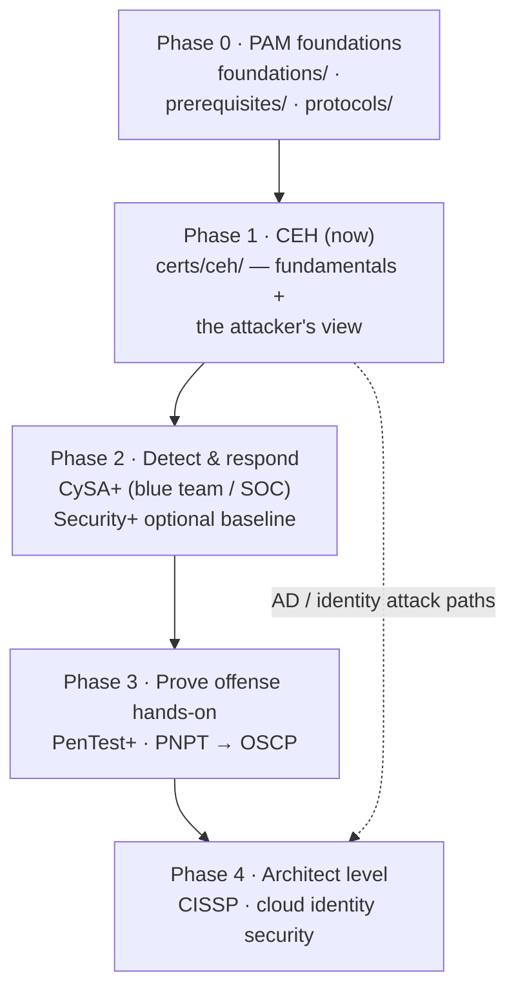
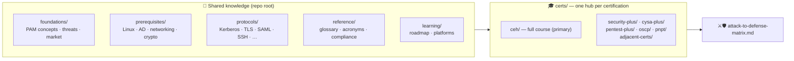

# 🔐 CyberCerts

### A **sysadmin → PAM architect** certification preparation guide

You already run the servers, the directories, and the access. This repo is a
**step-by-step guide** for turning that into a **Privileged Access Management (PAM)
architect** profile: one preparation method, a **professional skill path** (what a good PAM
architect must actually be able to do), the PAM foundations and protocols underneath, and a
preparation hub per certification milestone — **CEH first**, then the blue-team, offensive,
cloud, and architect-level certs that round out the profile. Every hub opens with the same
procedure: commit → objectives → self-assess → plan → study loop → readiness gate → exam week.

**[🎯 Start CEH](certs/ceh/README.md)** ·
[🛠️ The method](learning/how-to-prepare-a-cert.md) ·
[🧭 The path](#-the-path) ·
[🧠 Skills, not just certs](#-beyond-certs-the-professional-skill-path) ·
[🗂️ Repo map](#-repo-map) ·
[🎓 All cert hubs](certs/README.md) ·
[⚔️🛡️ Attack ↔ Defense](attack-to-defense-matrix.md) ·
[🧰 Where to practise](learning/platforms.md)

---

> [!NOTE]
> **Unofficial, vendor-neutral, no fabrication.** A personal study compilation, not a vendor
> or exam-body publication. Every factual claim is tied to an official document or reputable
> source (cited per page); unknowns are marked *“not specified in sources.”* Vendor PAM
> certifications (WALLIX, CyberArk, Palo Alto Networks…) are **deliberately out of scope**;
> vendors appear only as market or architecture examples. Structural quality is
> [enforced in CI](#-how-this-repo-is-built).

## 🚀 Start here — how to use this guide

1. **Place yourself on the path.** Read [the path](#-the-path) below and the
   [roadmap](learning/roadmap.md): four levels, ten competencies, a cert per milestone.
   Score yourself against the level exit criteria.
2. **Learn the method once.** [How to prepare a certification](learning/how-to-prepare-a-cert.md)
   is the eight-step procedure every hub follows — commit, objectives, self-assess, plan, study
   loop, readiness gate, exam week, after.
3. **Open the hub for your next cert and follow its procedure.** Each hub README starts with
   *Prepare for it — the procedure*: the concrete checklist, the week-by-week plan, a tracker
   and the readiness gate. **[CEH](certs/ceh/README.md)** is the next milestone on this path.
4. **Fill the gaps as you go.** The shared [foundations](foundations/README.md),
   [prerequisites](prerequisites/README.md) and [protocols](protocols/README.md) are the
   reference you return to whenever a hub page assumes something you cannot yet explain.

| You want to… | Go to |
|--------------|-------|
| **Prepare for CEH** (the next cert on the path) | **[certs/ceh/](certs/ceh/README.md)** — the procedure, one [12-week plan](certs/ceh/STUDY-PLAN.md), 20 modules with labs and flashcards, mock exams, a readiness gate and a defender/PAM lens |
| **Prepare for any other cert** on the path | [certs/](certs/README.md) — Security+, CySA+, PenTest+, PNPT, OSCP hubs, each with the same procedure, a study plan and a tracker; CISSP and cloud security orientations |
| Learn the **preparation method** itself | [learning/how-to-prepare-a-cert.md](learning/how-to-prepare-a-cert.md) |
| Refresh **what PAM is** and why it matters | [foundations/](foundations/README.md) — PAM from first principles, privileged accounts, the threat landscape, least privilege / JIT / Zero Trust |
| Understand **how a protocol actually works** (Kerberos, TLS, SAML…) | [protocols/](protocols/README.md) — RFC-grounded mechanism pages with sequence diagrams |
| Bridge **sysadmin skills** into security | [prerequisites/](prerequisites/README.md) — Linux, Windows/AD, networking, crypto/PKI, the PAM engineer's CLI |
| Build the **skills of a PAM architect**, not just collect certs | [The professional skill path](#-beyond-certs-the-professional-skill-path) below and the full [roadmap](learning/roadmap.md) |
| See **which control stops which attack** | [attack-to-defense-matrix.md](attack-to-defense-matrix.md) (MITRE ATT&CK ↔ PAM controls) |
| **Practise hands-on** | [learning/platforms.md](learning/platforms.md) + the self-hosted [CEH lab](certs/ceh/labs/README.md) (Docker, Vagrant, an Ansible AD lab with a tiered-admin PAM model) |
| Look something up | [glossary](reference/glossary.md) · [acronyms](reference/acronyms.md) · [compliance & standards](reference/compliance-and-standards.md) · [sources](reference/sources.md) |

## 🧭 The path

The order below is deliberate: **CEH first** to learn the fundamentals *through the
attacker's eyes*, then the certs that add detection, hands-on proof, and architect-level
breadth around the PAM core. Durations are suggestions; go at your own pace.

| Phase | Goal | Work through | Why it matters for a PAM architect |
|-------|------|--------------|-----------------------------------|
| **0 · Foundations** | Have the PAM vocabulary and the protocol mechanics cold | [foundations/](foundations/README.md) → [prerequisites/](prerequisites/README.md) → [protocols/](protocols/README.md) | Architects explain *why* a control works: vaulting, brokering, Kerberos, SAML, TLS |
| **1 · CEH (now)** | Learn security fundamentals and the full attack lifecycle | **[certs/ceh/](certs/ceh/README.md)** — concept pages, 20 modules with labs & flashcards, [defender/PAM lens](certs/ceh/defender-pam/README.md), [mock exams](certs/ceh/MOCK-EXAM-FULL.md) | You cannot design against credential theft, Pass-the-Hash, Kerberoasting or lateral movement without understanding them |
| **2 · Detect & respond** | Read the telemetry a PAM platform produces | [CySA+](certs/cysa-plus/README.md) (CS0-003); [Security+](certs/security-plus/README.md) (SY0-701) if you want the vendor-neutral baseline first | Session audit, SIEM correlation, incident response around privileged accounts |
| **3 · Prove offense hands-on** | Turn knowledge into demonstrated skill | [PenTest+](certs/pentest-plus/README.md) (PT0-003) · [PNPT](certs/pnpt/README.md) → [OSCP](certs/oscp/README.md) | AD-attack skill maps one-to-one onto the PAM defenses you will design |
| **4 · Architect level** | Management breadth and cloud privileged identity | [CISSP](certs/adjacent-certs/cissp.md) · [Cloud security](certs/adjacent-certs/cloud-security.md) (AZ-500 / AWS) | The architect role: governance, risk, cloud identities, secure design across the estate |

> ⚠️ The offensive hubs (CEH, PenTest+, OSCP, PNPT) are **educational and defense-oriented**:
> techniques are explained conceptually, paired with countermeasures, for **authorized use only**.
> Hands-on work belongs in the [isolated lab](certs/ceh/labs/README.md).

## 🧠 Beyond certs: the professional skill path

Certifications are milestones, not the goal. A **very good PAM architect** is someone who can
design, defend, explain and govern privileged access end-to-end. The table below is the
competency map this repo is organised around: for each skill, where to *learn* it, where to
*practise* it, and which cert *proves* it. The full ladder — with per-level exit criteria
from PAM engineer to architect — is in **[learning/roadmap.md](learning/roadmap.md)**.

| # | Competency | Learn it here | Practise it | Milestone cert |
|---|------------|---------------|-------------|----------------|
| 1 | **Privileged access fundamentals** — account types, credential risk, PAM pillars, least privilege / JIT / Zero Standing Privilege | [foundations/](foundations/README.md) | Inventory the privileged accounts in your own estate; classify them | — (Phase 0) |
| 2 | **Identity & directory internals** — AD, Kerberos, LDAP, NTLM, tiering, LAPS, gMSA | [windows & AD](prerequisites/windows-and-active-directory.md) · [Kerberos](protocols/kerberos.md) · [AD](protocols/active-directory.md) · [LDAP](protocols/ldap.md) | Build the [Ansible AD lab](certs/ceh/labs/README.md); implement a tier model | CEH (AD modules) → OSCP / PNPT |
| 3 | **Secure protocols & crypto** — TLS, SSH, SAML, OIDC, RADIUS, PKI | [protocols/](protocols/README.md) · [crypto & PKI](prerequisites/cryptography-and-pki.md) | Capture and read a handshake; stand up an IdP and federate a test app | Security+ · CISSP |
| 4 | **Attacker's view of identity** — credential dumping, Pass-the-Hash/Ticket, Kerberoasting, delegation abuse, ADCS, lateral movement | **[CEH](certs/ceh/README.md)** · [identity attack paths](certs/ceh/defender-pam/identity-attack-paths.md) · [PAM threat landscape](foundations/pam-threat-landscape.md) | The CEH [capstone chain](certs/ceh/labs/capstone.md) and [practical drills](certs/ceh/practical/README.md) | **CEH (now)** → PenTest+ → PNPT → OSCP |
| 5 | **PAM control design** — vaulting, rotation, session brokering & recording, JIT, approval workflows, EPM, break-glass, HA/DR | [PAM playbook](certs/ceh/defender-pam/pam-playbook.md) · [reference architecture](certs/ceh/defender-pam/pam-architecture.md) · [attack ↔ defense matrix](attack-to-defense-matrix.md) | Design a target architecture for your estate: tiers, vault, proxies, integrations | — (architecture practice) |
| 6 | **Detection & response** — event IDs, Sigma, SIEM correlation of privileged activity, IR around admin accounts | [detection engineering](certs/ceh/defender-pam/detection-engineering.md) · [CySA+](certs/cysa-plus/README.md) | The [blue-team lab](certs/ceh/labs/blue-team-lab.md): run the attacks, then detect them | CySA+ |
| 7 | **Operations & automation** — Linux CLI, logs, REST APIs, scripting, troubleshooting a PAM stack | [Linux essentials](prerequisites/linux-essentials-for-pam.md) · [the PAM engineer's CLI](prerequisites/linux-cli-for-pam-engineers.md) | Automate onboarding of accounts via an API; script a rotation report | — |
| 8 | **Cloud & OT privileged identity** — Entra / AWS IAM roles, secrets managers, workload identity; PAM for industrial systems | [cloud security](certs/adjacent-certs/cloud-security.md) · [CEH cloud module](certs/ceh/domains/19-cloud-computing.md) · [ot-security/](certs/ceh/ot-security/README.md) | Secure a cloud account with JIT roles; run the [OT lab](certs/ceh/labs/ot/README.md) | AZ-500 / AWS Security |
| 9 | **Governance, risk & compliance** — NIS2, ISO 27001, IEC 62443, DORA, PCI DSS; PAM vs IAM / IGA; the vendor market | [compliance & standards](reference/compliance-and-standards.md) · [PAM vs IAM / IGA / IDaaS / EPM](foundations/pam-iam-iga-idaas-epm.md) · [market landscape](foundations/pam-market-landscape.md) | Map one regulation's requirements to concrete PAM controls; write the gap analysis | CISSP |
| 10 | **Architect craft** — threat modelling, writing architecture decisions, presenting trade-offs, running a PAM programme | [roadmap](learning/roadmap.md) (architect level) · [engagement methodology & reporting](certs/ceh/00-overview/engagement-methodology-and-reporting.md) | Produce a one-page PAM target architecture and a phased rollout plan for a real or fictional company | CISSP |

## 🗂️ Repo map

| Folder | What lives there |
|--------|------------------|
| [`foundations/`](foundations/README.md) | What PAM is, privileged accounts & credentials, the PAM threat landscape, least privilege / JIT / Zero Trust, PAM vs IAM / IGA / IDaaS / EPM, the PAM vendor market |
| [`prerequisites/`](prerequisites/README.md) | The sysadmin → security skill bridge: Linux essentials, the PAM engineer's CLI, Windows & AD, networking & protocols, cryptography & PKI |
| [`protocols/`](protocols/README.md) | Mechanism-level pages: Kerberos, Active Directory, LDAP, RADIUS, TLS, SSH, SAML, OIDC / OAuth 2.0 |
| [`certs/`](certs/README.md) | Every certification hub — see the [index](certs/README.md) |
| [`reference/`](reference/README.md) | Glossary, acronyms, compliance & standards (NIS2, ISO 27001, IEC 62443, DORA…), consolidated sources |
| [`learning/`](learning/README.md) | The certification roadmap, the preparation method, and where to practise |
| [`attack-to-defense-matrix.md`](attack-to-defense-matrix.md) | CEH attack techniques (with MITRE ATT&CK IDs) mapped to the PAM controls that stop them |
| [`scripts/`](scripts/check-docs.py) · [`.github/`](.github/workflows) | The quality gate, Mermaid label wrapper, site builder and CI workflows |

## 🎓 Certification hubs

Each hub is self-contained (overview → domains/modules → labs → exam prep → reference),
opens with the same *Prepare for it — the procedure* section, and is built to the same
standards. Full index and details: **[certs/README.md](certs/README.md)**.

| Hub | Certification | Depth | Role on the path |
|-----|---------------|-------|------------------|
| 🎯 **[ceh/](certs/ceh/README.md)** | EC-Council CEH v13 (312-50) + CEH Practical | **Full course**: 20 modules × (guide, facts, questions, flashcards, lab), Kali course, runnable lab, mock exams, defender/PAM knowledge base, OT security | **Phase 1 — start here** |
| 🔵 [cysa-plus/](certs/cysa-plus/README.md) | CompTIA CySA+ (CS0-003) | 4 domains, exam prep, glossary | Phase 2 — detection & response |
| 🧱 [security-plus/](certs/security-plus/README.md) | CompTIA Security+ (SY0-701) | 5 domains, exam prep, cheat sheet, acronyms | Phase 2 — optional baseline |
| 🟠 [pentest-plus/](certs/pentest-plus/README.md) | CompTIA PenTest+ (PT0-003) | 5 domains, exam prep, glossary | Phase 3 — methodology |
| 🟣 [pnpt/](certs/pnpt/README.md) | TCM Security PNPT | 5 engagement phases, study plan | Phase 3 — practical engagement |
| 🔴 [oscp/](certs/oscp/README.md) | OffSec OSCP / OSCP+ (PEN-200) | 6 skill areas, exam structure, study plan | Phase 3 — hands-on proof |
| 🧩 [adjacent-certs/](certs/adjacent-certs/README.md) | CISSP · cloud security (AZ-500 / AWS) · one-page overviews | Orientation pages | Phase 4 — architect level |

## ✅ How this repo is built

- **No fabrication** — every claim is cited or marked *“not specified in sources”*; uncertainties stay flagged.
- **Vendor-neutral** — PAM is taught as a discipline. Product names appear only in the market-landscape page and as worked architecture examples, never as certification tracks.
- **Diagrams are Mermaid**, never ASCII art — they render on GitHub and on the site.
- **Quality is CI-enforced** — every push runs [`scripts/check-docs.py`](scripts/check-docs.py) (valid Mermaid, a Sources section per page, **zero broken internal links**) and the CEH course's own [`validate.py`](certs/ceh/scripts/validate.py) (links, anchors, flashcard decks, lab configs). See [MAINTENANCE.md](MAINTENANCE.md).
- The whole repo renders as a [searchable site](https://morandeirachema.github.io/CyberCerts/).

## 🔗 Quick links

- 🎯 [CEH hub](certs/ceh/README.md) · [CEH roadmap (beginner → master)](certs/ceh/ROADMAP.md) · [CEH lab](certs/ceh/labs/README.md)
- 🧭 [Certification roadmap](learning/roadmap.md) · 🛠️ [How to prepare a certification](learning/how-to-prepare-a-cert.md) · 🧰 [Learning platforms](learning/platforms.md)
- 🛡️ [What is PAM?](foundations/what-is-pam.md) · [PAM threat landscape](foundations/pam-threat-landscape.md) · [PAM control playbook](certs/ceh/defender-pam/pam-playbook.md)
- 🧠 [Glossary](reference/glossary.md) · [Acronyms](reference/acronyms.md) · 📚 [Sources](reference/sources.md)
- 📝 [Changelog](CHANGELOG.md) · [Contributing](CONTRIBUTING.md) · [Security & responsible use](SECURITY.md)

## 🤝 Contributing & license

Contributions welcome — see **[CONTRIBUTING.md](CONTRIBUTING.md)** (the no-fabrication rule,
Mermaid-only diagrams, page conventions, the verification checklist). Report errors via a
[content-correction issue](SECURITY.md). Licensed under **[MIT](LICENSE)**.

> Not affiliated with or endorsed by EC-Council, CompTIA, OffSec, TCM Security, ISC2, or any
> PAM vendor. “CEH”, “Security+”, “CySA+”, “PenTest+”, “OSCP”, “PNPT”, “CISSP” and related
> names are trademarks of their respective owners, used here for identification and
> educational purposes only. Offensive content is for **authorized, educational use only**.
