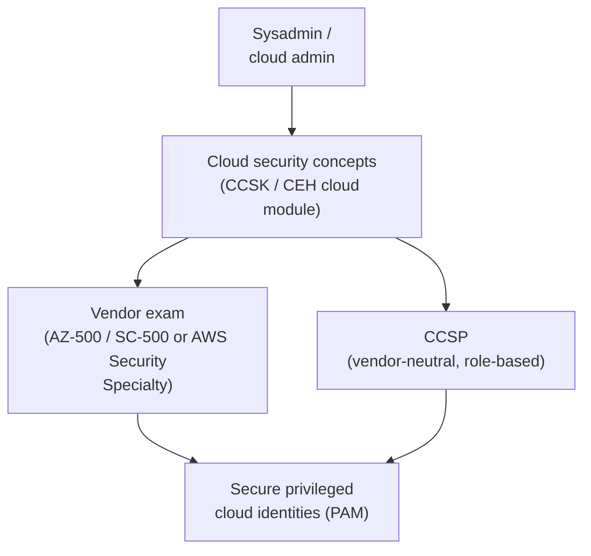

# Cloud Security Certifications

Cloud security certifications validate that you can secure workloads, identities, and data in **public-cloud** platforms. For a sysadmin, they are the natural next step once your infrastructure moves to **IaaS/PaaS/SaaS** (Infrastructure / Platform / Software as a Service) and the **shared-responsibility model** changes who secures what — the same model covered in the [CEH cloud-computing domain](../ceh/domains/19-cloud-computing.md). This page gives a concise overview of the two leading **vendor-specific** exams (Microsoft Azure and AWS) plus the **vendor-neutral** CCSP and CCSK, and explains how cloud security connects to **Privileged Access Management (PAM)**.

## Learning objectives

- Distinguish **vendor-specific** (Azure, AWS) from **vendor-neutral** (CCSP, CCSK) cloud security certifications.
- Recall the **AZ-500 retirement** (2026-08-31) and its **SC-500** successor, with verified dates.
- Summarise the **AWS Certified Security – Specialty** exam format with cited specifics.
- Explain how cloud security relates to **PAM (privileged cloud identities)** and the [CEH cloud module](../ceh/domains/19-cloud-computing.md).
- Pick a starting certification based on your platform and experience.

## What it is / who it's for

- **Provider & level:** Vendor exams (Microsoft, AWS) are **intermediate/specialty**, tied to one platform. Vendor-neutral exams ((ISC)² CCSP, CSA CCSK) test portable, cross-cloud concepts.
- **Who it's for:** Sysadmins, cloud and security engineers responsible for securing cloud infrastructure, identities, networking, and data — typically **after** some hands-on cloud administration experience.

## Microsoft Azure — SC-500 (successor to the retired AZ-500)

- **What it was:** Microsoft Certified **Azure Security Engineer Associate**, earned via **Exam AZ-500: Microsoft Azure Security Technologies**. Intermediate level.
- **Role/scope:** Implement, manage, and monitor security across Azure, multi-cloud, and hybrid environments using **Microsoft Defender for Cloud**, **Microsoft Sentinel**, and **Microsoft Entra ID**.
- **Skills assessed** (per the official certification page): Secure **identity and access**; secure **networking**; secure **compute, storage, and databases**; secure Azure using **Microsoft Defender for Cloud** and **Microsoft Sentinel**.

> ⚠️ **RETIRED.** Microsoft's official certification page states this certification, its exam, and renewal assessments **were retired on 2026-08-31**; it can no longer be earned or renewed. An already-earned certification **stays on your transcript** but is **not auto-converted**.

- **Successor:** **SC-500 — Microsoft Certified: Cloud and AI Security Engineer Associate** (exam titled *"Implementing End-to-End Security Controls for Cloud and AI Workloads"*). It broadens scope to **cloud and AI workloads**. As of 2026-09-29 the certification page lists the exam as bookable through Pearson VUE, and notes that the practice assessment is not yet available. **Verify current status on learn.microsoft.com** before booking.
- **Assessed on SC-500** (per the certification page): manage identity, access, and governance; secure storage, databases, and networking; secure compute; manage and monitor security posture.

| Item | Detail | Status |
| --- | --- | --- |
| Current exam | **SC-500** Cloud and AI Security Engineer Associate | Verified (learn.microsoft.com, 2026-09-29) |
| Duration | **120 minutes**, proctored | Verified (learn.microsoft.com) — *(verify)* |
| Languages | English, Japanese, Chinese (Simplified / Traditional), Korean, German, French, Italian, Portuguese (Brazil), Spanish | Verified (learn.microsoft.com) |
| Retired predecessor | **AZ-500**, retired **2026-08-31** | Verified (learn.microsoft.com) |
| Renewal | Not specified in sources for SC-500 — Microsoft associate certs have renewed annually via a free online assessment | *(verify on learn.microsoft.com)* |
| Price / # questions | Region-dependent; not fixed on the page | Omitted to avoid stale figures — *(verify on learn.microsoft.com)* |

## AWS Certified Security – Specialty

- **What it is:** AWS's specialty-level security credential for those who design and implement security solutions on AWS.
- **Exam code:** **SCS-C03**. AWS retired **SCS-C02** after its last day on **2025-12-01**; SCS-C03 has been delivered since **2025-12-02**.

| Item | Detail | Status |
| --- | --- | --- |
| Current code | **SCS-C03** (SCS-C02 retired 2025-12-01) | Verified (AWS Training & Certification blog) |
| Duration | **170 minutes** | Verified (aws.amazon.com) — *(verify)* |
| Questions | **65** — 50 scored + 15 unscored; multiple choice, multiple response, ordering, matching | Verified (SCS-C03 exam guide) |
| Cost | **USD 300** | Verified (aws.amazon.com) — *(verify, region-dependent)* |
| Validity | **3 years** | Verified (aws.amazon.com) — *(verify)* |
| Delivery | Pearson VUE test centre or online proctored | Verified (aws.amazon.com) |
| Passing score | **750** on a 100–1,000 scale (compensatory) | Verified (SCS-C03 exam guide) |
| Domains & weightings | Detection 16% · Incident Response 14% · Infrastructure Security 18% · Identity and Access Management 20% · Data Protection 18% · Security Foundations and Governance 14% | Verified (SCS-C03 exam guide) |

> Domain names and weightings differ between SCS-C02 and SCS-C03 — study from the current **SCS-C03 exam guide** (its appendix compares the two).

## Vendor-neutral options: CCSP and CCSK

For portable, cross-cloud knowledge:

- **(ISC)² CCSP (Certified Cloud Security Professional):** vendor-neutral, **management-leaning** credential covering cloud architecture, design, operations, and compliance across **six CBK (Common Body of Knowledge) domains**. Uses **CAT (Computerized Adaptive Testing)**; has an **experience requirement** (reported ~5 years IT, with cloud/security components, and waiver options). It is the cloud-focused sibling of the [CISSP](cissp.md) — *(verify all specifics on isc2.org)*.
- **CSA CCSK (Certificate of Cloud Security Knowledge):** from the **Cloud Security Alliance (CSA)**. A **certificate** (not a job-role certification) with **no experience requirement**, based on the **CSA Security Guidance**, the **Cloud Controls Matrix (CCM)**, and the **ENISA** cloud risk report — a strong, low-barrier first step *(verify on cloudsecurityalliance.org)*.

> Rule of thumb: **CCSK** to learn the concepts cheaply and quickly; **CCSP** for a recognised role-based credential; **AZ-500/SC-500 or AWS Security – Specialty** to prove platform-specific depth.

## How it fits a cyber path — PAM and CEH

- **Relation to PAM (privileged cloud identities):** The cloud's biggest risk is **over-permissioned identities** — root accounts, admin roles, access keys, and service principals. A **Privileged Access Management (PAM)** solution brokers, vaults, rotates, and records access to these privileged cloud identities, enforcing the **least-privilege** and **just-in-time** access that AZ-500/SC-500 (Entra ID) and AWS Security (IAM) teach you to configure. Cloud security certifications teach you *how the platform's access model works*; PAM is *how you keep that access controlled and auditable*. See [what is PAM](../../foundations/what-is-pam.md) and the [PAM playbook](../ceh/defender-pam/pam-playbook.md).
- **Relation to [CEH](../ceh/README.md):** The **[CEH cloud-computing module](../ceh/domains/19-cloud-computing.md)** introduces the same **shared-responsibility model**, IaaS/PaaS/SaaS distinctions, container and serverless risks, and **misconfiguration** as the leading breach cause. CEH frames these from a **testing/offensive** angle; the vendor and CCSP/CCSK exams frame them from a **build-and-defend** angle. They reinforce each other.

## How to prepare it

Apply the repo-wide [preparation method](../../learning/how-to-prepare-a-cert.md) with the adjustments cloud exams need.
The hands-on week-by-week schedule and the tracker are in the **[cloud security study plan](cloud-security-study-plan.md)**.

1. **Commit** — pick the platform your estate actually runs (Azure → the SC-500 successor,
   since AZ-500 retired on 2026-08-31 per the note above; AWS → Security Specialty, SCS-C03;
   CCSP or CCSK if the goal is vendor-neutral breadth) and confirm the current exam code,
   format and price on the provider page below.
2. **Objectives** — the provider's skills outline / exam guide is the coverage map; the
   providers publish per-area weights, so plan weight-first.
3. **Hands-on is the study loop** — open a free-tier account you own and build every
   objective: identity roles and privileged-role activation, key vaults and secrets
   managers, logging and alerting, network controls. Reading alone does not pass these
   exams. Map each control to its on-premises PAM equivalent
   ([what is PAM](../../foundations/what-is-pam.md), [least privilege / JIT](../../foundations/core-concepts-least-privilege-jit-zero-trust.md)).
4. **Test** with the provider's official practice assessment where one exists, log every
   miss, drill spaced.
5. **Readiness gate** — every objective area ≥ 80% on a second attempt; a timed full
   practice set ≥ 85%; every hands-on objective done at least once from memory.
6. **After** — note the provider's renewal rule (Microsoft renews online yearly; AWS and
   ISC2 have their own cycles — *verify on the provider page*) and calendar it.

## Study resources

- **Microsoft AZ-500 / SC-500:** official study guides and certification pages —
  - AZ-500: https://learn.microsoft.com/en-us/credentials/certifications/azure-security-engineer/
  - SC-500 study guide: https://learn.microsoft.com/en-us/credentials/certifications/resources/study-guides/sc-500
- **AWS Certified Security – Specialty:** official exam page and the **SCS-C03 exam guide** on AWS Skill Builder — https://aws.amazon.com/certification/certified-security-specialty/
- **(ISC)² CCSP:** exam outline and page — https://www.isc2.org/certifications/ccsp
- **CSA CCSK:** Cloud Security Alliance training and the CSA Security Guidance — https://cloudsecurityalliance.org/education/ccsk
- Hands-on practice in a free-tier cloud account beats reading alone; reconcile every exam detail against the provider's current page.

## Related pages

- [CISSP overview](cissp.md) — managerial breadth credential (CCSP is its cloud sibling).
- [CEH hub](../ceh/README.md) and [CEH cloud-computing domain](../ceh/domains/19-cloud-computing.md).

## Sources

- Microsoft Azure Security Engineer Associate (AZ-500), incl. retirement notice: https://learn.microsoft.com/en-us/credentials/certifications/azure-security-engineer/
- Microsoft Cloud and AI Security Engineer Associate (SC-500) certification page: https://learn.microsoft.com/en-us/credentials/certifications/cloud-and-ai-security-engineer-associate/
- Microsoft SC-500 study guide: https://learn.microsoft.com/en-us/credentials/certifications/resources/study-guides/sc-500
- AWS Certified Security – Specialty: https://aws.amazon.com/certification/certified-security-specialty/
- AWS SCS-C02 → SCS-C03 announcement: https://aws.amazon.com/blogs/training-and-certification/big-news-aws-expands-ai-certification-portfolio-and-updates-security-certification/
- AWS SCS-C03 exam guide (docs): https://docs.aws.amazon.com/aws-certification/latest/security-specialty-03/security-specialty-03.html
- (ISC)² CCSP: https://www.isc2.org/certifications/ccsp
- Cloud Security Alliance CCSK: https://cloudsecurityalliance.org/education/ccsk
