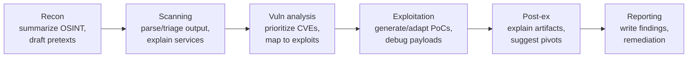
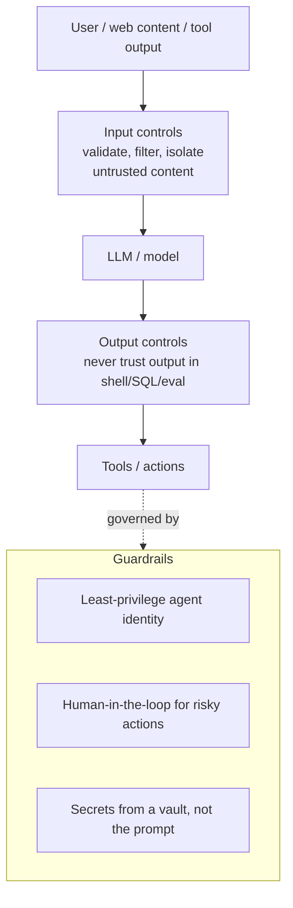

# AI-Driven Ethical Hacking (CEH v13)

> CEH v13's headline addition. Two directions you must understand: **(1) using AI to augment the ethical-hacking workflow**, and **(2) attacking and defending AI systems themselves**. This doc is the cross-cutting companion to the 20 modules — AI now touches every phase. Pairs with [EXAM-STRATEGY.md](EXAM-STRATEGY.md) and the [defender-pam](defender-pam/README.md) knowledge base.

> **⚖️ Same ethics apply.** Use AI-assisted techniques only within your authorized scope. AI lowers the effort bar for attackers *and* defenders — the authorization boundary does not move.

---

## Part 1 — AI as a force multiplier across the kill chain

AI (LLMs + ML) speeds up, not replaces, the methodology. The human still scopes, validates, and is accountable.

| Phase | How AI helps | Caution |
|---|---|---|
| Reconnaissance (M02) | Summarize large OSINT dumps, cluster employees/tech, draft phishing pretexts | Hallucinated "facts"; verify everything |
| Scanning/Enumeration (M03–04) | Explain nmap output, suggest next probes, translate protocols | Don't paste client data into public models |
| Vulnerability analysis (M05) | Prioritize CVEs by exploitability, summarize advisories | Confirm against NVD; models lag on new CVEs |
| Exploitation (M06, 14, 15) | Generate/adapt PoC code, decode obfuscation, debug payloads | Guardrails may refuse; output can be wrong/unsafe |
| Social engineering (M09) | Fluent, localized phishing / voice-clone scripts (a real threat) | This is why phishing-resistant MFA matters |
| Reporting | Draft findings, risk narratives, remediation steps | Human owns accuracy and severity |

**Defender's mirror image:** the same models power AI-assisted detection, log summarization, alert triage, and phishing-email analysis in the SOC.

> **Responsible use:** never submit sensitive client data, credentials, or exploit targets to third-party AI services (data leaves your control); prefer self-hosted/enterprise models with data controls; treat AI output as a *draft to verify*, never ground truth.

---

## Part 2 — Attacking AI/ML systems

Modern targets *include* AI. Know the adversarial-ML taxonomy and the LLM-specific attacks.

### Classic adversarial ML

| Attack | What it does |
|---|---|
| **Evasion / adversarial examples** | Perturb an input so the model misclassifies (e.g., a sticker that fools an image classifier) — a **test-time** attack |
| **Data poisoning** | Corrupt the *training data* so the model learns a backdoor or degrades — a **training-time** attack |
| **Model inversion** | Reconstruct sensitive training data from model outputs |
| **Membership inference** | Determine whether a specific record was in the training set (privacy leak) |
| **Model extraction / theft** | Query a model enough to clone its behavior/weights |

### LLM-specific attacks

- **Prompt injection** — the signature LLM attack. Malicious instructions override the system prompt.
  - **Direct:** the user types "ignore previous instructions…".
  - **Indirect:** the payload hides in content the model later reads (a web page, email, PDF, or tool output) and executes when ingested — dangerous for AI agents with tools.
- **Jailbreaking** — bypassing safety guardrails (role-play, obfuscation, many-shot).
- **Sensitive information disclosure** — coaxing out secrets, training data, or system prompts.
- **Insecure output handling** — trusting LLM output that flows into a shell, SQL, or `eval()` → classic injection (ties to Modules 14/15).
- **Excessive agency** — an agent given tools/permissions it shouldn't have; a successful prompt injection then *acts* (sends mail, calls APIs, runs code).
- **Supply chain** — poisoned models/datasets/plugins pulled from public hubs.

### OWASP Top 10 for LLM Applications (2025) — recognize the list
LLM01 Prompt Injection · LLM02 Sensitive Information Disclosure · LLM03 Supply Chain · LLM04 Data & Model Poisoning · LLM05 Improper Output Handling · LLM06 Excessive Agency · LLM07 System Prompt Leakage · LLM08 Vector/Embedding Weaknesses · LLM09 Misinformation · LLM10 Unbounded Consumption.

> **MITRE ATLAS** is the ATT&CK-style knowledge base for adversarial ML — the AI equivalent of the frameworks in [Module 01](modules/01-introduction-to-ethical-hacking/README.md).

---

## Part 3 — Defending AI, and the PAM angle

**Defensive controls:** treat all model input as untrusted, separate instructions from data, constrain and validate output before it reaches a sink, sandbox tool execution, rate-limit, log prompts/responses, and red-team the model (adversarial testing).

**The PAM / non-human-identity angle (your differentiator):**
- An AI agent is a **non-human identity** with credentials and tool access. Give it **least privilege** and **just-in-time**, scoped access — a prompt-injected agent can only do what its identity is allowed to do (**excessive agency** is contained by tiering).
- **Never put secrets in prompts or system messages.** Deliver them at runtime from a vault (CyberArk **Conjur / CCP**) so a system-prompt leak (LLM07) doesn't spill credentials.
- **Broker and record** an agent's privileged actions the same way you would a human admin's ([session brokering](defender-pam/pam-architecture.md)); require **human-in-the-loop** approval for high-impact tool calls.
- Map AI-agent risks onto the same [attack-to-control matrix](defender-pam/attack-to-control-matrix.md): identity, least privilege, secrets management, monitoring.

---

## Exam & interview notes
- **Prompt injection** (esp. **indirect**) is the LLM attack to know cold; **insecure output handling** turns it into classic injection.
- **Poisoning = training-time; evasion/adversarial examples = test-time.** Don't swap them.
- **Model extraction/inversion/membership inference** are the privacy/IP attacks.
- AI is a **force multiplier for both sides** — the ethical boundary (authorization) is unchanged.
- Best defenses echo the rest of CEH: **least privilege, validate input/output, manage secrets, monitor** — now applied to models and agents.

## Sources
- OWASP Top 10 for LLM Applications — https://genai.owasp.org/llm-top-10/
- OWASP Machine Learning Security Top 10 — https://owasp.org/www-project-machine-learning-security-top-10/
- MITRE ATLAS (Adversarial Threat Landscape for AI Systems) — https://atlas.mitre.org/
- NIST AI Risk Management Framework (AI RMF 1.0) — https://www.nist.gov/itl/ai-risk-management-framework
- NIST — Adversarial Machine Learning taxonomy (AI 100-2) — https://csrc.nist.gov/pubs/ai/100/2/e2023/final
- EC-Council CEH v13 (AI-driven ethical hacking) — https://www.eccouncil.org/train-certify/certified-ethical-hacker-ceh/
