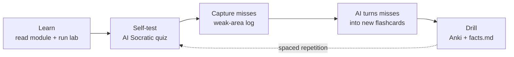

# Learn CEH Faster with an AI Tutor

> A concrete study system that turns any capable AI (Claude, ChatGPT, a local model) into a personal CEH tutor **wired to this repo's files**. Copy a prompt, paste the referenced file's content, and go. Built on retrieval practice + spacing — the two techniques with the strongest evidence for durable memory.

> **⚖️ Responsible use (you're studying this in [AI-IN-ETHICAL-HACKING.md](AI-IN-ETHICAL-HACKING.md)):** never paste real client data, live credentials, or a real target into a third-party model — data leaves your control. Use the *lab* and repo content. Treat AI output as a **draft to verify** against the module `README.md`, NVD, and vendor docs — models hallucinate confident, wrong specifics.

## The daily loop

Use the prompts below at each step. Paste the named repo file so the tutor grades against *your* material, not its guesses.

---

## 1. Feynman check — explain it back, get graded
*After reading a module. Attach that module's `facts.md`.*

> You are my CEH v13 tutor. I'll explain **Module 06 (System Hacking)** from memory — both the attacks **and their defensive/PAM controls**. Grade my explanation against the attached `facts.md`: list what I got right, what I got wrong, and what I omitted. Then ask me 3 follow-up questions on my weakest spot. Be strict; don't be encouraging for its own sake.

## 2. Socratic quiz — one question at a time
*The highest-yield drill. Attach `practice-questions.md` or `facts.md`.*

> Quiz me on this module **one multiple-choice question at a time**. After I answer, tell me if I'm right, explain **why each distractor is wrong**, then give the next question. Escalate difficulty as I get them right. Keep going until I say stop, then summarize my weak areas.

## 3. Misses → new flashcards (repo format)
*Grow your deck from what you actually miss. Paste the question you got wrong + your reasoning.*

> I got this question wrong and here's my (flawed) reasoning: `<paste>`. Write **3 flashcards** that fix my specific misconception — one recall card and two harder variants — in this exact CSV format so I can append them to `flashcards.csv`:
> `"Front question","Back answer","cehNN topic"`
> Every field double-quoted, exactly 3 columns.

## 4. Distractor forensics — why my wrong answer *felt* right
*For questions you narrowly miss.*

> For this question, I chose **B** but the answer is **C**. Explain the exact conceptual trap that made B attractive, give me a one-line rule to never fall for it again, and name two other CEH topics where the same trap appears.

## 5. Explain-my-lab-output — accelerate the recon→decision loop
*Paste real tool output from your [lab](labs/).*

> Here's my `nmap -sV` output against a lab host: `<paste>`. As my tutor: (a) what does each finding tell me, (b) what are the **two most promising next steps** and the Kali tool for each (see [KALI-TUTORIAL.md](KALI-TUTORIAL.md)), and (c) what would a defender see, and which control would stop my next move?

## 6. Interleaved mixed exam — simulate the real thing
*Blocked practice inflates confidence; interleaving mimics the exam.*

> Generate a 15-question mixed quiz drawing from **Modules 06, 08, 15, and 20** in random order (like the real exam). Number them, hide the answers until I've answered all 15, then give a key with one-line rationales and tell me which module to review.

## 7. PAM / "best defense" drill — your differentiator
*Attach `defender-pam/attack-to-control-matrix.md`.*

> Give me an attack from CEH and ask me for the **single best control** (prevention over detection). Grade my answer against the attached matrix and the "five controls that cover the most ground." Then flip it: name a control and make me list the attacks it defeats.

## 8. Make it stick — analogies & mnemonics
*For facts that won't stay put.*

> I keep confusing **Golden vs Silver tickets** (and **CSRF vs SSRF**, **polymorphic vs metamorphic**). Give me a vivid one-line analogy and a mnemonic for each, plus the single discriminating question I should ask myself on the exam.

## 9. Plan my week — spaced repetition + weak areas
*Paste your weak-area log from [PROGRESS.md](PROGRESS.md).*

> Here's my weak-area log and which modules I've finished: `<paste>`. Build me a 7-day study plan that (a) front-loads my weakest modules, (b) schedules spaced reviews of older ones (day 1/3/7 intervals), and (c) ends with a timed [MOCK-EXAM.md](MOCK-EXAM.md) checkpoint. Keep each day under 90 minutes.

## 10. Adversarial review — attack my own notes
*Catches confident-but-wrong gaps.*

> Here are my notes on **TLS / the crypto module**: `<paste>`. Attack them: where am I wrong, oversimplified, or missing a CEH v13 nuance? Rank the issues by how likely each is to cost me an exam point.

---

## Putting it together — a weekly cadence

| Day | With the AI tutor | Repo file |
|---|---|---|
| Learn a module | Feynman check (#1) after reading + lab | `facts.md`, `lab-walkthrough.md` |
| +1 day | Socratic quiz (#2); log + convert misses (#3, #4) | `practice-questions.md`, `flashcards.csv` |
| +3 days | Interleaved quiz (#6) across recent modules | multiple modules |
| +7 days | PAM drill (#7) + mixed review; plan next week (#9) | `defender-pam/`, `PROGRESS.md` |
| Milestone | Timed [MOCK-EXAM.md](MOCK-EXAM.md) → [MOCK-EXAM-FULL.md](MOCK-EXAM-FULL.md) | mock exams |

## Why this works (the evidence)
- **Retrieval practice** (testing yourself) builds far more durable memory than re-reading — the AI Socratic quiz is retrieval on demand.
- **Spacing** (revisiting on expanding intervals) beats cramming — prompt #9 schedules it.
- **Interleaving** (mixing topics) mirrors the exam and prevents false fluency — prompt #6.
- **Elaboration / self-explanation** (Feynman, analogies) links new facts to what you know — prompts #1, #8.

## Sources
- The Learning Scientists — retrieval practice, spacing, interleaving: https://www.learningscientists.org/
- Retrieval Practice (Agarwal & Bain): https://www.retrievalpractice.org/
- Anki (spaced-repetition software): https://apps.ankiweb.net/
- Responsible AI use — see [AI-IN-ETHICAL-HACKING.md](AI-IN-ETHICAL-HACKING.md)
