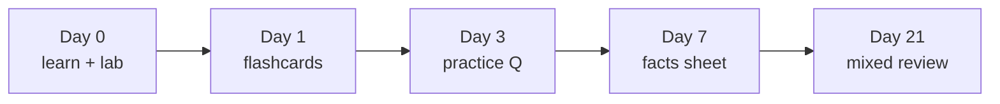

# CEH v13 — Exam Strategy & Learning System

How to *pass*, not just how to study. Two parts: a **study system** (how to build durable recall over weeks) and **test tactics** (how to squeeze every point on exam day). Confirm all exam mechanics against [EXAM-LOGISTICS.md](EXAM-LOGISTICS.md) and EC-Council before booking.

> **Ethics first.** This repo uses only **self-authored, concept-based** practice. Real "exam dumps" violate the [EC-Council Candidate Agreement](https://www.eccouncil.org/) and get certifications revoked. Learn the concepts; the questions take care of themselves.

---

## Part 1 — The study system

### Active recall beats re-reading
Reading a module feels productive but builds *recognition*, not *recall*. The exam demands recall. For every module, in order:
1. Read the module [README](modules/README.md) once.
2. Do the [`lab-walkthrough.md`](modules/README.md) — physically running commands cements the "tool → purpose" pairs the exam loves.
3. Close the guide and take the [`practice-questions.md`](modules/README.md). Score honestly.
4. Drill the [`flashcards.csv`](modules/README.md) until you can answer cold.
5. The night before you revisit a domain, read only the [`facts.md`](modules/README.md) one-pager.

### Spaced repetition
Don't cram a module once — revisit it on an expanding schedule. A simple cadence:

Import the `flashcards.csv` files into **Anki** (it schedules the repetition for you): *File → Import*, set the field separator to comma and enable "Allow HTML". The `#tags` line tags each card by module so you can study one domain at a time.

### Interleave, don't block
After finishing several modules, mix their flashcards/questions together. Blocked practice (all of one module) inflates your sense of mastery; interleaved practice mirrors the real exam, where topics arrive in random order.

### Track weak areas
Every missed question goes in the **Weak-area log** in [PROGRESS.md](PROGRESS.md). Re-test those first each session. Your misses are your syllabus.

---

## Part 2 — Test-day tactics

### The clock
125 questions in 240 minutes ≈ **1.9 minutes/question**. That's generous — but don't burn it on one item.
- **First pass:** answer everything you know quickly; **flag** anything that takes >2 min and move on.
- **Second pass:** return to flagged items with the time you banked.
- **Never leave a blank** — there's no penalty for guessing, so a flagged unknown still gets your best guess.

### "Choose the BEST answer" — the core skill
CEH often gives several *technically true* options; you must pick the **best**. Heuristics that resolve most of these:
- **Prevention > detection > response.** If asked for the best mitigation, the option that *removes* the vulnerability or standing privilege beats the one that merely detects it. (If prevention isn't offered, pick the strongest detection/monitoring option.)
- **Most specific, most directly relevant** wins over a vaguely-correct general answer.
- **Match the phase.** Identify which methodology phase the scenario is in (recon / scan / gain / escalate / maintain / cover) — the right tool/answer usually belongs to that phase.
- **Address the root cause**, not a symptom (e.g., *parameterized queries* over *WAF* for SQLi).

### Reading the question
- **Underline qualifiers:** *BEST, MOST, FIRST, LEAST, NOT, EXCEPT.* A single "NOT/EXCEPT" flips the whole item — a top source of careless losses.
- **Spot the ask:** is it a *definition*, a *tool→purpose*, a *"what attack is this"*, or a *"best defense"*? Each has a different answer shape.
- **Scenario questions:** find the one detail that decides it (a port, an event ID, "without cracking," "from a non-DC") and ignore the fluff.

### Eliminating distractors
- **Absolutes** ("always", "never", "100%", "guarantees") are usually wrong in security.
- **Two options that are near-synonyms** — often both wrong, or the question hinges on the subtle difference (e.g., Golden vs Silver ticket, CSRF vs SSRF, IDS vs IPS).
- **Right tool, wrong category** — a real tool listed under the wrong attack phase is a classic trap.
- Cross off obviously wrong options first; even eliminating two turns a guess into a coin flip.

### Common trap pairs to pre-load
Know these cold — they recur across domains:

| Pair | The distinction |
|---|---|
| Pass-the-Hash vs Kerberoasting | PtH needs **no** cracking; Kerberoasting cracks the **service** password |
| Golden vs Silver ticket | krbtgt (TGT, domain-wide) vs service key (TGS, one service) |
| CSRF vs SSRF | tricks the **browser** vs tricks the **server** |
| IDS vs IPS | detect/alert (passive) vs block inline |
| Virus vs Worm vs Trojan | host file vs self-propagating vs user-run |
| Symmetric vs Asymmetric | one shared key/bulk vs key pair/exchange+signatures |
| Encrypt vs Sign | recipient's **public** key vs your **private** key |
| Stored vs Reflected XSS | persisted server-side vs echoed from the request |
| MAC flooding vs ARP poisoning | fills CAM (fail-open) vs forged ARP (MITM) |

### The PAM shortcut for "best defense" questions
Because so many CEH answers are "what's the best control," your PAM lens is a fast filter: prefer the option that **reduces standing privilege, brokers/records access, rotates the secret, or segments the tier**. See [`defender-pam/attack-to-control-matrix.md`](defender-pam/attack-to-control-matrix.md) — memorizing "the five controls that cover the most ground" answers a surprising share of the defensive questions.

---

## Exam-day checklist
- [ ] ID and Pearson VUE / ECC confirmation ready; test environment / testing rules reviewed.
- [ ] Skim every [`facts.md`](modules/README.md) one-pager the morning of.
- [ ] Do a short warm-up set of flashcards (get your recall "engine" running).
- [ ] Bring water; plan your ~1.9 min/question pace.
- [ ] First pass fast + flag; second pass on flags; **no blanks**.
- [ ] Watch for NOT/EXCEPT and absolutes.
- [ ] Trust prepared knowledge over second-guessing — change an answer only with a concrete reason.

## Sources
- EC-Council CEH program — https://www.eccouncil.org/train-certify/certified-ethical-hacker-ceh/
- CEH exam blueprint / brochure — https://www.eccouncil.org/cehv13-brochure/
- Exam delivery (Pearson VUE) — https://home.pearsonvue.com/eccouncil
- Learning-science background (retrieval practice & spacing) — https://www.retrievalpractice.org/
