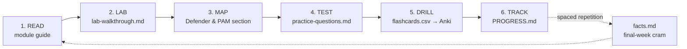

# CEH v13 — Study, Labs & Exam Prep

-1f6feb)


A self-built, **no-fabrications** study repository for the **EC-Council Certified Ethical Hacker (CEH) v13** certification, written from the perspective of a **systems administrator with a Privileged Access Management (PAM) background**.

Every module ties the offensive technique you must learn for the exam back to the **defensive and PAM controls you already understand** — so you learn attacks *through* the controls you manage. It's a complete self-study system: **read → lab → self-test → drill → track.**

> **⚖️ Ethics & scope.** Everything here is for authorized learning only: your own self-hosted lab (see [`labs/`](labs/)), EC-Council's official ranges, or systems you have **written permission** to test. Never point these tools or techniques at systems you do not own or are not explicitly authorized to assess. Unauthorized access is a crime in most jurisdictions.

---

## Contents

- [Why this repo is different](#why-this-repo-is-different)
- [At a glance](#at-a-glance)
- [Quick start](#quick-start)
- [The study loop](#the-study-loop)
- [The 20 modules](#the-20-modules-official-ceh-v13-order)
- [The Defender / PAM lens](#the-defender--pam-lens)
- [Exam facts](#exam-facts-verify-against-ec-council-before-you-book)
- [Repository map](#repository-map)
- [Official references](#official-ec-council-references)

---

## Why this repo is different

- **Every attack is paired with its control.** Each module has a Defender & PAM mapping, and a CyberArk-centered [knowledge base](defender-pam/) sits behind it (reference architecture, AD/Entra identity attack paths, detection engineering). If you can name the control, you can usually eliminate two wrong answers instantly.
- **Built for active recall, not re-reading.** Every module ships a one-page facts sheet, original practice questions with explanations, Anki-ready flashcards, and a guided lab — plus a dedicated [exam-strategy](EXAM-STRATEGY.md) guide.
- **Runnable on infrastructure you control.** Docker web targets + Vagrant VMs + an Ansible **tiered-admin / PAM** Active Directory lab.
- **Covers CEH v13's AI-driven ethical hacking.** A dedicated [AI doc](AI-IN-ETHICAL-HACKING.md) covers using AI across the phases *and* attacking/defending AI systems — and a [blueprint coverage matrix](BLUEPRINT-COVERAGE.md) documents every module's subtopics so you can verify nothing's missing.
- **No exam dumps, no invented facts.** Practice questions are self-authored to teach concepts; every external claim links to an official source.

### What this repo is *not*
- Not a brain dump of exam questions — dumps violate the [EC-Council Candidate Agreement](https://www.eccouncil.org/) and get certifications revoked.
- Not a replacement for the official courseware. Confirm every blueprint weight and policy against EC-Council directly (links at the bottom).

---

## At a glance

| | |
|---|---|
| 📘 **Module guides** | 20 — full concept coverage in official CEH v13 order |
| 🗂️ **Study companions** | 80 files — every module has `facts.md`, `practice-questions.md`, `flashcards.csv`, `lab-walkthrough.md` |
| ❓ **Practice questions** | 287 original, concept-based, with collapsible explanations |
| 🃏 **Flashcards** | 620 Anki-ready cards, tagged per module |
| 🛡️ **Defender/PAM knowledge base** | attack→control matrix · PAM playbook · CyberArk architecture · identity attack paths · detection engineering · CyberArk mapping |
| 🧪 **Lab** | Docker web targets + Vagrant (Kali + Metasploitable) + Ansible **AD/ADCS** lab with planted attack paths + a chained [capstone](labs/capstone.md) engagement |
| 🐉 **Kali** | a [beginner→mastery course](kali/) (17 chapters, from "what is Linux" to attacking AD) + a one-page [reference](KALI-TUTORIAL.md), all against the lab |
| 🧠 **AI study workflow** | copy-paste [AI-tutor prompts](AI-STUDY-WORKFLOW.md) wired to the repo (Socratic quiz, miss→flashcards, Feynman check) |
| 🎯 **Exam prep** | strategy guide, glossary/acronym index, **50- and 125-question mock exams**, 12-week plan, progress tracker |
| 🤖 **AI-driven hacking** | AI across each phase + attacking/defending AI (LLM Top 10, adversarial ML) — CEH v13's headline topic |
| 🧭 **Coverage matrix** | per-module subtopic checklist mapped to where each topic is covered |

---

## Quick start

```bash
# 1) get the repo
git clone https://github.com/morandeirachema/CEH.git && cd CEH

# 2) confirm eligibility + current blueprint, then stand up the lab
#    (read EXAM-LOGISTICS.md, then follow labs/README.md)
cd labs && ./scripts/setup.sh        # Docker web targets; see labs/README.md for VMs

# 3) read the study system once, then start Module 01
#    open EXAM-STRATEGY.md, then modules/01-introduction-to-ethical-hacking/
```

New here? Read [`EXAM-STRATEGY.md`](EXAM-STRATEGY.md) first — it explains *how* to use the companions (active recall + spaced repetition), which is what actually moves the score.

---

## The study loop

Work each module in this order. The companion files (linked from the top of every module's `README.md`) are built to be used in exactly this sequence.



1. **Read** the module `README.md` — concepts + exam-testable facts.
2. **Lab** the `lab-walkthrough.md` against **your** targets; record results in the module's lab-log table.
3. **Map** the Defender & PAM section — your retention hook (deep dives in [`defender-pam/`](defender-pam/)).
4. **Test** with `practice-questions.md`; aim for ≥80% before moving on.
5. **Drill** `flashcards.csv` (import into Anki — the `#tags` line groups cards by module).
6. **Track** in [`PROGRESS.md`](PROGRESS.md); log every miss in the weak-area table and re-test it first next session.

Keep [`GLOSSARY.md`](GLOSSARY.md) open for acronym lookups. Once you've worked several modules, take the [`MOCK-EXAM.md`](MOCK-EXAM.md) — 50 mixed questions — as a checkpoint, and the full-length [`MOCK-EXAM-FULL.md`](MOCK-EXAM-FULL.md) — 125 questions in 240 minutes — as a timed dress rehearsal before booking. In the final weeks, drill each module's one-page [`facts.md`](modules/), the [`cheatsheets/`](cheatsheets/), and the practice platforms in [`resources/practice-labs.md`](resources/practice-labs.md).

---

## The 20 modules (official CEH v13 order)

Each folder contains the **guide** plus its four study companions — `facts.md` · `practice-questions.md` · `flashcards.csv` · `lab-walkthrough.md` (linked from the top of every module README).

| # | Module | Open |
|---|---|---|
| 01 | Introduction to Ethical Hacking | [→](modules/01-introduction-to-ethical-hacking/) |
| 02 | Footprinting and Reconnaissance | [→](modules/02-footprinting-and-reconnaissance/) |
| 03 | Scanning Networks | [→](modules/03-scanning-networks/) |
| 04 | Enumeration | [→](modules/04-enumeration/) |
| 05 | Vulnerability Analysis | [→](modules/05-vulnerability-analysis/) |
| 06 | System Hacking | [→](modules/06-system-hacking/) |
| 07 | Malware Threats | [→](modules/07-malware-threats/) |
| 08 | Sniffing | [→](modules/08-sniffing/) |
| 09 | Social Engineering | [→](modules/09-social-engineering/) |
| 10 | Denial-of-Service | [→](modules/10-denial-of-service/) |
| 11 | Session Hijacking | [→](modules/11-session-hijacking/) |
| 12 | Evading IDS, Firewalls, and Honeypots | [→](modules/12-evading-ids-firewalls-honeypots/) |
| 13 | Hacking Web Servers | [→](modules/13-hacking-web-servers/) |
| 14 | Hacking Web Applications | [→](modules/14-hacking-web-applications/) |
| 15 | SQL Injection | [→](modules/15-sql-injection/) |
| 16 | Hacking Wireless Networks | [→](modules/16-hacking-wireless-networks/) |
| 17 | Hacking Mobile Platforms | [→](modules/17-hacking-mobile-platforms/) |
| 18 | IoT and OT Hacking | [→](modules/18-iot-and-ot-hacking/) |
| 19 | Cloud Computing | [→](modules/19-cloud-computing/) |
| 20 | Cryptography | [→](modules/20-cryptography/) |

---

## The Defender / PAM lens

The retention engine of the repo, centered on **CyberArk** for the PAM-engineering reader. Because so many CEH answers are "what's the *best* control," this doubles as a fast filter: prefer the option that **reduces standing privilege, brokers/records access, rotates the secret, or segments the tier**.

| Doc | What it gives you |
|---|---|
| [attack-to-control-matrix.md](defender-pam/attack-to-control-matrix.md) | Master table: attack → detection → control, grouped by module |
| [pam-playbook.md](defender-pam/pam-playbook.md) | The PAM control set (vault, JIT, tiering, gMSA, LAPS, session brokering) and what each defeats |
| [pam-architecture.md](defender-pam/pam-architecture.md) | CyberArk reference architecture + Zero-Standing-Privilege maturity model |
| [identity-attack-paths.md](defender-pam/identity-attack-paths.md) | Kerberoasting, delegation abuse, DCSync, ADCS ESC1–8, golden/silver tickets, Entra token theft |
| [detection-engineering.md](defender-pam/detection-engineering.md) | Windows event IDs, Sigma rules, KQL/Splunk queries, CyberArk PTA signals |
| [cyberark-attack-mapping.md](defender-pam/cyberark-attack-mapping.md) | CyberArk component ↔ CEH attack it defeats (both lookup directions) |

---

## Exam facts (verify against EC-Council before you book)

The values below are consistent across multiple public sources as of **2026-07-13**, but exam policy changes — always confirm on the official pages linked at the bottom.

### CEH (Knowledge) exam — the multiple-choice test

| Item | Value |
|---|---|
| Exam code | **312-50** (v13 → 312-50v13) |
| Questions | **125** multiple choice |
| Duration | **4 hours** (240 minutes) |
| Passing score | **Variable cut score, ~60–85%** depending on the difficulty of your question form |
| Delivery | Pearson VUE or ECC Exam Center (VUE Testing) |
| Courseware | **20 modules**, launched **23 September 2024**, Exam Blueprint **v5.0** |

### CEH (Practical) exam — the hands-on test (separate, optional, earns "CEH Master")

| Item | Value |
|---|---|
| Format | Hands-on challenges in EC-Council's iLabs / Cyber Range |
| Challenges | **20** real-world challenges |
| Duration | **6 hours** |
| Result | Passing both the Knowledge exam and the Practical earns the **CEH Master** designation |

> ⚠️ **Blueprint domains vs. modules.** EC-Council groups the 20 modules into a smaller set of scored *domains* in Blueprint v5.0. Public sources report the exact per-domain percentages **inconsistently**, so this repo does **not** print made-up weights. Download the official blueprint PDF and record the real weights in [`EXAM-LOGISTICS.md`](EXAM-LOGISTICS.md) yourself.

---

## Repository map

```mermaid
flowchart TD
    CEH["CEH/"]
    README["README.md — you are here"]
    STRATEGY["EXAM-STRATEGY.md — study system + test-day tactics"]
    MOCK["MOCK-EXAM.md — 50-question checkpoint"]
    MOCKFULL["MOCK-EXAM-FULL.md — 125-question full-length exam"]
    AICEH["AI-IN-ETHICAL-HACKING.md — AI-driven hacking (v13)"]
    COVERAGE["BLUEPRINT-COVERAGE.md — subtopic coverage matrix"]
    KALI["KALI-TUTORIAL.md — one-page Kali reference"]
    KALICOURSE["kali/ — beginner→mastery Kali course (17 chapters)"]
    AIWF["AI-STUDY-WORKFLOW.md — AI-tutor study system"]
    GLOSSARY["GLOSSARY.md — acronym / term index"]
    STUDY["STUDY-PLAN.md — 12-week plan"]
    EXAM["EXAM-LOGISTICS.md — eligibility, cost, scheduling, ECE"]
    PROGRESS["PROGRESS.md — personal tracker"]
    MODULES["modules/ — 20 module folders"]
    MODFILE["each: README + facts + practice-questions + flashcards + lab-walkthrough"]
    DEFENDER["defender-pam/ — matrix, playbook, CyberArk architecture, identity paths, detection"]
    LABS["labs/ — Docker + Vagrant + Ansible AD/PAM lab"]
    CHEATSHEETS["cheatsheets/ — ports, nmap, metasploit, hashcat, one-liners"]
    RESOURCES["resources/ — official links, tools, practice platforms"]
    CEH --> README
    CEH --> STRATEGY
    CEH --> MOCK
    CEH --> MOCKFULL
    CEH --> AICEH
    CEH --> COVERAGE
    CEH --> KALI
    CEH --> KALICOURSE
    CEH --> AIWF
    CEH --> GLOSSARY
    CEH --> STUDY
    CEH --> EXAM
    CEH --> PROGRESS
    CEH --> MODULES
    MODULES --> MODFILE
    CEH --> DEFENDER
    CEH --> LABS
    CEH --> CHEATSHEETS
    CEH --> RESOURCES
```



---

## Official EC-Council references

- CEH program home — https://www.eccouncil.org/train-certify/certified-ethical-hacker-ceh/
- CEH v13 brochure / syllabus PDF — https://www.eccouncil.org/cehv13-brochure/
- CEH learning framework — https://www.eccouncil.org/cybersecurity-exchange/ethical-hacking/ceh-learning-framework/
- EC-Council Continuing Education (ECE) policy — https://cert.eccouncil.org/ece-policy.html
- Exam via Pearson VUE — https://home.pearsonvue.com/eccouncil

> Anything about weights, eligibility, cost, or policy that you cannot confirm on the links above should be treated as **unverified** and not relied on for booking decisions.
