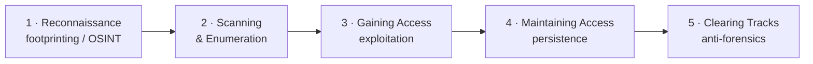
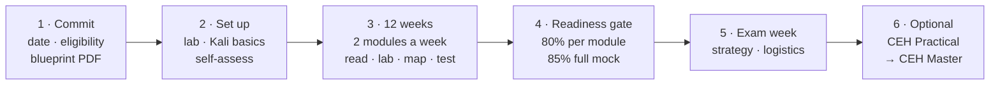
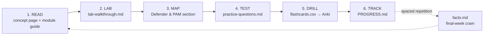

# 🎯 Certified Ethical Hacker (CEH v13) — Study Hub & Full Course

### A step-by-step preparation guide: concept pages, a 20-module course with labs and flashcards, one 12-week plan and a readiness gate — written from a **sysadmin / PAM defender** point of view

-red)

---

> [!WARNING]
> **Educational & authorized use only.** Attack techniques are explained for understanding
> and defense — every offensive topic is paired with **countermeasures**. Performing them
> against systems you do not own or are not **explicitly authorized in writing** to test is
> illegal. Read **[Legal & ethics](00-overview/legal-and-ethics.md)** first, and keep every
> hands-on exercise inside the [self-hosted lab](labs/README.md).

> [!NOTE]
> **Unofficial & no fabrication.** Not affiliated with or endorsed by EC-Council. Facts are
> tied to EC-Council and reputable sources (NIST, MITRE ATT&CK, OWASP, RFCs); unknowns are
> marked *“not specified in sources.”* Practice questions are **original**, never dumps.
> This hub is substantially AI-assisted and structurally validated, not line-by-line
> expert-reviewed — read [Known limitations](KNOWN-LIMITATIONS.md) and verify exam
> specifics at [eccouncil.org](https://www.eccouncil.org/).

## 🧭 Two layers, one hub

This folder merges two study repos that grew side by side:

| Layer | Where | Best for |
|-------|-------|----------|
| **Concept pages** — one page per module, Mermaid flows, tools by phase, countermeasures | [00-overview/](00-overview/what-is-ceh.md) · [domains/](domains/README.md) · [tools/](tools/tools-by-phase.md) · [exam-prep/](exam-prep/practice-questions.md) · [career/](career/ceh-career-and-adjacent-certs.md) · [reference/](reference/glossary.md) | A fast, source-grounded read of *what* each module covers |
| **Full course** — 20 module folders with facts, practice questions, flashcards and lab walkthroughs, plus a Kali course, a runnable lab, mock exams and a defender/PAM knowledge base | [modules/](modules/README.md) · [kali/](kali/README.md) · [labs/](labs/README.md) · [practical/](practical/README.md) · [defender-pam/](defender-pam/README.md) · [ot-security/](ot-security/README.md) · [cheatsheets/](cheatsheets/README.md) | Active recall, hands-on reps, and the “which control stops this?” reflex |

Read the concept page for a module, then work its course folder: **read → lab → map to the
control → test → drill → track.**

## 🔁 The 5 phases of ethical hacking

See **[five-phases-of-hacking.md](00-overview/five-phases-of-hacking.md)** for the
phase → module mapping and the Cyber Kill Chain / MITRE ATT&CK alignment.

## 🛠️ Prepare for the exam — the procedure

This hub is a **preparation guide**, not a reading list. Work it in this order; the method
behind it is the repo-wide [how to prepare a certification](../../learning/how-to-prepare-a-cert.md).

1. **Commit** — pick a target date; choose your eligibility route (official training or the
   experience-based application) and fill the *verify* fields in
   [EXAM-LOGISTICS.md](EXAM-LOGISTICS.md); download the official blueprint PDF and record its
   weights there. Read [exam & eligibility](00-overview/exam-and-eligibility.md) and
   [legal & ethics](00-overview/legal-and-ethics.md).
2. **Set up** — stand up the [lab](labs/README.md); if you are new to Linux, do the
   [Kali course](kali/README.md) chapters 00–05; score yourself on the
   [competency matrix](ROADMAP.md#where-are-you--competency-self-assessment); open
   [PROGRESS.md](PROGRESS.md).
3. **Follow the [12-week study plan](STUDY-PLAN.md)** — two modules a week, each through the
   loop below: concept page → module guide → lab → Defender & PAM mapping → practice
   questions → flashcards → tracker. Run the [capstone chain](labs/capstone.md) from Week 3.
   The **[practice kit](resources/practice-labs.md)** lists what to practise with each week:
   the repo's lab, drills and mocks, then the external platforms that add what the lab cannot.
4. **Pass the readiness gate** — every module ≥ 80% on its practice set, the
   [50-question](MOCK-EXAM.md) and [125-question timed](MOCK-EXAM-FULL.md) mocks ≥ 85%, the
   [rapid-fire bank](RAPID-FIRE.md) and [cheat sheet](exam-prep/cheat-sheet.md) automatic.
   The gate is spelled out at the end of the [plan](STUDY-PLAN.md#weeks-12-and-beyond--the-readiness-gate).
5. **Exam week** — [EXAM-STRATEGY.md](EXAM-STRATEGY.md): the study system, the test-day
   tactics, the trap pairs and the day-of checklist.
6. **CEH Practical (optional)** — the [practical/](practical/README.md) skills checklist,
   playbooks and timed drills for the 6-hour range; pass both exams for **CEH Master**.

**Entry points by profile** (the procedure is the same; the starting emphasis differs):

- 🌱 **New to Linux / hacking** — Kali course first, then the plan from Week 1. The
  [beginner → master roadmap](ROADMAP.md) sequences the whole journey with checkpoints.
- ⏱️ **Know the tech, need the cert** — skim each module guide, drill `facts.md`,
  `practice-questions.md` and `flashcards.csv`, and go straight to the mocks;
  [BLUEPRINT-COVERAGE.md](BLUEPRINT-COVERAGE.md) confirms nothing is missing.
- 🛡️ **Sysadmin / PAM engineer** — start with [defender-pam/](defender-pam/README.md) and
  [identity attack paths](defender-pam/identity-attack-paths.md), run the capstone to see
  attack → control end-to-end, then work the plan; for industrial estates add
  [ot-security/](ot-security/README.md).
- 🤖 **v13's AI focus** — [AI in ethical hacking](00-overview/ai-in-ethical-hacking.md),
  [AI-IN-ETHICAL-HACKING.md](AI-IN-ETHICAL-HACKING.md) and the drill prompts in
  [AI-STUDY-WORKFLOW.md](AI-STUDY-WORKFLOW.md).

## 📋 Exam at a glance

| Track | Format | Pass | Notes |
|-------|--------|------|-------|
| **CEH (knowledge)** | 125 multiple-choice questions · 4 hours · code `312-50v13` | **60–85%** (scaled cut-score per form) | Pearson VUE or ECC Exam Center |
| **CEH Practical** | 20 real-world challenges · 6 hours · iLabs Cyber Range | **60–85%** | Hands-on, optional |
| **CEH Master** | — | — | Awarded for passing **both** above |

Full details: **[exam & eligibility](00-overview/exam-and-eligibility.md)** and
[EXAM-LOGISTICS.md](EXAM-LOGISTICS.md). EC-Council publishes per-domain blueprint weights
inconsistently across public sources, so this hub does **not** print made-up weights —
download the official blueprint PDF and record the real ones yourself.

## 🔁 The study loop (every module)

Move on at **≥ 80%** on the module's practice set; log every miss in the weak-area log and
re-test it first next session. Drill flashcards with `python3 scripts/quiz.py --module 06`
or import them into Anki ([scripts/](scripts/README.md)). Keep [GLOSSARY.md](GLOSSARY.md),
the [glossary](reference/glossary.md) and [acronyms](reference/acronyms.md) open for lookups.

## 📚 The 20 modules (official CEH v13 order)

Each row links the **concept page** and the **course folder** (guide + `facts.md` ·
`practice-questions.md` · `flashcards.csv` · `lab-walkthrough.md`).

| # | Module | Concept page | Course folder |
|---|--------|--------------|---------------|
| 01 | Introduction to Ethical Hacking | [read](domains/01-introduction-to-ethical-hacking.md) | [→](modules/01-introduction-to-ethical-hacking/README.md) |
| 02 | Footprinting and Reconnaissance | [read](domains/02-footprinting-and-reconnaissance.md) | [→](modules/02-footprinting-and-reconnaissance/README.md) |
| 03 | Scanning Networks | [read](domains/03-scanning-networks.md) | [→](modules/03-scanning-networks/README.md) |
| 04 | Enumeration | [read](domains/04-enumeration.md) | [→](modules/04-enumeration/README.md) |
| 05 | Vulnerability Analysis | [read](domains/05-vulnerability-analysis.md) | [→](modules/05-vulnerability-analysis/README.md) |
| 06 | System Hacking | [read](domains/06-system-hacking.md) | [→](modules/06-system-hacking/README.md) |
| 07 | Malware Threats | [read](domains/07-malware-threats.md) | [→](modules/07-malware-threats/README.md) |
| 08 | Sniffing | [read](domains/08-sniffing.md) | [→](modules/08-sniffing/README.md) |
| 09 | Social Engineering | [read](domains/09-social-engineering.md) | [→](modules/09-social-engineering/README.md) |
| 10 | Denial-of-Service | [read](domains/10-denial-of-service.md) | [→](modules/10-denial-of-service/README.md) |
| 11 | Session Hijacking | [read](domains/11-session-hijacking.md) | [→](modules/11-session-hijacking/README.md) |
| 12 | Evading IDS, Firewalls, and Honeypots | [read](domains/12-evading-ids-firewalls-honeypots.md) | [→](modules/12-evading-ids-firewalls-honeypots/README.md) |
| 13 | Hacking Web Servers | [read](domains/13-hacking-web-servers.md) | [→](modules/13-hacking-web-servers/README.md) |
| 14 | Hacking Web Applications | [read](domains/14-hacking-web-applications.md) | [→](modules/14-hacking-web-applications/README.md) |
| 15 | SQL Injection | [read](domains/15-sql-injection.md) | [→](modules/15-sql-injection/README.md) |
| 16 | Hacking Wireless Networks | [read](domains/16-hacking-wireless-networks.md) | [→](modules/16-hacking-wireless-networks/README.md) |
| 17 | Hacking Mobile Platforms | [read](domains/17-hacking-mobile-platforms.md) | [→](modules/17-hacking-mobile-platforms/README.md) |
| 18 | IoT and OT Hacking | [read](domains/18-iot-and-ot-hacking.md) | [→](modules/18-iot-and-ot-hacking/README.md) |
| 19 | Cloud Computing | [read](domains/19-cloud-computing.md) | [→](modules/19-cloud-computing/README.md) |
| 20 | Cryptography | [read](domains/20-cryptography.md) | [→](modules/20-cryptography/README.md) |

## 🛡️ The Defender / PAM lens

Because so many CEH answers are “what's the *best* control”, the defender knowledge base
doubles as a fast filter: prefer the option that **reduces standing privilege, brokers /
records access, rotates the secret, or segments the tier**. It is the same lens the rest of
this repo uses for the sysadmin → PAM architect path — see the
[attack → defense matrix](../../attack-to-defense-matrix.md) and
[foundations/](../../foundations/README.md).

| Doc | What it gives you |
|-----|-------------------|
| [attack-to-control-matrix.md](defender-pam/attack-to-control-matrix.md) | Master table: attack → detection → control, grouped by module |
| [pam-playbook.md](defender-pam/pam-playbook.md) | The PAM control set (vault, JIT, tiering, gMSA, LAPS, session brokering) and what each defeats |
| [pam-architecture.md](defender-pam/pam-architecture.md) | A PAM reference architecture (illustrated with CyberArk's component model) + a Zero-Standing-Privilege maturity model |
| [identity-attack-paths.md](defender-pam/identity-attack-paths.md) | Kerberoasting, delegation abuse, DCSync, ADCS ESC1–8, golden/silver tickets, Entra token theft |
| [detection-engineering.md](defender-pam/detection-engineering.md) | Windows event IDs, Sigma rules, KQL/Splunk queries, PAM threat-analytics signals |
| [cyberark-attack-mapping.md](defender-pam/cyberark-attack-mapping.md) | Worked example: PAM component ↔ CEH attack it defeats (both lookup directions) |

> The vendor named in the architecture pages is a **worked example of a PAM stack**, not a
> certification track — this repo does not cover vendor PAM certifications.

## 🧪 Labs & tools

| Resource | What it is |
|----------|-----------|
| [labs/README.md](labs/README.md) | Runnable range: Docker web targets, OT/ICS simulators, Vagrant Kali + Metasploitable2, an Ansible **AD/ADCS lab with a tiered-admin (PAM) model**, a chained [capstone](labs/capstone.md) and a [blue-team detection lab](labs/blue-team-lab.md) |
| [labs/building-a-ceh-lab.md](labs/building-a-ceh-lab.md) · [labs/practice-ranges.md](labs/practice-ranges.md) | Lab design principles and the public practice ranges (TryHackMe, HTB, PortSwigger…) |
| [kali/](kali/README.md) · [KALI-TUTORIAL.md](KALI-TUTORIAL.md) | A 17-chapter beginner → mastery Kali course, and a one-page tool reference |
| [tools/tools-by-phase.md](tools/tools-by-phase.md) · [cheatsheets/](cheatsheets/README.md) | Tools mapped to phases; quick-reference sheets (nmap, Metasploit, hashcat, AD, web/SQLi, Wireshark…) |
| [scripts/](scripts/README.md) | Terminal flashcard quiz, Anki deck builder, and the hub's own integrity validator |

Run the course's validator from this folder: `python3 scripts/validate.py` (also run in CI).

## 📦 Everything here (clickable index)

**Orient:** [Roadmap (beginner → master)](ROADMAP.md) · [What is CEH](00-overview/what-is-ceh.md) · [Exam & eligibility](00-overview/exam-and-eligibility.md) · [Legal & ethics](00-overview/legal-and-ethics.md) · [Engagement methodology & reporting](00-overview/engagement-methodology-and-reporting.md) · [Known limitations](KNOWN-LIMITATIONS.md)

**Study the theory:** [Concept pages 01–20](domains/README.md) · [Course modules 01–20](modules/README.md) · [The 12-week study plan](STUDY-PLAN.md) · [Exam strategy](EXAM-STRATEGY.md) · [Glossary](GLOSSARY.md) · [Blueprint coverage](BLUEPRINT-COVERAGE.md) · [Progress tracker](PROGRESS.md) · [Exam logistics](EXAM-LOGISTICS.md)

**Learn the tools & do labs:** [Practice kit](resources/practice-labs.md) · [Kali course](kali/README.md) · [Kali reference](KALI-TUTORIAL.md) · [Lab environment](labs/README.md) · [Capstone chain](labs/capstone.md) · [Cheatsheets](cheatsheets/README.md) · [Tools by phase](tools/tools-by-phase.md)

**Pass the exams:** [Practice questions (concept track)](exam-prep/practice-questions.md) · [Cheat sheet](exam-prep/cheat-sheet.md) · [Mock exam — 50 Q](MOCK-EXAM.md) · [Full mock — 125 Q](MOCK-EXAM-FULL.md) · [Rapid-fire bank — 200 Q](RAPID-FIRE.md) · [CEH Practical prep](practical/README.md) · [Challenge generator](practical/challenge-lab/README.md) · [Drill packs](practical/drills/README.md) · [Simulated exams](practical/exams/README.md)

**Go deeper:** [Defender / PAM](defender-pam/README.md) · [OT / ICS security](ot-security/README.md) · [Identity attack paths](defender-pam/identity-attack-paths.md) · [Detection engineering](defender-pam/detection-engineering.md) · [AI-driven hacking](AI-IN-ETHICAL-HACKING.md) · [AI study workflow](AI-STUDY-WORKFLOW.md) · [Career & adjacent certs](career/ceh-career-and-adjacent-certs.md) · [Resources](resources/README.md) · [Deep references](resources/deep-references.md)

## 🔗 Official EC-Council references

- CEH program home — https://www.eccouncil.org/train-certify/certified-ethical-hacker-ceh/
- CEH v13 brochure / syllabus PDF — https://www.eccouncil.org/cehv13-brochure/
- CEH learning framework — https://www.eccouncil.org/cybersecurity-exchange/ethical-hacking/ceh-learning-framework/
- EC-Council Continuing Education (ECE) policy — https://cert.eccouncil.org/ece-policy.html
- Exam via Pearson VUE — https://home.pearsonvue.com/eccouncil

> Anything about weights, eligibility, cost, or policy that you cannot confirm on the links
> above should be treated as **unverified**. CEH, C|EH and EC-Council are trademarks of
> EC-Council, used here for identification and educational purposes only.
