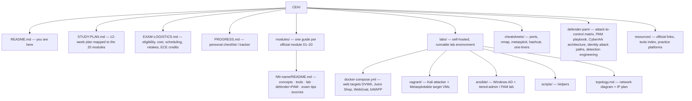

# CEH v13 — Study, Labs & Exam Prep

A self-built, no-fabrications study repository for the **EC-Council Certified Ethical Hacker (CEH) v13** certification, written from the perspective of a **systems administrator with a Privileged Access Management (PAM) background**.

Every module ties the offensive technique you must learn for the exam back to the defensive and PAM controls you already understand — so you learn attacks *through* the controls you manage.

> **Ethics & scope.** Everything here is for authorized learning only: your own self-hosted lab (see [`labs/`](labs/)), EC-Council's official ranges, or systems you have **written permission** to test. Never point these tools or techniques at systems you do not own or are not explicitly authorized to assess. Unauthorized access is a crime in most jurisdictions.

---

## What this repo is

- A **module-by-module guide** aligned to the 20 official CEH v13 modules ([`modules/`](modules/)).
- A **runnable, self-hosted lab** (Docker Compose + Vagrant + Ansible) so you practice on infrastructure you control ([`labs/`](labs/)).
- **Cheatsheets** with real command syntax ([`cheatsheets/`](cheatsheets/)).
- A **defender / PAM mapping** for every attack — a master attack-to-control matrix plus **CyberArk-centered deep-dives**: reference architecture, AD/Entra identity attack paths, and detection engineering ([`defender-pam/`](defender-pam/)).
- **Verified external resources** — official links only, no invented sources ([`resources/`](resources/)).
- A **study plan** and **progress tracker** you fill in as you go.

### What this repo is *not*
- Not a brain dump of exam questions or "dumps" — those violate the [EC-Council Candidate Agreement](https://www.eccouncil.org/) and get certifications revoked.
- Not a replacement for the official courseware. Confirm every blueprint weight and policy against EC-Council directly (links below).

---

## Exam facts (verify against EC-Council before you book)

The values below are consistent across multiple public sources as of **2026-07-13**, but exam policy changes — always confirm on the official pages linked at the bottom.

### CEH (Knowledge) exam — the multiple-choice test

| Item | Value |
|---|---|
| Exam code | **312-50** (v13 → 312-50v13) |
| Questions | **125** multiple choice |
| Duration | **4 hours** (240 minutes) |
| Passing score | **Variable cut score, ~60–85%** depending on the difficulty of your question form |
| Delivery | Pearson VUE or ECC Exam Center (VUE Testing) |
| Courseware | **20 modules**, launched **23 September 2024**, Exam Blueprint **v5.0** |

### CEH (Practical) exam — the hands-on test (separate, optional, earns "CEH Master")

| Item | Value |
|---|---|
| Format | Hands-on challenges in EC-Council's iLabs / Cyber Range |
| Challenges | **20** real-world challenges |
| Duration | **6 hours** |
| Result | Passing both the Knowledge exam and the Practical earns the **CEH Master** designation |

> ⚠️ **Blueprint domains vs. modules.** EC-Council groups the 20 modules into a smaller set of scored *domains* in Blueprint v5.0. Public sources report the exact per-domain percentages **inconsistently**, so this repo does **not** print made-up weights. Download the official blueprint PDF and record the real weights in [`EXAM-LOGISTICS.md`](EXAM-LOGISTICS.md) yourself.

---

## The 20 modules (official CEH v13 order)

| # | Module | Guide |
|---|---|---|
| 01 | Introduction to Ethical Hacking | [→](modules/01-introduction-to-ethical-hacking/) |
| 02 | Footprinting and Reconnaissance | [→](modules/02-footprinting-and-reconnaissance/) |
| 03 | Scanning Networks | [→](modules/03-scanning-networks/) |
| 04 | Enumeration | [→](modules/04-enumeration/) |
| 05 | Vulnerability Analysis | [→](modules/05-vulnerability-analysis/) |
| 06 | System Hacking | [→](modules/06-system-hacking/) |
| 07 | Malware Threats | [→](modules/07-malware-threats/) |
| 08 | Sniffing | [→](modules/08-sniffing/) |
| 09 | Social Engineering | [→](modules/09-social-engineering/) |
| 10 | Denial-of-Service | [→](modules/10-denial-of-service/) |
| 11 | Session Hijacking | [→](modules/11-session-hijacking/) |
| 12 | Evading IDS, Firewalls, and Honeypots | [→](modules/12-evading-ids-firewalls-honeypots/) |
| 13 | Hacking Web Servers | [→](modules/13-hacking-web-servers/) |
| 14 | Hacking Web Applications | [→](modules/14-hacking-web-applications/) |
| 15 | SQL Injection | [→](modules/15-sql-injection/) |
| 16 | Hacking Wireless Networks | [→](modules/16-hacking-wireless-networks/) |
| 17 | Hacking Mobile Platforms | [→](modules/17-hacking-mobile-platforms/) |
| 18 | IoT and OT Hacking | [→](modules/18-iot-and-ot-hacking/) |
| 19 | Cloud Computing | [→](modules/19-cloud-computing/) |
| 20 | Cryptography | [→](modules/20-cryptography/) |

---

## Repository map

---

## How to use this repo

1. Read [`EXAM-LOGISTICS.md`](EXAM-LOGISTICS.md) and confirm your eligibility path and the current blueprint.
2. Stand up the lab from [`labs/README.md`](labs/README.md).
3. Work modules **in order** ([`STUDY-PLAN.md`](STUDY-PLAN.md) gives a 12-week cadence). For each module:
   - Read the concepts and the exam-testable facts.
   - Run the lab exercise against **your** targets and record results in the module's lab-log section.
   - Read the **Defender & PAM mapping** — this is your retention hook.
   - Tick the module in [`PROGRESS.md`](PROGRESS.md).
4. In the final weeks, drill with the [`cheatsheets/`](cheatsheets/) and the practice platforms in [`resources/practice-labs.md`](resources/practice-labs.md).

---

## Official EC-Council references

- CEH program home — https://www.eccouncil.org/train-certify/certified-ethical-hacker-ceh/
- CEH v13 brochure / syllabus PDF — https://www.eccouncil.org/cehv13-brochure/
- CEH learning framework — https://www.eccouncil.org/cybersecurity-exchange/ethical-hacking/ceh-learning-framework/
- EC-Council Continuing Education (ECE) policy — https://cert.eccouncil.org/ece-policy.html
- Exam via Pearson VUE — https://home.pearsonvue.com/eccouncil

> Anything about weights, eligibility, cost, or policy that you cannot confirm on the links above should be treated as **unverified** and not relied on for booking decisions.
