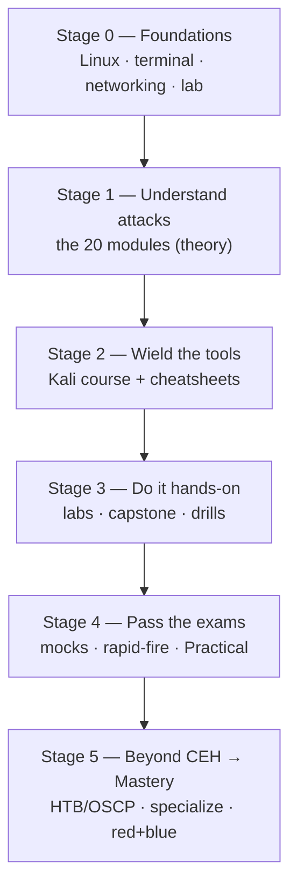

# Beginner → Master Roadmap

The **CEH hub** sequenced into one ladder — from "never opened a terminal" to "operates confidently on both sides of an attack." CEH sits in the middle (Stages 1–4); Stage 5 is where you keep climbing after the cert. Work the stages in order; don't skip the foundations. (The *career* ladder across all the certs is the repo-wide [roadmap](../../learning/roadmap.md); this page is the skill ladder inside CEH.)

> 🧭 **See also:** [career/ceh-career-and-adjacent-certs.md](career/ceh-career-and-adjacent-certs.md) and the repo-wide [sysadmin → PAM architect roadmap](../../learning/roadmap.md).

> Each stage ends with a **checkpoint**: a concrete thing you can *do*. If you can't do it, you're not done with the stage — go back, don't push forward.

---

## Stage 0 — Foundations *(1–3 weeks · absolute beginner)*
You can't hack what you can't navigate. Build the base first.
- **Learn:** [Kali course](kali/README.md) chapters [00 Getting started](kali/00-getting-started.md) → [01 Linux](kali/01-linux-essentials.md) → [02 Terminal](kali/02-terminal-power.md) → [03 Networking](kali/03-networking-basics.md).
- **Do:** stand up the [lab](labs/README.md) (`cd labs && ./scripts/setup.sh`), confirm it's isolated.
- ✅ **Checkpoint:** from a cold terminal you can move around Linux, edit a file, read your IP, ping a lab host, and explain what a port and an IP subnet are.

## Stage 1 — Understand the attacks *(4–8 weeks · the CEH theory)*
Learn *what* each attack is and *why* it works — and the control that stops it (your retention hook).
- **Learn:** the [20 modules](modules/README.md) in order. For each: read the guide, drill its `facts.md`, and read the **Defender & PAM** section. Track the blueprint in [BLUEPRINT-COVERAGE.md](BLUEPRINT-COVERAGE.md).
- **Cross-cutting:** [AI-driven hacking](AI-IN-ETHICAL-HACKING.md) (v13) and the [defender/PAM](defender-pam/README.md) knowledge base.
- ✅ **Checkpoint:** for any attack (Kerberoasting, SQLi, XSS, ARP poisoning…) you can explain it in two sentences *and* name the control that defeats it.

## Stage 2 — Wield the tools *(overlaps Stage 1 · 4–6 weeks)*
Turn "I know the concept" into "I can drive the tool."
- **Learn:** [Kali course](kali/README.md) chapters [04 Recon](kali/04-recon-osint.md) → [15 Reporting](kali/15-notes-and-reporting.md) (recon, nmap, enumeration, web, Metasploit, passwords, AD, sniffing, wireless, post-ex).
- **Reference:** keep the [cheatsheets](cheatsheets/README.md) open while you work.
- ✅ **Checkpoint:** without notes, you can nmap a host, enumerate SMB, crack a hash, get a shell with Metasploit, and upgrade it to a TTY.

## Stage 3 — Do it hands-on *(ongoing · where skill actually forms)*
Reading ≠ doing. Break things in the lab.
- **Do:** every module's `lab-walkthrough.md`; then the full [capstone chain](labs/capstone.md) (recon→Kerberoast→delegation→ADCS→DCSync); then the [challenge lab](practical/challenge-lab/README.md) (stego/pcap/crypto/hashes) and the [Practical drill packs](practical/drills/README.md).
- **Master move:** attack the lab, then **[detect your own attack](labs/blue-team-lab.md)** in the logs — understanding both sides is what separates operators from button-pushers.
- ✅ **Checkpoint:** you can run the capstone end-to-end from a foothold to Domain Admin, *and* find the same activity in the defender's logs.

## Stage 4 — Pass the exams *(final 2–4 weeks)*
- **Knowledge exam:** the [12-week plan](STUDY-PLAN.md), [exam strategy](EXAM-STRATEGY.md), and drill the [50-Q](MOCK-EXAM.md) / [125-Q](MOCK-EXAM-FULL.md) mocks + the [200-Q rapid-fire bank](RAPID-FIRE.md) until you're ≥85%.
- **Practical (CEH Master):** the [`practical/`](practical/README.md) skills checklist, playbooks, and timed drills.
- ✅ **Checkpoint:** ≥85% on a full-length mock, and you clear the Practical drills under time.

## Stage 5 — Beyond CEH → Mastery *(months–years · never really "done")*
CEH proves breadth. Mastery is depth + reps + both-sides fluency. Pick a lane and go deep.

**Structured hands-on ladder (free/cheap):**
- **TryHackMe** — beginner-friendly guided rooms → their "Jr Penetration Tester" / "Offensive Pentesting" paths.
- **Hack The Box** — Starting Point → easy → medium boxes; **HTB Academy** for structured modules.
- **VulnHub / PortSwigger Academy / PentesterLab** — downloadable targets and web-app depth.
- Build your own bigger [home lab](labs/README.md) (add AD forests, cloud accounts, an EDR to evade/tune).

**Certification ladder:** the order after CEH (CySA+, PenTest+ / PNPT / OSCP, cloud
security, CISSP) and the reasoning behind it live in one place, the repo-wide
[sysadmin → PAM architect roadmap](../../learning/roadmap.md); each cert's hub applies the
same [preparation method](../../learning/how-to-prepare-a-cert.md).

**Specializations to go deep in:**
- **Active Directory / identity** (your repo already leans here — [identity attack paths](defender-pam/identity-attack-paths.md), BloodHound, ADCS).
- **Web application security** (PortSwigger Academy → bug bounty).
- **Cloud security** (AWS/Azure/GCP + Kubernetes — [Module 19](modules/19-cloud-computing/README.md)).
- **OT / ICS security** (critical infrastructure — the beginner→expert [ot-security/](ot-security/README.md) curriculum, the [OT lab](labs/ot/README.md), IEC 62443, ATT&CK for ICS).
- **Malware analysis / DFIR**, **red teaming / evasion**, or **detection engineering / blue team** ([detection-engineering.md](defender-pam/detection-engineering.md) → SIEM/Sigma/Sysmon).

**Habits of mastery:**
- **Both sides:** for every attack you learn, learn its detection and its fix (the whole repo is built this way).
- **Reps + notes:** keep a methodology and a personal knowledge base ([Kali ch.15](kali/15-notes-and-reporting.md)); write up every box you do.
- **CTFs + community:** play CTFs, read writeups, follow research; teach what you learn (fastest way to master).
- **Stay legal, stay current:** only authorized targets; the field moves — keep reading ([deep references](resources/deep-references.md)).

---

## Where are you? — competency self-assessment
Rate yourself per skill: **🟥 Novice** (need a guide) · **🟨 Competent** (can do with notes) · **🟩 Proficient** (cold, under time) · **🟦 Expert** (can teach + adapt). Level up the 🟥/🟨 rows.

| Skill | 🟥 → 🟦 |
|---|---|
| Linux / terminal / networking | navigate → script → design a lab network |
| Recon & scanning | run nmap → interpret + choose next step → evade + tune |
| Enumeration | list shares → pull the right data fast → map an unknown env |
| Web & SQLi | follow a payload → exploit by hand → chain to RCE |
| Password / hash cracking | crack MD5 → pick the right mode fast → craft rules/wordlists |
| Exploitation & privesc | use a Metasploit module → manual exploit + privesc → write your own |
| Active Directory | Kerberoast → walk a BloodHound path → full domain compromise + persistence |
| Detection / blue team | read a finding → detect an attack in logs → write Sigma rules |
| Reporting | take notes → write a finding → deliver a full report |

> **Mastery isn't a cert — it's the day you can attack a target, defend it, and explain both to someone else.** Everything in this repo is arranged to get you there. Start at [Stage 0](#stage-0--foundations-13-weeks--absolute-beginner).
