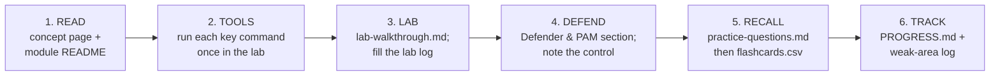

# CEH v13 — The 12-Week Study Plan

The single week-by-week plan for the **CEH v13 knowledge exam (312-50v13)**, with an optional
two-week extension for the **CEH Practical**. It sequences *both* layers of this hub — the
concept page and the course folder of each module — plus the lab, the drills and a weekly
milestone you can check. The method behind it is the repo-wide
[how to prepare a certification](../../learning/how-to-prepare-a-cert.md); the exam
mechanics are in [EXAM-LOGISTICS.md](EXAM-LOGISTICS.md) and
[exam & eligibility](00-overview/exam-and-eligibility.md).

> **Time estimates are suggestions, not requirements.** The cadence assumes a working
> sysadmin at roughly **8–10 hours a week**. Stretch or compress it to your exam date;
> EC-Council does not mandate a study duration. Halve the pace rather than skip the labs.

## Before Week 1 — set-up (Week 0)

- [ ] **Commit.** Write why CEH now (one sentence tied to the [skill path](../../learning/roadmap.md)) and pick a target exam date.
- [ ] **Eligibility.** Choose your route — official training, or the experience-based application — and fill the *verify* fields in [EXAM-LOGISTICS.md](EXAM-LOGISTICS.md) from EC-Council's site.
- [ ] **Blueprint.** Download the official CEH v13 blueprint PDF and record its domain weights in [EXAM-LOGISTICS.md](EXAM-LOGISTICS.md); this hub deliberately does not print them. Confirm coverage with [BLUEPRINT-COVERAGE.md](BLUEPRINT-COVERAGE.md).
- [ ] **Self-assess** with the [competency matrix](ROADMAP.md#where-are-you--competency-self-assessment); your 🟥 rows get extra time.
- [ ] **Lab.** Stand up the [self-hosted lab](labs/README.md) (`docker compose up`, then `vagrant up` for the Windows/AD layer). Nothing below works without it.
- [ ] **New to Linux or Kali?** Work the [Kali course](kali/README.md) chapters 00–05 first; every module assumes the terminal.
- [ ] **Tracking.** Open [PROGRESS.md](PROGRESS.md) and keep its weak-area log from day one.

## Ground rules

- **Do the lab, don't just read it.** CEH questions are heavily tool- and command-oriented; muscle memory beats recognition.
- **Use your PAM / sysadmin lens.** For every attack ask "which control that I already run would have stopped this?" — every module's *Defender & PAM* section answers it. That mapping is your fastest path to retention and to the "best defence" questions.
- **Ports and protocols from day one.** Start [cheatsheets/ports-and-protocols.md](cheatsheets/ports-and-protocols.md) in Week 1 and review it every week.
- **Recall, not re-reading.** Each module ships `facts.md`, original `practice-questions.md` and an Anki-ready `flashcards.csv`; the drill prompts are in [AI-STUDY-WORKFLOW.md](AI-STUDY-WORKFLOW.md). Read [EXAM-STRATEGY.md](EXAM-STRATEGY.md) once in Week 1.
- **Legal lab only.** Practise solely on systems you own or are authorised in writing to test — see [legal & ethics](00-overview/legal-and-ethics.md).

## The weekly loop (repeat for every module)

Move on when the module's practice set scores **≥ 80%**; otherwise log the misses and
re-test them first next session. Ten minutes of flashcards on the other days keeps the
spacing going (`python3 scripts/quiz.py --module NN`, or import the CSV into Anki — see
[scripts/](scripts/README.md)).

## The schedule

Each row names the **concept page** (fast, source-grounded *what*) and the **course folder**
(guide, facts, questions, flashcards, lab walkthrough). The **milestone** is the thing you
must be able to do before the week ends.

| Week | Modules | Concept pages | Course folders | Lab targets | Milestone — you can… |
|---|---|---|---|---|---|
| **1** | 01 Intro · 02 Footprinting | [what is CEH](00-overview/what-is-ceh.md) · [5 phases](00-overview/five-phases-of-hacking.md) · [legal & ethics](00-overview/legal-and-ethics.md) · [01](domains/01-introduction-to-ethical-hacking.md) · [02](domains/02-footprinting-and-reconnaissance.md) | [01](modules/01-introduction-to-ethical-hacking/README.md) · [02](modules/02-footprinting-and-reconnaissance/README.md) | External recon of the lab; WHOIS / DNS | recite the 5 phases in order, state the exam format, and distinguish passive from active recon naming 5 footprinting sources |
| **2** | 03 Scanning · 04 Enumeration | [03](domains/03-scanning-networks.md) · [04](domains/04-enumeration.md) | [03](modules/03-scanning-networks/README.md) · [04](modules/04-enumeration/README.md) | Metasploitable, the DVWA host | explain the TCP handshake and why a SYN scan is "stealthy"; enumerate SMB, SNMP and LDAP and say what enumeration adds beyond scanning |
| **3** | 05 Vuln Analysis · 06 System Hacking | [05](domains/05-vulnerability-analysis.md) · [06](domains/06-system-hacking.md) | [05](modules/05-vulnerability-analysis/README.md) · [06](modules/06-system-hacking/README.md) | Metasploitable; the Windows / AD lab | read a CVSS band; classify password-attack types; name 3 privilege-escalation and 3 persistence techniques |
| **4** | 07 Malware · 08 Sniffing | [07](domains/07-malware-threats.md) · [08](domains/08-sniffing.md) | [07](modules/07-malware-threats/README.md) · [08](modules/08-sniffing/README.md) | Lab-segment traffic | tell virus / worm / Trojan / rootkit apart; explain ARP poisoning vs MAC flooding and the switch-side control for each |
| **5** | 09 Social Engineering · 10 DoS | [09](domains/09-social-engineering.md) · [10](domains/10-denial-of-service.md) | [09](modules/09-social-engineering/README.md) · [10](modules/10-denial-of-service/README.md) | SET and load tests, lab only | classify volumetric / protocol / application-layer DoS; match each human attack to a control |
| **6** | 11 Session Hijacking · 12 Evasion | [11](domains/11-session-hijacking.md) · [12](domains/12-evading-ids-firewalls-honeypots.md) | [11](modules/11-session-hijacking/README.md) · [12](modules/12-evading-ids-firewalls-honeypots/README.md) | Web targets; Snort / Suricata | explain application- vs network-level hijacking and signature vs anomaly detection; match every attack from Weeks 4–6 to a defensive control |
| **7** | 13 Web Servers · 14 Web Apps | [13](domains/13-hacking-web-servers.md) · [14](domains/14-hacking-web-applications.md) | [13](modules/13-hacking-web-servers/README.md) · [14](modules/14-hacking-web-applications/README.md) | DVWA, Juice Shop, WebGoat | name the OWASP Top 10 categories and exploit one XSS and one traversal in the lab |
| **8** | 15 SQL Injection | [15](domains/15-sql-injection.md) | [15](modules/15-sql-injection/README.md) | DVWA, bWAPP, sqlmap | tell in-band, blind and out-of-band SQLi apart and state parameterised queries as the fix |
| **9** | 16 Wireless · 17 Mobile | [16](domains/16-hacking-wireless-networks.md) · [17](domains/17-hacking-mobile-platforms.md) | [16](modules/16-hacking-wireless-networks/README.md) · [17](modules/17-hacking-mobile-platforms/README.md) | Your own AP; an Android emulator | contrast WEP / WPA2 / WPA3 and explain evil-twin and deauth; outline the Android and iOS threat models |
| **10** | 18 IoT/OT · 19 Cloud | [18](domains/18-iot-and-ot-hacking.md) · [19](domains/19-cloud-computing.md) | [18](modules/18-iot-and-ot-hacking/README.md) · [19](modules/19-cloud-computing/README.md) | Docker; a cloud free tier you own | name the shared-responsibility boundary; explain Modbus / SCADA exposure and default-credential risk |
| **11** | 20 Cryptography · AI (v13) | [20](domains/20-cryptography.md) · [AI in ethical hacking](00-overview/ai-in-ethical-hacking.md) | [20](modules/20-cryptography/README.md) · [AI-IN-ETHICAL-HACKING.md](AI-IN-ETHICAL-HACKING.md) | hashcat / john in the lab | distinguish symmetric vs asymmetric and encrypt vs sign; describe prompt injection and adversarial ML in one sentence each |
| **12** | Review + mocks | [cheat sheet](exam-prep/cheat-sheet.md) · [cheatsheets/](cheatsheets/README.md) | every `facts.md` | Mixed | pass the readiness gate below |

> **Capstone (from Week 3, once the AD lab is up):** run the [capstone chain](labs/capstone.md)
> — recon → Kerberoast → delegation → ADCS → DCSync — then re-run it with the fixes applied and
> [detect your own attack](labs/blue-team-lab.md) in the logs. Do it at least twice before Week 12.

## Weeks 12 and beyond — the readiness gate

Book the knowledge exam when **all** of these hold:

- [ ] Every module row in [PROGRESS.md](PROGRESS.md) has all four columns ticked.
- [ ] Every module's `practice-questions.md` scores **≥ 80%** on a second, spaced attempt.
- [ ] The **50-question checkpoint** ([MOCK-EXAM.md](MOCK-EXAM.md)) and the **125-question
  timed full mock** ([MOCK-EXAM-FULL.md](MOCK-EXAM-FULL.md)) both score **≥ 85%**, at the
  real pace of about 1.9 minutes per question.
- [ ] The [rapid-fire bank](RAPID-FIRE.md) and the [cheat sheet](exam-prep/cheat-sheet.md)
  are automatic: well-known ports, Nmap flags and scan types, the Metasploit workflow,
  hash and crypto algorithm properties, tool → purpose pairs, CVSS bands.
- [ ] The [trap pairs](EXAM-STRATEGY.md#common-trap-pairs-to-pre-load) are cold.
- [ ] No open row in the weak-area log is older than a week.

Then follow [EXAM-STRATEGY.md](EXAM-STRATEGY.md) for exam week and exam day.

## Weeks 13–14 (optional) — CEH Practical

Only if you are going for **CEH Master** (knowledge exam + Practical):

- Work the [practical/](practical/README.md) skills checklist, challenge playbooks and timed
  drills; the [challenge lab](practical/challenge-lab/README.md) covers stego, pcap, crypto
  and hashes.
- Rebuild the key labs from scratch without notes: discovery, enumeration, password cracking,
  web exploitation and basic post-exploitation, inside a self-imposed time box.
- Practise note-taking and screenshot discipline; the Practical is scored on results you
  demonstrate.
- **Milestone:** a full lab chain end-to-end, under time, before you book the 6-hour range.

## Study tips for a sysadmin

- **Relabel, don't relearn.** You know TCP/IP, DNS, AD, SMB and services; CEH asks you to see
  them from the attacker's side.
- **Master ports and scan types cold.** High-frequency, low-effort points; the cheat-sheet
  port table is the best return on study time.
- **Learn tools by category.** The exam tests "which tool for which job" (scanner vs sniffer
  vs cracker). One representative tool per category beats memorising hundreds.
- **Watch the qualifier words.** *passive / active / stealth / BEST / FIRST / MOST likely /
  NOT / EXCEPT* decide most items. Read every option.
- **Space the reviews.** Short daily sessions plus a weekly mixed recall beat one long cram.

## External study references (verify current editions)

- CEH v13 official brochure / syllabus — https://www.eccouncil.org/cehv13-brochure/
- EC-Council CEH program page — https://www.eccouncil.org/train-certify/certified-ethical-hacker-ceh/
- MITRE ATT&CK (technique reference that maps well to the modules) — https://attack.mitre.org/
- OWASP Top 10 (web modules) — https://owasp.org/www-project-top-ten/
- NIST SP 800-115 (technical assessment methodology) — https://csrc.nist.gov/pubs/sp/800/115/final
