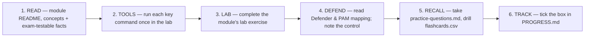

# CEH v13 — 12-Week Study Plan

A cadence for someone working full-time (aim ~8–10 hrs/week). Adjust freely. Each week = read the module guide(s) + do the lab exercise + review the defender/PAM mapping + update [`PROGRESS.md`](PROGRESS.md).

> This plan assumes your self-hosted lab is already running. Build it **before Week 1** using [`labs/README.md`](labs/README.md).

## Ground rules

- **Do the lab, don't just read it.** CEH questions are heavily tool- and command-oriented. Muscle memory beats recognition.
- **Use your PAM/sysadmin lens.** For every attack, ask "which control I already run would have stopped this?" That mapping is your fastest path to retention — it's in every module's *Defender & PAM* section.
- **Track ports/protocols from day one.** Start filling [`cheatsheets/ports-and-protocols.md`](cheatsheets/ports-and-protocols.md) in Week 1 and review it every single week.
- **New to Linux/Kali?** Work through the [`kali/`](kali/) course (chapters 00–05) *before* Week 1 — it teaches the terminal and tools every module assumes.
- **Study smart.** Each module ships a one-page `facts.md`, original `practice-questions.md`, and Anki `flashcards.csv`. Drill them with the copy-paste prompts in [`AI-STUDY-WORKFLOW.md`](AI-STUDY-WORKFLOW.md), and confirm nothing's missing with [`BLUEPRINT-COVERAGE.md`](BLUEPRINT-COVERAGE.md).

## Schedule

| Week | Modules | Focus | Lab targets |
|---|---|---|---|
| 0 (setup) | — | Stand up the lab; confirm blueprint & eligibility; if new to Linux, do [`kali/`](kali/) ch. 00–05 | All (`docker compose up`, `vagrant up`) |
| 1 | 01 Intro · 02 Footprinting | Ethics, methodology, OSINT, passive recon | External recon; WHOIS/DNS |
| 2 | 03 Scanning · 04 Enumeration | Host discovery, port/version scanning, service enum | Metasploitable, DVWA host |
| 3 | 05 Vuln Analysis · 06 System Hacking | Scoring (CVSS), scanners, privesc, cred access | Metasploitable, Windows AD lab |
| 4 | 07 Malware · 08 Sniffing | Malware taxonomy/analysis, MITM, ARP/DNS poisoning | Lab segment traffic |
| 5 | 09 Social Engineering · 10 DoS | Human attacks, phishing frameworks, DoS/DDoS types | SET (lab only), load tests (lab only) |
| 6 | 11 Session Hijacking · 12 Evasion | Token/session attacks, IDS/FW/honeypot evasion | Web targets, Snort/Suricata |
| 7 | 13 Web Servers · 14 Web Apps | Web server attacks, OWASP-style app attacks | DVWA, Juice Shop, WebGoat |
| 8 | 15 SQL Injection | In-band, blind, and automated SQLi | DVWA, bWAPP, sqlmap |
| 9 | 16 Wireless · 17 Mobile | WPA/WEP attacks, Bluetooth, Android/iOS | Wi-Fi lab (own AP), Android emulator |
| 10 | 18 IoT/OT · 19 Cloud | IoT/OT protocols, cloud attack surface, containers | Cloud free-tier (own), Docker |
| 11 | 20 Cryptography | Ciphers, PKI, hashing, crypto attacks | hashcat/john in lab |
| 12 | Review + practice | Full-length practice, weak-area drills, cheatsheets | Mixed |

> **Cross-cutting — AI (CEH v13):** study [`AI-IN-ETHICAL-HACKING.md`](AI-IN-ETHICAL-HACKING.md) during Weeks 10–12; v13 tests AI-driven ethical hacking *and* attacks on AI systems (prompt injection, adversarial ML).
> **Capstone:** once the AD lab is up (from Week 3), run the [`labs/capstone.md`](labs/capstone.md) chain — recon→Kerberoast→delegation→ADCS→DCSync — and re-run it with the fixes applied.

## Weekly loop (repeat every module)

## Final 2 weeks (exam readiness)

- Take the **50-question checkpoint** ([`MOCK-EXAM.md`](MOCK-EXAM.md)), then the **125-question full-length** timed ([`MOCK-EXAM-FULL.md`](MOCK-EXAM-FULL.md)) — plus other legitimate sources ([`resources/practice-labs.md`](resources/practice-labs.md)).
- Re-drill any module scoring < 80%.
- Memorize: well-known ports, nmap flags, Metasploit workflow, hashing/crypto algorithm properties, common tool→purpose pairs.
- If pursuing **CEH Master**, book time on EC-Council's Practical range and rehearse the full methodology end-to-end.

## External study references (verify current editions)

- CEH v13 official brochure/syllabus — https://www.eccouncil.org/cehv13-brochure/
- MITRE ATT&CK (technique reference that maps well to modules) — https://attack.mitre.org/
- OWASP Top 10 (web modules) — https://owasp.org/www-project-top-ten/
- NIST SP 800-115 (technical assessment methodology) — https://csrc.nist.gov/pubs/sp/800/115/final
