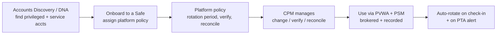

# CyberArk → CEH Attack Mapping

The vendor-specific companion to [attack-to-control-matrix.md](attack-to-control-matrix.md): given a CyberArk component, which CEH attacks does it defeat — and given a CEH attack, which component do you reach for. Use it to translate exam concepts into the product you operate.

> CyberArk is one implementation of the concepts in [pam-architecture.md](pam-architecture.md). The exam tests the *concept* (vault, JIT, session brokering); this doc is so you can also answer *"how would you do that in your stack?"* in an interview.

---

## Component → attacks it defeats

| CyberArk component | Core function | CEH attacks it defeats / contains | Modules |
|---|---|---|---|
| **Digital Vault (EPV) / Privilege Cloud** | Encrypted, tamper-evident credential store; no human knows the password | Offline credential reuse, shared-admin abuse, credential theft-at-rest | 06, 08, 20 |
| **PVWA** | Access UI + REST API; enforces MFA + approval before use | Unauthorized privileged use, missing MFA | 06, 09 |
| **CPM** (Central Policy Manager) | Auto-rotate / verify / reconcile credentials | **Pass-the-Hash** value, local-admin reuse, **Kerberoasting** (long random svc pwd), stale service creds | 06, 15, 16, 18 |
| **PSM / PSMP** | Broker + isolate + record RDP/SSH/web sessions; inject creds server-side | Sniffing, keylogging, **session hijacking**, endpoint credential theft, MITM | 06, 08, 11 |
| **PTA** (Privileged Threat Analytics) | Privileged UEBA: Golden Ticket, PtH/PtT, DCSync, unmanaged accounts | Detection for identity attacks + IDS-evasion behavioral gap | 06, 12 |
| **EPM** (Endpoint Privilege Manager) | Remove local admin, application control, credential-theft + ransomware blocking | Malware persistence, **LSASS dumping**, privilege escalation, ransomware | 06, 07 |
| **Conjur / Secrets Manager** | Secrets for apps, CI/CD, containers, cloud | Hardcoded secrets, leaked keys/connection strings | 13, 14, 19, 20 |
| **CCP / Credential Provider (AAM)** | Remove hardcoded app credentials; deliver at runtime | Secrets in `web.config`/source, DB creds in app | 13, 14, 15 |
| **DPA / Secure Infrastructure Access** | Agentless JIT + ZSP access to VMs & cloud (ephemeral certs) | Standing-privilege theft, lateral movement, cloud key leakage | 06, 18, 19 |
| **Secure Cloud Access (CIEM)** | JIT to cloud consoles; right-size cloud entitlements | Over-privileged IAM, cloud privilege escalation | 19 |
| **Remote Access** (ex-Alero) | VPN-less third-party access with mobile biometric MFA | Phishing, VPN credential abuse, vendor compromise | 09, 17, 18 |
| **Secure Web Sessions (SWS)** | Monitor/record access to SaaS/web admin consoles | Web-console session theft, cloud admin abuse | 14, 19 |
| **OPM** (On-Demand Privileges Mgr) | Vault-controlled Unix `sudo` / superuser | Unix privilege escalation, shared root | 06 |
| **CyberArk Identity** | SSO + adaptive/step-up MFA + lifecycle | Credential stuffing, phishing, weak auth | 09, 11, 14 |

---

## Attack → reach-for-this-component (quick lookup)

| CEH attack | First CyberArk answer | Backed by |
|---|---|---|
| Pass-the-Hash / PtT | **PSM** (creds never on endpoint) + **EPM** + tiering | CPM rotation |
| Kerberoasting | **CPM-rotated** long random svc pwd (or gMSA) | AES-only, PTA alert |
| LSASS / credential dumping | **EPM** credential-theft blocking | Credential Guard |
| Local-admin reuse across hosts | **CPM** unique rotated local admin (LAPS-style) | EPM removes need for it |
| DCSync / Golden Ticket | **PTA** detection + Tier 0 isolation | rotate krbtgt |
| Sniffing / MITM of admin creds | **PSM/PSMP** server-side injection | TLS everywhere |
| Ransomware | **EPM** ransomware + app control | least privilege, backups |
| Hardcoded app/DB secrets | **Conjur / CCP** | rotation |
| Over-privileged cloud IAM / leaked keys | **Secure Cloud Access + Conjur** | DPA JIT |
| Vendor / remote compromise | **Remote Access** biometric MFA | ZSP |
| Unix `sudo` abuse | **OPM** | Vault audit |

---

## Onboarding, platform policy & rotation (the engineering reality)

The mapping only works if accounts are actually **onboarded and managed**:

- **Safes** segregate credentials with least-privilege access (who can retrieve/use what).
- **Platform policies** define rotation cadence, verification, and *reconciliation* (CPM fixes a drifted password using a reconcile account).
- **Dual control + JIT** on sensitive Safes so retrieval needs approval and is time-boxed.
- **Service accounts** are the highest-value onboarding target — they're what Kerberoasting and delegation abuse chase; a CPM-managed long random password (or gMSA where CPM isn't needed) removes the payoff.

---

## Deployment note (self-hosted vs SaaS)

CyberArk ships the same concepts as **self-hosted PAM** (you run the Vault) and **Privilege Cloud** (Vault-as-a-service); **EPM, Conjur Cloud, Secure Cloud Access, Remote Access, and Secure Web Sessions** are SaaS. The CEH answer doesn't change with deployment model — *broker, rotate, JIT, isolate* — only where the control plane runs.

## Sources

- CyberArk Docs portal: https://docs.cyberark.com/
- CyberArk — Central Policy Manager (rotation/reconciliation): https://docs.cyberark.com/pam-self-hosted/latest/en/content/cpm/central-policy-manager.htm
- CyberArk — Privileged Session Manager: https://docs.cyberark.com/pam-self-hosted/latest/en/content/psm/privileged-session-manager.htm
- CyberArk — Endpoint Privilege Manager: https://docs.cyberark.com/epm/
- CyberArk — Secrets Manager / Conjur: https://docs.cyberark.com/conjur-cloud/latest/en/content/home.htm
- CyberArk — Secure Cloud Access: https://docs.cyberark.com/secure-cloud-access/latest/en/content/home.htm

> Component names and packaging evolve; verify against docs.cyberark.com for your licensed version and deployment.
