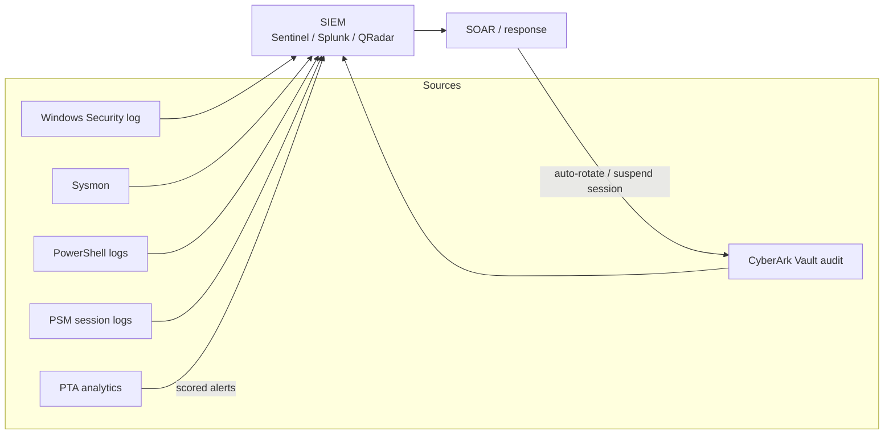
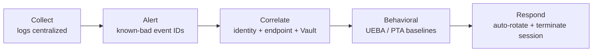

# Detection Engineering for Privileged Attacks

The visibility layer for everything in the [attack-to-control-matrix.md](attack-to-control-matrix.md) and [identity-attack-paths.md](identity-attack-paths.md). Prevention (least privilege, JIT, rotation) is the primary defense; this doc is the *safety net* — the event IDs, Sigma rules, and SIEM queries that catch what slipped through, plus the privileged-account signals that **CyberArk PTA** and the **Vault audit** add on top of raw Windows logs.

> A PAM engineer's edge in the SOC: your control plane is also a **sensor**. Every credential retrieval, session, and rotation flows through the Vault/PSM and becomes high-fidelity telemetry that endpoint logs alone can't produce.

---

## Telemetry sources



The last arrow matters: PTA/SIEM can trigger CyberArk to **rotate the credential and terminate the session** automatically — detection wired to response.

---

## Windows Security event IDs to alert on

| Event ID | Meaning | Watch for |
|---|---|---|
| 4624 | Successful logon | Type 3 (network) NTLM to many hosts = lateral movement / PtH |
| 4625 | Failed logon | Spikes across many accounts = password spray |
| 4648 | Logon with explicit creds | Runas / credential reuse patterns |
| 4672 | Special privileges assigned | Unexpected admin logons |
| 4768 | Kerberos TGT requested | Preauth-not-required (AS-REP roast); RC4 from odd host |
| 4769 | Kerberos TGS requested | **RC4 (0x17)** for SPN accounts = Kerberoasting |
| 4771 | Kerberos preauth failed | Brute force |
| 4776 | NTLM authentication | Legacy NTLM where it shouldn't be |
| 4662 | Operation on AD object | Replication GUIDs from a **non-DC** = DCSync |
| 4720 / 4726 | Account created / deleted | Rogue account creation |
| 4728 / 4732 / 4756 | Added to privileged group | Unexpected Domain/Enterprise Admin additions |
| 5136 | Directory object modified | `msDS-KeyCredentialLink` (Shadow Creds), RBCD attribute |
| 4886 / 4887 | ADCS cert requested / issued | Anomalous SAN = ESC1/ESC6 |
| 4688 | Process creation (+cmdline) | LOLBins, encoded PowerShell |
| 4697 / 7045 | Service installed | Persistence |
| 4104 | PowerShell script block | Deobfuscated malicious script content |
| 1102 | Audit log cleared | Anti-forensics (Module 06/12) |

### Sysmon (fills the gaps)

| Sysmon ID | Use |
|---|---|
| 1 | Process create with full command line + hashes |
| 3 | Network connection (C2 beacon, lateral) |
| 8 | CreateRemoteThread (injection) |
| 10 | **Process access to lsass.exe** = credential dumping |
| 11 | File create (dropper, web shell) |
| 13 | Registry set (persistence, Run keys) |
| 22 | DNS query (C2 / tunneling) |

---

## Example detections

### Sigma — Kerberoasting (RC4 TGS requests)

```yaml
title: Potential Kerberoasting - RC4 TGS Requests
logsource:
  product: windows
  service: security
detection:
  selection:
    EventID: 4769
    TicketEncryptionType: '0x17'   # RC4-HMAC
    TicketOptions: '0x40810000'
  filter_machine:
    ServiceName|endswith: '$'       # ignore machine accounts
  condition: selection and not filter_machine
falsepositives:
  - Legacy apps that still negotiate RC4
level: high
```

### KQL (Microsoft Sentinel / Defender) — DCSync from a non-DC

```kql
SecurityEvent
| where EventID == 4662
| where Properties has "1131f6aa-9c07-11d1-f79f-00c04fc2dcd2"   // DS-Replication-Get-Changes
    or Properties has "1131f6ad-9c07-11d1-f79f-00c04fc2dcd2"    // ...-Get-Changes-All
| where AccountType == "User"                                   // a user, not a DC computer acct
| project TimeGenerated, Account, Computer, ObjectName
```

### Splunk SPL — password spray (one source, many accounts)

```spl
index=wineventlog EventCode=4625
| stats dc(Account_Name) as distinct_accounts count by Source_Network_Address, _time span=10m
| where distinct_accounts > 10
```

### KQL — LSASS access (credential dumping)

```kql
DeviceEvents
| where ActionType == "OpenProcessApiCall"
| where FileName =~ "lsass.exe"
| where InitiatingProcessFileName !in~ ("MsMpEng.exe","wininit.exe","csrss.exe")
```

---

## CyberArk PTA — privileged-account detections

PTA correlates Vault activity, AD traffic, and network telemetry to raise **scored** privileged-threat alerts that generic SIEM rules miss:

| PTA detection | Maps to CEH module |
|---|---|
| Suspected credential theft | 06 System Hacking |
| **Golden Ticket** in use | 06 / identity-attack-paths |
| **Pass-the-Hash / Pass-the-Ticket / Overpass-the-Hash** | 06 |
| **Suspected DC sync (DCSync)** | identity-attack-paths |
| Unmanaged privileged account detected | 04 Enumeration / discovery gap |
| Suspicious Vault access (unknown source / irregular hours) | 06 / insider |
| Suspicious password change / CPM anomaly | 06 |

PTA can be wired to **auto-rotate** the affected credential and **suspend/terminate** the session — closing the loop from detect to contain.

### Vault & PSM audit as a sensor

- **Vault audit** logs every credential *retrieve*, *change*, *reconcile*, and *safe* access — attribution that shared admin accounts can never give you.
- **PSM** records the full session (video + keystroke/command text) and supports **live monitoring, suspend, and terminate** — so a suspicious privileged session is not just logged but *stoppable in real time*.
- Forward both to the SIEM (CyberArk provides a SIEM/syslog integration) so privileged signals sit next to endpoint and identity telemetry.

---

## Detection maturity — where to invest



> Rule of thumb: if a control in the matrix says *"detect,"* it belongs here; if it says *"prevent,"* it belongs upstream in [pam-architecture.md](pam-architecture.md). The strongest programs pair a preventive control with a detection for the case the prevention is bypassed.

## Sources

- Microsoft — Security auditing / event ID reference: https://learn.microsoft.com/en-us/windows/security/threat-protection/auditing/basic-security-audit-policies
- Microsoft — Events to monitor (appendix L): https://learn.microsoft.com/en-us/windows-server/identity/ad-ds/plan/appendix-l--events-to-monitor
- Sysmon (Sysinternals) + config: https://learn.microsoft.com/en-us/sysinternals/downloads/sysmon
- SwiftOnSecurity Sysmon config: https://github.com/SwiftOnSecurity/sysmon-config
- Sigma project (detection rules): https://github.com/SigmaHQ/sigma
- MITRE ATT&CK — Data Sources: https://attack.mitre.org/datasources/
- CyberArk — Privileged Threat Analytics docs: https://docs.cyberark.com/pta/
- CyberArk — SIEM integration: https://docs.cyberark.com/pam-self-hosted/latest/en/content/pta/siem-integration.htm
