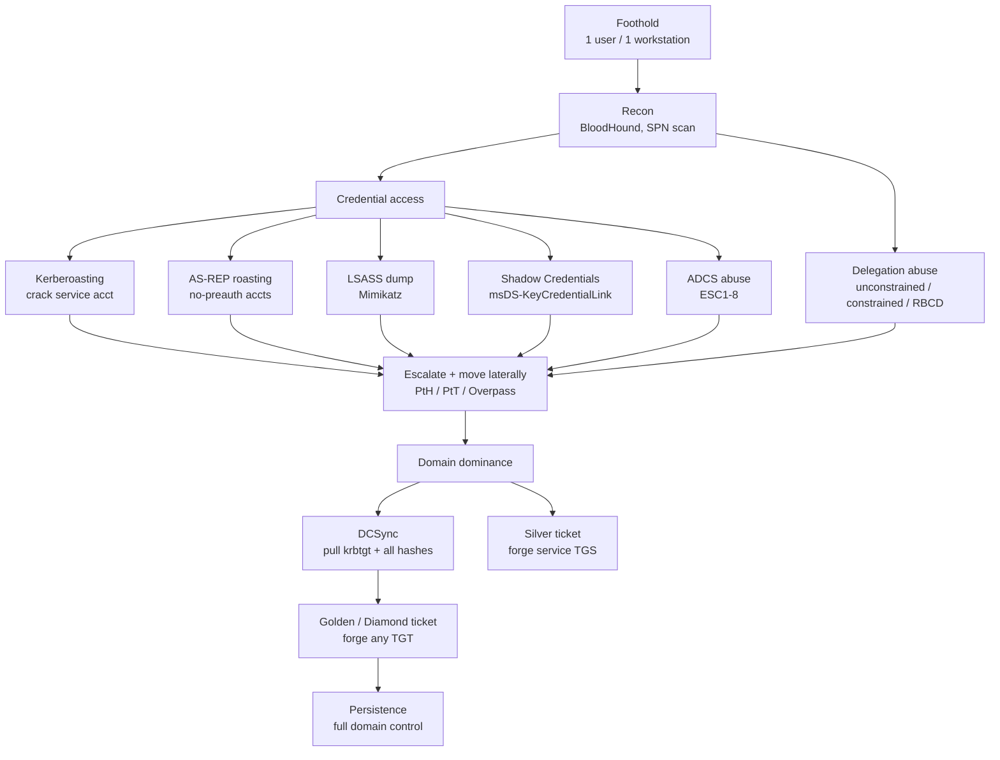

# Identity Attack Paths (AD & Entra) — and the PAM control that breaks each

CEH Module 06 introduces Pass-the-Hash and Kerberoasting; this doc is the PAM-engineering deep-dive behind them — the real attack paths a red team walks from a single foothold to Domain Admin (or Global Admin), each paired with the **detection signal** and the **control** that stops it. For the event-ID/query detail see [detection-engineering.md](detection-engineering.md); for the CyberArk component that implements each control see [cyberark-attack-mapping.md](cyberark-attack-mapping.md).

> The uncomfortable truth for defenders: most of these need **no exploit and no malware** — they abuse how Kerberos, delegation, ADCS, and tokens are *designed* to work. You don't patch them; you deny the *standing privilege* and *reusable secret* they depend on.

---

## The path from foothold to Domain Admin

---

## Kerberos-based attacks

| Attack | What it abuses | Needs cracking? | Detection signal | Control / PAM lever |
|---|---|---|---|---|
| **Kerberoasting** | Any user can request a TGS for an SPN; it's encrypted with the service account's key | Yes (svc password) | 4769 for SPN accounts, esp. RC4 (0x17) | **gMSA** (128-char auto-rotated) or **CPM-rotated** long random svc password; AES-only |
| **AS-REP roasting** | Accounts with "Kerberos preauth not required" leak a crackable blob | Yes (user password) | 4768 with preauth=0 | Require preauth on all accounts; strong passwords; vault + rotate |
| **Pass-the-Ticket (PtT)** | A stolen TGT/TGS is reused | No | Ticket reuse from unusual host | **PSM** so tickets aren't minted on endpoints; Protected Users; short TTL |
| **Overpass-the-Hash** | NT hash → request a real TGT | No | 4768 with RC4 from odd host | Credential Guard, **EPM** credential-theft blocking, tiering |
| **Silver ticket** | Forged TGS signed with a *service* account key | No | Service access with no matching 4769/TGS from KDC | Rotate service keys (gMSA/CPM), monitor, AES |
| **Golden ticket** | Forged TGT signed with the **krbtgt** hash | No | TGT anomalies; PTA flags it | Protect Tier 0, **rotate krbtgt twice** after any DA compromise |
| **Diamond / Sapphire ticket** | Modify a *legitimate* TGT (stealthier than golden) | No | Subtle PAC anomalies | Same as golden; strong Tier 0 isolation + PTA |

---

## Delegation abuse

Kerberos delegation lets a service act *on behalf of* a user — powerful and routinely misconfigured.

| Type | The abuse | Control |
|---|---|---|
| **Unconstrained delegation** | A compromised host with this flag captures TGTs of anyone who connects (incl. DA) | Remove unconstrained delegation; mark admins "sensitive — cannot be delegated"; add to Protected Users |
| **Constrained delegation (S4U)** | Compromise of the service account → impersonate users to the allowed SPNs | **Vault + rotate** the service account (CPM/gMSA); minimize delegation targets |
| **Resource-Based Constrained Delegation (RBCD)** | Write access to a computer object's `msDS-AllowedToActOnBehalfOfOtherIdentity` → impersonate to it | Restrict who can write computer attributes; tier admin; monitor 5136 |

---

## Directory & credential-store attacks

| Attack | What it abuses | Detection signal | Control / PAM lever |
|---|---|---|---|
| **DCSync** | Replication rights (`DS-Replication-Get-Changes-All`) → pull any hash incl. krbtgt | 4662 with replication GUIDs from a **non-DC** | Restrict replication rights to DCs; Tier 0 isolation; **vault DA creds**, PTA alert |
| **DCShadow** | Registers a rogue DC to push malicious changes | Unexpected DC registration, replication metadata | Monitor DC objects, Tier 0 isolation |
| **Shadow Credentials** | Write `msDS-KeyCredentialLink` on a victim → auth as them via PKINIT | 5136 modifying that attribute | Restrict write perms, monitor, tier admin |
| **Skeleton Key** | Patches LSASS on a DC to accept a master password | LSASS tamper, EDR/PTA | Credential Guard, DC hardening, **EPM**/EDR |

---

## ADCS (certificate services) abuse — ESC1–ESC8

Active Directory Certificate Services misconfigurations let an attacker mint a certificate that authenticates as a privileged user — persistent, and immune to password rotation. From SpecterOps' *Certified Pre-Owned* research.

| ESC | Misconfiguration | Effect |
|---|---|---|
| ESC1 | Template allows requester-supplied SAN + client auth | Request a cert *as Domain Admin* |
| ESC2 | "Any Purpose" or no EKU template | Use cert for anything |
| ESC3 | Enrollment-agent template abuse | Enroll on behalf of others |
| ESC4 | Weak template ACLs (write) | Edit a template to become vulnerable |
| ESC6 | CA flag `EDITF_ATTRIBUTESUBJECTALTNAME2` | SAN injection on any template |
| ESC7 | Weak CA permissions (ManageCA/ManageCertificates) | Approve own requests / enable ESC6 |
| ESC8 | HTTP web enrollment + NTLM relay | Relay a DC's auth → cert → domain compromise |

**Detection:** 4886/4887 (cert request/issue) with anomalous SAN; 4768 authentications via certificate. **Control:** audit and remediate templates (run Certipy/PSPKI in *audit* mode), remove SAN-injection flags, tighten template + CA ACLs, enable enrollment approval, disable NTLM on the CA web endpoint. Certificate-based auth **bypasses password rotation**, so ADCS hygiene is a first-class PAM concern — a rotated Vault password doesn't help if an attacker holds a 1-year auth cert.

---

## Entra ID (cloud identity) attacks

| Attack | What it abuses | Control / PAM lever |
|---|---|---|
| **PRT / token theft** | Steal the Primary Refresh Token or session token from an endpoint | Token protection / bound tokens, **phishing-resistant MFA**, compliant-device Conditional Access, **EPM** |
| **Illicit consent grant** | Trick a user into consenting to a malicious OAuth app | Admin-consent workflow, restrict user consent, app governance |
| **Seamless SSO / hybrid abuse** | Abuse `AZUREADSSOACC$` or hybrid trust | Rotate the SSO computer account, monitor, isolate sync |
| **Global Admin via role abuse** | Standing high-privilege cloud roles | **Entra PIM** (JIT roles) + CyberArk **Secure Cloud Access**, remove standing GA |

---

## The five controls that collapse most of this list

1. **Tier 0 isolation + Protected Users + PAWs** → kills unconstrained delegation, PtH/PtT lateral movement, and DA credential exposure.
2. **gMSA / CPM-rotated service accounts (AES-only)** → removes what Kerberoasting and silver tickets crack.
3. **DCSync/replication rights locked to DCs + rotate krbtgt twice on compromise** → contains domain dominance and golden tickets.
4. **ADCS template + CA hygiene** → closes the certificate-persistence bypass that ignores rotation.
5. **JIT everywhere (DPA / Entra PIM) + phishing-resistant MFA** → nothing standing to steal, cloud or on-prem.

## Sources

- SpecterOps — *Certified Pre-Owned* (ADCS ESC1–8): https://posts.specterops.io/certified-pre-owned-d95910965cd2
- Microsoft — Kerberoasting guidance: https://learn.microsoft.com/en-us/defender-for-identity/kerberoasting
- Microsoft — Securing privileged access (tier model / PAWs): https://learn.microsoft.com/en-us/security/privileged-access-workstations/overview
- Microsoft — Protected Users security group: https://learn.microsoft.com/en-us/windows-server/security/credentials-protection-and-management/protected-users-security-group
- Microsoft — About Entra Privileged Identity Management (PIM): https://learn.microsoft.com/en-us/entra/id-governance/privileged-identity-management/pim-configure
- MITRE ATT&CK — Steal or Forge Kerberos Tickets (T1558): https://attack.mitre.org/techniques/T1558/
- MITRE ATT&CK — Use Alternate Authentication Material (T1550): https://attack.mitre.org/techniques/T1550/
- The Hacker Recipes — AD attack reference: https://www.thehacker.recipes/ad/
