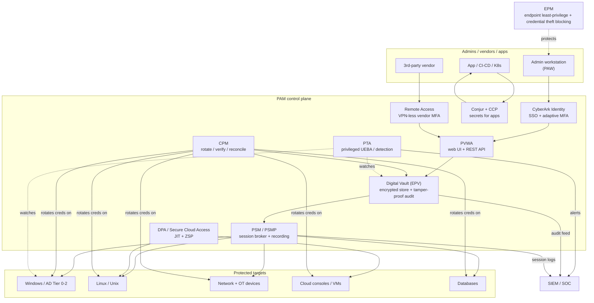
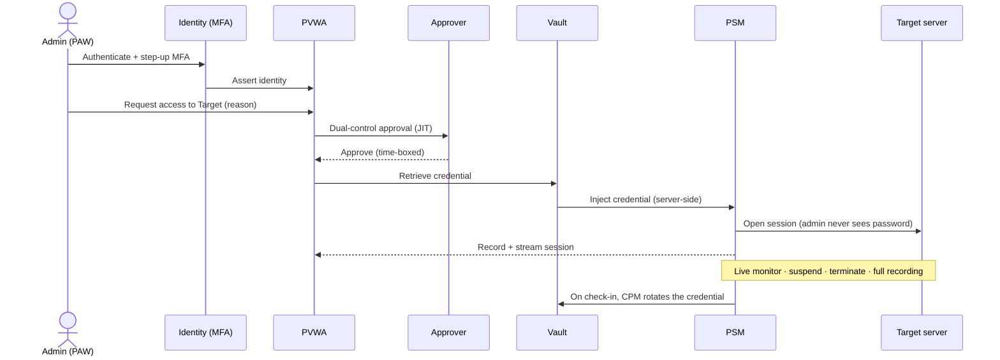
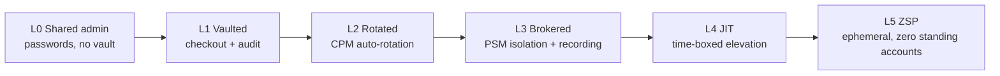
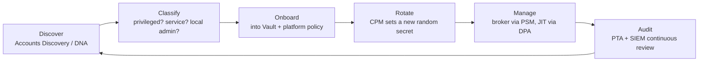

# PAM Reference Architecture (CyberArk-centered)

How a privileged-access program is actually wired, and where each layer breaks a CEH attack. Written for a PAM engineer: the goal is to be able to point at any component and say *"this is the control that turns attack X from a win into a logged, contained failure."* Vendor-neutral concepts are named first; the CyberArk component that implements each is in **bold**.

> The through-line: **reduce standing privilege to near-zero, broker + record every privileged access, rotate every secret, and isolate the credential from the endpoint.** Every box below serves one of those four goals.

---

## The reference architecture

### Component glossary

| Concept | CyberArk component | What it does | Attacks it breaks |
|---|---|---|---|
| Credential store | **Digital Vault (EPV)** / Privilege Cloud | Encrypted, tamper-evident store; no human knows the password | Credential theft, offline reuse, hardcoded secrets |
| Access UI / API | **PVWA** | Request, approve, retrieve, launch sessions | Enforces MFA + approval before any privileged use |
| Rotation engine | **CPM** | Auto-rotate, verify, reconcile per platform policy | Pass-the-Hash value, local-admin reuse, Kerberoasting (long random svc pwd) |
| Session broker | **PSM / PSMP** | Proxy + isolate + record RDP/SSH/web sessions; inject creds server-side | Sniffing, keylogging, endpoint credential theft, session hijacking |
| Privileged UEBA | **PTA** | Detects Golden Ticket, PtH/PtT, unmanaged accounts, Vault anomalies | Detection layer for identity attacks |
| Endpoint least-priv | **EPM** | Remove local admin, app control, block credential harvesting/ransomware | Malware persistence, LSASS dumping, privilege escalation |
| App secrets | **Conjur + CCP/AAM** | Remove hardcoded creds; deliver secrets at runtime | Secrets in config/source, leaked connection strings |
| JIT / ZSP | **DPA / Secure Cloud Access** | Ephemeral, agentless access to VMs & cloud; no standing accounts | Standing-privilege theft, cloud key leakage, lateral movement |
| Vendor access | **Remote Access** (ex-Alero) | VPN-less, biometric-MFA access for third parties | Phishing, VPN credential abuse, vendor compromise |
| Unix elevation | **OPM** | Vault-controlled `sudo`/superuser | Unix privilege escalation, shared root |

---

## The privileged access flow (what "brokered + JIT" looks like)

The admin **never learns the target password**, it **never reaches their endpoint or the wire**, the access is **time-boxed**, and the whole session is **recorded**. A keylogger on the admin's laptop, a sniffer on the LAN, and a stolen hash all come up empty.

---

## Zero Standing Privilege (ZSP) maturity model

Where most orgs are, and where a PAM engineer is driving them. Use this to answer "what's the *better* control" exam questions — higher on the ladder is always the stronger answer.

| Level | State | Residual risk |
|---|---|---|
| L0 | Shared local/domain admin, passwords known | Total — reuse, PtH, no attribution |
| L1 | Credentials vaulted, checked out | Password still known during checkout |
| L2 | Auto-rotated after use | Shrinks the reuse window to one session |
| L3 | Sessions brokered + recorded, creds injected | Credential never touches endpoint/wire |
| L4 | Privilege granted just-in-time, time-boxed | Near-zero standing privilege to steal |
| L5 | Ephemeral identities/certs, nothing standing | Nothing durable to harvest — the goal |

---

## Discovery & onboarding lifecycle

You can't protect what you haven't found. Attackers footprint (Module 02) and enumerate (Module 04) exactly the unmanaged privileged and service accounts you should be onboarding first.

---

## Break-glass & PAM availability

A PAM engineer must plan for the PAM stack itself being a target (Module 10 DoS) or being down:

- **Vault HA/DR** — clustered/DR Vault and distributed (satellite) vaults so the control plane survives a failure or a targeted DoS.
- **Break-glass accounts** — a small number of offline, sealed, monitored emergency credentials with a documented dual-control retrieval procedure, used only when PAM is unavailable. Any use fires a high-priority alert.
- **PSM farm scaling + load balancing** so session brokering doesn't become the bottleneck (or the SPOF) that tempts admins back to direct access.

---

## Harden the PAM stack itself

The Vault and its satellites are **Tier 0** — the most privileged assets you own. Treat them accordingly:

- Dedicated hardened OS, no other roles, restricted network (only required ports), per the CyberArk security fundamentals / hardening guidance.
- HSM integration for the Vault **Server Key** so the master key never sits in the clear (ties to Module 20).
- Least-privilege for CPM/PSM service accounts; PSM as the **only** ingress path to admin planes.
- Patch the PAM components on the same cadence you demand of everything else (Module 05).
- Monitor for attempts to disable EPM/PSM agents or tamper with the Vault audit (Module 12).

## Sources

- CyberArk Docs (product documentation portal): https://docs.cyberark.com/
- CyberArk — Privileged Access Manager (self-hosted) docs: https://docs.cyberark.com/pam-self-hosted/
- CyberArk — Endpoint Privilege Manager: https://docs.cyberark.com/epm/
- CyberArk — Conjur (Secrets Manager) open source: https://www.conjur.org/
- Microsoft — Securing privileged access / Enterprise Access Model: https://learn.microsoft.com/en-us/security/privileged-access-workstations/overview
- NIST SP 800-63B (authenticator/MFA guidance): https://pages.nist.gov/800-63-3/sp800-63b.html
- Gartner — Zero Standing Privileges concept (overview): https://www.gartner.com/en/documents/ (search "zero standing privileges")

> Product names and packaging change; confirm component names/features against docs.cyberark.com for your version.
