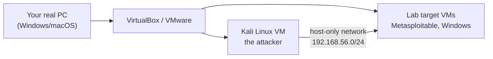

# 00 — Getting Started with Kali Linux

> **What you'll learn:** what Kali is, how to install it safely as a virtual machine, the very first things to do after booting, and how to keep it healthy. No prior Linux knowledge needed.
> **Prerequisites:** none — this is the first chapter. ⬅️ [Course index](README.md)

> 🐧 **On a Linux PC?** This chapter uses VirtualBox (easiest on Windows/macOS). If your own machine runs Linux, the native options — a **KVM/QEMU VM** or a **Docker container**, plus driving it all with **Claude Code** — are in [Running Kali on a Linux host](running-kali-on-linux.md).

---

## What is Kali Linux?
**Linux** is an operating system, like Windows or macOS, but free and open-source. **Kali Linux** is a version of Linux made by **Offensive Security** specifically for security testing — it comes with 600+ hacking and analysis tools already installed. Think of it as a fully-equipped workshop: instead of hunting down each tool, they're all in the drawer, ready.

You don't install Kali on your main computer. You run it in a **virtual machine (VM)** — a whole computer simulated *inside* a window on your real computer. That keeps Kali isolated and disposable: if you break it, you delete it and start over.



## Step 1 — Install a hypervisor
A **hypervisor** is the software that runs VMs. Pick one (both are free):
- **VirtualBox** — https://www.virtualbox.org/wiki/Downloads (easiest for beginners)
- **VMware Workstation Player** — https://www.vmware.com/products/workstation-player.html

Install it like any normal program.

## Step 2 — Get the Kali VM image
The **easiest** path: download Kali's **pre-built VM** (no manual install needed).
- Go to https://www.kali.org/get-kali/#kali-virtual-machines
- Download the **VirtualBox** (or **VMware**) image matching your hypervisor.
- In VirtualBox: **File → Import Appliance** → select the downloaded file → **Import**.

> Prefer building from scratch? Download the **Installer ISO** from the same page and create a new VM (2+ CPUs, 4+ GB RAM, 40+ GB disk), then install step-by-step. The pre-built image skips all that.

## Step 3 — First boot & login
Start the VM. The default credentials for the pre-built image are:
- **Username:** `kali`  **Password:** `kali`

You'll land on a desktop. The most important icon is the **Terminal** (top bar, or `Ctrl+Alt+T`) — a window where you type commands. Almost everything in this course happens there.

## Step 4 — The first three things to do

**1. Change the default password** (anyone knows `kali`/`kali`):
```bash
passwd
```
Type your current password, then a new one twice (the screen won't show characters — that's normal).

**2. Update everything.** Kali changes fast; update before you start:
```bash
sudo apt update && sudo apt full-upgrade -y
```
- `sudo` = "do this as the administrator (root)." It'll ask for your password.
- `apt` = the tool that installs/updates software on Kali.
- This can take a while the first time. Reboot afterward if it says to: `sudo reboot`.

**3. Take a snapshot.** In VirtualBox: **Machine → Take Snapshot**. A snapshot is a saved state you can instantly roll back to. Take one now ("clean install") and again before anything risky — it's your undo button.

## Understanding `sudo` and root
Linux has a superuser called **root** who can do *anything*. For safety you normally work as the regular `kali` user and borrow root powers with `sudo` only when needed (installing software, raw network scans). If a command fails with "Permission denied," it often just needs `sudo` in front.

## The Kali desktop, briefly
- **Terminal** — where you type commands (your main tool).
- **Files** — a graphical file browser.
- **Firefox** — for research and for proxying web traffic through Burp later.
- **Applications menu** — tools grouped by category (Information Gathering, Web Application Analysis, etc.). You'll mostly launch tools by typing their name in the terminal, which is faster.

## Common beginner mistakes
- **Running Kali as your daily OS or on bare metal.** Don't — use a VM; keep your real machine clean.
- **Skipping the update.** Half of "this tool doesn't work" is a stale install. `sudo apt update` first.
- **Bridging the VM to your home network.** Keep the lab on a **host-only** network so nothing escapes (see [03 — Networking basics](03-networking-basics.md) and [`../labs/topology.md`](../labs/topology.md)).
- **Forgetting snapshots.** Take one before experiments so a broken Kali is a 10-second rollback, not a reinstall.

## ✅ Practice task
1. Import/boot Kali, log in, change the password.
2. Run the full update, reboot.
3. Open a terminal and run `whoami` (should print `kali`) and `sudo whoami` (should print `root`).
4. Take a snapshot named "clean-updated".

## Next
➡️ [01 — Linux essentials](01-linux-essentials.md): moving around the filesystem, permissions, and installing tools.

## Sources
- Kali — Get Kali (VMs & ISOs): https://www.kali.org/get-kali/
- Kali Docs — Installation: https://www.kali.org/docs/installation/
- VirtualBox Manual: https://www.virtualbox.org/manual/
