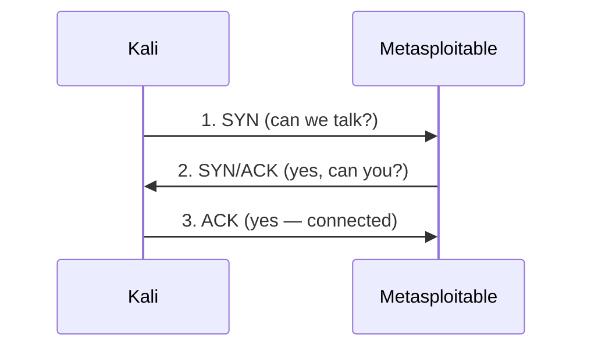

# 03 — Networking Basics

> **What you'll learn:** how computers find and talk to each other — IP addresses, ports, TCP/UDP, DNS — and the handful of commands you'll use to read your own address, map the lab, and test what's reachable. This is the vocabulary every tool in later chapters speaks.
> **Prerequisites:** [02 — Terminal power](02-terminal-power.md). ⬅️ [Course index](README.md)

Every scan, exploit, and enumeration tool is just an automated conversation over the network. If you understand the network, the tools stop feeling like magic. Spend time here — like Linux, it pays off in every chapter.

---

## What is an IP address?
An **IP address** (Internet Protocol address) is a computer's number on a network — like a street address for the mail. To send data to a machine, you need its IP. On the lab's private network, Kali is `192.168.56.10` and Metasploitable2 is `192.168.56.20`.

That style — four numbers `0–255` separated by dots — is **IPv4**. There are ~4.3 billion of them, which the world ran out of, so **IPv6** was created: much longer addresses like `fe80::a00:27ff:fe4e:1`. You'll meet IPv6 occasionally (`ip a` shows it), but the lab and most of this course use IPv4.

| Type | Looks like | Notes |
|---|---|---|
| IPv4 | `192.168.56.20` | 4 numbers, 0–255. What we use in the lab. |
| IPv6 | `fe80::a00:27ff:fe4e:1` | Longer, hex, `::` shortens zeros. A `fe80::` address is "link-local" (this network only). |

**Private vs public:** ranges like `192.168.x.x`, `10.x.x.x`, and `172.16–31.x.x` are **private** — reused inside home and lab networks, never routed on the internet. That's exactly why the lab uses `192.168.56.0/24`.

## Subnets and CIDR — what `/24` means
A network is a group of addresses that can talk directly. **CIDR notation** (e.g. `192.168.56.0/24`) says how big that group is. The `/24` means "the first 24 bits are the **network**, the rest identify the **host**."

An IPv4 address is 32 bits (4 × 8). `/24` locks the first three numbers and lets the last one vary:

| CIDR | Fixed part | Host range | Usable hosts |
|---|---|---|---|
| `192.168.56.0/24` | `192.168.56.` | `.1` – `.254` | 254 |
| `192.168.56.0/25` | `192.168.56.` | `.1` – `.126` | 126 |
| `10.0.0.0/8` | `10.` | huge | ~16 million |

So every lab machine on `192.168.56.0/24` shares `192.168.56.` and differs only in the last number — they're neighbors and can reach each other directly. When you scan "the whole subnet" later with nmap, `192.168.56.0/24` is how you say *all 254 addresses at once*.

## MAC addresses — the hardware name
An IP address can change; the **MAC address** (Media Access Control) is the near-permanent serial number burned into a network card, like `08:00:27:4e:00:01` (six hex pairs). IP is the *logical* address used across networks; MAC is the *physical* address used to deliver a frame to the exact card **on the local network segment**. The `arp` command (below) maps IP → MAC for your neighbors, and MAC addresses matter a lot in chapter [12 — Sniffing & MITM](12-sniffing-mitm.md).

## Ports — the door number
An IP gets you to the machine; a **port** gets you to the right *service* on it. One server (`192.168.56.20`) can run a web server, SSH, and FTP at once — each listens on a different port number (0–65535). IP + port together (`192.168.56.20:80`) is a full destination.

Certain services live on standard **well-known ports** (0–1023). Memorizing these is core CEH knowledge — a scan result is just a list of open ports, and you must know what each implies:

| Port | Proto | Service | What it means to an attacker |
|---|---|---|---|
| 21 | TCP | FTP | File transfer; often cleartext / anonymous login |
| 22 | TCP | SSH | Encrypted remote shell; brute-force target |
| 23 | TCP | Telnet | Remote shell in **cleartext** — sniffable |
| 25 | TCP | SMTP | Mail sending; user enumeration |
| 53 | TCP/UDP | DNS | Name lookups; zone transfers |
| 80 | TCP | HTTP | Web server (unencrypted) |
| 139/445 | TCP | SMB | Windows file shares — huge attack surface |
| 161 | UDP | SNMP | Device management; default community strings |
| 389 | TCP/UDP | LDAP | Directory (Active Directory) queries |
| 443 | TCP | HTTPS | Web server over TLS (encrypted) |
| 3389 | TCP | RDP | Windows Remote Desktop |
| 5985 | TCP | WinRM | Remote PowerShell on Windows |

The full, exam-focused list lives in [`../cheatsheets/ports-and-protocols.md`](../cheatsheets/ports-and-protocols.md) — study it.

## TCP vs UDP — two ways to send
Ports belong to one of two **transport protocols**:

| | **TCP** | **UDP** |
|---|---|---|
| Style | Connection-based, reliable | Fire-and-forget, no guarantee |
| Analogy | A phone call (both confirm) | A postcard (send and hope) |
| Confirms delivery? | Yes, re-sends lost data | No |
| Speed | Slower, careful | Faster, lean |
| Used by | SSH, HTTP, SMB, RDP | DNS, SNMP, DHCP, ping-adjacent |

Because UDP doesn't confirm anything, scanning UDP ports is slower and less certain — you'll see why in chapter [05 — Nmap scanning](05-nmap-scanning.md).

## The TCP three-way handshake
Before two machines exchange data over TCP, they perform a **three-way handshake** — a quick "hello" to agree they're both ready:



1. **SYN** — Kali asks to start ("synchronize").
2. **SYN/ACK** — the target agrees and asks back.
3. **ACK** — Kali confirms. The connection is open.

This is the heartbeat of port scanning. A **SYN scan** (nmap `-sS`) sends step 1 and watches the reply: a `SYN/ACK` back means the port is **open**; a `RST` (reset) means **closed**. It never finishes the handshake — faster and quieter. You'll run exactly this in chapter [05](05-nmap-scanning.md); understanding the handshake is why nmap output makes sense.

## DNS — names instead of numbers
Humans remember names; networks route numbers. **DNS** (Domain Name System) is the phone book that translates a name like `dc01.ceh.lab` into an IP like `192.168.56.30`. A lookup asks a **DNS server**, "what's the address for this name?" and gets an IP back.

On the real internet the lookup walks a chain — **root** servers → **TLD** servers (`.com`, `.lab`) → the domain's **authoritative** server — but your machine usually just asks one **resolver** that does the walking and caches the answer. In our lab, the Windows Domain Controller (`192.168.56.30`) is the authoritative DNS server for the `ceh.lab` domain, so we point lookups at it directly. DNS is heavily abused in recon — see [04 — Recon & OSINT](04-recon-osint.md).

## The lab is a walled garden — host-only networking
The lab runs on a **host-only** network. That means the VMs can talk to each other and to your workstation, but **there is no route to the internet or your home Wi-Fi** from the `192.168.56.0/24` segment (see [`../labs/topology.md`](../labs/topology.md)). This is the single most important safety setting in the course:

- Your loud scans and exploits **cannot escape** onto a real network.
- A compromised target VM **cannot reach out** and cause damage.
- You get to be as aggressive as you like — because the blast radius is a folder of VMs you can delete and rebuild.

Never switch the lab to "Bridged" networking to "make it work." If a target seems unreachable, fix the host-only config — don't open the cage.

## Core commands — read your network
These are the tools you'll reach for constantly. Run them now against the lab.

**See your own IP addresses and interfaces:**
```bash
ip a                          # "address" — list all interfaces and their IPs
```
You should see an interface (often `eth0` or `eth1`) with `inet 192.168.56.10/24` — that's your Kali IP and confirms you're on the lab subnet. `lo` with `127.0.0.1` is the loopback (the machine talking to itself).

**See your routing table (where traffic goes):**
```bash
ip r                          # "route" — how does traffic leave this machine?
```
You should see a line for `192.168.56.0/24 ... dev eth1` — the rule that lets Kali reach lab hosts directly.

**See what's listening on your own machine:**
```bash
sudo ss -tulpn                # sockets: -t TCP -u UDP -l listening -p process -n numeric
```
You should see a table of open local ports and the program behind each. `ss` replaces the older `netstat`; `sudo` is needed to reveal process names.

**Test whether a host is reachable:**
```bash
ping -c 4 192.168.56.20       # send 4 ICMP echo requests to Metasploitable
```
You should see `64 bytes from 192.168.56.20 ... time=0.5 ms` four times and `0% packet loss`. No reply usually means the host is down or a firewall blocks ICMP — not always "not there."

**Trace the path to a host (each hop):**
```bash
traceroute 192.168.56.30      # list every router between you and the DC
```
On the flat lab network you'll see just one hop (the target itself) — real networks show many.

**Resolve a name to an IP (DNS):**
```bash
dig @192.168.56.30 dc01.ceh.lab      # ask the lab DC for the DC's own record
nslookup dc01.ceh.lab 192.168.56.30  # same lookup, simpler output
```
You should see the name resolve to `192.168.56.30` in the `ANSWER SECTION`. `@192.168.56.30` chooses which DNS server to ask; without it, `dig` uses your system's default resolver.

**Netcat — the network multitool (`nc`):**
Netcat opens a raw connection to any IP and port — perfect for a quick "is this port open?" or to read a service's greeting (**banner**):
```bash
nc -vz 192.168.56.20 22       # -v verbose, -z just check (zero I/O), no data sent
nc 192.168.56.20 21           # connect to FTP and watch the banner it prints
```
You should see `... 22 (ssh) open` for the first, and a `220 ...` FTP welcome line for the second (press `Ctrl+C` to quit). Netcat comes back for shells and file transfer in chapter [09 — Metasploit](09-metasploit.md).

**See MAC addresses of neighbors (ARP):**
```bash
arp -n                        # show the IP -> MAC map your machine has learned
```
You should see `192.168.56.20` next to a MAC like `08:00:27:...` — proof Kali has talked to that host on the local segment. `ip neigh` shows the same modern table.

## Common beginner mistakes
- **Assuming "ping fails = host is down."** Many hosts (especially Windows) drop ICMP by default. Confirm with an `nc` port check before giving up.
- **Confusing IP and port.** `192.168.56.20` is the *machine*; `192.168.56.20:445` is a *service on it*. A scan finds ports, not machines.
- **Forgetting `sudo` on `ss -tulpn`.** Without it you still see ports, but not which program owns them.
- **Switching the lab off host-only** to fix connectivity — that defeats the isolation. Fix the adapter, don't bridge to your real network.
- **Mixing up TCP and UDP ports.** Port 53 exists on *both*; DNS uses UDP for lookups but TCP for zone transfers. The protocol matters.

## ✅ Practice task
1. Run `ip a` and write down your Kali IP and the `/24` it's on. Confirm it's `192.168.56.10/24`.
2. Run `ip r` and identify the route to the lab subnet.
3. `ping -c 4` both `192.168.56.20` and `192.168.56.30`. Which replies? (One may drop ICMP.)
4. Use `nc -vz 192.168.56.20 22` and `nc -vz 192.168.56.20 80` — note which report *open*.
5. Resolve `dc01.ceh.lab` with `dig @192.168.56.30 dc01.ceh.lab`; confirm it returns `192.168.56.30`.
6. Run `arp -n` and record the MAC address of `192.168.56.20`.

## Next
➡️ [04 — Recon & OSINT](04-recon-osint.md): turning these fundamentals into information gathering — whois, DNS digging, and mapping a target's footprint before you ever send a scan. Also see CEH [Module 03 — Scanning Networks](../modules/03-scanning-networks/), which builds directly on ports, TCP flags, and the handshake covered here.

## Sources
- Cloudflare Learning — What is an IP address? https://www.cloudflare.com/learning/dns/glossary/what-is-my-ip-address/
- Cloudflare Learning — What is DNS? https://www.cloudflare.com/learning/dns/what-is-dns/
- IANA Service Name and Port Number Registry: https://www.iana.org/assignments/service-names-port-numbers/service-names-port-numbers.xhtml
- RFC 4632 — CIDR (classless addressing): https://datatracker.ietf.org/doc/html/rfc4632
- `man` pages built into Kali: `man ip`, `man ss`, `man dig`, `man nc`
