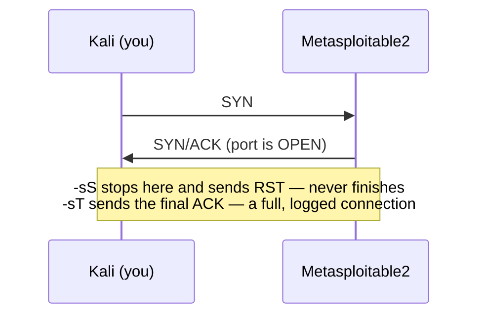

# 05 — Scanning with Nmap

> **What you'll learn:** what a port scan actually does, every scan type Nmap offers and when to reach for each, how to read the open/closed/filtered verdict, how to fingerprint services and operating systems, the Nmap Scripting Engine, timing and evasion, saving your evidence — and how to turn a scan into your next move. By the end you'll drive Nmap with intent, not guesswork.
> **Prerequisites:** [04 — Recon & OSINT](04-recon-osint.md). ⬅️ [Course index](README.md)

Recon (chapter 04) told you *who* and *where* your target is. Scanning tells you *what's actually listening*. **Nmap** ("Network Mapper") is the tool for this — the single most important, most exam-tested tool in the course. Take your time; this is a deep dive that maps directly to [Module 03 — Scanning Networks](../modules/03-scanning-networks/README.md).

---

## What is a port scan?
A **port** is a numbered door on a machine (0–65535) where a **service** listens — web on 80, SSH on 22, and so on (chapter 03 covers ports in depth). A **port scan** knocks on those doors and notes which ones answer. That list of open ports *is* your attack surface: every open port is a service you can enumerate and possibly exploit.

Nmap sorts each port it probes into one of these **states**:

| State | Meaning | What Nmap saw |
|---|---|---|
| `open` | A service is listening and accepting connections | The port answered "yes" |
| `closed` | Host is reachable, but nothing listens on that port | The port answered "no" (a TCP RST) |
| `filtered` | A firewall dropped the probe — no verdict possible | Silence, or an ICMP error |
| `open\|filtered` | Can't tell open from filtered (silence is ambiguous) | No reply at all |
| `unfiltered` | Reachable but state unknown (only the ACK scan says this) | A RST came back through the filter |

> **The triangle to memorize:** open replies **SYN/ACK**, closed replies **RST** (reset), filtered stays **silent**. Almost every scan type is just a different way of poking that triangle.

## Host discovery — who's even alive?
Before scanning ports, find out which hosts exist. `-sn` ("scan, no port scan") does a **ping sweep** across a whole range — fast, and it stops you wasting time port-scanning dead IPs.

```bash
sudo nmap -sn 192.168.56.0/24            # ping sweep the whole lab subnet
```
You should see the three lab hosts listed:
```
Nmap scan report for 192.168.56.10   # your Kali box
Nmap scan report for 192.168.56.20   # Metasploitable2
Nmap scan report for 192.168.56.30   # the Windows DC
Nmap done: 256 IP addresses (3 hosts up) scanned in 2.1s
```

On a **local network (LAN)** like our host-only lab, the most reliable discovery is **ARP** — a link-layer "who has this IP?" that even firewalled hosts must answer. Nmap does this automatically on a LAN, but you can force ARP-only with `-PR`:

```bash
sudo nmap -sn -PR 192.168.56.0/24        # ARP-only sweep — fast and hard to hide from on a LAN
```

If a host is up but ignores pings (common on hardened Windows), skip discovery entirely with `-Pn` — it *assumes* the host is up and scans anyway:

```bash
nmap -Pn 192.168.56.30                   # "don't ping, just scan" — for hosts that drop ICMP
```
> **Don't confuse `-sn` and `-Pn`.** `-sn` = discovery *only*, no ports. `-Pn` = *skip* discovery, scan ports anyway. Opposite jobs.

## The scan types (the heart of Nmap)
### `-sT` connect vs `-sS` SYN — and why SYN needs root
To check a TCP port, you complete (or start) the **three-way handshake**: you send **SYN**, an open port replies **SYN/ACK**, and you'd finish with **ACK**.



- **`-sT` (TCP connect)** asks the operating system to make a *normal, complete* connection using the standard `connect()` call. Any user can do it — **no root needed** — but it finishes the handshake, so the target logs a full connection. Noisier.
- **`-sS` (SYN / "half-open")** sends the SYN itself as a hand-crafted raw packet and hangs up (RST) the moment it hears SYN/ACK — the connection never completes, so many apps never log it. This is the **default** scan and stealthier. **It needs root** (`sudo`) because crafting raw packets requires a raw socket, which only root may open.

```bash
nmap -sT 192.168.56.20                    # TCP connect — works as a normal user
sudo nmap -sS 192.168.56.20               # SYN half-open — the default; needs root
```
You should see the **same** open ports either way on Metasploitable2 (21/ftp, 22/ssh, 80/http, 445/microsoft-ds, 3306/mysql, and more). The only difference is on the target's side: `-sT` leaves a logged connection, `-sS` often doesn't.

### `-sU` UDP scan
Not everything runs on TCP. DNS (53), SNMP (161), and others use **UDP**, which is connectionless — no handshake. A closed UDP port replies with an ICMP "port unreachable"; an open one usually says *nothing*, so open shows as `open|filtered`. UDP scanning is **slow**, so always bound it with `--top-ports`:

```bash
sudo nmap -sU --top-ports 20 192.168.56.20   # 20 most common UDP ports (needs root)
```
You should see (UDP takes far longer than TCP):
```
PORT    STATE  SERVICE
53/udp  open   domain
137/udp open   netbios-ns
```

### Flag scans — `-sF` FIN, `-sN` NULL, `-sX` Xmas
These craft odd TCP packets to sneak past simple filters. By the TCP standard (RFC 793), a *closed* port replies **RST** and an *open* port stays **silent** — so silence means `open|filtered`. **`-sF` FIN** sends a lone FIN flag; **`-sN` NULL** sends a packet with *no* flags set; **`-sX` Xmas** lights up the FIN, PSH, and URG flags (the packet is "lit up like a Christmas tree").

```bash
sudo nmap -sF 192.168.56.20               # FIN scan  (Linux target)
sudo nmap -sN 192.168.56.20               # NULL scan
sudo nmap -sX 192.168.56.20               # Xmas scan
```
> **Big gotcha (a favorite exam trick):** these rely on standards-compliant behavior. **Windows replies RST to everything**, so on a Windows host all three report *every* port `closed` — useless. Run them against the **Linux** Metasploitable2 (`192.168.56.20`) to see the intended `open|filtered` results.

### `-sA` ACK — mapping the firewall, not the ports
The **ACK scan** doesn't find open ports at all. It sends a bare ACK and watches whether a **RST** comes back: if it does, the port is `unfiltered` (a firewall let the packet through); if nothing returns, it's `filtered`. It's a tool for **mapping firewall rules** — which ports a firewall is guarding — not for finding services.

```bash
sudo nmap -sA 192.168.56.20               # tells you filtered vs unfiltered, not open vs closed
```

### How open vs closed ports respond (the core table)
| Scan | Flag | Packet sent | Open port | Closed port | Root? |
|---|---|---|---|---|---|
| TCP connect | `-sT` | full handshake | connection completes | RST | No |
| SYN / half-open | `-sS` | SYN | SYN/ACK (then RST) | RST | Yes |
| UDP | `-sU` | UDP datagram | usually silent → `open\|filtered` | ICMP port unreachable | Yes |
| FIN | `-sF` | FIN | silent → `open\|filtered` | RST | Yes |
| NULL | `-sN` | no flags | silent → `open\|filtered` | RST | Yes |
| Xmas | `-sX` | FIN+PSH+URG | silent → `open\|filtered` | RST | Yes |
| ACK | `-sA` | ACK | RST → `unfiltered` | RST → `unfiltered` | Yes |

> Add `--reason` to any scan to see *why* Nmap made each call (e.g. `syn-ack`, `reset`, `no-response`) — a superb way to learn how the states are decided.

## Choosing which ports to scan
By default Nmap checks the **1,000 most common** ports. You steer that with `-p`:

```bash
nmap -p 22,80,445 192.168.56.20           # only these three ports
nmap -p 1-1000 192.168.56.20              # a range
nmap -p- 192.168.56.20                    # ALL 65535 ports (thorough but slower)
nmap --top-ports 100 192.168.56.20        # the 100 statistically most common ports
```
> **Habit of good testers:** a quick default scan first to get moving, then a full `-p-` so nothing hides on an unusual port — Metasploitable2 has services up on 1524, 6667, 8180… where the interesting stuff often lives.

## Fingerprinting — what is it and what OS?
Knowing a port is open isn't enough; you need the **software and version** to find matching exploits.

- **`-sV`** grabs the **service version** (e.g. `vsftpd 2.3.4`) by reading banners and probing responses.
- **`-O`** guesses the **operating system** from subtle TCP/IP stack quirks (needs root).
- **`-sC`** runs Nmap's **default script set** — safe, useful checks (same as `--script=default`).
- **`-A`** is the "aggressive" everything-bundle (`-sV` + `-O` + `-sC` + traceroute). Thorough but **loud** — never the answer to a *stealth* question.

```bash
sudo nmap -sV -O 192.168.56.20            # versions + OS guess (root for -O)
nmap -sC 192.168.56.20                    # default NSE scripts
sudo nmap -A -T4 192.168.56.20            # the kitchen sink (version+OS+scripts+traceroute)
```
You should see version detail like:
```
PORT   STATE SERVICE VERSION
21/tcp open  ftp     vsftpd 2.3.4
22/tcp open  ssh     OpenSSH 4.7p1 Debian 8ubuntu1 (protocol 2.0)
80/tcp open  http    Apache httpd 2.2.8 ((Ubuntu) DAV/2)
Running: Linux 2.6.X   |   OS details: Linux 2.6.9 - 2.6.33
```
Those version strings (`vsftpd 2.3.4`, etc.) feed straight into vulnerability analysis (chapter 07) — that exact version has a famous backdoor.

## The NSE — Nmap Scripting Engine
The **NSE** turns Nmap into a mini-vulnerability scanner. Scripts (Lua files in `/usr/share/nmap/scripts/`) automate deeper checks. They're grouped into **categories**:

| Category | What it does |
|---|---|
| `default` | Safe, generally useful scripts (run by `-sC`) |
| `discovery` | Digs for more about hosts and services (also `safe`) |
| `auth` | Checks authentication / anonymous access |
| `brute` | Password brute-forcing scripts |
| `vuln` | Checks for known vulnerabilities |
| `exploit` | Actively tries to exploit a flaw |
| `intrusive` | Noisy or risky — may disrupt the target (also `malware`, `dos`) |

```bash
nmap --script vuln 192.168.56.20                       # run the whole vuln category
nmap --script smb-os-discovery -p445 192.168.56.20     # one script, targeted at SMB
nmap --script "http-title,http-headers" -p80 192.168.56.20   # a comma-list of scripts
```
`--script smb-os-discovery` against port 445 pulls the OS, hostname, and domain out of file sharing:
```
Host script results:
| smb-os-discovery:
|   OS: Unix (Samba 3.0.20-Debian)
|_  Computer name: metasploitable   Domain: localdomain
```
> Run `nmap --script-help "smb-*"` to read what any script does before firing it — some (`brute`, `exploit`, `intrusive`) are aggressive and belong in the lab only.

## Timing — how fast (and how loud)
`-T0` through `-T5` are ready-made speed presets. Faster = quicker results but easier to spot; slower = stealthier but can take hours.

| Template | Name | When |
|---|---|---|
| `-T0` | paranoid | Serious IDS evasion, painfully slow |
| `-T1` | sneaky | Low and slow |
| `-T2` | polite | Gentle on bandwidth |
| `-T3` | normal | The default |
| `-T4` | aggressive | **Fast — ideal for a LAN/lab** |
| `-T5` | insane | Fastest, may miss things |

```bash
sudo nmap -sS -T4 192.168.56.20               # a good default for the lab
sudo nmap -sS --min-rate 1000 192.168.56.20   # send at least 1000 packets/sec
```
`--min-rate` sets a packet-per-second floor for fine control when a template isn't precise enough. Use `-T4` for lab work; save `-T0/-T1` for when you're deliberately practising evasion.

## Evasion basics
Firewalls and intrusion-detection systems (IDS) watch for scans. Nmap can dress its packets up to slip past simple ones. This is a preview — **[Module 12 — Evading IDS, Firewalls & Honeypots](../modules/12-evading-ids-firewalls-honeypots/README.md)** goes deep.

```bash
sudo nmap -sS -f 192.168.56.20                # -f: fragment probes into tiny pieces a filter may fail to reassemble
sudo nmap -sS -D 192.168.56.15,192.168.56.16,ME 192.168.56.20   # -D: hide your real IP among decoy sources (ME = you)
sudo nmap -sS -g 53 192.168.56.20             # -g 53 (= --source-port 53): pose as DNS traffic lazy firewalls trust
```

> These are *lab demonstrations* to understand the technique — matched by real defensive controls in [Module 03](../modules/03-scanning-networks/README.md). Never test them on networks you don't own.

## Save your evidence — output flags
Always save scans. You'll re-read them constantly, and they're your report evidence. `-oA` writes **all three** formats at once with one basename:

| Flag | Format | Good for |
|---|---|---|
| `-oN file.nmap` | Normal (human-readable) | Reading and reports |
| `-oG file.gnmap` | Greppable (one host per line) | `grep`/`awk` filtering |
| `-oX file.xml` | XML | Feeding other tools (Metasploit, etc.) |
| `-oA basename` | All three above | **Just use this** |

```bash
mkdir -p ~/lab/scans
sudo nmap -sS -sV -oA ~/lab/scans/msf2-full 192.168.56.20   # writes .nmap, .gnmap, .xml
grep -i open ~/lab/scans/msf2-full.gnmap                    # pull open ports out later
```

## How to read results and pick your next step
A finished scan is a to-do list. Read every open port as a question:

| You saw | It means | Next step |
|---|---|---|
| `21/tcp open ftp vsftpd 2.3.4` | Old FTP with a known backdoor | Vuln analysis → exploit (ch. 07, 09) |
| `80/tcp open http Apache 2.2.8` | A web server | Web hacking — dirb/ffuf/nikto (ch. 08) |
| `139,445 open` Samba | Windows-style file sharing | Enumerate shares & users (ch. 06) |
| `3306 open mysql` | A database exposed to the network | Check auth / default creds (ch. 06, 10) |

The workflow is always the same loop: **discover → scan → fingerprint → enumerate the most interesting service**. Scanning doesn't hack anything; it hands you the map. The next chapter, [Enumeration](06-enumeration.md), is where you start opening the interesting doors.

## Common beginner mistakes
- **Forgetting `sudo`.** `-sS`, `-sU`, `-O` and evasion tricks need raw sockets — without root, Nmap silently downgrades to `-sT` or errors out. If results look odd, add `sudo`.
- **Scanning only the top 1000 ports and stopping.** Interesting services hide high (1524, 6667, 8180). Follow up with `-p-`.
- **Confusing `-sn` with `-Pn`.** `-sn` = discovery only (no ports). `-Pn` = skip discovery, scan ports anyway.
- **Running Xmas/FIN/NULL against Windows** and trusting the "all closed" result — that's the RST-to-everything gotcha, not a real finding. Those scans are for *nix stacks.
- **Not saving output.** Scans take time; re-running them is wasted effort. `-oA` from the start.
- **Blindly firing `--script vuln` / `-A` at anything but the lab.** They're loud and sometimes intrusive. Lab only, always.

## ✅ Practice task
1. Discover hosts: `sudo nmap -sn 192.168.56.0/24`. Confirm you see `.10`, `.20`, and `.30`.
2. Scan Metasploitable2 two ways: `nmap -sT 192.168.56.20` then `sudo nmap -sS 192.168.56.20`. Note the results match — the difference is only in what the target *logs*.
3. Fingerprint and save it: `sudo nmap -sV -O -oA ~/lab/scans/msf2 192.168.56.20`. Open `~/lab/scans/msf2.nmap` and write down three service versions.
4. Prove the Windows gotcha: run `sudo nmap -sX 192.168.56.20` (Linux → `open|filtered`) and `sudo nmap -sX 192.168.56.30` (Windows → everything `closed`). Explain in one sentence why.
5. Use the NSE: `nmap --script smb-os-discovery -p445 192.168.56.20` and record the OS/hostname it reveals.

## Next
➡️ [06 — Enumeration](06-enumeration.md): taking the open ports you just found — SMB, SNMP, LDAP, SSH — and squeezing usernames, shares, and versions out of each.

## Sources
- Nmap Reference Guide (the whole book) — https://nmap.org/book/
- Nmap port-scanning techniques — https://nmap.org/book/man-port-scanning-techniques.html
- Nmap Scripting Engine (NSE) — https://nmap.org/book/nse.html
- Nmap timing & performance — https://nmap.org/book/man-performance.html
- CEH companion — [Module 03 — Scanning Networks](../modules/03-scanning-networks/README.md)
