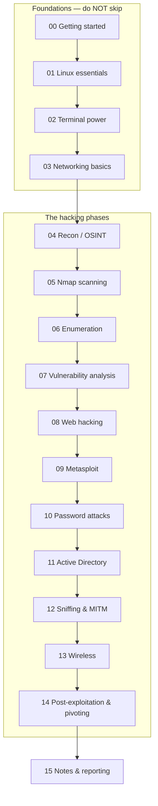

# Kali Linux — A Beginner's Deep Course

A **from-zero** course in using Kali Linux for ethical hacking, built for someone who has *never opened a terminal*. It starts with "what is Linux" and walks you all the way to attacking (and defending) a full Active Directory lab — one small, explained step at a time.

> **This is the deep course.** The top-level [`../KALI-TUTORIAL.md`](../KALI-TUTORIAL.md) is the condensed one-page reference; come here to actually *learn* each piece. Each file assumes you've read the ones before it.

> **⚖️ Rules that never bend.** Everything here runs against **your own isolated [lab](../labs/)** or systems you have **written permission** to test. Kali's tools are real weapons — using them on anything else is a crime. If you're unsure whether something is allowed, it isn't.

---

## Who this is for
- You can use a computer but have **little or no Linux / command-line / networking** experience.
- You want to understand **why**, not just paste commands.
- You're studying for **CEH v13** (each chapter links to the matching [module](../modules/)) or just want real, hands-on skills.

## How to use this course
1. **Set up the lab first** ([`../labs/README.md`](../labs/README.md)) — you'll practice on Kali `192.168.56.10`, Metasploitable2 `192.168.56.20`, a Windows DC `192.168.56.30`, and Docker web apps on `localhost:8081–8084`.
2. **Read in order.** Don't skip the foundations — most beginner frustration comes from missing Linux/networking basics, not from the hacking tools.
3. **Type every command yourself** (don't copy-paste blindly) and read the *expected output* notes. Typing builds memory.
4. **Do the "Practice task"** at the end of each chapter before moving on.
5. Keep a notes file open (see [15 — Notes & reporting](15-notes-and-reporting.md)).

## The learning path

## Chapters

**Foundations (start here)**
| # | Chapter | You'll learn |
|---|---|---|
| 00 | [Getting started with Kali](00-getting-started.md) | Install Kali as a VM, first boot, updating, sudo, the desktop |
| 01 | [Linux essentials](01-linux-essentials.md) | Files, folders, permissions, users, processes, installing tools |
| 02 | [Terminal power](02-terminal-power.md) | The shell, pipes, grep/find, tmux, tiny scripts |
| 03 | [Networking basics](03-networking-basics.md) | IP, ports, protocols, DNS — the language every tool speaks |

**The hacking phases**
| # | Chapter | Main tools | CEH module |
|---|---|---|---|
| 04 | [Recon & OSINT](04-recon-osint.md) | whois, dig, theHarvester, recon-ng, amass | [02](../modules/02-footprinting-and-reconnaissance/) |
| 05 | [Scanning with Nmap](05-nmap-scanning.md) | nmap (deep), netdiscover, masscan | [03](../modules/03-scanning-networks/) |
| 06 | [Enumeration](06-enumeration.md) | nxc/NetExec, enum4linux-ng, snmpwalk, ldapsearch | [04](../modules/04-enumeration/) |
| 07 | [Vulnerability analysis](07-vulnerability-analysis.md) | nikto, searchsploit, wpscan, OpenVAS | [05](../modules/05-vulnerability-analysis/) |
| 08 | [Web application hacking](08-web-hacking.md) | Burp Suite, ffuf, sqlmap, whatweb | [13–15](../modules/14-hacking-web-applications/) |
| 09 | [Metasploit Framework](09-metasploit.md) | msfconsole, msfvenom, Meterpreter | [06](../modules/06-system-hacking/) |
| 10 | [Password attacks](10-password-attacks.md) | hydra, hashcat, john, wordlists | [06](../modules/06-system-hacking/) |
| 11 | [Active Directory](11-active-directory.md) | Impacket, BloodHound, Certipy, evil-winrm | [04–06](../modules/06-system-hacking/) |
| 12 | [Sniffing & MITM](12-sniffing-mitm.md) | Wireshark, tcpdump, bettercap, Responder | [08](../modules/08-sniffing/) |
| 13 | [Wireless](13-wireless.md) | aircrack-ng suite, wifite | [16](../modules/16-hacking-wireless-networks/) |
| 14 | [Post-exploitation & pivoting](14-post-exploitation-pivoting.md) | Meterpreter, PEASS, chisel, proxychains | [06](../modules/06-system-hacking/) |
| 15 | [Notes & reporting](15-notes-and-reporting.md) | tmux, note-taking, writing findings | [05](../modules/05-vulnerability-analysis/) |

**Appendix**
- [Troubleshooting — common beginner errors & fixes](appendix-troubleshooting.md)

---

## The mindset (read before you start)
- **Enumerate before you exploit.** Beginners rush to "hack"; pros spend most of their time *understanding* the target first. The scans and questions in chapters 04–06 are where engagements are actually won.
- **Every attack has a defense.** This course links each technique to the control that stops it ([`../defender-pam/`](../defender-pam/)). Learning both makes you better at each.
- **Break things in the lab, not in the world.** You *will* crash a service or lock an account while learning — that's fine on Metasploitable, catastrophic on a real network.
- **Go deeper when ready:** [`../resources/deep-references.md`](../resources/deep-references.md) points to HackTricks, The Hacker Recipes, and the rest of the canon.

## Sources
- Kali Linux official docs — https://www.kali.org/docs/
- Kali Tools directory — https://www.kali.org/tools/
- The Linux Command Line (free book, W. Shotts) — https://linuxcommand.org/tlcl.php
