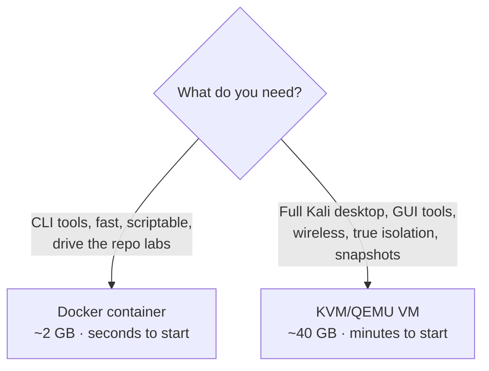

# Running Kali on a Linux PC — KVM VM or Docker (+ Claude Code)

> [00 — Getting started](00-getting-started.md) covers the beginner **VirtualBox** path on Windows/macOS. This guide is for running Kali on a **Linux host** (like an Ubuntu laptop), where you get two better, native options — a **KVM/QEMU virtual machine** or a **Docker container** — and shows how to drive the whole thing with **Claude Code**. ⬅️ [Course index](README.md)

> **⚖️ Same rules that never bend:** everything runs against your **own isolated [lab](../labs/)** or systems you have **written permission** to test. Keep the lab off your home/work LAN.

---

## Does your machine support this?

Run these on your host to check — a modern x86_64 laptop almost always passes:

```bash
egrep -c '(vmx|svm)' /proc/cpuinfo   # >0  = CPU virtualization (Intel VT-x / AMD-V)
ls -l /dev/kvm                        # exists = KVM usable (VMs get near-native speed)
free -h                               # 8 GB RAM min; 16 GB comfortable
df -h /                               # ~40 GB free for a VM; ~3 GB for a container
docker --version ; qemu-system-x86_64 --version
```

> **This machine, detected:** Ubuntu 26.04, Intel i7 (VT-x present), `/dev/kvm` available, 14 GB RAM, ~168 GB free, Docker 29.6 + QEMU 10.2 already installed. Both paths below work here — Docker needs its daemon started, the VM path needs `virt-manager`/`libvirt` added.

## Which option should I pick?



| | **Docker container** | **KVM/QEMU VM** |
|---|---|---|
| Footprint | ~2 GB, starts in seconds | ~40–60 GB, boots like a PC |
| Isolation | Shares the host kernel | Full VM (own kernel) — stronger |
| GUI tools (Burp, Wireshark GUI) | Awkward (needs X11 tricks) | Native desktop |
| Wireless / USB (Module 13) | No monitor mode | **Yes** (USB adapter passthrough) |
| Snapshots / rollback | Rebuild image | `virsh snapshot` — instant undo |
| Best for | Quick tool runs, the [web](../labs/) & [OT](../labs/ot/) labs, CI | The full [Kali course](README.md), GUI, wireless |

**Rule of thumb:** container for *tools and speed*, VM for *the full desktop, GUI, and wireless*. Many people run both.

---

## Path A — Docker container (fastest)

### 1. Start the Docker daemon and grant access (one-time)
```bash
sudo systemctl enable --now docker         # start Docker and enable at boot
sudo usermod -aG docker "$USER"            # run docker without sudo
newgrp docker                              # apply the group now (or log out/in)
docker run --rm hello-world                # verify it works
```

### 2. Run Kali
```bash
# Throwaway shell (nothing persists):
docker run -it --rm kalilinux/kali-rolling

# Persistent, named container you can stop/restart:
docker run -it --name kali kalilinux/kali-rolling
#   later:  docker start -ai kali
```
The base image is tiny (no tools). Inside the container, add a toolset:
```bash
apt update
apt -y install kali-tools-top10            # the common 10 (nmap, metasploit, hydra…)
#   or bigger:  kali-linux-headless   (no-GUI full set)   |   kali-linux-default
```

### 3. A reusable image (bake tools + a work dir) — optional
Save as `Dockerfile`, then `docker build -t my-kali .`:
```dockerfile
FROM kalilinux/kali-rolling
RUN apt-get update && apt-get -y install kali-tools-top10 python3 git tmux && \
    apt-get clean && rm -rf /var/lib/apt/lists/*
WORKDIR /work
CMD ["/bin/bash"]
```
Run it with your notes/loot mounted from the host and on the repo's lab network:
```bash
docker run -it --rm -v "$PWD/work:/work" my-kali
#   reach the repo web lab (localhost:8081-8084) from the container: add  --network host
```

> **Networking note:** with `--network host` the container shares your host's network, so `127.0.0.1:8081` reaches the [web lab](../labs/). Otherwise attach it to the lab's Docker network. Never expose these ports beyond localhost.

---

## Path B — KVM/QEMU virtual machine (full desktop)

KVM is the Linux-native hypervisor; with your CPU's VT-x it runs at near-native speed and needs no third-party software.

### 1. Install the virtualization stack (one-time)
```bash
sudo apt update
sudo apt install -y virt-manager qemu-system-x86 libvirt-daemon-system \
                    libvirt-clients bridge-utils ovmf
sudo usermod -aG libvirt,kvm "$USER"       # then log out/in
sudo systemctl enable --now libvirtd
virt-host-validate qemu                    # all "PASS" = you're ready
```

### 2. Get the Kali image (two ways)
- **Easiest — Kali's prebuilt VM.** Download the **QEMU** image from <https://www.kali.org/get-kali/#kali-virtual-machines>, extract the `.qcow2`, then in **virt-manager**: *File → New VM → Import existing disk image* → pick the `.qcow2`. Default login **`kali` / `kali`**.
- **From scratch — Installer ISO.** Download the ISO from the same page, *New VM → Local install media*, and install step-by-step (choose **UEFI/OVMF** firmware).

### 3. Size it for this machine (14 GB RAM)
| Resource | Give the VM | Why |
|---|---|---|
| RAM | **4 GB** (up to 6) | Leaves the host + Docker headroom |
| vCPUs | **2–4** | You have 8 logical cores |
| Disk | **40–60 GB** qcow2 (grows on demand) | Kali + tools + loot |

### 4. First-boot hygiene (same as [chapter 00](00-getting-started.md))
```bash
passwd                                      # change the default kali password
sudo apt update && sudo apt full-upgrade -y # update everything, then reboot if asked
```
Then take a **snapshot** so a broken Kali is a 10-second rollback:
```bash
virsh snapshot-create-as kali clean-updated "fresh install, fully updated"
#   restore later:  virsh snapshot-revert kali clean-updated
```

### 5. Keep the lab isolated
virt-manager's default network is NAT (`192.168.122.0/24`). For an air-gapped range, create an **isolated** libvirt network (VMs talk to each other, not the internet) and attach your targets to it — the equivalent of the host-only `192.168.56.0/24` the [Vagrant lab](../labs/vagrant/README.md) uses. Never bridge the lab to your real LAN.

> **Wireless (Module 13):** a container can't do monitor mode. In the VM, attach a USB Wi-Fi adapter via *Add Hardware → USB Host Device* to get monitor/injection for [aircrack-ng](13-wireless.md).

---

## Path C — Vagrant / VirtualBox (the repo's lab)
The repo's [`labs/vagrant/`](../labs/vagrant/README.md) provisions Kali + Metasploitable from a `Vagrantfile` using the `kalilinux/rolling` box. On this Linux host you can back Vagrant with **libvirt** (`vagrant plugin install vagrant-libvirt`) instead of VirtualBox — no need to install VirtualBox at all (and VirtualBox can clash with KVM). See [`labs/README.md`](../labs/README.md) §2.

---

## Using Claude Code with Kali

**Claude Code** is Anthropic's agentic CLI — it reads your files, runs commands (asking first), and edits code. You're already using it to build this repo; here's how it pairs with a Kali setup.

### Install & sign in (on the host)
```bash
# Recommended — native installer, no Node.js needed, auto-updates:
curl -fsSL https://claude.ai/install.sh | bash
#   alternative (if you use Node):  npm install -g @anthropic-ai/claude-code   (no sudo)

claude          # first run opens a browser to sign in to your Anthropic account
```

### Two places to run it
- **On the host — as the orchestrator.** Let Claude Code build the Kali image, manage libvirt VMs, bring up the [web](../labs/)/[OT](../labs/ot/) labs, run the repo tooling ([`scripts/quiz.py`](../scripts/README.md)), and keep your notes. This is exactly the workflow that built this repo.
- **Inside the Kali VM/container — as the field assistant.** Have it explain tool output, draft the next command, and write up findings while you work. Running it *inside* the VM/container keeps its blast radius contained.

### A concrete "day one" flow
Ask Claude Code (from the host):
> "Start the Docker Kali container on the lab network, run `nmap -sV` against the DVWA target, then explain each finding and suggest the two best next steps."

It brings the pieces up, runs the scan, and turns the output into a decision — the same loop as [AI-STUDY-WORKFLOW.md](../AI-STUDY-WORKFLOW.md) prompt #5.

### Rules for AI + offensive tools
- **Authorized targets only.** Point tools at your **lab** or systems you have permission to test — never a real target because "Claude suggested it."
- **Never paste real data.** No client data, live credentials, or real IPs into any model — data leaves your control (see [AI-IN-ETHICAL-HACKING.md](../AI-IN-ETHICAL-HACKING.md)).
- **Verify, don't trust.** Treat AI output as a **draft**: models produce confident, wrong specifics. Check against tool docs and the module `README.md`.
- **Keep the approval prompts.** Let Claude Code ask before commands that touch the network; contain it in the VM/container.

---

## Manage & clean up

| Task | Docker | KVM (virsh) |
|---|---|---|
| List | `docker ps -a` | `virsh list --all` |
| Start / stop | `docker start/stop kali` | `virsh start/shutdown kali` |
| Snapshot | (rebuild image) | `virsh snapshot-create-as kali <name>` |
| Delete | `docker rm -f kali` | `virsh destroy kali; virsh undefine kali --remove-all-storage` |
| Reset the repo labs | — | [`labs/scripts/reset.sh`](../labs/README.md) |

## ✅ Practice task
1. Pick a path: `docker run --rm hello-world` **or** `virt-host-validate qemu` (all PASS).
2. Boot Kali, log in, `passwd`, then `sudo apt update && sudo apt full-upgrade -y`.
3. (VM) take a `clean-updated` snapshot; (Docker) save your `Dockerfile`.
4. Install Claude Code, sign in, and have it run one `nmap` against a [lab](../labs/) target and explain the output.

## Sources
- Kali — Get Kali (VM & container images) — https://www.kali.org/get-kali/
- Kali Docs — Official Kali Linux Docker images — https://www.kali.org/docs/containers/official-kalilinux-docker-images/
- Kali metapackages (tool sets) — https://www.kali.org/docs/general-use/metapackages/
- KVM / libvirt — virt-manager — https://virt-manager.org/
- Ubuntu — KVM installation — https://help.ubuntu.com/community/KVM/Installation
- Docker Engine (Linux) install — https://docs.docker.com/engine/install/ubuntu/
- Claude Code — setup & install — https://code.claude.com/docs/en/setup

---
Related: [00 — Getting started](00-getting-started.md) · [Lab environment](../labs/) · [AI study workflow](../AI-STUDY-WORKFLOW.md) · [Responsible AI use](../AI-IN-ETHICAL-HACKING.md)
