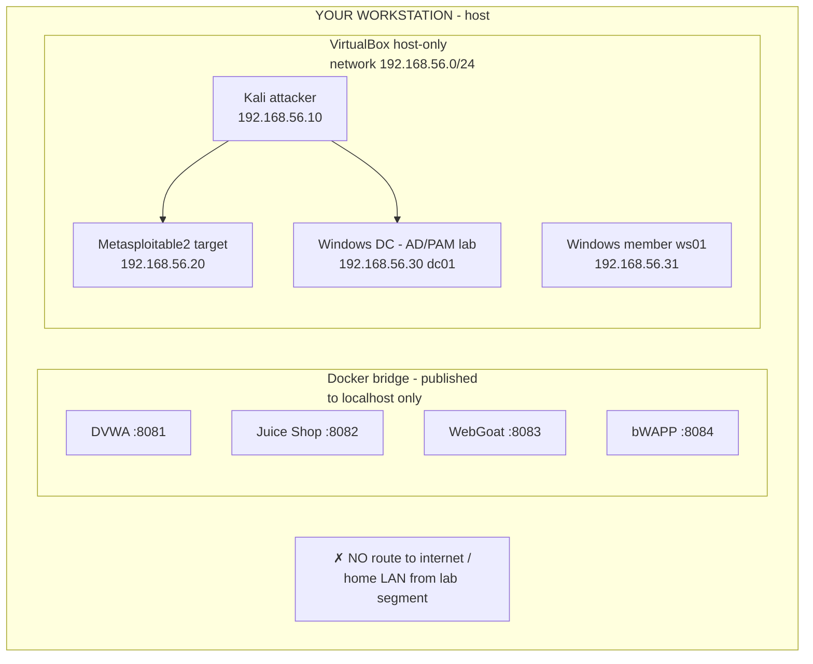
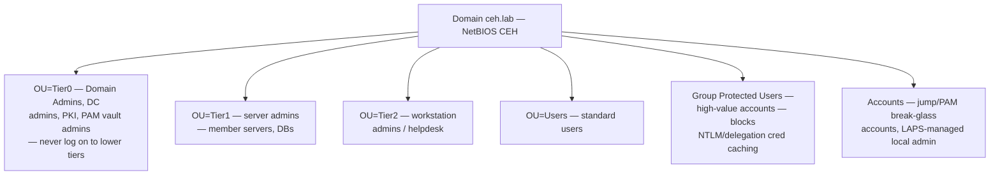

# Lab Network Topology

Everything lives on an isolated host-only / internal network. The Docker web targets are reachable only via `localhost` published ports on your workstation; the VMs share a private VirtualBox host-only network.

## IP / port plan

| Host | Address | Role | Access |
|---|---|---|---|
| Workstation | host-only gateway (typically 192.168.56.1) | Runs Docker + hypervisor | — |
| DVWA | localhost:8081 | Web target | Browser |
| Juice Shop | localhost:8082 | Web target | Browser |
| WebGoat | localhost:8083 (+ WebWolf :9090) | Web target | Browser |
| bWAPP | localhost:8084 | Web target | Browser |
| Kali | 192.168.56.10 | Attacker | `vagrant ssh kali` |
| Metasploitable2 | 192.168.56.20 | Linux target | From Kali |
| dc01 | 192.168.56.30 | Windows Domain Controller | From Kali |
| ws01 | 192.168.56.31 | Windows domain member | From Kali |

## AD domain design (PAM-flavored)

The AD lab intentionally models the controls a PAM/sysadmin runs so you can both **attack** it (enumeration, Kerberoasting, credential access) and **see the control working** (tiering blocks lateral movement, Protected Users limits cred theft). Attack↔control mapping lives in [`../defender-pam/`](../defender-pam/README.md).
