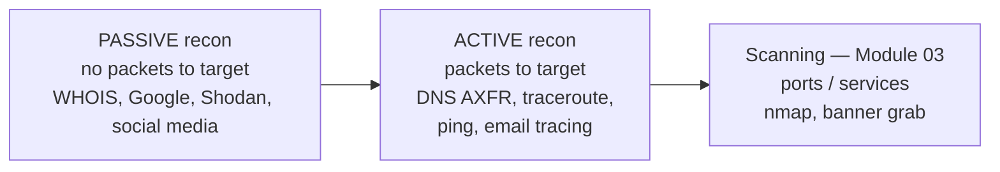

# Module 02 — Footprinting & Reconnaissance

> **One-liner:** the first real phase — gathering everything about a target *before* touching it. This is where passive OSINT ends and active probing begins, and the exam tests that line hard. For a PAM/sysadmin, this is your attack-surface inventory viewed from the outside.

> **📚 Study companions:** [Facts sheet](facts.md) · [Practice questions](practice-questions.md) · [Flashcards (Anki)](flashcards.csv) · [Lab walkthrough](lab-walkthrough.md)

## Exam focus

- **Passive vs. active** footprinting — WHOIS/Google/Shodan (passive) vs. DNS zone transfer/traceroute/ping (active). One wrong verb flips the answer.
- **Footprinting categories**: network, DNS, website, email, social media, competitive intelligence, WHOIS, and OSINT via search engines.
- **WHOIS** records (registrar, registrant, admin/tech contacts, name servers) and **regional registries** (ARIN, RIPE, APNIC, LACNIC, AFRINIC).
- **DNS record types** and what each leaks; **zone transfer (AXFR)** as the classic misconfiguration.
- **Google Dorking** operators (`site:`, `filetype:`, `intitle:`, `inurl:`, `cache:`) and the **Google Hacking Database (GHDB)**.
- **Tool → purpose** pairs: theHarvester, Recon-ng, Maltego, Shodan, Censys, HTTrack, dnsrecon/dnsenum.
- **Countermeasures**: registrar privacy, split-horizon DNS, disabling zone transfers, footer/metadata scrubbing.

## Key concepts

### Where footprinting sits in the methodology



The dividing line: **did a packet reach the target's infrastructure?** Querying a public WHOIS server or Shodan's cache = passive. Asking the target's *own* name server for a zone transfer = active.

### Footprinting objectives (what you are building)

| Objective | Example data | Feeds |
|---|---|---|
| Network footprint | IP ranges, ASN, netblocks, name servers | Scanning scope |
| DNS footprint | A/AAAA/MX/NS/TXT/SRV records, subdomains | Host discovery |
| System footprint | OS hints, tech stack, banners | Vuln analysis |
| Org/People footprint | Employees, emails, roles | Social engineering |
| Website footprint | Directory structure, comments, metadata | Web attacks |

### DNS record types the exam expects

| Record | Purpose | Recon value |
|---|---|---|
| A / AAAA | Hostname → IPv4 / IPv6 | Map hosts |
| NS | Authoritative name servers | Find AXFR targets |
| MX | Mail exchangers | Mail infra, phishing pretext |
| SOA | Zone authority + serial | Primary DNS, admin email |
| CNAME | Alias | Cloud/SaaS fingerprints |
| TXT | SPF/DKIM/DMARC, verification | Third-party services in use |
| SRV | Service locator (`_ldap`, `_kerberos`) | **AD discovery** |
| PTR | IP → hostname (reverse) | Internal naming schemes |

### Zone transfer (AXFR)

A **zone transfer** copies an entire DNS zone from a primary to a secondary. If a name server answers AXFR to *anyone*, it hands over every record in the zone — a full internal map. This is a misconfiguration, and CEH loves it as a "what did the attacker exploit?" answer.

### Google Dorking operators (memorize)

| Operator | Finds |
|---|---|
| `site:` | Pages on one domain |
| `filetype:` / `ext:` | Documents (pdf, xlsx, conf, bak) |
| `intitle:` / `allintitle:` | Text in page title |
| `inurl:` / `allinurl:` | Text in the URL |
| `cache:` | Google's cached copy (passive) |
| `link:` / `related:` | Linked / similar sites |
| `-` (minus) | Exclude a term |

## Key tools

| Tool | Purpose | Reference |
|---|---|---|
| whois | Registrar/registrant lookup | https://www.kali.org/tools/whois/ |
| dig / nslookup | DNS record queries | https://www.isc.org/bind/ |
| dnsrecon | Automated DNS enum + AXFR | https://github.com/darkoperator/dnsrecon |
| dnsenum | DNS enum, brute, zone transfer | https://www.kali.org/tools/dnsenum/ |
| theHarvester | Emails/subdomains/hosts from OSINT | https://github.com/laramies/theHarvester |
| Recon-ng | Modular OSINT framework | https://github.com/lanmaster53/recon-ng |
| Maltego | Link-analysis / OSINT graphing | https://www.maltego.com/ |
| Shodan | Internet-exposed device search | https://www.shodan.io/ |
| Censys | Internet host/cert search | https://censys.com/ |
| HTTrack | Offline website mirroring | https://www.httrack.com/ |
| Google Hacking DB | Curated dork catalog | https://www.exploit-db.com/google-hacking-database |

## Commands & techniques (lab-ready)

> **Safety:** WHOIS/Shodan/Censys/theHarvester query the *public internet*. Run them only against **a domain you own** or documented practice targets — never a third party. The **DNS/AXFR** commands below target your own lab DC (`192.168.56.30`, zone `ceh.lab`). See [`../../labs/`](../../labs/README.md).

```bash
# --- WHOIS (passive) — use a domain you own ---
whois example.com                       # registrar, contacts, name servers, dates

# --- DNS lookups against the lab DC (ceh.lab) ---
dig @192.168.56.30 ceh.lab ANY          # dump available record types
dig @192.168.56.30 ceh.lab NS +short    # authoritative name servers
dig @192.168.56.30 ceh.lab MX +short    # mail exchangers
dig @192.168.56.30 _ldap._tcp.ceh.lab SRV   # AD service locator record
nslookup -type=SRV _kerberos._tcp.ceh.lab 192.168.56.30

# --- Zone transfer (AXFR) — the classic misconfig, against your lab ---
dig @192.168.56.30 ceh.lab AXFR         # full zone if transfers are open
host -l ceh.lab 192.168.56.30           # same idea via host

# --- Automated DNS enumeration (lab DC) ---
dnsrecon -d ceh.lab -n 192.168.56.30 -a           # -a attempts AXFR
dnsenum --dnsserver 192.168.56.30 ceh.lab

# --- OSINT harvesting (domain you own only) ---
theHarvester -d example.com -b bing,crtsh,duckduckgo
recon-ng                                # then: marketplace install / modules load

# --- Website mirroring for offline review (a site you own) ---
httrack "https://example.com" -O ./mirror_example -%v

# --- Reverse DNS sweep across the lab segment (light active recon) ---
for ip in $(seq 20 31); do dig @192.168.56.30 -x 192.168.56.$ip +short; done
```

**Google/Shodan dork examples** (run in the browser, passive):

```text
site:example.com filetype:pdf                 # documents you own
intitle:"index of" "backup"                   # exposed listings (GHDB pattern)
Shodan:  hostname:example.com                  # your own exposed services
Shodan:  net:198.51.100.0/24                   # an allocation you own
```

## Lab exercise

1. **Passive first:** `whois` a domain you own and record the registrar, name servers, and any contact data still public. Note whether registrar privacy is hiding it.
2. **DNS map (lab):** use `dig`/`nslookup` against `192.168.56.30` to enumerate `ceh.lab` — pull NS, MX, and the `_ldap`/`_kerberos` SRV records. Those SRV records are how attackers *find* a domain controller with zero credentials.
3. **AXFR test (lab):** run `dig @192.168.56.30 ceh.lab AXFR`. If it succeeds, you just dumped the zone — then go disable transfers on the DC's DNS and re-run to confirm it now refuses.
4. **Offline mirror:** point HTTrack at a small site you own and browse the copy — hunt for HTML comments, internal paths, and email addresses in the source.

**What you should observe:** almost all of this is *passive and legal on your own assets* — and the single most damaging finding (an open zone transfer) is a one-line server fix. Recon quality decides how efficient every later phase is.

## Defender & PAM mapping

| Attack | Detection signal | Control / PAM lever |
|---|---|---|
| WHOIS / registrar harvesting | (none — external) | Registrar privacy/redaction, role-based generic contacts (not personal admins) |
| DNS zone transfer (AXFR) | AXFR request in DNS logs from non-secondary IP | **Restrict transfers** to listed secondaries, split-horizon/internal-only DNS |
| SRV-record AD discovery | DNS query telemetry for `_ldap`/`_kerberos` | Internal-only resolvers, no public exposure of AD DNS |
| Subdomain / OSINT enumeration | Cert-transparency hits, spikes on public assets | Asset inventory, minimize public footprint, monitor CT logs |
| Google-dork exposed files | Web/access logs for odd paths, GHDB self-scans | Remove index listings, scrub metadata, `robots`/auth on sensitive dirs |
| Email/employee harvesting | Inbound phishing referencing real roles | Least-privilege on public info, security-awareness, generic role mailboxes |
| Shodan/Censys exposure | Your host appearing in their scans | Reduce internet-facing services, firewall/segment, banner minimization |

> **Your edge:** footprinting is just an *external attack-surface inventory*. Everything here maps to controls you already own — asset inventory, DNS hygiene, and least exposure of privileged identities. The single worst leak for a PAM environment is a public SRV/AXFR trail that points straight at Tier 0; keep AD DNS internal-only.

### 🔐 PAM engineering deep-dive (CyberArk)

Footprinting is the attacker doing *your* asset inventory for you. The privileged identities, service accounts, and remote-access endpoints they OSINT are exactly what you should discover and vault first.

| This module's attack | CyberArk control | Component |
|---|---|---|
| OSINT of admin/service accounts & tech stack | Minimize exposed privileged identities; discover + onboard | Accounts Discovery / DNA |
| Leaked service-account creds in repos/docs/config | Remove hardcoded secrets from apps | Conjur / CCP |
| Exposed admin remote-access surface | VPN-less, brokered, MFA'd access | Remote Access |

**Detection (privileged lens):** PTA flags *unmanaged* privileged accounts that discovery surfaces — see [`../../defender-pam/detection-engineering.md`](../../defender-pam/detection-engineering.md).

**Engineering note:** scrub secrets from public repos and documents, then onboard every discovered privileged account into a Safe with a rotation policy — you're closing the recon-to-exploit gap.

> Go deeper: [PAM architecture](../../defender-pam/pam-architecture.md) · [CyberArk mapping](../../defender-pam/cyberark-attack-mapping.md)

## Exam tips & gotchas

- **Passive vs. active** is the #1 trap: WHOIS/Google/Shodan = passive; **zone transfer, traceroute, ping, and banner grabbing = active**.
- A **zone transfer** copies the *entire zone*; a normal DNS query returns one record. AXFR = the misconfiguration answer.
- Match **registry to region**: ARIN (North America), RIPE (Europe/ME), APNIC (Asia-Pacific), LACNIC (Latin America), AFRINIC (Africa).
- **SOA** holds the zone serial and primary NS; **NS** lists authoritative servers — don't swap them.
- `cache:` is passive (Google's copy); fetching the live page is not.
- **theHarvester = emails/subdomains/hosts**; **Maltego = link-analysis graphs**; **Recon-ng = modular framework** — know the tool→role pairing.
- Website mirroring (HTTrack) is for **offline analysis** so you don't hammer the live site — a stealth/efficiency motive, not just convenience.

## Sources

- WHOIS (Kali Tools) — https://www.kali.org/tools/whois/
- ISC BIND (dig / DNS) — https://www.isc.org/bind/
- dnsrecon — https://github.com/darkoperator/dnsrecon
- theHarvester — https://github.com/laramies/theHarvester
- Recon-ng — https://github.com/lanmaster53/recon-ng
- Maltego — https://www.maltego.com/
- Shodan — https://www.shodan.io/
- Censys — https://censys.com/
- HTTrack — https://www.httrack.com/
- Google Hacking Database — https://www.exploit-db.com/google-hacking-database
- MITRE ATT&CK: Reconnaissance (TA0043) — https://attack.mitre.org/tactics/TA0043/

---
### 📝 My lab log (fill in)
| Date | Target | Command | Result / notes |
|---|---|---|---|
|  |  |  |  |
