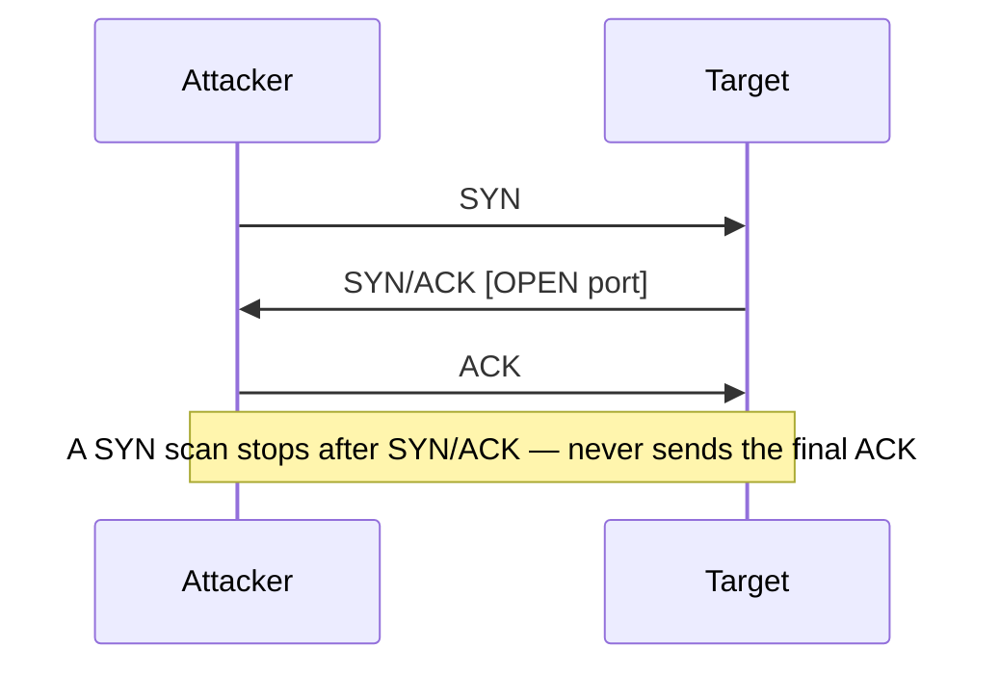

# Module 03 — Scanning Networks

> **One-liner:** turning the recon map into a live target list — which hosts are up, which ports are open, what's listening, and what OS it runs. This is Nmap's module, and the exam tests scan *types* and *flags* precisely. For a sysadmin, it's the same discovery you run to inventory a subnet — just from the attacker's chair.

> **📚 Study companions:** [Facts sheet](facts.md) · [Practice questions](practice-questions.md) · [Flashcards (Anki)](flashcards.csv) · [Lab walkthrough](lab-walkthrough.md)

## Exam focus

- The **TCP three-way handshake** (SYN → SYN/ACK → ACK) and every **TCP flag** (SYN, ACK, FIN, RST, PSH, URG).
- **Scan types** and how each abuses the flags: TCP connect, SYN (half-open), UDP, Xmas, FIN, NULL, ACK, and idle/zombie.
- How a target's response (**SYN/ACK**, **RST**, **ICMP unreachable**, or **no reply**) is interpreted as open / closed / filtered.
- **Nmap flags** by heart: `-sn -sT -sS -sU -sV -O -sC --script -p -T0..T5 -f -D --source-port`.
- **Host discovery** vs. **port scanning** vs. **service/OS detection** — separate steps CEH keeps distinct.
- **Timing/evasion**: fragmentation, decoys, source-port spoofing, timing templates, idle scan.
- **Banner grabbing** (active fingerprinting) and mass scanning (**masscan**, **hping3**).

## Key concepts

### The TCP three-way handshake



- **Open port** → replies **SYN/ACK**.
- **Closed port** → replies **RST**.
- **Filtered** (firewall drop) → **no reply** or ICMP unreachable.

### Scan-type matrix (the core exam table)

| Scan | Nmap flag | Packet sent | "Open" response | Stealth / notes |
|---|---|---|---|---|
| TCP connect | `-sT` | Full handshake | SYN/ACK + completes | Noisy, logs a full connection; no root needed |
| SYN / half-open | `-sS` | SYN only | SYN/ACK (then RST) | Default; never finishes handshake |
| UDP | `-sU` | UDP datagram | (app reply) / no ICMP | Slow; closed = ICMP port unreachable |
| Xmas | `-sX` | FIN+PSH+URG set | **no reply = open\|filtered** | Bypasses simple filters; fails vs. Windows |
| FIN | `-sF` | FIN only | **no reply = open\|filtered** | Same logic as Xmas |
| NULL | `-sN` | no flags set | **no reply = open\|filtered** | Same logic; Windows sends RST regardless |
| ACK | `-sA` | ACK only | RST (unfiltered) | Maps firewall rules, not open ports |
| Idle / zombie | `-sI <zombie>` | Spoofed via 3rd host | inferred from IPID | Fully blind/spoofed source |

> **Key gotcha:** Xmas/FIN/NULL rely on RFC 793 behavior — **Windows replies RST to everything**, so these scans report all ports `closed` on Windows. They're for stack-compliant (often *nix) targets.

### Open vs. closed vs. filtered

| Nmap state | Meaning |
|---|---|
| open | Service actively accepting connections |
| closed | Host reachable, nothing listening on that port |
| filtered | A firewall/filter dropped the probe (no verdict) |
| open\|filtered | No reply — can't tell (Xmas/FIN/NULL/UDP) |
| unfiltered | Reachable but state unknown (ACK scan) |

### Timing templates

| Template | Name | Use |
|---|---|---|
| `-T0` | paranoid | IDS evasion, very slow |
| `-T1` | sneaky | Slow, low footprint |
| `-T2` | polite | Reduced bandwidth |
| `-T3` | normal | Default |
| `-T4` | aggressive | Fast, good on LAN/lab |
| `-T5` | insane | Fastest, may lose accuracy |

## Key tools

| Tool | Purpose | Reference |
|---|---|---|
| Nmap | Host discovery, port/version/OS scanning | https://nmap.org/ |
| Nmap Scripting Engine | Scripted enum/vuln checks | https://nmap.org/book/nse.html |
| Zenmap | Nmap GUI + topology | https://nmap.org/zenmap/ |
| hping3 | Custom packet crafting, flag control | http://www.hping.org/ |
| masscan | Asynchronous internet-scale port scan | https://github.com/robertdavidgraham/masscan |
| netcat | Manual banner grabbing / connections | https://nc110.sourceforge.io/ |

## Commands & techniques (lab-ready)

> **Safety:** every command targets your own lab only — Metasploitable2 (`192.168.56.20`) and the segment `192.168.56.0/24`. `-sS`, `-O`, `-sU`, and masscan need root (`sudo`). Never scan networks you don't own. See [`../../labs/`](../../labs/README.md).

```bash
# --- Host discovery (no port scan) ---
sudo nmap -sn 192.168.56.0/24                 # ping sweep: which hosts are up
sudo nmap -sn -PR 192.168.56.0/24             # ARP-only (fast, reliable on local LAN)

# --- Core port scans against Metasploitable2 ---
nmap -sT 192.168.56.20                        # TCP connect (no root needed)
sudo nmap -sS 192.168.56.20                   # SYN / half-open (default, stealthier)
sudo nmap -sU --top-ports 50 192.168.56.20    # UDP top 50 (slow — keep it bounded)

# --- Flag-abuse scans (work on the Linux target, not Windows) ---
sudo nmap -sX 192.168.56.20                   # Xmas
sudo nmap -sF 192.168.56.20                   # FIN
sudo nmap -sN 192.168.56.20                   # NULL
sudo nmap -sA 192.168.56.20                   # ACK (firewall mapping)

# --- Service versions, OS, and default scripts ---
sudo nmap -sV -O 192.168.56.20                # version + OS fingerprint
nmap -sC 192.168.56.20                        # default NSE script set (= --script=default)
nmap -p- 192.168.56.20                        # all 65535 TCP ports
sudo nmap -A -T4 192.168.56.20                # aggressive: -sV -O -sC + traceroute

# --- NSE targeting ---
nmap --script smb-os-discovery -p445 192.168.56.20
nmap --script "http-title,http-headers" -p80 192.168.56.20
nmap --script vuln 192.168.56.20              # vuln category scripts

# --- Evasion / timing (against your lab, to see the technique) ---
sudo nmap -sS -f 192.168.56.20                # fragment packets
sudo nmap -sS -D 192.168.56.15,192.168.56.16,ME 192.168.56.20   # decoys
sudo nmap -sS --source-port 53 192.168.56.20  # spoof source port 53 (looks like DNS)
sudo nmap -sS -T1 192.168.56.20               # sneaky timing

# --- Banner grabbing (manual, active) ---
nc -nv 192.168.56.20 21                        # FTP banner
nc -nv 192.168.56.20 22                        # SSH banner
nmap -sV --script=banner 192.168.56.20

# --- hping3: craft individual probes ---
sudo hping3 -S -p 80 -c 3 192.168.56.20        # SYN to port 80, 3 packets
sudo hping3 -A -p 80 -c 3 192.168.56.20        # ACK probe (firewall check)
sudo hping3 -8 20-25 -S 192.168.56.20          # scan mode, ports 20-25

# --- masscan: fast sweep of the lab subnet (rate-limited!) ---
sudo masscan 192.168.56.0/24 -p1-1000 --rate 1000
```

**Nmap flags to memorize:** `-sn` (ping/no-port), `-sT` connect, `-sS` SYN, `-sU` UDP, `-sV` version, `-O` OS, `-sC`/`--script` NSE, `-p`/`-p-` ports, `-Pn` skip discovery, `-f` fragment, `-D` decoy, `-T0..T5` timing, `-A` aggressive.

## Lab exercise

1. **Discover:** `sudo nmap -sn 192.168.56.0/24` and confirm you see `.20` (Metasploitable2), `.30` (dc01), `.31` (ws01).
2. **Compare scan types:** run `-sT`, then `-sS` against `192.168.56.20`. Same results — but on the target's side one logs a full connection and one doesn't. That's the "stealth" difference.
3. **Prove the Windows/Xmas gotcha:** run `sudo nmap -sX 192.168.56.20` (Linux — you get open|filtered results) and `sudo nmap -sX 192.168.56.31` (Windows — everything reports closed). You just demonstrated why Xmas/FIN/NULL fail on Windows.
4. **Fingerprint:** `sudo nmap -sV -O 192.168.56.20`, note the versions (vsftpd, Samba, etc.) — these feed Module 05 (vuln analysis).
5. **Watch it from the defender side:** if you have logging on a target, run a `-T4` scan then a `-T1` scan and compare how loud each is.

**What you should observe:** the *same host* looks different depending on scan type and target OS. Choosing the right scan is about matching the technique to the stack — and every scan leaves a signature a defender can catch.

## Defender & PAM mapping

| Attack | Detection signal | Control / PAM lever |
|---|---|---|
| SYN / connect port scan | Many SYNs to sequential ports, half-open connections, IDS port-scan sig | Host firewall default-deny, **network segmentation**, IDS/IPS threshold alerts |
| UDP scan | Bursts of ICMP port-unreachable outbound | Rate-limit ICMP, segment services, monitor for sweep patterns |
| Xmas/FIN/NULL scan | Malformed flag combos in flow logs / IDS | Stateful firewall drops invalid flag combos, IDS signatures |
| Idle/zombie scan | Predictable IPID host being abused as zombie | Randomize IPID, patch stacks, egress filtering |
| OS/version detection | Repeated probes to many ports, odd TCP options | Banner minimization, service hardening, minimize exposed ports |
| Banner grabbing | Connects that read the banner then drop | Strip/spoof service banners, restrict access to mgmt ports |
| Masscan/high-rate sweep | Very high connection rate from one source | IPS rate limiting, SIEM correlation, block scanning source |

> **Your edge:** scanning is reconnaissance against *your* attack surface. The strongest answers are **segmentation** (a scan from Tier 2 shouldn't even reach Tier 0 management ports) and **least exposure** (fewer open ports = smaller map). Alert on port-scan patterns crossing tier boundaries — that's an attacker orienting, and it should never be normal traffic.

### 🔐 PAM engineering deep-dive (CyberArk)

A scan maps your admin ingress. If the only path to a target's admin port is *through* the session broker, the scan finds nothing to connect to directly.

| This module's attack | CyberArk control | Component |
|---|---|---|
| Scan finds open admin ports (RDP/SSH/WinRM) | Close direct admin ingress; broker all sessions | PSM / PSMP |
| Scan discovers the PAM stack itself (PVWA/Vault) | Harden + segment the Tier 0 control plane | Vault hardening |
| Recon staged before lateral movement | JIT so there's no standing access to reach | DPA |

**Detection (privileged lens):** scanning near Tier 0 assets should alert (IDS + PTA) — see [`../../defender-pam/detection-engineering.md`](../../defender-pam/detection-engineering.md).

**Engineering note:** block direct RDP/SSH to targets at the firewall so admins *must* traverse PSM/PSMP — this simultaneously shrinks the scannable surface and gives you full session recording.

> Go deeper: [PAM architecture](../../defender-pam/pam-architecture.md)

## Exam tips & gotchas

- **`-sS` is the default** SYN/half-open scan and needs root; **`-sT`** completes the handshake and doesn't need root but is noisier/logged.
- **Xmas/FIN/NULL → no reply means `open|filtered`**; a **RST means closed**. On **Windows they always RST**, so those scans report everything closed — a favorite trick question.
- **Closed port replies RST; open replies SYN/ACK; filtered is silent.** Memorize this triangle.
- **ACK scan maps the firewall**, not open ports — it tells you *filtered vs. unfiltered*.
- **Idle (zombie) scan** = fully spoofed source, inferred via IPID; needs a predictable-IPID zombie.
- `-Pn` **skips host discovery** (treats host as up) — use it when ICMP is blocked; don't confuse with `-sn` (discovery *only*, no ports).
- UDP scanning is **slow** and "no response = open|filtered" — closed UDP returns ICMP port unreachable.
- **Decoys (`-D`)** hide you in noise; **`--source-port 53`** slips past filters that trust DNS.

## Sources

- Nmap reference guide — https://nmap.org/book/man.html
- Nmap port scanning techniques — https://nmap.org/book/man-port-scanning-techniques.html
- Nmap Scripting Engine — https://nmap.org/book/nse.html
- hping3 — http://www.hping.org/
- masscan — https://github.com/robertdavidgraham/masscan
- MITRE ATT&CK: Active Scanning (T1595) — https://attack.mitre.org/techniques/T1595/
- MITRE ATT&CK: Network Service Discovery (T1046) — https://attack.mitre.org/techniques/T1046/

---
### 📝 My lab log (fill in)
| Date | Target | Command | Result / notes |
|---|---|---|---|
|  |  |  |  |
