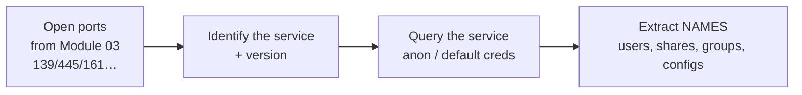

# Module 04 — Enumeration

> **One-liner:** actively querying discovered services to pull out names — users, shares, groups, machines, and configs. Scanning finds the door; enumeration reads the nameplate. This module is *directly* your world: it's the outside view of the exact directory, share, and service-account data a PAM/sysadmin governs.

> **📚 Study companions:** [Facts sheet](facts.md) · [Practice questions](practice-questions.md) · [Flashcards (Anki)](flashcards.csv) · [Lab walkthrough](lab-walkthrough.md)

## Exam focus

- **Enumeration = active** by definition — you're making authenticated or anonymous requests to services.
- **Protocol → default port** pairs (the exam drills these): NetBIOS 137/138/139, SMB 445, SNMP 161/162, LDAP 389/636, NFS 2049, SMTP 25, RPC 135.
- **NetBIOS** enumeration and the NetBIOS name/suffix codes.
- **SMB** null sessions, share enumeration, RID cycling (enum4linux / rpcclient).
- **SNMP** community strings — the **default `public` (read) / `private` (read-write)** trap — and the MIB.
- **LDAP** anonymous bind and directory enumeration.
- **NFS** exported shares (`showmount`) and **SMTP** user enumeration verbs (**VRFY / EXPN / RCPT TO**).
- **Countermeasures**: disable null sessions, change/disable SNMP defaults, restrict zone/share access, disable SMTP verbs.

## Key concepts

### Default ports (memorize this table)

| Service | Port(s) | Enumeration payoff |
|---|---|---|
| NetBIOS name | 137/UDP | Names, suffixes, MAC |
| NetBIOS datagram | 138/UDP | Browser/service info |
| NetBIOS session | 139/TCP | SMB over NetBIOS, null sessions |
| SMB (direct) | 445/TCP | Shares, users, groups, policies |
| SNMP | 161/UDP (traps 162) | Full system config via MIB |
| LDAP / LDAPS | 389/TCP, 636/TCP | Users, groups, OUs, computers |
| Global Catalog | 3268/3269 | Forest-wide AD objects |
| NFS | 2049/TCP | Exported file systems |
| SMTP | 25/TCP | Valid usernames (VRFY/EXPN) |
| RPC endpoint mapper | 135/TCP | Service→port mapping |
| Kerberos | 88/TCP-UDP | User existence, AS-REP roasting |

### The enumeration workflow



### NetBIOS suffix codes (common ones)

| Suffix (hex) | Meaning |
|---|---|
| `<00>` | Workstation service (computer name) |
| `<20>` | File Server (SMB) service running |
| `<1C>` | Domain controllers / group |
| `<1B>` | Domain master browser (PDC) |
| `<1D>` | Master browser |

### SNMP community strings

- **`public`** = default **read-only** community; **`private`** = default **read-write**.
- The **MIB** (Management Information Base) is the tree of queryable objects; `snmpwalk` traverses it. Read-write + default string = you can *reconfigure* the device, not just read it.
- SNMP **v1/v2c send the community in cleartext**; **v3** adds auth + encryption.

### SMB null session

An **anonymous / null session** (`\\host\IPC$` with empty user + password) historically let you enumerate users, groups, shares, and policy without credentials. Legacy Windows and misconfigured Samba allow it — it's the engine behind enum4linux.

### More enumeration targets (round out the blueprint)

Beyond SMB (139/445), SNMP (161), and LDAP (389), the exam samples widely:

| Service | Port | What you enumerate | Tool |
|---|---|---|---|
| **NTP** | 123/UDP | Connected hosts, time source (`ntpq`, `ntpdc`/monlist) | ntpq, nmap NSE |
| **SMTP** | 25 | Valid users via **VRFY/EXPN/RCPT** | smtp-user-enum |
| **NFS** | 2049 (111 rpcbind) | Exported/mountable shares | `showmount -e`, rpcinfo |
| **RPC** | 111 / 135 | Registered endpoints/services | rpcinfo, rpcclient |
| **VoIP (SIP)** | 5060/5061 | Extensions, user agents | SIPVicious (svmap/svwar) |
| **IPsec/IKE** | 500/UDP | VPN gateway, IKE aggressive mode | ike-scan |
| **DNS** | 53 | Records, zone transfer (AXFR) | dig, dnsrecon |
| **Telnet / FTP / TFTP** | 23 / 21 / 69 | Banners, weak/anon auth | nc, ftp |

> IPv6 and VoIP enumeration are increasingly sampled — don't assume everything is IPv4/SMB.

## Key tools

| Tool | Purpose | Reference |
|---|---|---|
| nbtstat | NetBIOS name-table query (Windows) | https://learn.microsoft.com/en-us/windows-server/administration/windows-commands/nbtstat |
| nmblookup | NetBIOS lookup (Linux/Samba) | https://www.samba.org/ |
| enum4linux | Wrapper: SMB/NetBIOS/RID/shares | https://github.com/CiscoCXSecurity/enum4linux |
| enum4linux-ng | Modern rewrite, JSON output | https://github.com/cddmp/enum4linux-ng |
| smbclient | SMB share access (Samba) | https://www.samba.org/ |
| rpcclient | MS-RPC queries over SMB | https://www.samba.org/ |
| snmpwalk (net-snmp) | Walk the SNMP MIB | http://www.net-snmp.org/ |
| onesixtyone | SNMP community brute | https://github.com/trailofbits/onesixtyone |
| ldapsearch (OpenLDAP) | LDAP/AD directory queries | https://www.openldap.org/ |
| showmount (nfs-utils) | List NFS exports | https://linux-nfs.org/ |
| smtp-user-enum | SMTP username enumeration | https://github.com/pentestmonkey/smtp-user-enum |
| NetExec (CME successor) | Multi-proto AD enumeration | https://github.com/Pennyw0rth/NetExec |

## Commands & techniques (lab-ready)

> **Safety:** targets are your lab only — Metasploitable2 (`192.168.56.20`, wide-open Samba/SNMP/NFS) and the AD DC dc01 (`192.168.56.30`, zone/domain `ceh.lab`). These are noisy, authenticated-style queries — never run them off your segment. See [`../../labs/`](../../labs/README.md).

```bash
# --- NetBIOS ---
nmblookup -A 192.168.56.20                    # NetBIOS name table (Linux)
nbtstat -A 192.168.56.31                      # from a Windows host: remote name table

# --- SMB: shares, users, groups (Metasploitable2 allows null sessions) ---
smbclient -L //192.168.56.20 -N               # -N = no password (null session), list shares
smbclient //192.168.56.20/tmp -N              # connect to a share anonymously
enum4linux -a 192.168.56.20                   # -a = all: users, shares, RID cycle, policy
enum4linux-ng -A 192.168.56.20                # modern rewrite, structured output

# --- rpcclient: null-session MS-RPC enumeration ---
rpcclient -U "" -N 192.168.56.20
  # then at the prompt:
  #   enumdomusers      -> domain/local users + RIDs
  #   enumdomgroups     -> groups
  #   querydominfo      -> domain/policy info
  #   lookupnames guest -> name -> SID

# --- SMB against the AD DC (anonymous view; usually more locked down) ---
smbclient -L //192.168.56.30 -N
enum4linux-ng -A 192.168.56.30
# with lab creds you were issued, richer enumeration:
netexec smb 192.168.56.30 -u jdoe -p 'Passw0rd!' --users --shares --groups

# --- SNMP: the default-community goldmine (Metasploitable2) ---
snmpwalk -v2c -c public 192.168.56.20                     # walk entire MIB (read)
snmpwalk -v2c -c public 192.168.56.20 1.3.6.1.2.1.25.4.2  # running processes
snmpwalk -v2c -c public 192.168.56.20 1.3.6.1.2.1.25.6.3  # installed software
snmpwalk -v2c -c public 192.168.56.20 1.3.6.1.4.1.77.1.2.25  # user accounts (Windows hrSWRun)
onesixtyone -c /usr/share/wordlists/snmp.txt 192.168.56.20   # brute community strings

# --- LDAP: anonymous bind + directory dump against the DC ---
ldapsearch -x -H ldap://192.168.56.30 -s base namingContexts   # find the base DN
ldapsearch -x -H ldap://192.168.56.30 -b "DC=ceh,DC=lab" "(objectClass=user)" sAMAccountName
ldapsearch -x -H ldap://192.168.56.30 -b "DC=ceh,DC=lab" "(objectClass=group)" cn

# --- NFS: exported file systems (Metasploitable2) ---
showmount -e 192.168.56.20                    # list exports
# if an export is world-readable you can mount it (lab only):
# sudo mount -t nfs 192.168.56.20:/export /mnt/nfs -o nolock

# --- SMTP user enumeration (Metasploitable2 mail service) ---
nc -nv 192.168.56.20 25
  # VRFY root        -> 250/252 = user exists, 550 = no such user
  # EXPN staff       -> expand a mailing list
  # RCPT TO:<root>   -> the most reliable modern check
smtp-user-enum -M VRFY -U /usr/share/wordlists/metasploit/unix_users.txt -t 192.168.56.20
```

**Port → tool cheat:** 139/445 → `enum4linux`/`smbclient`/`rpcclient`; 161 → `snmpwalk`/`onesixtyone`; 389/636 → `ldapsearch`; 2049 → `showmount`; 25 → `smtp-user-enum`.

## Lab exercise

1. **SMB null session:** `enum4linux -a 192.168.56.20`. Record the user list, RIDs, and shares it dumps *with no credentials* — that's the null-session weakness in action.
2. **SNMP defaults:** `snmpwalk -v2c -c public 192.168.56.20`. Note that the *default community string* alone exposes processes, software, and interfaces. Then think: `private` would let you *change* config.
3. **LDAP anonymous bind:** query `DC=ceh,DC=lab` on `192.168.56.30` for users and groups. Compare what an *anonymous* bind returns vs. an *authenticated* one with your lab creds — the delta is your hardening win.
4. **SMTP verbs:** connect to port 25 on `192.168.56.20` and try `VRFY root`. A `250/252` confirms the account exists — free username validation for later password attacks (Module 06).
5. **NFS exports:** `showmount -e 192.168.56.20` and note any world-exported paths.

**What you should observe:** enumeration converts anonymous access into a *named inventory* of your directory. Every item that comes back without credentials is a control you can turn off — null sessions, default SNMP strings, anonymous LDAP binds, and open SMTP verbs.

## Defender & PAM mapping

| Attack | Detection signal | Control / PAM lever |
|---|---|---|
| SMB null-session enumeration | Anonymous IPC$ logons (Event 4624 type 3, blank user), RID-cycling bursts | Disable null sessions (`RestrictAnonymous`/`RestrictAnonymousSAM`), SMB signing, least-privilege shares |
| RID cycling / user enumeration | Rapid SID→name lookups, many 4625/4776 | Restrict anonymous SID translation, monitor lookup volume, account-name obfuscation |
| SNMP default-community read | UDP/161 from unexpected source, GET floods | **Remove `public`/`private`**, use SNMPv3 (auth+priv), ACL the manager, segment mgmt VLAN |
| LDAP anonymous bind | Bind with empty DN, broad subtree searches | Disable anonymous bind, require LDAPS + auth, monitor bulk directory reads |
| NFS export enumeration | `showmount`/mount from non-authorized host | Export to specific hosts only, `root_squash`, Kerberized NFS, segment storage |
| SMTP VRFY/EXPN harvesting | 250/252 reply patterns, sequential RCPT probes | Disable VRFY/EXPN, tarpit/rate-limit, generic bounce messages |
| Service-account discovery (LDAP/SPN) | Enumeration of accounts with SPNs / high privilege | **gMSA** for service accounts, tiered OUs, hide privileged groups, PAM-vault the creds |

> **Your edge:** this module is a checklist of *anonymous-access hardening* — exactly what a PAM/sysadmin owns. The worst outcome for an AD/PAM environment is enumeration that names your **privileged groups and service accounts** before any credential is spent. Kill anonymous binds and null sessions, remove default SNMP strings, tier your OUs so a low-priv enumerator can't see Tier 0, and move service accounts to gMSA so their names don't hand an attacker a Kerberoast target (Module 06).

### 🔐 PAM engineering deep-dive (CyberArk)

Enumeration harvests the raw material for the next module: shares, local admins, and SPN-bearing service accounts. Onboarding those accounts removes the payoff.

| This module's attack | CyberArk control | Component |
|---|---|---|
| Enumerated local administrator accounts | Unique, rotated local-admin password per host | CPM (LAPS-style); EPM removes the need entirely |
| Enumerated service accounts (SPNs) | Vault + rotate, or convert to gMSA | CPM |
| SMB/SNMP/LDAP recon | SNMPv3, disable null sessions, restrict directory reads | (hardening) |

**Detection (privileged lens):** enumeration bursts, anonymous LDAP binds, RID cycling, 4662 — see [`../../defender-pam/detection-engineering.md`](../../defender-pam/detection-engineering.md).

**Engineering note:** the fastest win here is to onboard every discovered **local admin** and **service account**; a Kerberoastable SPN with a CPM-managed 40-char password is no longer worth enumerating.

> Go deeper: [identity attack paths](../../defender-pam/identity-attack-paths.md) · [CyberArk mapping](../../defender-pam/cyberark-attack-mapping.md)

## Exam tips & gotchas

- **Enumeration is active**, not passive — you are querying the target's services directly.
- **Nail the ports:** 137/138/139 NetBIOS, 445 SMB, 161 SNMP, 389 LDAP (636 LDAPS), 2049 NFS, 25 SMTP, 135 RPC endpoint mapper.
- **SNMP defaults: `public` = read-only, `private` = read-write.** A frequent "which string gives write access?" question — answer: `private`.
- **SMB null session** = connect to `IPC$` with blank user + blank password; it's what enum4linux automates.
- **SMTP verbs:** `VRFY` verifies a user, `EXPN` expands a list, `RCPT TO` checks a recipient — all leak valid usernames.
- **`showmount -e`** lists NFS exports; `-a` lists who's mounted.
- **SNMPv3** is the secure version (auth + encryption); **v1/v2c community strings travel in cleartext**.
- Don't confuse **scanning** (finds open ports) with **enumeration** (extracts names/accounts/shares from those ports).

## Sources

- enum4linux — https://github.com/CiscoCXSecurity/enum4linux
- enum4linux-ng — https://github.com/cddmp/enum4linux-ng
- Samba (smbclient / rpcclient) — https://www.samba.org/
- Net-SNMP (snmpwalk) — http://www.net-snmp.org/
- OpenLDAP (ldapsearch) — https://www.openldap.org/
- smtp-user-enum — https://github.com/pentestmonkey/smtp-user-enum
- nbtstat (Microsoft) — https://learn.microsoft.com/en-us/windows-server/administration/windows-commands/nbtstat
- Microsoft — Network access: Restrict anonymous — https://learn.microsoft.com/en-us/previous-versions/windows/it-pro/windows-10/security/threat-protection/security-policy-settings/network-access-do-not-allow-anonymous-enumeration-of-sam-accounts
- MITRE ATT&CK: Account Discovery (T1087) — https://attack.mitre.org/techniques/T1087/
- MITRE ATT&CK: Permission Groups Discovery (T1069) — https://attack.mitre.org/techniques/T1069/

---
### 📝 My lab log (fill in)
| Date | Target | Command | Result / notes |
|---|---|---|---|
|  |  |  |  |
