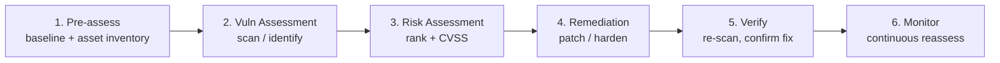

# Module 05 — Vulnerability Analysis

> **One-liner:** how you *find and rank* weaknesses before anyone exploits them — assessment types, the VA lifecycle, and the scoring/identification standards (CVSS, CVE, CWE, CPE) the exam quizzes by name. This is breadth, not exploitation: VA finds & prioritizes; the pen test (Module 06+) proves impact.

> **📚 Study companions:** [Facts sheet](facts.md) · [Practice questions](practice-questions.md) · [Flashcards (Anki)](flashcards.csv) · [Lab walkthrough](lab-walkthrough.md)

## Exam focus

- **Types of vulnerability assessment**: active vs. passive; external vs. internal; host-based vs. network-based vs. application-based (plus wireless/database).
- **Assessment approaches**: product-based vs. service-based; tree-based vs. inference-based; credentialed (authenticated) vs. non-credentialed.
- The **vulnerability management lifecycle** (the phase order).
- **CVSS** — Base / Temporal (Threat in v4.0) / Environmental metric groups, and the qualitative severity bands (None → Critical). *Know what each group represents, not just the number.*
- **CVE vs. CWE vs. CPE** — the classic "which identifier is which" question.
- **NVD** and how it enriches CVEs with CVSS, CWE, and CPE.
- **Scanners → purpose**: Nessus, OpenVAS/Greenbone, Nikto, Qualys.
- **False positives vs. false negatives**, and why a false negative is the dangerous one.
- **Scoring vs. prioritization** — severity (CVSS) is not the same as "fix this first" (add exploitability + exposure).

## Key concepts

### Vulnerability assessment types (a classic taxonomy table)

| Type | What it does | Notes |
|---|---|---|
| **Active** | Sends probes/packets to the target (scanner interacts) | Most scanning; can be noisy, can crash fragile services |
| **Passive** | Observes traffic without probing (sniff & fingerprint) | Stealthy; only sees what's on the wire |
| **External** | Perspective of an outside attacker (Internet-facing) | Perimeter, exposed services |
| **Internal** | Perspective from inside the LAN | Post-breach / insider view; usually finds far more |
| **Host-based** | Deep check of one system (patches, config, users) | Often credentialed; agent or login |
| **Network-based** | Scans hosts/ports/services across a range | Discovers exposure breadth |
| **Application-based** | Web/app-layer flaws (input, auth, logic) | Nikto, ZAP, Burp territory |
| **Credentialed / authenticated** | Scanner logs in with an account | Far fewer false positives, sees missing patches |
| **Non-credentialed** | No login — infers from banners/behavior | More guessing → more false positives |

Approaches CEH also names: **product-based** (installed in your network) vs. **service-based** (offered by a third party); **tree-based** (auditor applies different strategies per machine) vs. **inference-based** (scan branches based on what it finds).

### The vulnerability management lifecycle



It's a **loop**: monitoring feeds the next baseline. VA *finds and ranks*; it does not exploit (that separation is the Module 01 VA-vs-PT distinction).

### The identification standards — know these cold

| Acronym | Full name | Owner | What it identifies |
|---|---|---|---|
| **CVE** | Common Vulnerabilities and Exposures | MITRE (cve.org) | A **specific** publicly known vulnerability instance, e.g. `CVE-2011-2523` |
| **CWE** | Common Weakness Enumeration | MITRE | The **weakness type / root cause category**, e.g. `CWE-89` SQL injection, `CWE-79` XSS |
| **CPE** | Common Platform Enumeration | NIST/NVD | A **structured product name**, e.g. `cpe:2.3:a:vendor:product:1.0:*:*:*:*:*:*:*` |
| **NVD** | National Vulnerability Database | NIST | **Enriches** CVEs with CVSS scores, CWE mapping, and CPE — the searchable feed |
| **CVSS** | Common Vulnerability Scoring System | FIRST | The **severity score** (0.0–10.0) for a vulnerability |

> Mnemonic: **CVE = the bug (an instance)**, **CWE = the *kind* of bug (a class)**, **CPE = the product it lives in**. NVD ties them together and hangs a CVSS score on each CVE.

### CVSS — the three metric groups

CVSS breaks severity into three groups (per **FIRST**, the standard's maintainer):

| Group | Represents | Changes? |
|---|---|---|
| **Base** | Intrinsic, constant traits: Attack Vector, Attack Complexity, Privileges Required, User Interaction, Scope, and Confidentiality/Integrity/Availability impact | Fixed over time |
| **Temporal** (v3.x) / **Threat** (v4.0) | State of exploitation *right now*: exploit maturity, remediation level, report confidence | Changes over time |
| **Environmental** | Your org's context: security requirements + modified base metrics for *your* deployment | Per-organization |

**Qualitative severity bands** (standard CVSS v3.x / v4.0 rating scale, per FIRST/NVD — cite the source, don't memorize made-up numbers):

| Rating | Score band |
|---|---|
| None | 0.0 |
| Low | 0.1 – 3.9 |
| Medium | 4.0 – 6.9 |
| High | 7.0 – 8.9 |
| Critical | 9.0 – 10.0 |

> Gotcha: **CVSS v2 had no "Critical"** (its top band was High). "Critical" arrived with v3. CVSS **v4.0** (2023) renamed *Temporal → Threat* and added a *Supplemental* group. When in doubt on the exam, reason from what each **group** measures, not a specific decimal.

### Scoring vs. prioritization

CVSS answers "**how bad could this be?**" — it does **not** answer "**fix which first?**". Real prioritization layers on exploitability and exposure:

| Signal | What it adds | Source |
|---|---|---|
| **CVSS** | Intrinsic severity | FIRST |
| **EPSS** | *Probability* a CVE will be exploited soon | FIRST (Exploit Prediction Scoring System) |
| **CISA KEV** | Whether it is **already exploited in the wild** | CISA Known Exploited Vulnerabilities catalog |
| Asset value / exposure | Is it Internet-facing? Tier 0? | Your asset inventory (CPE) |

A Medium CVSS that is Internet-facing **and** on the KEV list beats a Critical buried on an isolated host. That reasoning is the whole point of the *Risk Assessment* lifecycle phase.

### False positives vs. false negatives

| Result | Meaning | Consequence |
|---|---|---|
| **False positive** | Flagged a vuln that isn't real | Wasted remediation effort, alert fatigue |
| **False negative** | Missed a vuln that *is* real | **Silent exposure — the dangerous one** |

**Credentialed scans** cut both by seeing actual patch level and config instead of guessing from banners.

## Key tools

| Tool | Purpose | Reference |
|---|---|---|
| Nessus (Tenable) | Commercial, industry-standard vuln scanner | https://www.tenable.com/products/nessus |
| OpenVAS / Greenbone (GVM) | Open-source network vuln scanner | https://www.openvas.org/ · https://www.greenbone.net/ |
| Nikto | Web-server vulnerability scanner | https://github.com/sullo/nikto |
| Qualys VMDR | Cloud-based vulnerability management | https://www.qualys.com/ |
| Nmap + NSE `vuln` scripts | Service/version detection → CVE correlation | https://nmap.org/ |
| searchsploit / Exploit-DB | Map a version to known exploits | https://www.exploit-db.com/searchsploit |

## Commands & techniques (lab-ready)

> Run only against your own lab. Target here: **Metasploitable2 `192.168.56.20`** from Kali (`192.168.56.10`). See [`../../labs/`](../../labs/README.md).

```bash
# --- Service/version discovery (feeds CVE lookup) ---
nmap -sV -O 192.168.56.20                       # versions + OS guess

# --- Nmap NSE vulnerability scripts ---
nmap -sV --script vuln 192.168.56.20            # runs the "vuln" NSE category
nmap -p 21 --script ftp-vsftpd-backdoor 192.168.56.20   # checks the vsftpd 2.3.4 backdoor

# --- Correlate a version to a known CVE / exploit ---
searchsploit vsftpd 2.3.4                       # -> CVE-2011-2523 (backdoor)
searchsploit samba 3.0                          # -> usermap_script (CVE-2007-2447)

# --- Web-layer scan (Metasploitable2 runs Apache on :80) ---
nikto -h http://192.168.56.20

# --- OpenVAS / Greenbone (GVM) on Kali ---
sudo gvm-setup                                  # one-time setup (feeds sync = slow)
sudo gvm-start                                  # then browse https://127.0.0.1:9392
# Create a target (192.168.56.20), a "Full and fast" task, run, review by CVSS.

# --- Nessus (if installed): service listens on 8834 ---
# Browse https://localhost:8834 -> New Scan -> Basic Network Scan -> 192.168.56.20
```

**Credentialed scan habit:** give the scanner a **dedicated, least-privilege** account (read/config-audit only), **vault** it, and rotate it. That single practice slashes false positives — and is exactly the PAM discipline the exam rewards conceptually.

## Lab exercise

1. **Discover:** run `nmap -sV 192.168.56.20`. Write down three service versions (e.g., vsftpd, Samba, Apache).
2. **Identify:** run `nmap --script vuln` and `nikto`. Note the findings and their apparent severity.
3. **Standardize:** pick one finding (e.g., the vsftpd 2.3.4 backdoor). Look it up:
   - On **cve.org** / **NVD** — record the **CVE** ID and its **CVSS** base score + vector.
   - Find its **CWE** (the weakness *type*).
   - Note the **CPE** string NVD lists for the affected product.
4. **Prioritize:** for that CVE, check whether it appears in the **CISA KEV** catalog and look at its **EPSS** score. Would that change your fix order vs. a higher-CVSS finding on an internal-only port?
5. **Verify mindset:** decide what a *credentialed* re-scan would confirm that the unauthenticated scan only guessed.

**What you should observe:** a scanner produces *findings*; standards (CVE/CWE/CPE/CVSS) turn them into a shared language; and prioritization needs exploitability + exposure on top of the raw score. VA never exploits — it hands a ranked list to remediation.

## Defender & PAM mapping

| Attack | Detection signal | Control / PAM lever |
|---|---|---|
| Attacker vuln-scans your estate (recon) | Burst of connections, IDS scan sigs, scanner user-agent | Authorized scan windows, segmentation, rate limiting, egress control |
| Exploiting an unpatched CVE | Vuln present in your own scan; exploit attempt in logs | Remediation SLA driven by **CVSS + EPSS + KEV**; patch/config hardening |
| Default/weak service left exposed (Metasploitable-style) | Open ports, default creds, stale versions | Asset inventory (**CPE**), least functionality, disable unused services |
| Abuse of the scanner's credentialed account | Scan account used off-schedule or from odd host | **Vault** scanner creds, dedicated least-priv account, **JIT** + rotation |
| False sense of security (unauth scan only) | Gap between authenticated vs. unauthenticated results | Credentialed scans, verification re-scan, coverage metrics |
| Blind spot in Tier 0 assets | Tier 0 systems absent from scan scope | Scope Tier 0 explicitly; PAM-brokered access for scanning DCs/vaults |

> **PAM playbook for this module:** the vulnerability scanner is itself a **privileged tool** — it holds credentials to half your estate. Treat its service account like any other privileged account: vault it, scope it to least privilege, run it just-in-time, and record its sessions. Then let CVSS+EPSS+KEV, not gut feel, set your patch order. Attack↔control detail lives in [`../../defender-pam/`](../../defender-pam/README.md).

### 🔐 PAM engineering deep-dive (CyberArk)

Two PAM angles most people miss: your **scanner's own service account** is a prime over-privileged, never-rotated target, and your **PAM stack itself** needs the same patch discipline you demand of everything else.

| This module's attack | CyberArk control | Component |
|---|---|---|
| Over-privileged, static scan/credentialed account | Vault + rotate + time-box the scan account | CPM + DPA |
| Unpatched PAM components (Tier 0) | Patch the Vault/PVWA/CPM/PSM on cadence | (patch mgmt) |
| Exploit → local privilege escalation | Least privilege caps the blast radius | EPM |

**Detection (privileged lens):** the scan account authenticating outside its window or to unexpected hosts should fire — see [`../../defender-pam/detection-engineering.md`](../../defender-pam/detection-engineering.md).

**Engineering note:** credentialed scanners should **check out a vaulted, JIT scan credential**, not carry standing Domain Admin. A leaked scanner config then yields a short-lived, low-power account.

> Go deeper: [PAM architecture](../../defender-pam/pam-architecture.md)

## Exam tips & gotchas

- **CVE = instance, CWE = weakness class, CPE = product name.** Highest-frequency mix-up in this module.
- **NVD is NIST**; **CVE is MITRE** (cve.org); **CVSS is FIRST**. Match owner → standard.
- **CVSS Base is constant; Temporal/Threat changes over time; Environmental is org-specific.** Learn what each *group* means.
- **CVSS v2 had no "Critical"** — that band is v3+.
- **Credentialed/authenticated scans → fewer false positives.**
- **False negative > false positive in danger** (a missed vuln is silent risk).
- **VA finds & ranks; it does not exploit** — that's the pen test. (Ties back to Module 01.)
- **Active** sends probes; **passive** only observes traffic.
- **Nessus = commercial, OpenVAS/Greenbone = open source, Nikto = web-only, Qualys = cloud.**
- **Severity ≠ priority:** exploitability (EPSS) and real-world exploitation (KEV) reorder the list.

## Sources

- FIRST — CVSS specification — https://www.first.org/cvss/
- FIRST — CVSS v4.0 — https://www.first.org/cvss/v4-0/
- FIRST — EPSS (Exploit Prediction Scoring System) — https://www.first.org/epss/
- MITRE — CVE program — https://www.cve.org/
- MITRE — CWE (Common Weakness Enumeration) — https://cwe.mitre.org/
- NIST — National Vulnerability Database (NVD) — https://nvd.nist.gov/
- NIST — CPE (Common Platform Enumeration) — https://nvd.nist.gov/products/cpe
- CISA — Known Exploited Vulnerabilities (KEV) catalog — https://www.cisa.gov/known-exploited-vulnerabilities-catalog
- Tenable Nessus — https://www.tenable.com/products/nessus
- Greenbone / OpenVAS — https://www.greenbone.net/ · https://www.openvas.org/
- Nikto — https://github.com/sullo/nikto
- Qualys — https://www.qualys.com/
- Nmap NSE `vuln` category — https://nmap.org/nsedoc/categories/vuln.html

---
### 📝 My lab log (fill in)
| Date | Target | Command | Result / notes |
|---|---|---|---|
|  |  |  |  |
