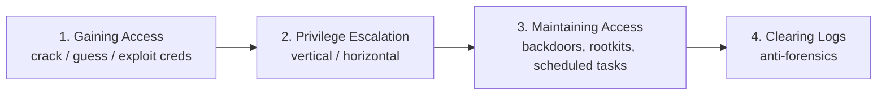

# Module 06 — System Hacking

> **One-liner:** the core attack chain against a host once you're on it — cracking/guessing credentials, escalating privilege, executing code, hiding, and covering tracks. This is the module where your PAM background pays off most: almost every technique here is something a PAM/tiering control is designed to defeat.

> **📚 Study companions:** [Facts sheet](facts.md) · [Practice questions](practice-questions.md) · [Flashcards (Anki)](flashcards.csv) · [Lab walkthrough](lab-walkthrough.md)

## Exam focus

- The **System Hacking methodology**: Gaining Access → Escalating Privileges → Maintaining Access → Clearing Logs.
- **Password attack types**: passive online, active online, offline, non-electronic — and which tool fits which.
- **Windows authentication internals**: LM vs. NTLM vs. NTLMv2, Kerberos, where hashes live (SAM, LSASS, NTDS.dit).
- **Pass-the-Hash / Pass-the-Ticket / Kerberoasting / AS-REP roasting**.
- **Privilege escalation** on Windows and Linux (misconfig, unquoted paths, SUID, sudo, kernel).
- **Steganography**, **rootkits**, **NTFS alternate data streams**, and **log clearing** as anti-forensics.
- **Rainbow tables vs. salting**, and why salting defeats precomputation.

## Key concepts

### The methodology



### Password attack taxonomy (classic exam table)

| Category | Description | Example tools |
|---|---|---|
| Passive online | Sniff creds on the wire | Wireshark, Responder |
| Active online | Guess against a live service | Hydra, Medusa, `crackmapexec` |
| Offline | Crack captured hashes | John the Ripper, Hashcat |
| Non-electronic | Shoulder-surf, dumpster, social | (no tool) |

Attack strategies: **dictionary**, **brute force**, **hybrid**, **rule-based**, **rainbow table**.

### Windows credentials — where they live

| Store | Contains | Attack |
|---|---|---|
| SAM (local) | Local account NT hashes | Dump offline / with SYSTEM |
| LSASS (memory) | Logged-on creds, tickets | Mimikatz `sekurlsa` |
| NTDS.dit (DC) | All domain hashes | DCSync, volume shadow copy |
| LSA secrets | Service acct passwords | `secretsdump` |

### Hash & ticket attacks (know the difference)

| Attack | What it abuses | Needs cracking? |
|---|---|---|
| Pass-the-Hash (PtH) | NTLM hash used directly to auth | No |
| Pass-the-Ticket (PtT) | Kerberos TGT/TGS reused | No |
| Kerberoasting | Requests TGS for an SPN, cracks it offline | Yes (service acct password) |
| AS-REP roasting | Accounts with "no preauth" leak crackable blob | Yes |
| Golden/Silver ticket | Forged TGT (krbtgt) / TGS (service key) | No (post-compromise) |

### Rainbow tables vs. salt

- **Rainbow table** = precomputed hash→plaintext lookup; fast but defeated by **salting** (random per-hash value makes precomputation useless).
- Modern Windows uses NT hash (unsalted MD4-based) → still crackable, which is *why* Kerberoasting works.

### More gaining/maintaining-access techniques

- **Buffer overflow** — writing past a buffer's bounds to overwrite the return address / control flow → code execution. **Stack** (classic saved-EIP/RIP overwrite) vs **heap**. Mitigations: **DEP/NX**, **ASLR**, **stack canaries**, **SEHOP/CFG**. It underpins many "Gaining Access" exploitation questions.
- **Keyloggers** — capture keystrokes: **hardware** (inline/USB device) or **software** (kernel/API hooks). A credential-theft primitive.
- **Spyware** — covertly monitors activity (screen, audio, files) and exfiltrates it; stalkerware/adware are variants.
- **Executing applications** — post-exploitation, attackers run remote tools (backdoors, RATs, keyloggers) — the *executing applications* step of Maintaining Access.
- Hierarchy to remember: **buffer overflow / cracking get you in → keyloggers & spyware harvest → rootkits, ADS, steganography hide it.**

## Key tools

| Tool | Purpose | Reference |
|---|---|---|
| Hashcat | GPU offline hash cracking | https://hashcat.net/hashcat/ |
| John the Ripper | CPU hash cracking | https://www.openwall.com/john/ |
| Hydra | Online credential brute force | https://github.com/vanhauser-thc/thc-hydra |
| Mimikatz | Windows credential/ticket extraction | https://github.com/gentilkiwi/mimikatz |
| Impacket (secretsdump, GetUserSPNs) | AD credential/ticket tooling | https://github.com/fortra/impacket |
| CrackMapExec / NetExec | AD spraying, PtH, enumeration | https://github.com/Pennyw0rth/NetExec |
| Metasploit | Exploitation + Meterpreter post-ex | https://docs.metasploit.com/ |

## Commands & techniques (lab-ready)

> Run only against your own lab (`192.168.56.0/24`, docker range). See [`../../labs/`](../../labs/).

```bash
# --- Online guessing against a service (Metasploitable2) ---
hydra -l msfadmin -P /usr/share/wordlists/rockyou.txt ssh://192.168.56.20

# --- Offline cracking of captured hashes ---
hashcat -m 1000 ntlm_hashes.txt /usr/share/wordlists/rockyou.txt   # -m 1000 = NTLM
john --format=nt ntlm_hashes.txt --wordlist=/usr/share/wordlists/rockyou.txt

# --- AD: Kerberoast the svc-sql account from the Ansible lab ---
# (Impacket) request TGS tickets for accounts with SPNs, output crackable hashes
impacket-GetUserSPNs ceh.lab/jdoe:'Passw0rd!' -dc-ip 192.168.56.30 -request
hashcat -m 13100 kerberoast.txt /usr/share/wordlists/rockyou.txt   # -m 13100 = Kerberos TGS

# --- AD: dump domain hashes (needs privilege) ---
impacket-secretsdump ceh.lab/Administrator@192.168.56.30

# --- Pass-the-Hash to authenticate without the plaintext ---
netexec smb 192.168.56.31 -u Administrator -H <NT_HASH>

# --- Linux privesc quick checks (on a foothold shell) ---
sudo -l                       # what can I run as root?
find / -perm -4000 -type f 2>/dev/null   # SUID binaries
```

Common Hashcat modes to memorize: **0** MD5 · **100** SHA1 · **1000** NTLM · **1800** sha512crypt · **13100** Kerberos TGS-REP · **22000** WPA-PBKDF2.

## Lab exercise

1. **Online → offline path:** brute `msfadmin` over SSH on Metasploitable2 with Hydra; separately, grab `/etc/shadow` and crack it with John. Note how much faster offline is.
2. **AD attack (Ansible lab):** Kerberoast `svc-sql`. First run it with the *weak* password the playbook sets — you crack it. Then change `svc-sql` to a long random password (or convert to a gMSA) and re-run: the crack fails. **You just demonstrated the control.**
3. **Lateral movement blocked:** try to reuse `t0-admin` on `ws01` (Tier 2). Observe that Protected Users / tiering breaks the path.

**What you should observe:** every "win" here has a specific control that turns it into a "loss" — weak service password → gMSA; PtH → tiering + Protected Users + LAPS; NTDS access → Tier 0 isolation.

## Defender & PAM mapping

| Attack | Detection signal | Control / PAM lever |
|---|---|---|
| Password spraying / brute force | Many 4625 failures, lockouts, spray pattern across accounts | Lockout policy, MFA, PAM broker + rate limiting |
| Kerberoasting | 4769 TGS requests for SPN accts, esp. RC4 | **gMSA** (128-char managed passwords), strong svc passwords, AES-only |
| Pass-the-Hash / PtT | NTLM auth from unusual hosts, ticket anomalies | **Tiered admin**, Protected Users, Credential Guard, LAPS |
| LSASS dumping (Mimikatz) | Handle to lsass, Sysmon EID 10, EDR | Credential Guard, LSASS PPL, attack-surface-reduction rules |
| DCSync / NTDS theft | Replication from non-DC (4662), volume shadow copy | Tier 0 isolation, monitor replication rights, PAM-vault DA creds |
| Local admin reuse | Same local admin hash across hosts | **LAPS** (unique local admin passwords), deny lateral logon |
| Persistence (tasks/services) | New service/scheduled task, autoruns | Least privilege, JIT elevation, allow-listing, change control |

> **PAM playbook for this module:** vault and rotate privileged credentials, enforce **JIT** so standing privilege is near-zero, **tier** admin planes so a Tier 2 compromise can't reach Tier 0, and prefer **gMSA** for service accounts to kill Kerberoasting. This is exactly the mapping in [`../../defender-pam/attack-to-control-matrix.md`](../../defender-pam/attack-to-control-matrix.md).

### 🔐 PAM engineering deep-dive (CyberArk)

This is the module PAM was built for — nearly every technique here is something a CyberArk control turns from a win into a logged, contained failure.

| This module's attack | CyberArk control | Component |
|---|---|---|
| Pass-the-Hash / Pass-the-Ticket | Credential never touches the endpoint; rotated | PSM + CPM + EPM |
| Kerberoasting | Long random service password (or gMSA), AES-only | CPM |
| LSASS / credential dumping | Block credential harvesting on the endpoint | EPM (credential theft protection) |
| Local-admin reuse across hosts | Unique, rotated local-admin password | CPM (LAPS-style) |
| DCSync / Golden Ticket | Detect + isolate Tier 0 | PTA |
| Unix `sudo` / shared root | Vault-controlled elevation, per-command | OPM |

**Detection (privileged lens):** 4769 with RC4 (Kerberoasting), 4662 replication from a non-DC (DCSync), Sysmon 10 handle-to-lsass (dumping), and PTA's Golden Ticket / PtH detections — full queries in [`../../defender-pam/detection-engineering.md`](../../defender-pam/detection-engineering.md).

**Engineering note:** the two highest-leverage moves are (1) **convert SPN service accounts to gMSA or CPM-managed** and (2) **remove standing local admin with EPM**. Together they neutralize Kerberoasting, most credential dumping, and local-admin lateral movement — the backbone of this module.

> Go deeper: [identity attack paths](../../defender-pam/identity-attack-paths.md) · [PAM architecture](../../defender-pam/pam-architecture.md) · [CyberArk mapping](../../defender-pam/cyberark-attack-mapping.md)

## Exam tips & gotchas

- **PtH needs no cracking** — it reuses the hash. If a question says "crack," it's *not* PtH; it's offline cracking or Kerberoasting.
- **Kerberoasting cracks the service account password**, not the user's — and it only works because the TGS is encrypted with the service account's key.
- **Salting defeats rainbow tables**; NTLM is unsalted (why it stays crackable).
- Know **hash types on sight**: LM (uppercased, split 7-char halves, weak) vs. NTLM.
- **Clearing logs** on Windows: `wevtutil cl <log>` / `Clear-EventLog` — anti-forensics = Maintaining/Clearing phase, not privesc.
- **Vertical vs. horizontal** privesc: vertical = higher privilege; horizontal = same level, different user.

## Sources

- Hashcat example hashes / modes — https://hashcat.net/wiki/doku.php?id=example_hashes
- Impacket (Fortra) — https://github.com/fortra/impacket
- Mimikatz — https://github.com/gentilkiwi/mimikatz
- MITRE ATT&CK: OS Credential Dumping (T1003) — https://attack.mitre.org/techniques/T1003/
- MITRE ATT&CK: Kerberoasting (T1558.003) — https://attack.mitre.org/techniques/T1558/003/
- Microsoft: Securing privileged access / tiering model — https://learn.microsoft.com/en-us/security/privileged-access-workstations/overview
- Microsoft LAPS — https://learn.microsoft.com/en-us/windows-server/identity/laps/laps-overview

---
### 📝 My lab log (fill in)
| Date | Target | Command | Result / notes |
|---|---|---|---|
|  |  |  |  |
