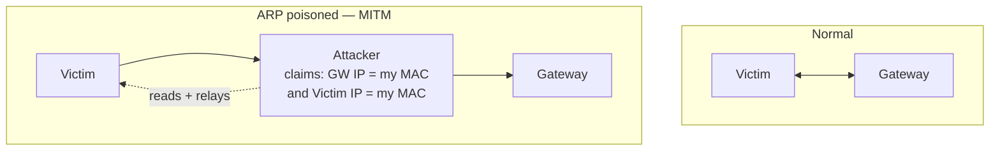

# Module 08 — Sniffing

> **One-liner:** capturing and manipulating traffic on the wire — passive sniffing on a switch you can already see, and active attacks (MAC flooding, ARP/DHCP/DNS spoofing) that *force* traffic to you. Your PAM/sysadmin hook: sniffing is why privileged sessions must be encrypted and brokered, and why switch-port security exists.

## Exam focus

- **Passive vs. active sniffing** — and why switches made passive sniffing "not enough."
- **How a switch normally blocks sniffing** (per-port forwarding via the CAM/MAC table) and how attackers defeat it.
- **MAC flooding** (CAM table overflow → fail-open) and **MAC spoofing**.
- **ARP spoofing / ARP poisoning** → man-in-the-middle, and **gratuitous ARP**.
- **DHCP starvation** and **rogue DHCP** attacks.
- **DNS poisoning** variants (intranet, internet, proxy-server, cache).
- **Port mirroring (SPAN) / TAP** — the *legitimate* way to sniff.
- **Protocols that leak in cleartext**: HTTP, FTP, Telnet, SMTP, POP3, IMAP, SNMPv1/2c, LDAP (unencrypted).
- **Sniffing tools & Wireshark filters/display syntax.**
- **Defenses**: DHCP snooping, Dynamic ARP Inspection (DAI), port security, encryption.

## Key concepts

### Why switches matter

A **hub** repeats every frame to every port → trivially sniffable. A **switch** learns MAC→port mappings in its **CAM table** and forwards frames only to the destination port. So on a switched network, attackers must *actively* redirect traffic to their port.

### Active sniffing attacks (the exam's core list)

| Attack | Mechanism | Result |
|---|---|---|
| **MAC flooding** | Flood switch with bogus source MACs until CAM table fills | Switch **fails open** → floods all ports like a hub |
| **MAC spoofing** | Clone a legitimate MAC | Bypass port/MAC filtering, hijack a port |
| **ARP poisoning** | Send forged ARP replies mapping gateway IP → attacker MAC | **MITM**: victim's traffic flows through you |
| **DHCP starvation** | Exhaust the DHCP pool with spoofed requests | Denial of service; sets up rogue DHCP |
| **Rogue DHCP** | Attacker DHCP server answers first | Push malicious gateway/DNS → MITM |
| **DNS poisoning** | Inject false DNS records/responses | Redirect victims to attacker hosts |

### ARP poisoning — the MITM engine



ARP has **no authentication**, so a forged "gratuitous ARP" reply is accepted. This is why encrypted transport (TLS/SSH) matters: you can be MITM'd at L2 and still not hand over readable data.

### DNS poisoning variants

| Variant | Where it happens |
|---|---|
| Intranet DNS spoofing | On the LAN (often via ARP MITM) |
| Internet DNS spoofing | Attacker-controlled resolver on a rogue box |
| Proxy server DNS poisoning | Malicious proxy in browser settings |
| DNS cache poisoning | Inject forged records into a resolver's cache |

### Cleartext protocols to flag (know the secure swap)

| Insecure | Port | Encrypted replacement |
|---|---|---|
| Telnet | 23 | SSH (22) |
| FTP | 21 | SFTP (22) / FTPS (990) |
| HTTP | 80 | HTTPS (443) |
| SMTP/POP3/IMAP | 25/110/143 | +TLS (587/465, 995, 993) |
| SNMPv1/2c | 161 | SNMPv3 (auth+priv) |
| LDAP | 389 | LDAPS (636) |

## Key tools

| Tool | Purpose | Reference |
|---|---|---|
| Wireshark / tshark | Packet capture & deep analysis | https://www.wireshark.org/ |
| tcpdump | CLI capture / filtering | https://www.tcpdump.org/ |
| Ettercap | ARP poisoning / MITM suite | https://www.ettercap-project.org/ |
| Bettercap | Modern MITM / network attack framework | https://www.bettercap.org/ |
| dsniff (arpspoof, dnsspoof, macof) | Classic sniffing/spoofing toolkit | https://www.monkey.org/~dugsong/dsniff/ |
| Responder | LLMNR/NBT-NS/mDNS poisoning → cred capture | https://github.com/lgandx/Responder |
| Yersinia | L2 attacks (STP, DHCP, CDP) | https://github.com/tomac/yersinia |

## Commands & techniques (lab-ready)

> Run only on your own lab segment (`192.168.56.0/24`). ARP poisoning disrupts real networks — never off your lab. See [`../../labs/`](../../labs/).

```bash
# --- Passive capture and read cleartext creds ---
sudo tcpdump -i eth0 -w capture.pcap                     # capture to file
tshark -r capture.pcap -Y "http.request.method == POST"  # find form posts
# Wireshark display filters worth memorizing:
#   http.authbasic         ftp.request.command == "PASS"
#   telnet                 tcp.port == 23

# --- Enable forwarding so victims stay online during MITM ---
sudo sysctl -w net.ipv4.ip_forward=1

# --- ARP poison a victim <-> gateway (bettercap) ---
sudo bettercap -iface eth0
# in bettercap:  set arp.spoof.targets 192.168.56.101; arp.spoof on; net.sniff on

# --- Classic dsniff equivalents ---
sudo arpspoof -i eth0 -t 192.168.56.101 192.168.56.1     # poison victim
sudo macof -i eth0                                        # MAC flood (CAM overflow)

# --- Capture AD creds via LLMNR/NBT-NS poisoning ---
sudo responder -I eth0 -wv                                # then crack the NetNTLMv2 with hashcat -m 5600
```

## Lab exercise

1. **Cleartext proof:** log into the FTP or the DVWA login over HTTP on a lab target while capturing with Wireshark; find the username/password in the packet bytes. Repeat over HTTPS/SSH and confirm you see only ciphertext.
2. **ARP MITM:** poison a victim VM ↔ gateway with bettercap, enable IP forwarding, and observe its browsing traffic flow through you. Then have the victim hit an HTTPS site and note the cert warning / that you can't read it.
3. **Responder → crack:** run Responder, trigger a lookup from a Windows lab host, capture the NetNTLMv2 hash, and crack it with `hashcat -m 5600`.
4. **Defend it:** turn on **port security** / **DHCP snooping + DAI** on your virtual switch (or simulate by pinning static ARP), then re-run the ARP attack and watch it fail.

**What you should observe:** L2 attacks let you *see and steal* traffic, but **encryption neutralizes the payoff** and **switch hardening (DAI, DHCP snooping, port security) neutralizes the technique.**

## Defender & PAM mapping

| Attack | Detection signal | Control / PAM lever |
|---|---|---|
| MAC flooding | CAM table full, port flooding, MAC count spikes | **Port security** (limit MACs/port), sticky MAC |
| ARP poisoning / MITM | Duplicate-IP / changed-MAC alerts, gratuitous ARP bursts | **Dynamic ARP Inspection (DAI)**, static ARP for gateways |
| Rogue DHCP / starvation | Unexpected DHCP offers, pool exhaustion | **DHCP snooping** (trusted ports only), port security |
| LLMNR/NBT-NS poisoning (Responder) | NetNTLM auth to a rogue host | **Disable LLMNR/NBT-NS**, SMB signing, MFA |
| Cleartext credential sniffing | Plaintext creds in capture | **Encrypt everything** (SSH/TLS/SNMPv3), broker privileged sessions via PAM |
| Privileged session on the wire | Admin creds transiting the LAN | **PAM session brokering** + isolation so creds never touch the endpoint/wire |

> **PAM playbook for this module:** privileged sessions are the juiciest sniffing target, so **never let a privileged credential traverse the network in a form the endpoint can read.** Broker admin sessions through a PAM proxy (the target credential is injected server-side, session is TLS-tunneled and recorded), disable legacy cleartext protocols, and enforce SMB signing + LLMNR-off to kill the Responder → hash-crack path. Full mapping in [`../../defender-pam/attack-to-control-matrix.md`](../../defender-pam/attack-to-control-matrix.md).

### 🔐 PAM engineering deep-dive (CyberArk)

Privileged credentials are the sniffer's jackpot. Session brokering removes the jackpot: the target password is injected **server-side on the PSM**, so it never traverses the admin's endpoint or the wire in a form anyone can capture.

| This module's attack | CyberArk control | Component |
|---|---|---|
| Cleartext credential sniffing | Creds injected server-side, never on the wire | PSM / PSMP |
| MITM of an admin session | Session isolation + TLS-tunnelled proxy | PSM |
| Vendor traffic over untrusted networks | VPN-less brokered access with MFA | Remote Access |

**Detection (privileged lens):** LLMNR/NBT-NS poisoning (Responder) yields NetNTLMv2 you'd crack with `hashcat -m 5600`; disable LLMNR and watch for it — see [`../../defender-pam/detection-engineering.md`](../../defender-pam/detection-engineering.md).

**Engineering note:** broker **every** privileged session so a LAN sniffer or a Responder capture never resolves to a usable privileged credential — combine with disabling cleartext protocols and enforcing SMB signing.

> Go deeper: [PAM architecture](../../defender-pam/pam-architecture.md)

## Exam tips & gotchas

- **Passive sniffing** works on a **hub** (or a SPAN/TAP); **active sniffing** is what you need on a **switch**.
- **MAC flooding fails a switch *open*** (it behaves like a hub) — that's the whole point of the attack.
- **ARP poisoning works because ARP has no authentication** — memorize that reason.
- **Port security** counters MAC flooding; **DHCP snooping** counters rogue DHCP; **DAI** counters ARP poisoning. Match the defense to the attack.
- A **SPAN port / port mirroring / network TAP** is the *legitimate* way to feed an IDS — know these terms as sanctioned, not attacks.
- Wireshark uses **display filters** (`http.request`) vs. capture filters (BPF: `tcp port 80`) — don't confuse the syntaxes.
- **SNMPv1/2c community strings** ("public"/"private") are cleartext; **SNMPv3** adds auth + privacy.

## Sources

- Wireshark display filter reference: https://www.wireshark.org/docs/dfref/
- Cisco — Dynamic ARP Inspection: https://www.cisco.com/c/en/us/td/docs/switches/lan/catalyst9300/software/release/17-x/configuration_guide/sec/b_17x_sec_9300_cg/configuring_dynamic_arp_inspection.html
- Cisco — DHCP Snooping: https://www.cisco.com/c/en/us/td/docs/switches/lan/catalyst9300/software/release/17-x/configuration_guide/sec/b_17x_sec_9300_cg/configuring_dhcp_snooping.html
- MITRE ATT&CK — Adversary-in-the-Middle (T1557): https://attack.mitre.org/techniques/T1557/
- MITRE ATT&CK — Network Sniffing (T1040): https://attack.mitre.org/techniques/T1040/
- Responder: https://github.com/lgandx/Responder
- bettercap docs: https://www.bettercap.org/

---
### 📝 My lab log (fill in)
| Date | Attack | Tool / filter | Result / captured data |
|---|---|---|---|
|  |  |  |  |
