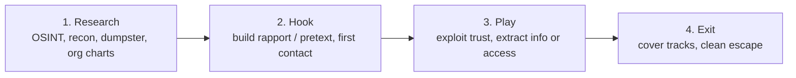

# Module 09 — Social Engineering

> **One-liner:** attacking the human instead of the host — the art of manipulating people into revealing information or performing actions that break security. No exploit, no patch: the "vulnerability" is trust, and the exam tests the taxonomy of techniques hard. For a PAM practitioner this is the module that explains *why the help desk is your soft underbelly*.

> ⚠️ **SAFETY / LEGAL:** Run phishing simulations and pretext calls **only inside your own lab, against your own test accounts**. Sending a phish, cloning a login page, or pretexting a real person or third-party org — even "to prove a point" — is illegal (fraud/unauthorized access) and unethical without written authorization and scope. Every command below targets lab accounts you created.

> **📚 Study companions:** [Facts sheet](facts.md) · [Practice questions](practice-questions.md) · [Flashcards (Anki)](flashcards.csv) · [Lab walkthrough](lab-walkthrough.md)

## Exam focus

- The **three delivery vectors**: **human-based**, **computer-based**, and **mobile-based** — and which technique goes in which bucket.
- The **phishing family** and how to tell members apart: phishing, **spear-phishing** (targeted), **whaling** (executives), **vishing** (voice), **smishing** (SMS), **pharming** (DNS/hosts redirection).
- **Human-based techniques**: pretexting, baiting, quid pro quo, tailgating vs. piggybacking, impersonation, dumpster diving, shoulder surfing, eavesdropping, reverse social engineering.
- **Insider threats** (malicious, negligent, compromised) and why they defeat perimeter controls.
- The **social engineering attack lifecycle** (Research → Hook → Play → Exit).
- Tool→purpose: **SET**, **Gophish**, **King Phisher** — what each is for.
- Countermeasures, especially **phishing-resistant MFA** and **identity verification for privileged resets**.

## Key concepts

### The three vectors (classic "which type is this?" table)

| Vector | Definition | Techniques it covers |
|---|---|---|
| **Human-based** | Person-to-person deception | Impersonation, pretexting, tailgating, shoulder surfing, dumpster diving, quid pro quo, eavesdropping, reverse SE |
| **Computer-based** | Software/web/email lures | Phishing, spear-phishing, whaling, pharming, pop-ups, scareware, fake sites |
| **Mobile-based** | Apps and phone messaging | Malicious apps, repackaged apps, smishing, fake security apps, SMS/QR lures |

> Note: **vishing** (voice) is usually classed **computer/telephony-based** but is often grouped with mobile; **smishing** (SMS) is **mobile-based**. CEH wants you to match the channel to the term.

### The phishing family — tell them apart by *target* and *channel*

| Term | Channel | Target / twist |
|---|---|---|
| Phishing | Email/web | Broad, untargeted "spray" |
| **Spear-phishing** | Email | *Specific* individual/group, personalized |
| **Whaling** | Email | *Executives / high-value* ("big fish") |
| **Vishing** | Voice call | Verbal pretext ("this is IT support…") |
| **Smishing** | SMS text | Malicious link/number via text |
| **Pharming** | DNS / hosts file | Redirects a *correct* URL to a fake site |
| Angler | Social media | Fake support account hijacks a complaint |

Mnemonic: **spear** = one target, **whale** = one *big* target, **v**ishing = **v**oice, **sm**ishing = **SM**S, **pharming** = **poisoned name resolution** (no click on a bad link needed — the right address goes to the wrong place).

### Human-based techniques (know the exact distinctions)

| Technique | What it is | Exam trap |
|---|---|---|
| **Pretexting** | Inventing a scenario/role to gain trust | The *story*, not the delivery |
| **Baiting** | Leaving malware bait (USB drop, "free" download) | Relies on victim *curiosity/greed* |
| **Quid pro quo** | Offers a *service in exchange* (fake IT help) | "Something for something" |
| **Tailgating** | Following an authorized person through a door (they don't know) | *No consent* from the badge-holder |
| **Piggybacking** | Authorized person *knowingly* lets you in ("hold the door") | *With consent/awareness* |
| **Impersonation** | Pretending to be staff, vendor, exec, delivery | Often combined with pretexting |
| **Dumpster diving** | Recovering info from discarded trash | Physical, non-electronic |
| **Shoulder surfing** | Watching someone type/read | Passwords, PINs, screens |
| **Eavesdropping** | Overhearing conversations/comms | Passive |
| **Reverse SE** | Attacker gets victim to *ask them* for help | Victim initiates contact |

### Insider threats

| Type | Motivation | Example |
|---|---|---|
| **Malicious** | Revenge, greed, espionage | Disgruntled admin exfiltrates data |
| **Negligent** | Carelessness, convenience | Reuses passwords, clicks phish |
| **Compromised** | Account taken over via SE | Phished user becomes the attacker's tool |
| **Professional / mole** | Planted for espionage | Long-game infiltration |

Insider threats sidestep the perimeter entirely — which is why **least privilege and privileged-session monitoring** (your world) matter more than the firewall here.

### The social engineering attack lifecycle



Also phrased by EC-Council as **Research target → Select victim → Develop relationship → Exploit**.

## Key tools

| Tool | Purpose | Reference |
|---|---|---|
| Social-Engineer Toolkit (SET) | Framework: credential-harvester clone pages, mass mailer, payloads | https://github.com/trustedsec/social-engineer-toolkit |
| Gophish | Self-hosted phishing *campaign* platform (templates, tracking, reporting) | https://github.com/gophish/gophish |
| King Phisher | Phishing campaign toolkit with template server & metrics | https://github.com/rsmusllp/king-phisher |
| Maltego / theHarvester | OSINT for the Research phase (emails, names, infra) | https://github.com/laramies/theHarvester |

## Commands & techniques (lab-ready)

> ⚠️ **Targets = lab test accounts only.** Create disposable users (e.g. `alice@ceh.lab`, `bob@ceh.lab`) on your own mail/AD lab. Never point a campaign at a real inbox, a coworker, or an external domain.

```bash
# --- SET: launch the menu-driven framework (lab only) ---
sudo setoolkit
#   1) Social-Engineering Attacks
#     2) Website Attack Vectors
#       3) Credential Harvester Attack Method
#         2) Site Cloner   -> clone a LOGIN page you host in the lab
#   POST-back captures creds from your OWN test user hitting your OWN clone.

# --- Gophish: run a self-contained campaign server in the lab ---
./gophish                     # admin UI on https://127.0.0.1:3333, phish server :80
#   In the UI: Sending Profile (your lab SMTP) -> Email Template ->
#   Landing Page (clone) -> Users&Groups (ONLY alice@ceh.lab, bob@ceh.lab) -> Campaign
#   Watch opens / clicks / submitted-data in real time.

# --- OSINT for the Research phase (public data on a domain YOU own) ---
theHarvester -d ceh.lab -b bing        # emails/subdomains that leak from public sources

# --- Simulated pretext payload delivery (lab file share) ---
#   Baiting concept: a document that beacons back when opened, staged on YOUR share.
#   (Track engagement metrics; never weaponize against real users.)
```

Concept-only (name recognition for the exam, no execution needed): **phishing kits**, **BeEF** (browser hooking), **evilginx**-style reverse proxies for MFA-phishing/token theft.

## Lab exercise

1. **Stand up Gophish** on your workstation. Create two lab-only recipients (`alice@ceh.lab`, `bob@ceh.lab`) on your test mail server.
2. **Build a spear-phish**: an "IT password expiry" email + a cloned login **landing page**. Send the campaign to your two test accounts *only*.
3. Log in as `alice`, click the link, and submit a fake password. Watch Gophish record **open → click → submitted data**.
4. **Now apply the control:** enable **FIDO2/WebAuthn** (or a TOTP step) on the test accounts. Re-run: the harvested password alone no longer grants access — phishing-resistant MFA breaks the "play."
5. **Help-desk drill:** script a **vishing** call to your own lab help-desk runbook asking for a *privileged* password reset. Confirm your verification workflow (callback, ticket, secondary factor) refuses the reset without proof of identity.

**What you should observe:** the credential harvest *always* succeeds — humans click. The attack only becomes a *loss* when the stolen secret is worthless (phishing-resistant MFA) and when privileged resets require **out-of-band identity proofing** that a pretext can't satisfy.

## Defender & PAM mapping

| Attack | Detection signal | Control / PAM lever |
|---|---|---|
| Phishing / spear-phishing / whaling | Reported emails, mail-gateway hits, click telemetry, impossible-travel logon after credential entry | **Phishing-resistant MFA (FIDO2/WebAuthn)**, mail filtering + DMARC/DKIM/SPF, user reporting button, awareness training |
| Vishing / help-desk pretext for privileged reset | Reset requests out of normal pattern, no ticket, urgency/pressure | **Strict help-desk identity verification** for privileged accounts (callback, secondary factor, manager approval), PAM-brokered break-glass with logging |
| Baiting (USB drop) / malicious attachment | New USB device events, EDR execution alerts, macro/beacon telemetry | Device-control policy, ASR rules, least privilege so payload runs as a *low* user with nowhere to go |
| Tailgating / piggybacking / impersonation | Physical access logs, badge anomalies, visitor-log gaps | Mantraps/badge-in-badge-out, escort policy, no shared credentials, no standing local admin on shared kiosks |
| Pharming | DNS answers not matching authoritative, altered hosts file, cert warnings | DNSSEC, protected/monitored resolvers, HSTS, file-integrity monitoring on `hosts` |
| Insider / compromised account | Access to resources outside role, off-hours privileged use, session-recording anomalies | **Least privilege + JIT**, privileged session recording, UEBA, segregation of duties, approval workflows |
| Dumpster diving / shoulder surfing | (Pre-incident, physical) | Shredding/media-sanitization policy, clean-desk, privacy screens, no credential printouts |

> **PAM playbook for this module:** you can't patch a human, so you *shrink the blast radius* and *raise the proof bar*. (1) Make stolen passwords useless with **phishing-resistant MFA**. (2) Treat **privileged password resets** as high-assurance events requiring out-of-band identity verification and approval — the help desk is a top target precisely because it can hand over Tier 0. (3) **Least privilege + JIT** means a phished user reaches almost nothing standing. (4) **Session recording** turns a compromised insider into a *detected* one. Mapping lives in [`../../defender-pam/`](../../defender-pam/).

### 🔐 PAM engineering deep-dive (CyberArk)

Social engineering steals *credentials*; PAM makes the stolen credential worthless. If privilege is JIT and MFA is phishing-resistant, a phished admin password unlocks nothing standing.

| This module's attack | CyberArk control | Component |
|---|---|---|
| Phishing / credential theft | Adaptive, phishing-resistant, step-up MFA | CyberArk Identity |
| Phished user holds standing admin | JIT elevation — nothing durable to abuse | DPA / PVWA approval |
| Vendor / third-party spear-phish | VPN-less access with mobile biometric MFA | Remote Access |
| Malicious attachment executed | Application control blocks execution | EPM |

**Detection (privileged lens):** impossible-travel, MFA fatigue / push-bombing, first-time privileged access — see [`../../defender-pam/detection-engineering.md`](../../defender-pam/detection-engineering.md).

**Engineering note:** enforce **number-matching MFA** at PVWA and require **approval + time-box** on sensitive Safes; the phished credential then needs a human approval it can't produce.

> Go deeper: [identity attack paths](../../defender-pam/identity-attack-paths.md) · [CyberArk mapping](../../defender-pam/cyberark-attack-mapping.md)

## Exam tips & gotchas

- **Tailgating vs. piggybacking:** tailgating = *without* the authorized person's knowledge; piggybacking = *with* their consent ("hold the door"). This exact distinction is a favorite.
- **Whaling ⊂ spear-phishing** — whaling is spear-phishing aimed specifically at **executives/high-value** targets.
- **Pharming ≠ phishing:** pharming redirects a *legitimate* URL via **DNS/hosts poisoning** — the victim types the right address and lands on a fake site; no malicious link click required.
- **Quid pro quo vs. baiting:** quid pro quo = attacker *offers a service* in return ("free IT help"); baiting = *dangling an item* the victim takes (USB/free download). Both trade on desire, but quid pro quo is a *transaction*.
- **Reverse social engineering:** the *victim* initiates contact and asks the attacker for help — attacker seeds the problem, advertises the fix.
- **Vishing = voice, smishing = SMS.** Don't swap them.
- The **best countermeasure** to social engineering on exam questions is almost always **user awareness/training** plus **MFA** — technology alone never fully solves a human-trust attack.
- Insider threats **bypass the perimeter** — the "answer" is monitoring, least privilege, and separation of duties, not a firewall.

## Sources

- Social-Engineer Toolkit (TrustedSec) — https://github.com/trustedsec/social-engineer-toolkit
- Gophish — https://github.com/gophish/gophish
- King Phisher — https://github.com/rsmusllp/king-phisher
- MITRE ATT&CK: Phishing (T1566) — https://attack.mitre.org/techniques/T1566/
- MITRE ATT&CK: Phishing for Information (T1598) — https://attack.mitre.org/techniques/T1598/
- CISA: Avoiding Social Engineering and Phishing Attacks — https://www.cisa.gov/news-events/news/avoiding-social-engineering-and-phishing-attacks
- Microsoft: Phishing-resistant MFA (FIDO2/passkeys) — https://learn.microsoft.com/en-us/entra/identity/authentication/concept-authentication-passwordless

---
### 📝 My lab log (fill in)
| Date | Target | Command | Result / notes |
|---|---|---|---|
|  |  |  |  |
