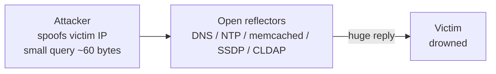

# Module 10 — Denial-of-Service

> **One-liner:** attacks that deny *availability* — the "A" in the CIA triad — by exhausting bandwidth, connection state, or application resources. The exam tests the **taxonomy** (volumetric / protocol / application-layer), the named classic attacks, and how amplification/reflection multiplies a botnet's firepower. For a sysadmin, the sharpest angle is: *if the admin plane goes down, can you still recover?*

> ⚠️ **SAFETY / LEGAL:** DoS/DDoS against any system you do not own is a **crime** (CFAA / Computer Misuse Act equivalents) — no exceptions, no "just testing." Flooding tools also disrupt *shared* infrastructure, so run everything **only against a dedicated lab target on the isolated `192.168.56.0/24` segment or a localhost container you can afford to crash**. Never point these at the internet, a cloud VM, a home router, or a third party. Stress-test tools like LOIC/HOIC are named here for **recognition only** — do not download or fire them at anything you don't own.

## Exam focus

- The **three DoS categories**: **volumetric** (bandwidth), **protocol/state** (connection tables), **application-layer** (L7 resource exhaustion).
- **Named attacks** and their layer: SYN flood, UDP flood, ICMP flood, **Smurf**, **Ping of Death**, **Teardrop**, **Slowloris**, HTTP flood/GET-POST.
- **Amplification / reflection**: DNS, NTP (`monlist`), memcached, SSDP — and why the **amplification factor** matters.
- **DoS vs. DDoS vs. DRDoS** (distributed reflection) and the role of **botnets / C2**.
- **Permanent DoS (PDoS / "phlashing")** — bricking firmware/hardware.
- Countermeasures: SYN cookies, rate limiting, blackhole/sinkhole routing, anycast, CDN/scrubbing.
- Tool→purpose recognition (**hping3**, Slowloris, LOIC/HOIC).

## Key concepts

### The three categories (the core exam table)

| Category | Exhausts | Measured in | Example attacks |
|---|---|---|---|
| **Volumetric** | Link bandwidth | bits/sec (bps) | UDP flood, ICMP flood, **DNS/NTP/memcached amplification** |
| **Protocol / state** | Connection tables, OS/network-gear state | packets/sec (pps) | **SYN flood**, Ping of Death, Teardrop, Smurf, fragmentation |
| **Application-layer (L7)** | Server CPU/RAM/threads/DB | requests/sec (rps) | **Slowloris**, HTTP GET/POST flood, Slow POST (R-U-Dead-Yet) |

Rule of thumb: **volumetric = fill the pipe**, **protocol = fill the table**, **application = tie up the app**. Application-layer attacks are dangerous because *low* traffic can exhaust a server (Slowloris needs almost no bandwidth).

### Named classic attacks (know the mechanism)

| Attack | Layer | Mechanism | Modern status |
|---|---|---|---|
| **SYN flood** | Protocol (L4) | Half-open TCP: send SYNs, never ACK, exhaust backlog | Mitigated by **SYN cookies** |
| **UDP flood** | Volumetric | Blast UDP to random ports; host replies ICMP unreachable | Rate-limit / drop |
| **ICMP flood** | Volumetric | Ping flood saturating bandwidth | Rate-limit ICMP |
| **Smurf** | Volumetric (reflect) | Spoofed ICMP to a **broadcast** address; all hosts reply to victim | Dead (no directed broadcast) |
| **Fraggle** | Volumetric (reflect) | Smurf but with **UDP** (echo/chargen) to broadcast | Dead |
| **Ping of Death** | Protocol | Oversized/fragmented ICMP > 65,535 bytes crashes stack | Patched in modern OSes |
| **Teardrop** | Protocol | Overlapping IP **fragment offsets** crash reassembly | Patched |
| **Slowloris** | Application (L7) | Opens many connections, sends **partial** HTTP headers slowly, holds sockets open | **Connection/time limits**, reverse proxy |
| **HTTP flood** | Application (L7) | Flood of *valid* GET/POST requests, hard to distinguish from users | WAF, rate limit, CAPTCHA |

### Amplification & reflection (DRDoS)

**Reflection** = spoof the victim's IP as source, send small queries to open servers → replies go to the victim. **Amplification** = pick a protocol where the *reply is much bigger than the request*.



| Protocol | Trigger | Approx amplification factor* |
|---|---|---|
| **DNS** | ANY / large TXT response | ~28–54× |
| **NTP** | `monlist` command | ~500× |
| **SSDP** | UPnP discovery | ~30× |
| **memcached** | UDP :11211 stats/get | ~10,000–51,000× (record-setting) |

\*Factors are the commonly cited *orders of magnitude* — memorize the *ranking* (memcached ≫ NTP ≫ DNS ≫ SSDP), not exact numbers.

### DoS vs. DDoS vs. botnets

| Term | Sources | Notes |
|---|---|---|
| **DoS** | Single source | Easier to block by IP |
| **DDoS** | Many sources (botnet) | Distributed → can't just block one IP |
| **DRDoS** | Reflectors (spoofed) | True origin hidden behind reflectors |
| **Botnet** | Compromised hosts + **C2** | Bot herder commands zombies (e.g. Mirai-style IoT) |
| **PDoS / phlashing** | — | *Permanent* DoS: corrupt firmware / brick hardware ("BrickerBot") |

## Key tools

| Tool | Purpose | Reference |
|---|---|---|
| hping3 | Crafted TCP/UDP/ICMP packet generator — SYN floods, custom flags (lab testing) | https://github.com/antirez/hping |
| Slowloris (script) | Low-bandwidth L7 connection-exhaustion PoC | https://github.com/gkbrk/slowloris |
| hping3 / nping | Rate and flag control for protocol tests | https://nmap.org/nping/ |
| LOIC / HOIC | *Name-recognition only* — historic volumetric stress cannons | (do not deploy) |

## Commands & techniques (lab-ready)

> ⚠️ **Only against a disposable lab target you own** (e.g. a throwaway `192.168.56.x` VM or a localhost container). These can crash the target — that is the point, so pick something you can rebuild. Never test bandwidth exhaustion on shared/prod links.

```bash
# --- SYN flood against a lab VM (protocol/state exhaustion) ---
# -S SYN, -p 80 port, --flood as fast as possible, --rand-source spoof sources
sudo hping3 -S -p 80 --flood --rand-source 192.168.56.20

# --- UDP flood (volumetric) against a lab target ---
sudo hping3 --udp -p 53 --flood 192.168.56.20

# --- ICMP flood (volumetric) ---
sudo hping3 -1 --flood 192.168.56.20

# --- Slowloris-style L7 exhaustion against a lab web container ---
# Holds hundreds of half-open HTTP connections with partial headers.
slowloris 127.0.0.1 -p 8081 -s 500      # DVWA in the docker range

# --- Observe the effect (run on/against the target, second terminal) ---
ss -s                                    # socket summary: watch SYN-RECV / connections climb
watch -n1 'ss -ant state syn-recv | wc -l'   # count half-open connections
```

For **defenders**, the same box is where you enable the control:

```bash
# Enable Linux SYN cookies (mitigates SYN floods without growing the backlog)
sudo sysctl -w net.ipv4.tcp_syncookies=1

# Rate-limit new connections per source (nftables/iptables example)
sudo iptables -A INPUT -p tcp --dport 80 -m connlimit --connlimit-above 50 -j DROP
```

## Lab exercise

1. **Baseline:** from Kali, load a lab web container (DVWA `127.0.0.1:8081`) in a browser — note it responds instantly. On the target, run `ss -s` to record normal socket counts.
2. **Protocol attack:** launch the **SYN flood** against a disposable `192.168.56.x` VM. On the target watch `ss -ant state syn-recv | wc -l` climb and the service become unresponsive.
3. **Apply the control:** set `net.ipv4.tcp_syncookies=1` and re-test — the backlog stops overflowing and the service survives. **You just demonstrated SYN cookies.**
4. **Application attack:** run **Slowloris** against the web container with a low connection count; note how *little* bandwidth it uses to hang the server. Put a reverse proxy / connection timeout in front and watch it shrug the attack off.
5. **Recovery drill (PAM angle):** while the target is "down," try to reach it via its **out-of-band/management path** (separate admin interface / console). Confirm you can still administer it when the data-plane is saturated.

**What you should observe:** each attack maps to a specific resource — pipe, table, or app — and each has a matching control that turns the outage back into uptime. The management-plane test proves *why* admin access must not share fate with the service under attack.

## Defender & PAM mapping

| Attack | Detection signal | Control / PAM lever |
|---|---|---|
| SYN flood | Spike in SYN-RECV / half-open connections, backlog drops | **SYN cookies**, connection rate limiting, upstream filtering |
| UDP / ICMP flood | Bandwidth saturation, high pps of small packets, ICMP-unreachable storms | Rate limiting, ingress ACLs, drop unused UDP, upstream **scrubbing** |
| Amplification / reflection (DNS/NTP/memcached/SSDP) | Large replies to spoofed victim, traffic from open resolvers/servers | **BCP38 anti-spoofing (uRPF)**, close/patch open reflectors, disable NTP `monlist` & memcached UDP, response-rate limiting |
| DDoS / botnet volumetric | Traffic from thousands of sources, geo/ASN anomalies | **Anycast**, **CDN / cloud scrubbing service**, remotely-triggered **blackhole (RTBH)** / sinkhole |
| Application-layer (Slowloris / HTTP flood) | Many slow/half-open HTTP connections, high rps from few IPs, low bandwidth | Reverse proxy + **connection/time-outs**, WAF, per-IP request limits, CAPTCHA |
| Permanent DoS (phlashing) | Firmware integrity failures, bricked devices | Signed firmware, mgmt-network isolation, least-privilege device admin |
| Admin-plane starvation (collateral) | Loss of SSH/RDP/console during a flood | **Out-of-band management**, dedicated mgmt VLAN, protected/hardened **jump hosts**, QoS priority for admin traffic |

> **PAM playbook for this module:** DoS is an *availability* attack, so the PAM concern is **can you still administer and recover while the service is under fire?** (1) Keep the **admin plane out-of-band** — a separate management network/VLAN so a saturated data-plane never starves SSH/RDP/console. (2) **Harden and protect jump hosts / PAM proxies** — they are single points that must survive, so give them QoS priority, rate limiting, and no exposure to the flooded segment. (3) Maintain **break-glass access** that works when normal auth infrastructure is degraded. (4) Push volumetric mitigation **upstream** (CDN/anycast/scrubbing) because you can't absorb a botnet at the host. Mapping lives in [`../../defender-pam/`](../../defender-pam/).

### 🔐 PAM engineering deep-dive (CyberArk)

The PAM angle on DoS is inward-facing: your control plane must not be a single point of failure, and you need a way to work when it's down without abandoning the controls.

| This module's attack | CyberArk control | Component |
|---|---|---|
| DoS against the PAM control plane | Clustered + DR + distributed (satellite) vaults | Vault HA/DR architecture |
| Session broker becomes a bottleneck / SPOF | Load-balanced PSM farm | PSM |
| PAM unavailable mid-incident | Documented, sealed, monitored emergency access | Break-glass procedure |

**Detection (privileged lens):** availability + latency monitoring on Vault/PVWA/PSM, and a **high-priority alert on any break-glass retrieval** — see [`../../defender-pam/detection-engineering.md`](../../defender-pam/detection-engineering.md).

**Engineering note:** design the Vault for HA/DR and keep an offline break-glass path with dual-control retrieval, so a DoS on PAM never pressures admins back into direct, unbrokered access.

> Go deeper: [PAM architecture — break-glass & availability](../../defender-pam/pam-architecture.md)

## Exam tips & gotchas

- **Match attack → category:** SYN flood = **protocol/state**; UDP/ICMP/amplification = **volumetric**; Slowloris/HTTP flood = **application-layer**. This mapping is the single most-tested thing here.
- **Slowloris is *low-bandwidth*** — it wins by holding connections open with partial requests, not by flooding. If a question stresses "minimal bandwidth" or "incomplete HTTP headers," it's Slowloris.
- **Smurf vs. Fraggle:** Smurf = **ICMP** to broadcast; Fraggle = **UDP** (echo/chargen) to broadcast. Both are *reflection* via directed broadcast (now disabled by default).
- **Ping of Death vs. Teardrop:** PoD = **oversized** ping (>65,535 bytes); Teardrop = **overlapping fragment offsets**. Both are legacy/patched.
- **Amplification ranking:** **memcached ≫ NTP ≫ DNS ≫ SSDP.** NTP's trigger is **`monlist`**; memcached is UDP **:11211**.
- **DDoS can't be stopped by blocking one IP** (many sources); **DRDoS** hides the real origin behind reflectors via **source-IP spoofing** — the fix is anti-spoofing (**BCP38/uRPF**) at the network edge.
- **PDoS/phlashing = permanent** (bricking hardware/firmware), not just a temporary outage.
- **SYN cookies** defend SYN floods **without enlarging the backlog** — that's the mechanism they want.

## Sources

- hping — https://github.com/antirez/hping
- nping (Nmap) — https://nmap.org/nping/
- Slowloris (reference implementation) — https://github.com/gkbrk/slowloris
- MITRE ATT&CK: Network Denial of Service (T1498) — https://attack.mitre.org/techniques/T1498/
- MITRE ATT&CK: Endpoint Denial of Service (T1499) — https://attack.mitre.org/techniques/T1499/
- CISA: Understanding Denial-of-Service Attacks — https://www.cisa.gov/news-events/news/understanding-denial-service-attacks
- CISA: UDP-Based Amplification Attacks (AA14-017A) — https://www.cisa.gov/news-events/alerts/2014/01/17/udp-based-amplification-attacks
- IETF BCP 38 (Network Ingress Filtering) — https://www.rfc-editor.org/info/bcp38

---
### 📝 My lab log (fill in)
| Date | Target | Command | Result / notes |
|---|---|---|---|
|  |  |  |  |
