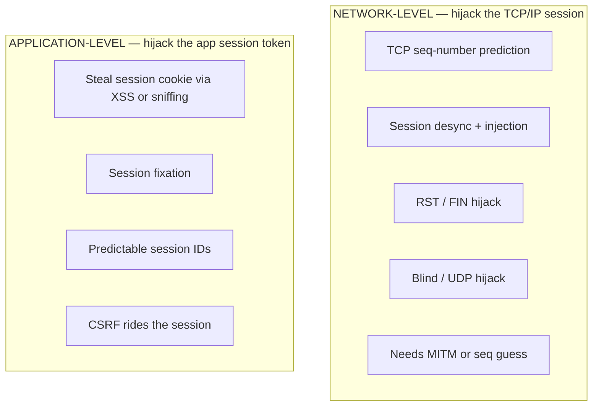

# Module 11 — Session Hijacking

> **One-liner:** stealing or riding an *already-authenticated* session so you skip the login entirely — the attacker becomes the user without ever knowing the password. The exam splits this into **network-level** (TCP/packet layer) and **application-level** (session tokens/cookies), and wants you to know the mechanism of each. For a PAM practitioner this is the module that justifies **session brokering, recording, and step-up re-authentication**.

## Exam focus

- **Network-level vs. application-level** hijacking — the primary dividing line.
- **Network-level**: TCP **three-way handshake** and **sequence-number prediction**, session **desynchronization**, **RST hijacking**, **blind** vs. non-blind hijacking, **UDP** hijacking, IP spoofing.
- **Application-level**: session **token theft** (via XSS/sniffing), **session fixation**, **sidejacking** (cookie theft on the wire), and how **CSRF** relates (rides a session without stealing the token).
- **Predictable / weak session IDs** and why entropy + rotation matter.
- **Man-in-the-Middle (MITM)** as the enabling position (ARP/DNS spoofing → intercept).
- **Active vs. passive** hijacking (take over vs. observe).
- Tool→purpose: **Burp Suite**, **Wireshark**, **ettercap**, **bettercap**.
- Countermeasures: **TLS everywhere**, cookie flags (**Secure / HttpOnly / SameSite**), token rotation on privilege change, short timeouts.

## Key concepts

### The two levels (the core exam split)



### Network-level techniques

| Technique | Mechanism | Key point |
|---|---|---|
| **TCP sequence prediction** | Guess/observe the next SEQ/ACK numbers to inject packets as the client | Modern OSes randomize ISN → hard blind |
| **Session desynchronization** | Force client & server SEQ numbers out of sync, then inject your own packets | Attacker's packets accepted, real client's dropped |
| **RST hijacking** | Send a forged **RST** with the right SEQ to tear down a peer's connection | Also a DoS building block |
| **Blind hijacking** | Attacker **can't see** responses (off-path) → must *predict* SEQ | Harder; contrast with non-blind (MITM sees traffic) |
| **UDP hijacking** | No handshake/SEQ — just race a spoofed reply before the server's | Easier than TCP; connectionless |
| **IP spoofing** | Forge source IP to impersonate the client | Prerequisite for many of the above |

The TCP three-way handshake you're abusing: `SYN → SYN/ACK → ACK`. Hijacking = injecting into an **established** session by getting the **SEQ/ACK numbers right**.

### Application-level techniques

| Technique | Mechanism | Distinguisher |
|---|---|---|
| **Session token theft (sniffing/sidejacking)** | Capture the session cookie off an **unencrypted** or downgraded link (e.g. HTTP after HTTPS login) | Classic "Firesheep" scenario; **TLS everywhere** kills it |
| **XSS cookie theft** | Inject script that reads `document.cookie` and exfiltrates it | **HttpOnly** flag blocks script access |
| **Session fixation** | Attacker *sets/knows* the victim's session ID **before** login, victim authenticates it, attacker reuses it | Fix: **regenerate the session ID on login/privilege change** |
| **Predictable session IDs** | IDs are sequential/low-entropy → attacker guesses a valid one | Fix: long, random, high-entropy tokens |
| **CSRF (related, not identical)** | Forces the victim's browser to send an authenticated request; attacker **never sees** the token | Rides the session; fix = anti-CSRF tokens + **SameSite** |

> **Fixation vs. theft — the classic trap:** in **fixation** the attacker supplies the session ID *up front* and waits for the victim to authenticate it; in **theft** the attacker *captures* an ID the victim already has. Fixation is defeated by **rotating the session ID at authentication**.

### MITM: the enabling position

Most network-level and sidejacking attacks need the attacker **in the path**. Common ways to get there in a LAN: **ARP spoofing/poisoning**, **DNS spoofing**, rogue AP. Once MITM, the attacker can sniff tokens, inject packets, or strip TLS (**SSL stripping**, defeated by **HSTS**).

### Active vs. passive

- **Passive** = watch/record the session (steal the token, replay later).
- **Active** = take over the live session, push the legitimate user out (desync/RST).

## Key tools

| Tool | Purpose | Reference |
|---|---|---|
| Burp Suite | Intercept/modify HTTP, inspect & replay session tokens, test fixation | https://portswigger.net/burp |
| Wireshark | Sniff traffic, follow TCP streams, observe cookies/SEQ numbers | https://www.wireshark.org/ |
| ettercap | ARP poisoning / MITM framework for LAN interception | https://www.ettercap-project.org/ |
| bettercap | Modern MITM: ARP/DNS spoof, sniff, HTTP(S) proxy, caplets | https://www.bettercap.org/ |

## Commands & techniques (lab-ready)

> Run only against your own lab web apps (DVWA `localhost:8081`, Juice Shop `localhost:8082`) and the `192.168.56.0/24` VMs. Intercepting sessions you don't own is unauthorized access.

```bash
# --- Observe a session cookie in cleartext (app-level, sniffing) ---
# Capture HTTP to a lab web app and follow the stream to see the Cookie header.
sudo tcpdump -i any -A 'tcp port 8081' | grep -i 'Cookie:'
#   In Wireshark: Follow > HTTP Stream to read Set-Cookie / Cookie (PHPSESSID, etc.)

# --- MITM a lab segment with bettercap (get in the path) ---
sudo bettercap -iface eth0
#   > net.probe on
#   > set arp.spoof.targets 192.168.56.20
#   > arp.spoof on
#   > net.sniff on            # now you can observe tokens crossing the wire

# --- ettercap equivalent ARP-poison MITM (lab only) ---
sudo ettercap -T -q -i eth0 -M arp:remote /192.168.56.20// /192.168.56.1//

# --- RST-hijack / injection primitives (concept demo on a lab flow) ---
# Forge a TCP RST with a plausible sequence number to tear a peer's session.
sudo hping3 -R -p 80 -s 12345 -M <SEQ> 192.168.56.20
```

**Application-level, via Burp (no packet crafting):**

```
1. Proxy the browser through Burp. Log into DVWA as one user.
2. In HTTP History, copy the PHPSESSID / session cookie value.
3. In a *second* browser/incognito, set that same cookie value (Burp Repeater or
   a cookie editor) and load an authenticated page — you're now riding the session.
4. Session fixation test: set a KNOWN session ID before login, log in, then check
   with Burp whether the app REUSED it (vulnerable) or ISSUED A NEW one (fixed).
```

## Lab exercise

1. **Token theft (app-level):** log into **DVWA** (`localhost:8081`). In Burp, grab the `PHPSESSID`. Paste it into a fresh incognito session and confirm you land in the account **without logging in**. That cookie *is* the identity.
2. **See why HttpOnly matters:** use DVWA's stored-XSS page to attempt `document.cookie` exfiltration. Then set the cookie to **HttpOnly** and observe the script can no longer read it.
3. **Session fixation:** on **Juice Shop** (`localhost:8082`) or DVWA, force a known session ID before authenticating, log in, and check with Burp whether the ID **rotated**. A fixed app reuses it; a hardened app regenerates it.
4. **Network-level MITM (VM segment):** ARP-poison between two lab VMs with **bettercap**, sniff a cleartext session, then enable **TLS** on the service and watch the token disappear from the capture.
5. **PAM control demo:** in front of a lab admin app, require **step-up re-authentication** for a "sensitive" action. Confirm that even with a stolen session cookie, the sensitive action **prompts for re-auth** and the hijack stalls.

**What you should observe:** an authenticated **token is a bearer credential** — whoever holds it *is* the user. Every defense works by making the token (a) unreadable on the wire (**TLS**), (b) unreadable by script (**HttpOnly**), (c) not attacker-settable (**rotate on login**), (d) short-lived (**timeouts**), or (e) **insufficient alone** for privileged actions (**step-up re-auth**).

## Defender & PAM mapping

| Attack | Detection signal | Control / PAM lever |
|---|---|---|
| Sidejacking / token sniffing | Cleartext HTTP with cookies, downgrade from HTTPS, same session ID from a new IP/UA | **TLS everywhere + HSTS**, `Secure` cookie flag, alert on session-IP/UA change |
| XSS cookie theft | XSS alerts / WAF, outbound requests carrying `document.cookie` | **HttpOnly** cookies, CSP, input/output encoding |
| Session fixation | Same session ID observed **before and after** login | **Regenerate session ID on authentication and on privilege change** |
| Predictable session IDs | Sequential/low-entropy tokens, guess bursts | Long high-entropy random tokens, server-side session store |
| CSRF riding a session | State-changing requests without anti-CSRF token, cross-site `Referer`/`Origin` | Anti-CSRF tokens, **SameSite** cookies, re-auth on sensitive actions |
| Network-level hijack (seq predict / desync / RST) | TCP SEQ anomalies, RST storms, duplicate/ACK-storm patterns, ARP table changes | Encrypted transport (TLS/SSH/IPsec), **dynamic ARP inspection**, switch port security, IDS |
| MITM (ARP/DNS spoof) | Duplicate MAC for gateway, gratuitous ARP, DNS answer mismatch | DAI, DHCP snooping, DNSSEC, 802.1X, HSTS |
| Stolen **privileged** session | Privileged action from an unexpected client, no recent re-auth, session-recording gaps | **PAM session brokering + recording**, **step-up (re-auth) for sensitive actions**, short **idle timeouts**, bind session to client/MFA |

> **PAM playbook for this module:** a hijack is the attacker inheriting a *live privileged session* — exactly what a PAM broker exists to contain. (1) **Broker and record** privileged sessions so admins never hold a raw reusable token and every action is attributable and replayable. (2) Require **step-up re-authentication** (re-prompt / MFA) for high-impact actions, so a stolen session alone can't approve, delete, or escalate. (3) Enforce **short idle timeouts** and **token rotation on privilege change** so a captured session expires fast and never survives an elevation. (4) **Bind sessions** to client attributes/MFA where possible so a lifted cookie fails from a new context. Mapping lives in [`../../defender-pam/`](../../defender-pam/).

### 🔐 PAM engineering deep-dive (CyberArk)

Session hijacking needs a session token to steal. **PSM** runs the privileged session on the broker, not on the admin's endpoint — so there's no local token to lift, and a suspicious session can be killed in real time.

| This module's attack | CyberArk control | Component |
|---|---|---|
| Session / token theft | Session runs on the broker; no token on endpoint | PSM |
| Hijacked privileged session | Live monitor + suspend + terminate | PSM |
| Web-console / SaaS session theft | Record + protect web sessions | Secure Web Sessions |

**Detection (privileged lens):** PTA "suspicious privileged session," concurrent-session anomalies, session from a new source — see [`../../defender-pam/detection-engineering.md`](../../defender-pam/detection-engineering.md).

**Engineering note:** because the session is isolated on PSM, the admin's browser/RDP client never holds the target credential or a reusable cookie; pair with short TTLs and MFA to shrink any residual window.

> Go deeper: [PAM architecture](../../defender-pam/pam-architecture.md) · [CyberArk mapping](../../defender-pam/cyberark-attack-mapping.md)

## Exam tips & gotchas

- **Network-level vs. application-level** is the dividing line CEH tests first: TCP/SEQ/RST/desync = **network**; cookies/tokens/XSS/fixation = **application**.
- **Session fixation vs. session theft:** fixation = attacker **sets the ID before** login and waits; theft = attacker **captures an existing** ID. Fixation's fix is **rotate the session ID at authentication**.
- **Hijacking ≠ spoofing ≠ replay:** hijacking **takes over an active** session; spoofing forges identity; replay resends captured data. Hijacking rides an *authenticated, live* session — no password needed.
- **HttpOnly** stops **script** (XSS) from reading a cookie; **Secure** stops it traversing **non-TLS**; **SameSite** curbs **CSRF**. Know which flag defeats which attack.
- **Blind vs. non-blind:** blind = attacker is **off-path** and must **predict** SEQ numbers (harder); non-blind = MITM can **see** the traffic.
- **UDP hijacking is easier** than TCP — no handshake or sequence numbers to defeat.
- **CSRF doesn't steal the token** — it makes the victim's browser send an authenticated request; that's why it's *related to* but distinct from session hijacking.
- **RST hijacking** doubles as a DoS primitive (forcibly tears down the connection).

## Sources

- Burp Suite (PortSwigger) — https://portswigger.net/burp
- PortSwigger Web Security Academy: Session management / fixation — https://portswigger.net/web-security/authentication
- OWASP: Session Management Cheat Sheet — https://cheatsheetseries.owasp.org/cheatsheets/Session_Management_Cheat_Sheet.html
- OWASP: Session Fixation — https://owasp.org/www-community/attacks/Session_fixation
- Wireshark — https://www.wireshark.org/
- bettercap — https://www.bettercap.org/
- ettercap — https://www.ettercap-project.org/
- MITRE ATT&CK: Steal Web Session Cookie (T1539) — https://attack.mitre.org/techniques/T1539/
- MITRE ATT&CK: Adversary-in-the-Middle (T1557) — https://attack.mitre.org/techniques/T1557/

---
### 📝 My lab log (fill in)
| Date | Target | Command | Result / notes |
|---|---|---|---|
|  |  |  |  |
