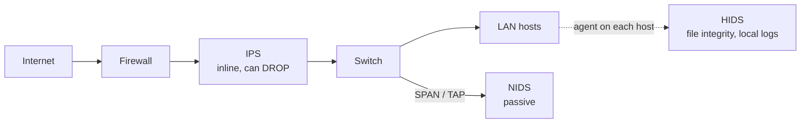
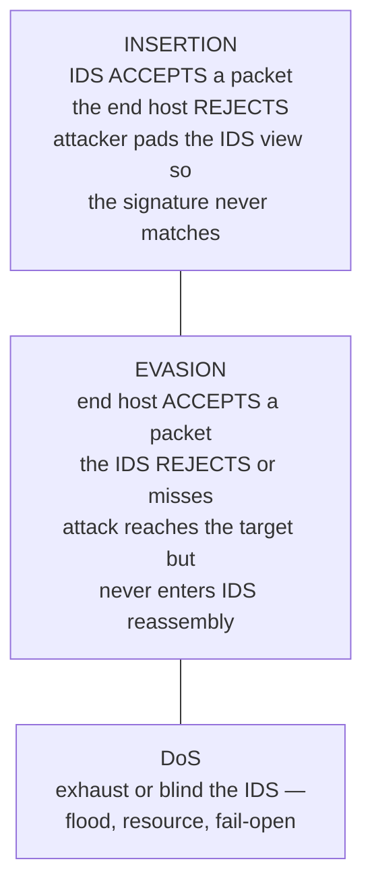

# Module 12 — Evading IDS, Firewalls & Honeypots

> **One-liner:** how attackers slip scans and payloads past the sensors, packet filters, and deception you deploy — and, read the other way, how a defender detects the evasion. As a PAM/sysadmin this is your egress-filtering, jump-host-monitoring, and deception module: almost every evasion trick has a matching log signal or control you already own.

> **📖 Concept page:** [domains/12-evading-ids-firewalls-honeypots.md](../../domains/12-evading-ids-firewalls-honeypots.md) — the source-grounded overview with Mermaid flows and countermeasures.

> **📚 Study companions:** [Facts sheet](facts.md) · [Practice questions](practice-questions.md) · [Flashcards (Anki)](flashcards.csv) · [Lab walkthrough](lab-walkthrough.md)

## Exam focus

- **IDS vs IPS** and **NIDS vs HIDS** — placement (passive tap/SPAN vs inline), what each sees.
- **Detection methods**: signature-based (misuse) vs anomaly-based (behavior) vs stateful protocol analysis — and the false-positive/false-negative trade-off.
- **Firewall types** by OSI layer: packet filter → stateful → circuit-level → application/proxy → NGFW.
- **IDS insertion vs evasion vs DoS** (the Ptacek & Newsham model) — know which is which.
- **Evasion techniques**: fragmentation / session splicing, encoding & obfuscation (Unicode/hex), encryption & **tunneling over HTTP / DNS / ICMP**, decoys, source-port spoofing, source routing, MTU/data-length padding.
- **nmap evasion flags** by symptom (`-f`, `-D`, `-g/--source-port`, `--data-length`, `--scan-delay`, `--spoof-mac`, `--badsum`).
- **Honeypot** taxonomy (low- vs high-interaction; production vs research) and **how attackers detect** them.
- Tool → purpose: Snort/Suricata (detect), nmap/Nessus (evade/scan), honeyd/T-Pot (deceive).

## Key concepts

### IDS / IPS — where they sit and what they do



| Sensor | Scope | Sees | Blocks? |
|---|---|---|---|
| **NIDS** | Network segment | Packets on the wire (needs tap/SPAN) | No (alert only) |
| **HIDS** | Single host | Local logs, FIM, syscalls | No (alert only) |
| **IPS** | Inline | Same as NIDS but in the path | **Yes** (drop/reset) |

### Detection methods (classic exam table)

| Method | How it decides | Strength | Weakness |
|---|---|---|---|
| **Signature / misuse** | Match known-bad patterns | Low false positives on known attacks | Blind to 0-day / novel |
| **Anomaly / behavior** | Deviation from a learned baseline | Can catch unknown attacks | Noisy; false positives; needs training |
| **Stateful protocol analysis** | Compare traffic to protocol RFC/state | Catches protocol abuse | Vendor-defined, heavy |

Alert outcomes to memorize: **true positive** (real attack flagged), **false positive** (benign flagged), **false negative** (real attack *missed* — the dangerous one), **true negative** (benign, quiet).

### Firewall types by layer

| Type | OSI layer | Decides on | Notes |
|---|---|---|---|
| **Packet filter** | 3–4 | IP, port, protocol, flags | Stateless ACLs; no session memory |
| **Stateful inspection** | 3–4 (+state) | Connection state table | Allows return traffic of established flows |
| **Circuit-level gateway** | 5 | TCP handshake / session | SOCKS-style; validates sessions not payload |
| **Application / proxy** | 7 | Full payload, per-protocol | Terminates & re-originates; deep but slow |
| **NGFW** | 3–7 | App-ID, users, IPS, TLS inspect | DPI + IPS + app awareness combined |

Related terms: **bastion host**, **DMZ / screened subnet**, **default-deny** posture.

### Insertion vs Evasion vs DoS (Ptacek & Newsham)



### Evasion techniques

- **Fragmentation / session splicing** — split the payload across many small packets so no single packet matches a signature; the target reassembles it. `whisker`-style splicing for HTTP.
- **Encoding / obfuscation** — URL/Unicode/hex/double-encoding, case randomization, inserting self-referencing dirs (`/./`), polymorphic shellcode.
- **Encryption & tunneling** — carry the attack inside an allowed channel: **HTTP(S) tunneling**, **DNS tunneling** (iodine, dnscat2), **ICMP tunneling** (Loki, ptunnel), SSH tunnels. Signature IDS can't read encrypted payloads.
- **Decoy scans** — mix your real source IP among many spoofed ones so the analyst can't tell who is real.
- **Source-port spoofing** — send from a "trusted" port (53, 80, 443) to slip past sloppy ACLs.
- **Source routing** — dictate the packet's path via IP options to dodge filtering routers.
- **MTU / data-length padding** — odd fragment sizes or appended junk to break length-based signatures.
- **IP spoofing / MAC spoofing**, **proxies / anonymizers** to hide origin.

### Honeypots

| Axis | Options |
|---|---|
| Interaction | **Low** (emulated services — honeyd, Dionaea) vs **High** (real OS/services — honeynet) vs medium |
| Purpose | **Production** (early-warning inside your net) vs **Research** (study attacker TTPs) |
| Special | Tarpit (LaBrea — slows scanners), pure honeypot (full real system) |

**Detecting a honeypot** (what an attacker looks for): unrealistically open/consistent services, canned banners, abnormal latency or tarpit stalling, VM/sandbox artifacts, no real user activity. Tools/names to know: **honeyd**, **T-Pot** (multi-honeypot platform), **Cowrie/Kippo** (SSH), **KFSensor**.

### Evading NAC & endpoint security

- **NAC (Network Access Control)** enforces posture/identity before granting network access (**802.1X**, MAC Authentication Bypass). Evasion: **MAC spoofing** a permitted device, abusing **MAB**, or plugging a rogue device into an authorized port (e.g., behind a VoIP phone).
- **Endpoint security evasion** — blinding/disabling **EDR/AV**: **process injection**, **AMSI bypass**, API **unhooking**, packing/obfuscation, and **living-off-the-land** (LOLBins) to dodge signatures (ties to Module 07).
- **Why it still gets caught:** detection shifts to **behavior** — UEBA/**PTA**, tamper-protected agents, and script-block logging catch what signature evasion slips past.

## Key tools

| Tool | Purpose | Reference |
|---|---|---|
| Snort | Signature NIDS/IPS (sniffer, logger, IDS modes) | https://www.snort.org/ |
| Suricata | Multi-threaded IDS/IPS, EVE JSON, Snort-rule compatible | https://suricata.io/ |
| nmap | Scanner with built-in evasion flags | https://nmap.org/book/man-bypass-firewalls-ids.html |
| Nessus | Vulnerability scanner (evasion/tuning options) | https://www.tenable.com/products/nessus |
| honeyd | Low-interaction honeypot framework | https://github.com/DataSoft/Honeyd |
| T-Pot | All-in-one honeypot platform | https://github.com/telekom-security/tpotce |

## Commands & techniques (lab-ready)

> Run only against your own lab (`192.168.56.0/24`). See [`../../labs/`](../../labs/README.md). The point is to *watch your own Snort/Suricata react*, not to attack anything external.

```bash
# --- nmap evasion flags (from Kali 192.168.56.10 → Metasploitable2) ---
nmap -f 192.168.56.20                       # fragment (8-byte); -ff = 16-byte
nmap --mtu 16 192.168.56.20                 # custom MTU (must be a multiple of 8)
nmap -D RND:5 192.168.56.20                 # 5 random decoy source IPs
nmap -D 192.168.56.31,ME,192.168.56.20 -sS 192.168.56.20   # explicit decoys, ME = you
nmap -g 53 192.168.56.20                    # spoof source port 53 (--source-port)
nmap --data-length 25 192.168.56.20         # append 25 random bytes to each packet
nmap --scan-delay 2s 192.168.56.20          # slow down to dodge rate-based alerts
nmap --spoof-mac 0 192.168.56.20            # random MAC (0=random, or vendor/MAC)
nmap --badsum 192.168.56.20                 # bad TCP checksum (insertion / fw fingerprint)
nmap -T1 192.168.56.20                      # "sneaky" timing template (T0..T5)

# --- run Suricata as IDS on the sniffing host and read alerts ---
sudo suricata -c /etc/suricata/suricata.yaml -i eth0
sudo tail -f /var/log/suricata/eve.json | jq 'select(.event_type=="alert")'
sudo suricata-update && sudo suricatasc -c reload-rules   # refresh rule feeds

# --- run Snort in NIDS/console mode against a config ---
sudo snort -A console -q -c /etc/snort/snort.conf -i eth0
sudo snort -r capture.pcap -c /etc/snort/snort.conf        # replay a pcap offline
```

A minimal local Snort rule to catch a SYN scan — drop it in `local.rules` and watch it fire when you run the nmap above:

```
# rule header (action proto src port -> dst port)  |  options
alert tcp any any -> $HOME_NET any (flags:S; msg:"Possible SYN scan"; \
      detection_filter:track by_src, count 20, seconds 5; sid:1000001; rev:1;)
```

Rule anatomy to memorize: **header** = action · protocol · src IP/port · direction · dst IP/port; **options** = `msg`, `content`, `sid`, `rev`. Snort actions: `alert`, `log`, `pass`, and (inline) `drop`/`reject`.

## Lab exercise

1. **See evasion vs detection side by side.** Start Suricata on your sniffing interface, then from Kali run a plain `nmap -sS 192.168.56.20` and note the alerts. Re-run with `-f -D RND:5 -g 53 --data-length 25 --scan-delay 2s` and compare: which signatures still fire, which go quiet, and how the decoys pollute the source-IP field.
2. **Insertion in action.** Send `nmap --badsum 192.168.56.20`. Confirm the target ignores the packets (no open ports reported) while your sensor may still log them — that gap *is* the insertion concept.
3. **Tunnel past a filter (concept).** On an isolated segment, stand up a DNS tunnel (iodine/dnscat2) between Kali and Metasploitable2 and observe the tell-tale signal: abnormally high volume of long, high-entropy TXT/`A` queries to one domain.
4. **Honeypot fingerprinting.** If you run honeyd or a Cowrie SSH honeypot, connect and look for the artifacts (canned banner, latency, no real filesystem) an attacker would use to spot it.

**What you should observe:** evasion rarely makes an attack *invisible* — it moves the evidence from a payload signature (which you obfuscated) to a **behavioral** one (fragmentation storms, decoy spray, DNS-over-TXT volume, timing). That behavioral tail is exactly what your anomaly rules and egress monitoring should catch.

## Defender & PAM mapping

| Attack | Detection signal | Control / PAM lever |
|---|---|---|
| Fragmentation / session splicing | Reassembly-engine alerts, tiny/overlapping fragments | Force IDS/IPS full reassembly; NGFW normalization; drop overlapping frags |
| Decoy scan (`-D`) | Many "sources" scanning simultaneously, one real | Correlate on the truly connecting host; NetFlow baselining |
| Source-port spoofing (`-g 53/80`) | Inbound "from 53/443" to non-DNS/web hosts | **Default-deny egress + stateful rules** (don't trust source port) |
| HTTP/DNS/ICMP tunneling (C2 exfil) | Long high-entropy DNS TXT, ICMP with payload, beaconing | **Egress filtering**, DNS to approved resolvers only, block outbound ICMP/odd ports from servers |
| MAC/IP spoofing near privileged assets | ARP anomalies, unexpected MAC on switch port | Port security / 802.1X, isolate jump hosts on their own VLAN |
| Evasion aimed at Tier 0 / jump host | Gaps in HIDS/EDR telemetry on admin hosts | HIDS + EDR on **every** PAM jump/bastion host; alert on log-source silence |
| Recon of the environment | First-touch scan pattern, honeypot hits | **Deception around privileged assets** — a honeypot "admin" host/service that no legit user should ever touch = high-fidelity alert |

> **PAM playbook for this module:** put your jump/bastion hosts behind **default-deny egress** so a foothold can't tunnel out over DNS/HTTP/ICMP; run **HIDS/EDR on the admin plane itself** and alert when a sensor goes quiet (blinding is an attack); and use **deception** deliberately — a fake privileged share, service account, or admin host is the cheapest high-fidelity tripwire you can point at Tier 0. Any interaction is malicious by definition.

### 🔐 PAM engineering deep-dive (CyberArk)

Attackers evade *network* IDS by blending into normal traffic — but privileged **behavior** is much harder to fake. PTA is your behavioral layer for the identity plane, and the Vault audit is built to resist the log-clearing these evasion techniques rely on.

| This module's attack | CyberArk control | Component |
|---|---|---|
| Behavioral evasion of signature IDS | Privileged UEBA catches identity anomalies | PTA |
| Log tampering / anti-forensics | Tamper-evident, append-only audit | Digital Vault audit |
| Disabling endpoint security agents | Detect EPM/PSM agent tamper | EPM / PTA |

**Detection (privileged lens):** 1102 (audit log cleared), agent-health gaps, and PTA's Golden Ticket / DCSync / PtH detections that pattern-match what network IDS can't — see [`../../defender-pam/detection-engineering.md`](../../defender-pam/detection-engineering.md).

**Engineering note:** forward Vault + PSM + PTA telemetry to the SIEM so privileged signals sit beside network/endpoint data; an attacker who evades the firewall still trips the behavioral privileged detections.

> Go deeper: [detection engineering](../../defender-pam/detection-engineering.md)

## Exam tips & gotchas

- **IDS = detect/alert, IPS = detect + block inline.** HIDS/NIDS are *detection* tech; only IPS sits in the path and drops.
- **Insertion vs evasion**: *insertion* = IDS accepts what the host rejects (pad the IDS's view); *evasion* = host accepts what the IDS missed. Easy to flip — anchor on "who accepted the packet."
- **False negative** is the dangerous miss (real attack, no alert); **false positive** is noise. Anomaly systems trade more false positives for the chance to catch unknowns.
- **`-D` is decoys, `-S` is a spoofed source, `-g/--source-port` is source-port spoofing, `-f` is fragmentation** — CEH loves the flag→purpose match.
- **`--mtu` must be a multiple of 8.** `-f` ≈ MTU 8, `-ff` ≈ MTU 16.
- **Encryption defeats signature IDS**, not anomaly/flow analysis — tunneling still shows a behavioral shape.
- **Low- vs high-interaction honeypot**: low = *emulated* services (safer, less data), high = *real* systems (richer data, more risk).
- **Proxy/application firewall works at Layer 7**; packet filter at 3–4. Match by layer.

## Sources

- Snort — https://www.snort.org/
- Suricata — https://suricata.io/
- nmap: Firewall/IDS Evasion and Spoofing — https://nmap.org/book/man-bypass-firewalls-ids.html
- Ptacek & Newsham, "Insertion, Evasion, and Denial of Service" — https://insecure.org/stf/secnet_ids/secnet_ids.html
- T-Pot honeypot platform — https://github.com/telekom-security/tpotce
- MITRE ATT&CK: Application Layer Protocol / Exfiltration Over C2 — https://attack.mitre.org/techniques/T1071/

---
### 📝 My lab log (fill in)
| Date | Target | Command | Result / notes |
|---|---|---|---|
|  |  |  |  |
