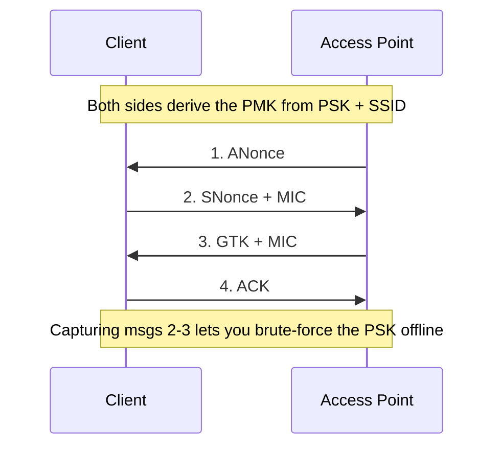

# Module 16 — Hacking Wireless Networks

> **One-liner:** how Wi-Fi authentication and encryption work, where WEP/WPA/WPA2/WPA3 break, and the capture-then-crack workflow with the aircrack-ng suite and hashcat. For a PAM reader the takeaway is blunt: a shared PSK is a shared credential — privileged networks belong on **802.1X/EAP-TLS**, not a passphrase.

> ⚠️ **LEGALITY — read first.** Deauth, handshake capture, PMKID grabbing, evil-twin, and WPS attacks against a network **you do not own or have written authorization to test are illegal** (unauthorized access + interference with radio communications) in essentially every jurisdiction. Every command below is for **your own AP/router and your own client devices**, on an isolated SSID you control. Do not attack a neighbour's, an employer's, or a public network. Monitor-mode/injection also needs a capable adapter — you are transmitting on regulated spectrum.

> **📚 Study companions:** [Facts sheet](facts.md) · [Practice questions](practice-questions.md) · [Flashcards (Anki)](flashcards.csv) · [Lab walkthrough](lab-walkthrough.md)

## Exam focus

- **802.11 standards** (a/b/g/n/ac/ax) — bands, rough max rates, marketing names (Wi-Fi 4/5/6/6E).
- **Encryption evolution**: WEP (RC4 + weak IV) → WPA (TKIP) → WPA2 (CCMP/AES) → WPA3 (SAE).
- **The WPA/WPA2 4-way handshake** and why capturing it enables an *offline* dictionary/brute attack.
- **PMKID attack** — clientless handshake-material capture (no deauth needed) against RSN-PMKID-leaking APs.
- **Attacks**: WEP cracking, handshake capture + crack, PMKID, **evil twin/rogue AP**, **deauth**, **WPS PIN / Pixie-Dust**, and **KRACK** (concept).
- **Tools → purpose**: airmon/airodump/aireplay/aircrack-ng, hashcat `-m 22000`, wifite, reaver/bully, bettercap.
- **Hashcat WPA mode is `22000`** (the combined PBKDF2/PMKID mode that replaced 2500/16800). Memorize this number.
- **Enterprise defense**: WPA2/WPA3-**Enterprise** with 802.1X/RADIUS and certificate auth (EAP-TLS).

## Key concepts

### 802.11 standards (know band + generation name)

| Standard | Wi-Fi name | Band(s) | Approx max PHY rate | Notes |
|---|---|---|---|---|
| 802.11a | — | 5 GHz | 54 Mbps | OFDM |
| 802.11b | — | 2.4 GHz | 11 Mbps | DSSS (legacy) |
| 802.11g | — | 2.4 GHz | 54 Mbps | OFDM, b-compatible |
| 802.11n | Wi-Fi 4 | 2.4 / 5 GHz | ~600 Mbps | MIMO, channel bonding |
| 802.11ac | Wi-Fi 5 | 5 GHz | ~1.3 Gbps+ | MU-MIMO, wider channels |
| 802.11ax | Wi-Fi 6 / 6E | 2.4 / 5 / (6) GHz | multi-Gbps | OFDMA; 6E adds 6 GHz |

### Encryption / auth evolution (the core exam table)

| Protocol | Cipher | Key management | Fatal / notable weakness |
|---|---|---|---|
| **WEP** | RC4 + 24-bit IV | Static shared key | IV reuse/collision → crackable in minutes (statistical) |
| **WPA** | TKIP (RC4) | PSK or 802.1X | TKIP was a stopgap; MIC/replay weaknesses |
| **WPA2** | **CCMP/AES** | PSK or 802.1X | 4-way handshake → **offline** crack of PSK; KRACK (nonce reuse) |
| **WPA3** | GCMP/AES, **SAE** (Dragonfly) | SAE (PSK) or 802.1X | Forward secrecy, resists offline dictionary; Dragonblood side-channels (concept) |

- **WEP** is broken by design — the 24-bit IV space is tiny, so IVs repeat and leak keystream. Passive collection + statistical attack recovers the key.
- **WPA2-PSK** is *not* cracked on the wire — you capture the **4-way handshake** (or a **PMKID**) and attack the passphrase **offline**. Strength depends entirely on passphrase length/entropy.
- **WPA3-SAE** replaces the PSK handshake with **Simultaneous Authentication of Equals** (a PAKE): captured traffic no longer yields an offline-crackable blob, and it gives **forward secrecy**.

### The WPA2 4-way handshake (what you actually capture)



The MIC is derived from the **PMK** (which comes from `PSK + SSID`). Offline, you guess a passphrase → derive PMK/PTK → recompute the MIC → compare. Match = correct passphrase.

### Other attacks to name on sight

| Attack | What it does | Needs a client? | Tool |
|---|---|---|---|
| **Deauth** | Spoofed deauth frames force a reconnect (to capture handshake or DoS) | Yes (to reconnect) | aireplay-ng |
| **PMKID** | Grabs RSN PMKID from the first EAPOL frame — **no client/handshake needed** | No | hcxdumptool |
| **Evil twin / rogue AP** | Clone SSID to lure clients, then MITM / capture creds | Yes (victim) | bettercap, hostapd |
| **WPS PIN brute** | Brute the 8-digit WPS PIN (effectively ~11k tries) | No | reaver / bully |
| **WPS Pixie-Dust** | Offline attack on weak WPS nonce (E-S1/E-S2) RNG | No | reaver `-K` / bully `-d` |
| **KRACK** (concept) | Key-reinstallation: replays handshake msg 3 → nonce reuse → decrypt | Yes | (research PoC; patched) |

> **KRACK** targets the **WPA2 4-way handshake protocol** itself (not the passphrase) by forcing **nonce/key reinstallation**. It's a client-side flaw fixed by patching — exam-relevant as a *concept*, not a lab you run.

### Bluetooth hacking

Wireless on the exam includes **Bluetooth**, not just Wi-Fi:

| Attack | What it does |
|---|---|
| **Bluejacking** | Sends unsolicited messages to a device |
| **Bluesnarfing** | Steals data (contacts, files) over Bluetooth |
| **Bluebugging** | Takes control of the device (calls, messages) |
| **BlueBorne** | Exploit chain spreading over Bluetooth **without pairing** |
| **KNOB / BIAS** | Key-negotiation downgrade / impersonation on BR/EDR |

- Discoverable vs non-discoverable modes; pairing over **BR/EDR** or **BLE**. Tools: `hcitool`, `bluetoothctl`, `btscanner`, Bettercap.
- **Defense:** keep non-discoverable, patch firmware, require strong pairing (SSP / LE Secure Connections), turn Bluetooth off when unused.

## Key tools

| Tool | Purpose | Reference |
|---|---|---|
| aircrack-ng suite | Monitor mode, capture, deauth, crack | https://www.aircrack-ng.org/ |
| hcxdumptool / hcxtools | PMKID/handshake capture + convert to `22000` | https://github.com/ZerBea/hcxdumptool |
| hashcat | GPU offline crack, **`-m 22000`** for WPA | https://hashcat.net/hashcat/ |
| wifite | Automated wrapper over the whole workflow | https://github.com/kimocoder/wifite2 |
| reaver / bully | WPS PIN brute + Pixie-Dust | https://github.com/t6x/reaver-wps-fork-t6x |
| bettercap | Evil twin, recon, MITM framework | https://www.bettercap.org/ |

## Commands & techniques (lab-ready)

> ⚠️ **Your own AP and client only.** Put your test router on an isolated SSID with a passphrase you set (make it weak on purpose for the crack to finish). Replace `wlan0` with your monitor-capable adapter and the BSSID/channel with your own.

### 1. Monitor mode + recon

```bash
sudo airmon-ng check kill          # stop NetworkManager/wpa_supplicant interference
sudo airmon-ng start wlan0         # creates wlan0mon (monitor mode)
sudo airodump-ng wlan0mon          # survey: note YOUR BSSID, CH, ENC
```

### 2. WPA2-PSK: capture the 4-way handshake, then crack offline

```bash
# Lock onto your AP's channel and write a capture
sudo airodump-ng -c 6 --bssid AA:BB:CC:DD:EE:FF -w capture wlan0mon

# In a 2nd terminal: deauth YOUR OWN client to force a reconnect (handshake)
sudo aireplay-ng --deauth 5 -a AA:BB:CC:DD:EE:FF -c 11:22:33:44:55:66 wlan0mon
# Watch airodump's top-right for "WPA handshake: AA:BB:CC:DD:EE:FF"

# Crack with aircrack-ng...
sudo aircrack-ng -w /usr/share/wordlists/rockyou.txt -b AA:BB:CC:DD:EE:FF capture-01.cap

# ...or convert and crack with hashcat (mode 22000)
hcxpcapngtool -o hash.22000 capture-01.cap
hashcat -m 22000 hash.22000 /usr/share/wordlists/rockyou.txt
```

### 3. PMKID attack (clientless — no deauth needed)

```bash
sudo hcxdumptool -i wlan0mon -w pmkid.pcapng --enable_status=1
hcxpcapngtool -o hash.22000 pmkid.pcapng      # extracts PMKID and/or handshakes
hashcat -m 22000 hash.22000 /usr/share/wordlists/rockyou.txt
```

### 4. WEP crack (legacy — only if you own an old AP set to WEP)

```bash
sudo airodump-ng -c 6 --bssid AA:BB:CC:DD:EE:FF -w wep wlan0mon
sudo aireplay-ng --arpreplay -b AA:BB:CC:DD:EE:FF wlan0mon   # generate IV traffic
sudo aircrack-ng wep-01.cap                                  # ~tens of thousands of IVs
```

### 5. WPS PIN / Pixie-Dust

```bash
sudo reaver -i wlan0mon -b AA:BB:CC:DD:EE:FF -vv          # online PIN brute
sudo reaver -i wlan0mon -b AA:BB:CC:DD:EE:FF -K 1 -vv     # Pixie-Dust (offline)
sudo bully wlan0mon -b AA:BB:CC:DD:EE:FF -d -v 3          # bully Pixie-Dust
```

### 6. Fully automated (wifite) and evil twin (bettercap)

```bash
sudo wifite --kill                 # menu-driven: scan, pick YOUR AP, it runs the workflow
sudo bettercap -iface wlan0        # then: wifi.recon on ; wifi.show   (recon of your lab)
```

**Hashcat modes to remember:** WPA/WPA2/PMKID = **`-m 22000`** (the modern combined mode; the older `2500` and PMKID-only `16800` are deprecated).

## Lab exercise

1. **Own it, weaken it:** on your test router, create an isolated SSID with a *deliberately weak* WPA2 passphrase that's in `rockyou.txt`.
2. **Capture → crack:** run the section-2 workflow — deauth your own phone, confirm `WPA handshake`, then crack with both `aircrack-ng` and `hashcat -m 22000`. Note the passphrase came back because it was in the wordlist.
3. **Now defend it:** change the passphrase to a long random string (20+ chars, not dictionary-derived) and re-run. The crack fails — you just demonstrated that WPA2-PSK strength = passphrase entropy.
4. **PMKID vs. handshake:** capture a PMKID with `hcxdumptool` and note you never had to deauth a client — clientless is quieter.
5. **WPS check:** see whether your router exposes WPS; disable it and confirm reaver/bully can no longer proceed.

**What you should observe:** WPA2-PSK is only as strong as its passphrase, and several capture paths (deauth-handshake, PMKID, WPS) all feed the same offline crack. The durable fix isn't a longer passphrase — it's **removing the shared secret** (Enterprise/802.1X) and **disabling WPS**.

## Defender & PAM mapping

| Attack | Detection signal | Control / PAM lever |
|---|---|---|
| Deauth flood / handshake capture | Burst of deauth/disassoc frames; unexpected reconnects (WIDS) | **802.11w PMF** (management-frame protection), WIDS/WIPS alerting |
| WPA2-PSK offline crack | (offline — invisible on the wire) | **WPA3-SAE** or **WPA2/3-Enterprise (802.1X)**; long random PSK if PSK is unavoidable |
| PMKID capture | Repeated association attempts from one radio (WIPS) | Disable roaming PMK caching where feasible; move to 802.1X; PMF |
| Evil twin / rogue AP | Duplicate SSID/BSSID, unexpected BSSID, signal anomalies | **Rogue-AP detection (WIPS)**, **EAP-TLS server-cert validation** (clients reject the fake), 802.1X mutual auth |
| WPS PIN / Pixie-Dust | WPS registrar attempts in AP logs | **Disable WPS entirely** |
| Weak enterprise EAP (PEAP/MSCHAPv2) | RADIUS auth failures, cracked NTLM challenge-response | **EAP-TLS (client certs)**, validated server cert, no MSCHAPv2 for privileged SSIDs |
| Unmanaged device on privileged WLAN | New MAC/device on admin VLAN | **NAC / 802.1X device auth**, certificate enrollment, segmented admin SSID |

> **PAM playbook for this module:** treat a **PSK as a shared credential** — it can't be attributed, rotated per-user, or revoked without changing it for everyone. For any network that touches privileged systems, run **WPA2/WPA3-Enterprise with 802.1X/RADIUS and EAP-TLS** (per-device/user certificates), enforce **PMF (802.11w)**, put admin access on a **segmented SSID/VLAN behind NAC**, and **never allow privileged/jump access over a PSK network**. Broader attack↔control mapping lives in [`../../defender-pam/`](../../defender-pam/).

### 🔐 PAM engineering deep-dive (CyberArk)

Cracking a captured handshake is only step one — the attacker still wants the *network device* admin credentials behind the SSID. Vault those, and require brokered access to the infrastructure.

| This module's attack | CyberArk control | Component |
|---|---|---|
| Cracked AP / WLC admin password | Vault + rotate network-device credentials | CPM (network device platform) |
| Direct admin to APs / switches / controllers | Broker device administration | PSM for network devices |
| RADIUS / 802.1X service account or shared secret | Vault the RADIUS account/secret | CPM / Conjur |

**Detection (privileged lens):** device admin logon from an unexpected source or outside change windows — see [`../../defender-pam/detection-engineering.md`](../../defender-pam/detection-engineering.md).

**Engineering note:** onboard AP/controller/switch **enable + admin** credentials and SSH keys to CPM and require **PSM** for device administration — a cracked WPA2 handshake still won't surrender standing infrastructure credentials. (And prefer WPA3 / 802.1X EAP-TLS to remove the crackable handshake.)

> Go deeper: [CyberArk mapping](../../defender-pam/cyberark-attack-mapping.md)

## Exam tips & gotchas

- **WEP = RC4 + tiny 24-bit IV** → the IV reuse is the flaw. Don't say "RC4 is fine"; the *IV size* is the exam answer.
- **WPA2-PSK isn't cracked on the wire** — you capture the **handshake (or PMKID)** and crack **offline**. Anything describing "capture then dictionary attack" is offline.
- **TKIP vs. CCMP**: WPA→TKIP (RC4-based), WPA2→**CCMP/AES**. WPA3→**SAE** (a.k.a. Dragonfly) with GCMP.
- **PMKID needs no client and no deauth** — that's its whole selling point vs. the handshake attack.
- **Hashcat WPA = `-m 22000`** (superset of the old `2500` handshake and `16800` PMKID modes).
- **KRACK ≠ passphrase attack** — it's a **key-reinstallation** flaw in the 4-way handshake, fixed by patching clients.
- **802.11w/PMF** is the answer to "how do I stop deauth?" — deauth abuses *unprotected* management frames.
- **Evil twin defense = mutual auth / server-cert validation (EAP-TLS)** — a client that validates the RADIUS server cert won't join the clone.

## Sources

- Aircrack-ng — https://www.aircrack-ng.org/
- Hashcat (WPA mode 22000) — https://hashcat.net/wiki/doku.php?id=example_hashes
- hcxdumptool / hcxtools — https://github.com/ZerBea/hcxdumptool
- reaver-wps-fork-t6x (WPS/Pixie-Dust) — https://github.com/t6x/reaver-wps-fork-t6x
- bettercap — https://www.bettercap.org/
- Wi-Fi Alliance — WPA3 / Wi-Fi security — https://www.wi-fi.org/discover-wi-fi/security
- KRACK (Key Reinstallation Attacks) — https://www.krackattacks.com/

---
### 📝 My lab log (fill in)
| Date | Target | Command | Result / notes |
|---|---|---|---|
|  |  |  |  |
