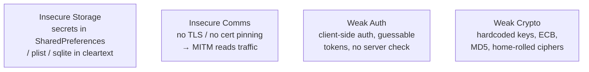

# Module 17 — Hacking Mobile Platforms

> **One-liner:** the mobile attack surface — Android and iOS architecture, the OWASP Mobile Top 10, app-level flaws (insecure storage, weak crypto, poor transport), device compromise (rooting/jailbreaking, malware), and the management controls (MDM/MAM, BYOD) that a PAM/sysadmin actually operates. Your hook: mobiles are unmanaged endpoints holding tokens and MFA — treat them like privileged endpoints.

> **📚 Study companions:** [Facts sheet](facts.md) · [Practice questions](practice-questions.md) · [Flashcards (Anki)](flashcards.csv) · [Lab walkthrough](lab-walkthrough.md)

## Exam focus

- **Mobile attack vectors** and the **OWASP Mobile Top 10**.
- **Android architecture** (Linux kernel → libraries/ART → app framework → apps) and its security model (app sandbox, permissions, APK signing).
- **iOS architecture** and security model (Secure Enclave, code signing, sandbox, Data Protection).
- **Rooting (Android) vs. jailbreaking (iOS)** — what they remove and why it matters.
- **App-level flaws**: insecure data storage, weak/broken cryptography, insecure communication, insecure authentication, reverse engineering.
- **Mobile malware / spyware** and repackaged/trojanized apps; **sideloading** risk.
- **SMS/OTP interception, SIM swapping, smishing, and MFA-fatigue** relevance.
- **MDM / MAM / UEM**, **BYOD** policy, containerization, and remote wipe.
- Static/dynamic mobile analysis tools (MobSF, Frida, Drozer, apktool, ADB).

## Key concepts

### The two OSes at a glance

| | Android | iOS |
|---|---|---|
| Base | Modified Linux kernel | Darwin (XNU) |
| Runtime | ART (Ahead-of-Time/JIT) | Native (Objective-C/Swift) |
| App package | **APK** (or AAB) | **IPA** |
| Store model | Open + **sideloading** allowed | Closed, App Store review; sideloading restricted |
| Privilege bypass | **Rooting** | **Jailbreaking** |
| Isolation | App sandbox, UID per app, permissions | App sandbox, code signing, Data Protection classes |

### OWASP Mobile Top 10 (2024) — the exam list

| # | Category |
|---|---|
| M1 | Improper Credential Usage |
| M2 | Inadequate Supply Chain Security |
| M3 | Insecure Authentication / Authorization |
| M4 | Insufficient Input/Output Validation |
| M5 | Insecure Communication |
| M6 | Inadequate Privacy Controls |
| M7 | Insufficient Binary Protections |
| M8 | Security Misconfiguration |
| M9 | Insecure Data Storage |
| M10 | Insufficient Cryptography |

> The older 2016 list (M1 Improper Platform Usage, M2 Insecure Data Storage, …) still shows up in question banks — recognize both, but favor the categories above.

### Rooting / jailbreaking — what actually changes

Both remove the vendor's privilege restrictions:
- **Break the sandbox / gain root** → any app can read another app's private storage.
- **Disable code-signing / verified boot** → unsigned or tampered apps run.
- **Expose keystore/keychain material** to extraction.

That's why **MDM blocks rooted/jailbroken devices** from enrolling or accessing corporate data — the entire OS trust model is gone.

### The app-flaw quartet you'll be tested on



### Where sensitive data hides on the device

| Android | iOS |
|---|---|
| `/data/data/<pkg>/shared_prefs/*.xml` | `Library/Preferences/*.plist` |
| `/data/data/<pkg>/databases/*.sqlite` | app sandbox `Documents/`, SQLite |
| Logcat leakage | Keychain (correct place) vs. plist (wrong place) |
| Android Keystore (correct place) | Unified logging leakage |

### Mobile-relevant identity attacks

- **Smishing** (SMS phishing), **SIM swapping** (port the number, steal SMS OTP), **OTP interception** → why **SMS-based MFA is weak** and app/hardware-based MFA is preferred.
- **MFA fatigue / push bombing** against mobile authenticator apps.

## Key tools

| Tool | Purpose | Reference |
|---|---|---|
| MobSF | Automated static + dynamic mobile app analysis | https://github.com/MobSF/Mobile-Security-Framework-MobSF |
| ADB (Android Debug Bridge) | Device shell, pull/install, logcat | https://developer.android.com/tools/adb |
| apktool | Decompile/rebuild APK resources & smali | https://apktool.org/ |
| jadx | APK → readable Java decompiler | https://github.com/skylot/jadx |
| Frida / Objection | Runtime instrumentation, pinning bypass | https://frida.re/ |
| Drozer | Android attack-surface / IPC assessment | https://github.com/WithSecureLabs/drozer |
| Genymotion / Android Emulator | Safe test devices | https://developer.android.com/studio/run/emulator |

## Commands & techniques (lab-ready)

> Use an **emulator or a test device you own**. Never analyze or tamper with apps/accounts that aren't yours. See [`../../labs/`](../../labs/README.md).

```bash
# --- Pull and statically inspect an APK ---
adb shell pm list packages | grep <app>
adb shell pm path com.example.app                    # find the APK path
adb pull /data/app/.../base.apk app.apk
apktool d app.apk -o app_src                          # decode manifest + smali
jadx -d out app.apk                                   # decompile to Java

# --- Find secrets / misconfig ---
grep -riE "http://|password|api[_-]?key|BEGIN PRIVATE" app_src/
# in AndroidManifest.xml check: android:debuggable, exported=true, cleartextTrafficPermitted

# --- Inspect on-device data stores (rooted test device / emulator) ---
adb shell run-as com.example.app cat shared_prefs/prefs.xml
adb logcat | grep -i token                            # leaked tokens in logs

# --- Automated static+dynamic report ---
# (MobSF web UI) upload app.apk → review storage, crypto, network, permissions

# --- Runtime: bypass SSL pinning to MITM the API ---
objection -g com.example.app explore                  # then: android sslpinning disable
# route device traffic through Burp with the CA installed to read the API calls
```

## Lab exercise

1. **Static triage:** decompile a **deliberately vulnerable app** (e.g. an intentionally-broken test app you build or download for training) with jadx/apktool. Read the manifest for `debuggable`, `exported` components, and `cleartextTrafficPermitted`.
2. **Find stored secrets:** run it on an emulator, exercise login, then pull `shared_prefs`/sqlite and locate any cleartext credential or token (Insecure Data Storage, M9).
3. **MITM the API:** put the emulator's traffic through Burp; if it fails due to cert pinning, use **Objection/Frida** to disable pinning and read the calls (Insecure Communication, M5).
4. **Run MobSF:** upload the APK and compare its automated findings to what you found by hand.
5. **Defender view:** enroll the emulator in a test MDM (or simulate policy) and set a **compromised-device (root/jailbreak) block** + **require-encryption** + **remote-wipe** — the controls that neutralize most of the above.

**What you should observe:** mobile findings cluster around **secrets on the device** and **traffic off the device**. The corporate defense isn't fixing each app — it's **MDM/MAM policy** (block rooted, containerize corporate data, enforce transport security) plus **phishing-resistant MFA** so a stolen token or SMS OTP isn't enough.

## Defender & PAM mapping

| Attack | Detection signal | Control / PAM lever |
|---|---|---|
| Rooted/jailbroken device | Root/JB attestation fails, SafetyNet/Play Integrity fail | **MDM conditional access** — block compromised devices from corporate data |
| Insecure data storage | Tokens/creds in prefs/sqlite/plist/logs | Use Keystore/Keychain, MAM containerization, no secrets in logs |
| Insecure comms / no pinning | MITM succeeds, cleartext API calls | Enforce TLS + cert pinning, network security config |
| Malicious / repackaged app (sideload) | Unknown app source, over-broad permissions | Block sideloading, managed app catalog, Play Integrity |
| SMS OTP intercept / SIM swap | Auth from new device, OTP replay | **Phishing-resistant MFA** (FIDO2/passkeys) over SMS |
| MFA fatigue / push bombing | Repeated denied push prompts | Number matching, MFA rate-limits, JIT approval workflows |
| Lost/stolen device | Device offline + sensitive access | **Remote wipe**, full-disk encryption, screen-lock policy |

> **PAM playbook for this module:** phones are where privileged people approve MFA and hold session tokens, so treat a phone accessing admin systems as a **privileged endpoint**. Require MDM enrollment with a **rooted/jailbroken block**, containerize corporate data (MAM), replace **SMS OTP with phishing-resistant MFA (FIDO2/passkeys)**, and keep privileged approvals behind a PAM workflow (number-matching, JIT) so a compromised handset can't silently rubber-stamp elevation. Full mapping in [`../../defender-pam/attack-to-control-matrix.md`](../../defender-pam/attack-to-control-matrix.md).

### 🔐 PAM engineering deep-dive (CyberArk)

A phone that approves MFA and holds session tokens is a **privileged endpoint**. Treat it like one: brokered access, biometric MFA, and JIT so the device never holds a durable privileged secret.

| This module's attack | CyberArk control | Component |
|---|---|---|
| Admin on mobile holds a long-lived token | JIT — nothing durable stored on the device | DPA / PVWA approval |
| Vendor / admin remote access from a phone | VPN-less access with mobile biometric MFA | Remote Access |
| Privileged web console used from mobile | Record + protect the session | Secure Web Sessions |

**Detection (privileged lens):** token theft / auth from a new device, MFA fatigue — see [`../../defender-pam/detection-engineering.md`](../../defender-pam/detection-engineering.md).

**Engineering note:** require MDM enrollment with a **rooted/jailbroken block**, use **Remote Access** biometric MFA instead of SMS OTP, and keep privileged elevation behind **JIT** — a compromised handset then holds no reusable privileged credential.

> Go deeper: [PAM architecture](../../defender-pam/pam-architecture.md) · [CyberArk mapping](../../defender-pam/cyberark-attack-mapping.md)

## Exam tips & gotchas

- **Rooting = Android, Jailbreaking = iOS.** Both defeat the sandbox/code-signing trust model.
- **APK = Android, IPA = iOS.** Android allows **sideloading**; iOS is far more locked down.
- **Insecure Data Storage** is the perennial top mobile flaw — secrets belong in **Keystore/Keychain**, never in SharedPreferences/plist/logs.
- **Cert pinning** defeats casual MITM; **Frida/Objection** bypass it at runtime — know both sides.
- **SMS-based MFA is weak** (SIM swap, OTP intercept) — the exam wants **app/hardware/FIDO2** MFA as the stronger answer.
- **MDM** = manages the whole device; **MAM** = manages just the app/data (containerization) — pick MAM for BYOD.
- Static analysis = decompile/inspect (jadx, apktool, MobSF static); dynamic = run + instrument (Frida, MobSF dynamic).

## Sources

- OWASP Mobile Top 10: https://owasp.org/www-project-mobile-top-10/
- OWASP MASVS / MASTG (Mobile App Security Testing Guide): https://mas.owasp.org/
- Android security model & app sandbox: https://source.android.com/docs/security/app-sandbox
- Apple Platform Security Guide: https://support.apple.com/guide/security/welcome/web
- MITRE ATT&CK for Mobile: https://attack.mitre.org/matrices/mobile/
- MobSF: https://github.com/MobSF/Mobile-Security-Framework-MobSF
- NIST SP 800-124 Rev.2 (mobile device security in the enterprise): https://csrc.nist.gov/pubs/sp/800/124/r2/final

---
### 📝 My lab log (fill in)
| Date | App / device | Technique | Result / finding |
|---|---|---|---|
|  |  |  |  |
