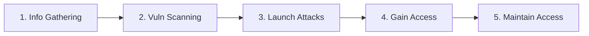
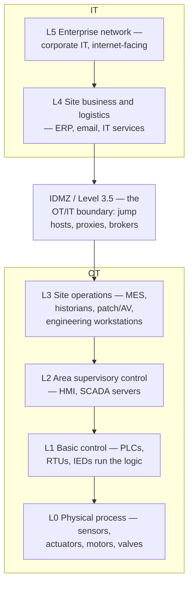

# Module 18 — IoT and OT Hacking

> **One-liner:** attacking the physical-world edge — internet-connected "things" and the industrial control systems (ICS/OT) that run factories, grids, and pipelines. The exam tests protocols, the Purdue model, and the attack surface; the real world tests your discipline, because OT is **safety-critical** and you can hurt people. Your PAM instinct — segment, broker, least-privilege — is exactly the defense.

> **📖 Concept page:** [domains/18-iot-and-ot-hacking.md](../../domains/18-iot-and-ot-hacking.md) — the source-grounded overview with Mermaid flows and countermeasures.

> **📚 Study companions:** [Facts sheet](facts.md) · [Practice questions](practice-questions.md) · [Flashcards (Anki)](flashcards.csv) · [Lab walkthrough](lab-walkthrough.md)

## Exam focus

- **IoT architecture** (the layered model) and the four **IoT communication models** (device-to-device, device-to-cloud, device-to-gateway, back-end data-sharing).
- **IoT communication protocols** and their default ports: MQTT, CoAP, Zigbee, BLE, LoRaWAN, Z-Wave, 6LoWPAN.
- **OWASP IoT Top 10** — know it exists and its recurring themes (weak/default/hardcoded passwords lead it). Match categories to mitigations.
- The **IoT attack surface** (OWASP attack-surface areas) and the **IoT hacking methodology**.
- **Mirai** as the archetypal IoT botnet (Telnet + default creds → DDoS).
- **OT/ICS vocabulary**: SCADA, DCS, PLC, RTU, IED, HMI, Historian — and how they differ.
- **OT protocols**: Modbus, DNP3, Profinet/Profibus, EtherNet/IP, S7comm — and that most have **no authentication or encryption**.
- The **Purdue model** (levels 0–5 plus the IDMZ) and IT/OT convergence risk.
- **Segmentation, zoning/conduits (IEC 62443), unidirectional gateways** as the primary controls.

## Key concepts

### IoT architecture (layered model)

| Layer | What it is | Example |
|---|---|---|
| Edge / Device | The "things" — sensors, actuators, MCUs, firmware | Smart camera, thermostat |
| Access / Gateway | First hop; protocol translation, local aggregation | Home hub, IoT gateway |
| Internet / Communication | Transport to the cloud | Wi-Fi, cellular, LPWAN |
| Middleware | Device mgmt, message brokers, data storage | MQTT broker, cloud IoT core |
| Application | The user/business logic | Mobile app, web dashboard |

**Four communication models:** Device-to-Device, Device-to-Cloud, Device-to-Gateway, Back-End Data-Sharing.

### IoT communication protocols (know ports + role)

| Protocol | Layer / radio | Default port | One-liner |
|---|---|---|---|
| **MQTT** | App messaging over TCP | **1883** (TLS **8883**) | Lightweight **publish/subscribe** via a broker; frequently **unauthenticated** |
| **CoAP** | App, RESTful over **UDP** | **5683** (DTLS **5684**) | HTTP-like for constrained devices; request/response |
| **Zigbee** | IEEE **802.15.4**, 2.4 GHz mesh | — (RF) | Low-power mesh home/building automation |
| **BLE** | Bluetooth Low Energy, 2.4 GHz | — (RF) | Short-range; GATT profiles; pairing weaknesses |
| **LoRaWAN** | Sub-GHz LPWAN, star-of-stars | — (RF) | **Long-range**, low-power WAN; AppKey/NwkKey |
| **Z-Wave / 6LoWPAN** | Sub-GHz / 802.15.4 + IPv6 | — (RF) | Home mesh / IPv6 over low-power radio |

> **Trap:** MQTT is **pub/sub over TCP**; CoAP is **RESTful over UDP**. A single wrong word (TCP↔UDP, pub/sub↔request/response) flips the answer.

### OWASP IoT Top 10 & attack surface

The **OWASP IoT Top 10** is the authoritative list of the most critical IoT weaknesses. Do **not** memorize a paraphrase — read the official categories at the source (see [Sources]). Recurring themes you must recognize: **weak/guessable/hardcoded passwords** (perennial #1), **insecure network services**, **insecure ecosystem interfaces** (web/cloud/mobile), and **lack of a secure update mechanism**.

The OWASP **IoT attack-surface areas** map where you probe:

| Surface | Attack examples |
|---|---|
| Device firmware | Extract with `binwalk`, hunt hardcoded creds/keys |
| Device physical/debug | UART/JTAG serial console, chip-off |
| Network services | Exposed Telnet/UPnP/MQTT, default creds |
| Web/cloud/mobile interface | Auth bypass, insecure API, secrets in app |
| Update mechanism | Unsigned firmware, MITM of OTA updates |
| Ecosystem comms | Sniff/replay Zigbee/BLE, weak pairing |

### IoT hacking methodology



Information gathering leans heavily on **Shodan/Censys** (querying a pre-built index — passive) before any active scan.

### Mirai (the archetypal IoT botnet — concept)

Mirai spread by scanning the internet for open **Telnet (23/2323)** and trying a built-in list of **default/factory credentials**. Compromised cameras/DVRs/routers were enlisted into a botnet used for large **DDoS** attacks; the source code was later leaked, spawning many variants. Lesson for the exam: **default credentials + exposed management services = mass compromise.**

### OT / ICS vocabulary

| Term | Meaning |
|---|---|
| **ICS** | Industrial Control Systems (umbrella term) |
| **SCADA** | Supervisory Control And Data Acquisition — geographically distributed monitoring/control |
| **DCS** | Distributed Control System — process control within a single plant |
| **PLC** | Programmable Logic Controller — the small ruggedized computer running the process |
| **RTU / IED** | Remote Terminal Unit / Intelligent Electronic Device — field controllers |
| **HMI** | Human-Machine Interface — operator screen |
| **Historian** | Time-series database of process values |

### OT protocols (most have NO auth/encryption by design)

| Protocol | Port | Domain |
|---|---|---|
| **Modbus** (TCP) | **502** | Generic industrial; trivially readable/writable |
| **DNP3** | **20000** | Electric/water utilities |
| **Profinet / Profibus** | — / — | Factory automation (Siemens ecosystem) |
| **EtherNet/IP (CIP)** | 44818 / 2222 | Rockwell/Allen-Bradley |
| **S7comm** | 102 | Siemens S7 PLCs |
| **BACnet** | 47808/UDP | Building automation |
| **OPC UA** | 4840 | Secure-capable modern interoperability |

### The Purdue model (levels 0–5 + IDMZ)

Attacks flow **down**; safety flows from keeping people and IT **out** of the lower levels.



**IT/OT convergence** flattened these zones (remote access, cloud historians), which is exactly why segmentation and brokered access matter.

## Key tools

| Tool | Purpose | Reference |
|---|---|---|
| Shodan | Search engine/index of internet-exposed devices | https://www.shodan.io/ |
| Censys | Internet asset/exposure search | https://censys.com/ |
| Nmap | Port/service discovery + ICS NSE scripts | https://nmap.org/ |
| Wireshark | Protocol dissection (MQTT, Modbus, DNP3) | https://www.wireshark.org/ |
| pymodbus | Python Modbus client/server (talk to a simulator) | https://github.com/pymodbus-dev/pymodbus |
| binwalk | Firmware carving / filesystem extraction | https://github.com/ReFirmLabs/binwalk |
| Bettercap | BLE/Wi-Fi reconnaissance | https://www.bettercap.org/ |

## Commands & techniques (lab-ready)

> ⛔ **OT SAFETY — read this first.** Never scan, connect to, or write to **any real ICS/OT device, PLC, or IoT product you do not own and control on an isolated bench.** A stray Modbus write or an aggressive Nmap scan can trip a safety system, damage equipment, or endanger people. Everything below targets **your own local simulators, your own firmware images, and Shodan's *index* (which you query, never connect to)**.

```bash
# --- PASSIVE recon: query Shodan's INDEX only. NEVER connect to a result. ---
shodan search 'port:502 product:Modbus'          # count exposed Modbus (do NOT touch them)
shodan search 'port:1883'                         # exposed MQTT brokers
shodan host <ip-you-own>                          # only your own asset

# --- Local MQTT lab: run YOUR OWN broker, observe missing auth (pub/sub abuse) ---
mosquitto -v                                      # start a broker on 127.0.0.1:1883
mosquitto_sub -h 127.0.0.1 -t '#' -v              # subscribe to ALL topics (wildcard sniff)
mosquitto_pub  -h 127.0.0.1 -t 'lab/sensor' -m 'spoofed'   # inject a fake reading

# --- Local Modbus lab: pymodbus simulator, then read/WRITE registers ---
# Start a simulator bound to loopback (CLI varies by pymodbus version):
python -m pymodbus.server --host 127.0.0.1 --port 5020
# Client: read holding registers (FC3) and write one (FC6) — WRITE would be dangerous on a real PLC
python - <<'PY'
from pymodbus.client import ModbusTcpClient
c = ModbusTcpClient('127.0.0.1', port=5020); c.connect()
print(c.read_holding_registers(0, 10))    # function code 3 (read)
c.write_register(1, 42)                    # function code 6 (write) — sim only!
c.close()
PY

# --- Nmap ICS discovery against YOUR simulator only ---
nmap -sV -p 502 --script modbus-discover 127.0.0.1
nmap -p 1883,8883,5683 -sV 127.0.0.1              # MQTT/CoAP fingerprint (your host)

# --- Firmware analysis on an image you legally own ---
binwalk firmware.bin                              # identify embedded filesystems
binwalk -e firmware.bin                           # extract; then grep for creds/keys
grep -rniE 'password|api[_-]?key|BEGIN .*PRIVATE' _firmware.bin.extracted/

# --- Inspect captured IoT/OT traffic (Wireshark display filters) ---
#   mqtt            → MQTT publish/subscribe
#   modbus          → Modbus function codes/registers
#   dnp3            → DNP3
```

## Lab exercise

Everything runs on your **own workstation/loopback** — no external device is touched. See [`../../labs/`](../../labs/README.md) and [`../../labs/topology.md`](../../labs/topology.md).

1. **MQTT trust failure:** start `mosquitto`, subscribe to `#`, and publish a spoofed message from a second terminal. Observe that an unauthenticated broker lets **anyone read and inject** on every topic — this is OWASP "insecure network services" in miniature.
2. **Modbus has no identity:** run the `pymodbus` simulator, read registers with FC3, then write one with FC6. Note there was **no login, no authorization, no crypto** — the protocol assumes a trusted network, which is why **segmentation is the control**.
3. **Firmware secrets:** `binwalk -e` a firmware image you own and grep the extracted rootfs for hardcoded passwords/keys.
4. **Purdue mapping:** on paper, place each lab component at a Purdue level and draw where an **IDMZ + jump host** would sit. Identify which flows a **unidirectional gateway** would allow (monitoring data up) and block (control down).

**What you should observe:** OT/IoT protocols were built for **trusted, isolated networks**. They provide little or no authentication or encryption, so the entire defense is **keeping them isolated and brokering every human/remote path** — precisely a PAM problem.

## Defender & PAM mapping

| Attack | Detection signal | Control / PAM lever |
|---|---|---|
| Default/hardcoded creds (Mirai-style) | Telnet/SSH logins from device VLAN, new outbound scanning | Change defaults, **disable Telnet**, NAC, device credential vaulting + rotation |
| Exposed Modbus/DNP3 with unauth writes | Unexpected write function codes (FC5/6/15/16), OT-IDS alerts | **IT/OT segmentation**, read-only where possible, protocol-aware firewall, deny writes from IT |
| Engineer/vendor reaching L0/L1 directly | Remote session bypassing IDMZ, VPN straight to a PLC | **Purdue IDMZ + jump host**, brokered/recorded remote access, **JIT** time-boxed sessions |
| Flat IT↔OT network / lateral movement | East-west traffic between IT and OT VLANs | **Zoning & conduits (IEC 62443)**, deny IT→OT by default, allow-list only |
| Monitoring path abused for control | Two-way flow where only telemetry is needed | **Unidirectional gateway / data diode** (data up only) |
| Unsigned firmware / OTA MITM | Hash/signature mismatch, unexpected update source | Signed firmware + **secure boot**, verify vendor supply chain |
| Zigbee/BLE sniffing & replay | RF anomalies, unexpected device joins | Encryption + strong pairing, disable open join, RF monitoring |
| Third-party/OEM remote support abuse | Vendor sessions off-hours, from new geos | **PAM secure remote access**: approval, session recording, credential injection, expiry |

> **PAM playbook for OT:** treat the OT network as a **crown-jewel Tier 0**. No human touches L0/L1 directly — all access flows through a **jump host in the IDMZ** with **JIT, MFA, approval, and full session recording**. Use **unidirectional gateways** so historians/monitoring can pull data *up* while nothing can push control *down*. Vault and rotate device/service credentials, and never let a vendor keep a standing VPN. Map these to [`../../defender-pam/`](../../defender-pam/README.md).

### 🔐 PAM engineering deep-dive (CyberArk)

OT is where default credentials and flat, always-on remote access are still the norm. PAM's job: vault the device credentials and make a brokered jump host the **only** way into the OT zone.

| This module's attack | CyberArk control | Component |
|---|---|---|
| Default / weak device (PLC, HMI, RTU) creds | Vault + rotate device credentials | CPM |
| Direct admin into the OT network | Broker via a jump host | PSM / PSMP |
| Third-party OT vendor access | VPN-less, time-boxed, biometric MFA | Remote Access |

**Detection (privileged lens):** access into the OT zone outside change windows, abnormal control commands — see [`../../defender-pam/detection-engineering.md`](../../defender-pam/detection-engineering.md).

**Engineering note:** make **PSM/PSMP the sole ingress** into the OT DMZ (aligned to IEC 62443 zones/conduits), vault device credentials, and grant vendors **time-boxed Remote Access** — no flat, standing path to the plant floor. Where devices can't rotate, compensate with strict segmentation + brokered access.

> Go deeper: [PAM architecture](../../defender-pam/pam-architecture.md) · [CyberArk mapping](../../defender-pam/cyberark-attack-mapping.md) · **[OT/ICS security — beginner→expert](../../ot-security/README.md)** (a full standalone curriculum on the OT side)

## Exam tips & gotchas

- **Ports to memorize:** MQTT **1883** (TLS **8883**), CoAP **5683/UDP** (DTLS **5684**), Modbus **502**, DNP3 **20000**.
- **MQTT = pub/sub over TCP; CoAP = REST over UDP.** Classic swap trap.
- **Purdue levels:** L0 = process (sensors/actuators), L1 = PLC/RTU, L2 = HMI/SCADA, L3 = site ops/historian, **L3.5 = IDMZ**, L4/L5 = IT/enterprise.
- **SCADA vs DCS vs PLC:** SCADA = distributed supervisory monitoring; DCS = in-plant process control; PLC = the field controller that both use.
- **Modbus/DNP3 have no built-in auth or encryption** — the defense is the network, not the protocol. **OPC UA** is the security-capable modern option.
- **Mirai = Telnet + default creds → DDoS botnet.** If a question mentions default IoT passwords at scale, think Mirai.
- **IoT communication models:** Device-to-Device, Device-to-Cloud, Device-to-Gateway, Back-End Data-Sharing.
- Do **not** paraphrase the OWASP IoT Top 10 from memory on the job — cite the official page.

## Sources

- OWASP Internet of Things Project (IoT Top 10) — https://owasp.org/www-project-internet-of-things/
- MQTT (OASIS standard) — https://mqtt.org/
- CoAP — RFC 7252 — https://datatracker.ietf.org/doc/html/rfc7252
- Modbus specifications — https://modbus.org/specs.php
- Nmap `modbus-discover` NSE script — https://nmap.org/nsedoc/scripts/modbus-discover.html
- pymodbus — https://github.com/pymodbus-dev/pymodbus
- Shodan — https://www.shodan.io/
- CISA — Industrial Control Systems — https://www.cisa.gov/topics/industrial-control-systems
- ISA/IEC 62443 series (zones & conduits) — https://www.isa.org/standards-and-publications/isa-standards/isa-iec-62443-series-of-standards
- MITRE ATT&CK for ICS — https://attack.mitre.org/matrices/ics/

---
### 📝 My lab log (fill in)
| Date | Target | Command | Result / notes |
|---|---|---|---|
|  |  |  |  |
