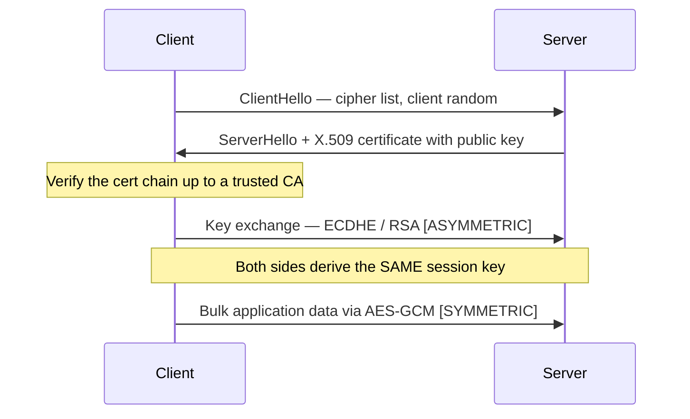

# Module 20 — Cryptography

> **One-liner:** the math that protects (and, when misused, exposes) everything else — symmetric vs. asymmetric ciphers, hashing, PKI, TLS, and the attacks against them. For a PAM practitioner this is home turf: your vault encrypts secrets at rest, signs audit trails, rotates keys, and manages certificate lifecycles. The exam tests definitions precisely, so get the pairings exact.

> **📚 Study companions:** [Facts sheet](facts.md) · [Practice questions](practice-questions.md) · [Flashcards (Anki)](flashcards.csv) · [Lab walkthrough](lab-walkthrough.md)

## Exam focus

- **Symmetric vs. asymmetric**: keys, speed, and correct use (bulk encryption vs. key exchange + signatures).
- **Symmetric ciphers** by name: AES, DES, 3DES, RC4, Blowfish, Twofish — block vs. stream, key sizes.
- **Asymmetric** by name: RSA, ECC, Diffie-Hellman, ElGamal, DSA — and what each can/can't do.
- **Block cipher modes**: ECB (bad), CBC, CTR, GCM (authenticated).
- **Hashing**: MD5, SHA-1/2/3, RIPEMD — and **password hashing** (bcrypt, scrypt, Argon2, PBKDF2) vs. fast hashes.
- **PKI**: CA/RA, X.509 certificates, chain of trust, CRL/OCSP; **digital signatures**; the **SSL/TLS handshake** (hybrid crypto).
- **Disk/email encryption**: BitLocker, PGP/GPG, S/MIME.
- **Crypto attacks**: brute force, birthday, collision, known/chosen plaintext, side-channel, **padding oracle**, MITM on key exchange.
- **Steganography** vs. cryptography.

## Key concepts

### Symmetric vs. asymmetric

| Property | Symmetric | Asymmetric |
|---|---|---|
| Keys | **one shared secret** | **public/private key pair** |
| Speed | fast | slow (~orders of magnitude) |
| Best for | **bulk data encryption** | **key exchange + digital signatures** |
| Key distribution | hard (must share secret) | solved (publish the public key) |
| Examples | AES, DES, 3DES, RC4, Blowfish, Twofish | RSA, ECC, Diffie-Hellman, ElGamal, DSA |

> **The whole of TLS is "use both":** asymmetric to agree on a session key, then symmetric for the bulk data. That hybrid model is a favorite exam point.

### Symmetric ciphers

| Cipher | Type | Key size | Status / note |
|---|---|---|---|
| **DES** | block (64-bit) | **56-bit** | Broken — key too short |
| **3DES** | block (64-bit) | 112/168-bit | Legacy, deprecated (meet-in-the-middle is why 2DES ≈ DES) |
| **AES** (Rijndael) | block (128-bit) | 128/192/256 | **The standard** (FIPS 197) |
| **RC4** | **stream** | variable | Broken/deprecated (old WEP/TLS) |
| **Blowfish** | block (64-bit) | up to 448 | Schneier; superseded by Twofish/AES |
| **Twofish** | block (128-bit) | up to 256 | AES finalist |

**Modes of operation:** **ECB** leaks patterns (the "ECB penguin") — never use it; **CBC** chains blocks with an IV (target of **padding-oracle** attacks); **CTR** turns a block cipher into a stream; **GCM** adds **authentication** (integrity + confidentiality) — prefer it.

### Asymmetric algorithms

| Algorithm | Hard problem | Can do |
|---|---|---|
| **RSA** | integer factorization | encryption **and** signatures |
| **Diffie-Hellman** | discrete logarithm | **key exchange only** (no encrypt/sign) |
| **ECC** | elliptic-curve discrete log | same as RSA, **smaller keys** (mobile/IoT) |
| **ElGamal** | discrete logarithm | encryption and signatures |
| **DSA** | discrete logarithm | **signatures only** |

### Hashing

| Hash | Output | Status |
|---|---|---|
| **MD5** | 128-bit | Broken (practical collisions) |
| **SHA-1** | 160-bit | Broken (SHAttered collision) |
| **SHA-2** (256/384/512) | 256+ | Secure |
| **SHA-3** (Keccak) | variable | Secure (sponge construction) |
| **RIPEMD-160** | 160-bit | OK; used in Bitcoin addresses |

Hashing gives **integrity**, not confidentiality — it's one-way. A good hash resists **preimage**, **second-preimage**, and **collision**.

### Password hashing (KDFs) — NOT the same as fast hashes

Passwords must use **slow, salted, tunable** key-derivation functions: **bcrypt**, **scrypt** (memory-hard), **Argon2** (Password Hashing Competition winner), or **PBKDF2**. A **salt** defeats rainbow tables; a **work factor** slows brute force. Using plain **MD5/SHA-256** for passwords is a classic mistake — they're built to be *fast*, which is exactly wrong here.

### PKI, digital signatures & the TLS handshake

- **PKI** components: **CA** (issues/signs), **RA** (verifies identity), **certificate** (binds identity ↔ public key), **CRL/OCSP** (revocation), all in **X.509** format with a **root → intermediate → leaf chain of trust**.
- **Digital signature:** hash the message, encrypt the hash with your **private** key; anyone verifies with your **public** key. Provides **integrity, authenticity, and non-repudiation** — **not confidentiality**.
- **To send confidentially:** encrypt with the **recipient's public** key. **To prove it's from you:** sign with **your private** key. (Swapping these two is the #1 trap.)



**TLS 1.3** simplified this to one round-trip, mandates **forward secrecy** (ephemeral DH/ECDHE), and removed RSA key transport, RC4, and other weak options.

### Disk & email encryption

| Tool | Scope | Model |
|---|---|---|
| **BitLocker** | Full-disk (Windows) | AES, often **TPM**-sealed key |
| **PGP / GPG** (OpenPGP) | Files/email | **Web of trust**; hybrid (session key wrapped with recipient's public key) |
| **S/MIME** | Email | **X.509 / CA hierarchy** (PKI, not web of trust) |
| **VeraCrypt / LUKS / FileVault** | Volumes/disks | AES at rest |

### Crypto attacks

| Attack | Target | Idea |
|---|---|---|
| Brute force | key/password | Try all possibilities |
| **Birthday** | hashes | Find a collision in ≈ **2^(n/2)** work (birthday paradox) |
| Collision | hashes | Two inputs → same digest (MD5/SHA-1) |
| Known-plaintext (KPA) | cipher | Attacker has plaintext+ciphertext pairs |
| Chosen-plaintext (CPA) | cipher | Attacker picks plaintexts, sees ciphertexts |
| Chosen-ciphertext (CCA) | cipher | Attacker picks ciphertexts, sees plaintexts |
| **Side-channel** | implementation | Leak via timing/power/EM, not the math |
| **Padding oracle** | CBC mode | Server padding errors leak plaintext byte-by-byte |
| **MITM on key exchange** | unauthenticated DH | Intercept and relay — why DH must be **authenticated** |
| Rainbow table | unsalted hashes | Precomputed hash→plaintext lookup |

### Steganography vs. cryptography

**Cryptography scrambles** content (still visibly "encrypted"); **steganography hides the very existence** of the message (e.g., LSB embedding in an image). They're complementary — combine them for defense in depth. Detecting hidden data is **steganalysis**.

## Key tools

| Tool | Purpose | Reference |
|---|---|---|
| OpenSSL | Swiss-army crypto: enc/dgst/genrsa/x509/s_client | https://www.openssl.org/ |
| Hashcat | GPU offline hash cracking | https://hashcat.net/hashcat/ |
| John the Ripper | CPU hash cracking | https://www.openwall.com/john/ |
| GnuPG (gpg) | OpenPGP keygen, encrypt, sign, verify | https://gnupg.org/ |
| hashID | Identify a hash type from its format | https://github.com/psypanda/hashID |
| CrypTool | Visual learning tool for ciphers/attacks | https://www.cryptool.org/ |

## Commands & techniques (lab-ready)

> Run these on **your own lab host** (see [`../../labs/`](../../labs/) / [`../../labs/topology.md`](../../labs/topology.md)). Only crack hashes **you generated** or captured from **your own** lab targets.

```bash
# --- Symmetric encrypt/decrypt (AES-256-CBC with a proper KDF) ---
openssl enc -aes-256-cbc -pbkdf2 -salt -in secret.txt -out secret.enc
openssl enc -d -aes-256-cbc -pbkdf2 -in secret.enc -out secret.dec

# --- Hashing / digests ---
echo -n 'password' | openssl dgst -md5        # 5f4dcc3b5aa765d61d8327deb882cf99
echo -n 'password' | openssl dgst -sha256
sha256sum ubuntu.iso                          # integrity check

# --- RSA keypair, then sign & verify a file ---
openssl genrsa -out priv.pem 2048
openssl rsa -in priv.pem -pubout -out pub.pem
openssl dgst -sha256 -sign priv.pem -out sig.bin file.txt
openssl dgst -sha256 -verify pub.pem -signature sig.bin file.txt   # "Verified OK"

# --- Self-signed X.509 cert + inspection ---
openssl req -x509 -newkey rsa:2048 -keyout key.pem -out cert.pem -days 365 -nodes
openssl x509 -in cert.pem -noout -text
openssl s_client -connect 127.0.0.1:8443 </dev/null | openssl x509 -noout -text   # inspect a live cert

# --- Identify then crack a hash (LAB hashes only) ---
hashid '5f4dcc3b5aa765d61d8327deb882cf99'        # suggests MD5
hashcat -m 0    md5.txt  /usr/share/wordlists/rockyou.txt    #    0 = MD5
hashcat -m 100  sha1.txt /usr/share/wordlists/rockyou.txt    #  100 = SHA1
hashcat -m 1000 ntlm.txt /usr/share/wordlists/rockyou.txt    # 1000 = NTLM
john --format=raw-md5 md5.txt --wordlist=/usr/share/wordlists/rockyou.txt

# --- GnuPG: keypair, hybrid-encrypt to a recipient, detached-sign, verify ---
gpg --full-generate-key
gpg --encrypt --recipient you@lab.local file.txt    # session key wrapped with recipient's pubkey
gpg --detach-sign file.txt
gpg --verify file.txt.sig file.txt
```

**Hashcat modes to memorize:** **0** MD5 · **100** SHA1 · **1000** NTLM · **1400** SHA-256 · **1800** sha512crypt · **3200** bcrypt · **13100** Kerberos TGS-REP.

## Lab exercise

1. **Avalanche & integrity:** AES-encrypt a file with OpenSSL, decrypt it back. Then flip a single byte of the ciphertext and decrypt again — watch it fail/garble. Symmetric crypto gives confidentiality; **GCM would also catch the tamper**.
2. **Signatures prove origin:** generate an RSA keypair, sign a file, verify ("Verified OK"). Change one character in the file and re-verify — it **fails**. You've demonstrated **integrity + authenticity + non-repudiation**.
3. **Why passwords need KDFs:** MD5-hash `password`, identify it with `hashID`, crack it with `hashcat -m 0` (instant). Now bcrypt the same password (`-m 3200`) and try again — it crawls. **This is exactly why a vault stores bcrypt/Argon2, not MD5.**
4. **Hybrid email:** create a GPG keypair, encrypt a file to yourself, decrypt it — note the session-key-wrapped-with-public-key model that PGP, S/MIME, and TLS all share.

**What you should observe:** symmetric = fast bulk encryption; asymmetric = key exchange + signatures; fast hashes fall instantly while **salted KDFs resist**. Every one of these maps to a vault/PKI control you already operate.

## Defender & PAM mapping

| Attack | Detection signal | Control / PAM lever |
|---|---|---|
| Offline hash cracking after a dump | Mass auth attempts post-breach; cracking-rig indicators | Store passwords with **salted Argon2/bcrypt/scrypt**, long passphrases, **MFA**; vault holds secrets, not reusable hashes |
| Weak/deprecated crypto (MD5/SHA-1/DES/RC4/ECB) | TLS scanner findings; crypto inventory gaps | **Crypto policy**: TLS 1.2+/1.3 only, disable weak ciphers, FIPS-validated modules |
| Key theft / long-lived private keys | Anomalous key usage; keys found in code/backups | **HSM/KMS-backed keys**, key **rotation**, secrets manager, **never export private keys** |
| Padding oracle / TLS MITM / downgrade | Repeated decrypt errors; cert warnings; downgrade attempts | **Authenticated encryption (GCM)**, TLS 1.3, HSTS, mutual TLS, cert pinning |
| Rogue / expired certificates | CT-log entries; expiry & OCSP/CRL monitoring | **Certificate lifecycle management**, automated renewal (ACME), CA governance, short-lived certs |
| Stolen vault data/backup at rest | (prevent) — file/backup exfiltration | **Encrypt vault at rest (AES-256)**, HSM-held master key, envelope encryption, KMS |
| Steganographic exfiltration | Entropy/size anomalies on outbound files; DLP hits | DLP, egress filtering, steganalysis on attachments |
| MITM on unauthenticated DH | Signature/cert validation failures | **Authenticated key exchange** (signed ECDHE), PKI trust, pinning |

> **PAM playbook for crypto:** your vault **encrypts secrets at rest** with an **HSM/KMS-held master key** (envelope encryption), **rotates** keys and secrets on schedule and on compromise, and manages **certificate lifecycles** (issue → renew → revoke) so nothing expires or lingers. Store passwords with **Argon2/bcrypt**, keep private/root keys in an **HSM** where they can be used but never extracted, and sign audit trails for **non-repudiation**. Map to [`../../defender-pam/`](../../defender-pam/).

### 🔐 PAM engineering deep-dive (CyberArk)

Keys are just another secret that must be stored, rotated, and audited — and the Vault's own master key is the most sensitive one you own. Give cryptographic material the same vault-rotate-audit discipline as passwords.

| This module's attack | CyberArk control | Component |
|---|---|---|
| Weak / hardcoded keys in apps | Central key & secret storage + rotation | Conjur / Vault |
| Exposure of the Vault master / Server Key | HSM-back the Server Key | Digital Vault + HSM |
| Secrets at rest in cleartext | Encrypted, tamper-evident store | Digital Vault |

**Detection (privileged lens):** legacy-cipher negotiation (RC4/DES/MD5), anomalous key/secret retrieval — see [`../../defender-pam/detection-engineering.md`](../../defender-pam/detection-engineering.md).

**Engineering note:** back the **Vault Server Key with an HSM** so the master key never sits in the clear, and use **Conjur** for application keys — encryption keys then get the same rotation and audit trail as any vaulted credential.

> Go deeper: [PAM architecture — hardening the stack](../../defender-pam/pam-architecture.md)

## Exam tips & gotchas

- **Confidential send = recipient's PUBLIC key; signing = your PRIVATE key.** Swapping these is the most common trap.
- **Digital signature = integrity + authenticity + non-repudiation, NOT confidentiality.**
- **Diffie-Hellman does key exchange only** — no encryption, no signing. **RSA encrypts and signs; DSA signs only.**
- **Symmetric = 1 key, fast, bulk; asymmetric = key pair, slow, exchange/sign; TLS uses BOTH (hybrid).**
- **Birthday attack ≈ 2^(n/2)** — collisions are far cheaper than preimages; MD5 and SHA-1 are collision-broken.
- **ECB leaks patterns** — prefer CBC/CTR, and **GCM** for authenticated encryption.
- **Salt defeats rainbow tables**; use **bcrypt/scrypt/Argon2** for passwords, never plain MD5/SHA.
- **3DES exists because DES's 56-bit key is too short**; meet-in-the-middle makes 2DES pointless.
- **Hashcat modes: 0 MD5, 100 SHA1, 1000 NTLM.**
- **Steganography hides existence; cryptography scrambles content** — different goals.
- **Quantum note:** Shor's algorithm threatens RSA/ECC; Grover's halves symmetric strength (so **AES-256 stays safe**). NIST is standardizing **post-quantum** algorithms.

## Sources

- OpenSSL — https://www.openssl.org/ (docs: https://docs.openssl.org/)
- Hashcat example hashes / mode list — https://hashcat.net/wiki/doku.php?id=example_hashes
- John the Ripper — https://www.openwall.com/john/
- GnuPG — https://gnupg.org/
- NIST FIPS 197 (AES) — https://csrc.nist.gov/pubs/fips/197/final
- NIST FIPS 180-4 (SHA-2) — https://csrc.nist.gov/pubs/fips/180-4/final · FIPS 202 (SHA-3) — https://csrc.nist.gov/pubs/fips/202/final
- RFC 8446 (TLS 1.3) — https://datatracker.ietf.org/doc/html/rfc8446
- Argon2 (Password Hashing Competition) — https://github.com/P-H-C/phc-winner-argon2
- NIST Post-Quantum Cryptography — https://csrc.nist.gov/projects/post-quantum-cryptography
- CrypTool — https://www.cryptool.org/ · hashID — https://github.com/psypanda/hashID

---
### 📝 My lab log (fill in)
| Date | Target | Command | Result / notes |
|---|---|---|---|
|  |  |  |  |
