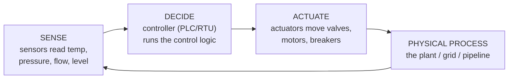
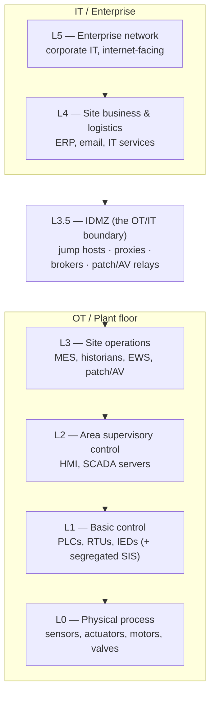
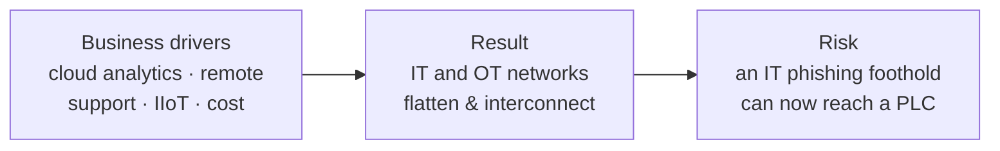

# 01 — OT Foundations

> Level 0–1. What OT/ICS actually *is*, the parts and their jobs, and the map every OT defender carries in their head: the **Purdue model**. Start here; everything else assumes this.

← Back to the [OT Security ladder](README.md)

## What is OT? What is ICS?

**Operational Technology (OT)** is hardware and software that detects or causes a change in the physical world by monitoring and controlling devices, processes, and events — motors, valves, breakers, pumps. Contrast with **IT**, which processes *data*. NIST SP 800-82r3 widened the older term "ICS" to "OT" to also cover building automation, transportation, and physical access systems.

**Industrial Control Systems (ICS)** is the classic umbrella for the control systems inside OT: SCADA, DCS, and the controllers (PLCs/RTUs) themselves.

## The control loop — the heartbeat of every process

Every industrial process is a loop running thousands of times a second. Break it and the physical process misbehaves.

The attacker's goal in OT is almost always to **lie to this loop** — feed the controller false sensor data, or send it unauthorized commands — so it drives the process to an unsafe or wrong state while operators see "normal."

## The asset taxonomy (know every box)

| Term | What it is | Purdue level | Note |
|---|---|---|---|
| **Sensor / actuator** | Field devices that measure or move the process | L0 | The physical edge |
| **PLC** (Programmable Logic Controller) | Ruggedized controller running the control logic | L1 | The workhorse; scan-cycle real-time |
| **RTU** (Remote Terminal Unit) | Field controller for remote/distributed sites | L1 | Common in utilities/pipelines |
| **IED** (Intelligent Electronic Device) | Smart protective relay / meter | L1 | Power systems |
| **SIS** (Safety Instrumented System) | *Independent* system that trips the process to a safe state | L1 (segregated) | **Last line before disaster** — TRITON's target |
| **HMI** (Human-Machine Interface) | Operator screen to monitor/command the process | L2 | What the operator "sees" |
| **SCADA server** | Supervisory control + data acquisition over a wide area | L2 | Distributed monitoring/control |
| **DCS** (Distributed Control System) | Integrated process control within one plant | L1–L2 | Continuous processes (refineries) |
| **Historian** | Time-series database of every process value | L3 (mirror in L3.5/L4) | The data everyone wants "up" |
| **EWS** (Engineering Workstation) | Where engineers write/download PLC logic | L2–L3 | **Crown jewel** — owns the controllers |

> **SCADA vs DCS vs PLC** (the classic confusion): a **PLC** is the field controller. **SCADA** is *geographically distributed* supervisory monitoring/control (a pipeline across a state). A **DCS** is *plant-local* integrated process control (a refinery). SCADA and DCS both *use* PLCs/RTUs underneath.

> **The SIS is sacred.** Safety Instrumented Systems exist to force the process to a safe state (e.g. close a valve) independently of the control system. Attacking the SIS — as [TRITON](03-threats.md) did — removes the last automated barrier before physical catastrophe. Best practice keeps the SIS **physically and logically separate** from the control network.

## The Purdue model — the map you defend

The **Purdue Enterprise Reference Architecture** (via ISA-95) layers an industrial network so that **attacks flow *down*** and the defense is keeping IT and people **out of the lower levels**. The pivotal control is the **IDMZ (Level 3.5)** — the brokered boundary between IT and OT.

**What the IDMZ buys you:** no traffic crosses IT↔OT directly. A historian in L3 replicates *up* to a mirror in the IDMZ that IT reads; a vendor reaches a **jump host** in the IDMZ, never a PLC. Every crossing is brokered, inspected, and (ideally) recorded — the same pattern PAM enforces for privileged access. This is where [OT PAM](05-pam-for-ot.md) lives.

## IT/OT convergence — why the model erodes

The clean Purdue layers were drawn before business wanted **real-time plant data in the cloud** and vendors wanted **remote support**. Convergence — remote access, cloud historians, IIoT sensors, shared Active Directory, flat VLANs — punched holes straight through the levels.

Almost every modern OT incident is really an **IT intrusion that pivoted into OT** because convergence removed the air gap. That is precisely why segmentation ([04](04-defense.md)) and brokered, least-privilege access ([05](05-pam-for-ot.md)) are the load-bearing controls — the protocols themselves ([02](02-protocols.md)) offer no protection.

## ✅ Checkpoint
- Draw the Purdue model from memory and place a sensor, PLC, HMI, historian, and EWS correctly.
- Explain what the **IDMZ** is for and why a vendor should never reach L1 directly.
- Explain **SCADA vs DCS vs PLC** and why the **SIS** must stay separate.

## Sources
- NIST SP 800-82 Rev. 3, *Guide to Operational Technology (OT) Security* — https://csrc.nist.gov/pubs/sp/800/82/r3/final
- CISA — Industrial Control Systems — https://www.cisa.gov/topics/industrial-control-systems
- ISA-95 / Purdue Enterprise Reference Architecture (ISA) — https://www.isa.org/standards-and-publications/isa-standards/isa-standards-committees/isa95
- ISA/IEC 62443 series — https://www.isa.org/standards-and-publications/isa-standards/isa-iec-62443-series-of-standards

---
Next: [02 — Protocols](02-protocols.md) →
