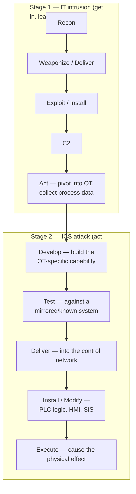

# 03 — OT Threats, Attacks, and Incidents

> Level 3. How OT attacks actually unfold, the framework to describe them (**ATT&CK for ICS**), and the landmark cases every OT defender must know — from Stuxnet to FrostyGoop. The through-line: nearly every one began as an **IT intrusion that pivoted into OT**.

← Back to the [ladder](README.md)

## The ICS Cyber Kill Chain

Michael Assante and Robert M. Lee (SANS, 2015) extended Lockheed Martin's kill chain for ICS. The insight: a real ICS attack is **two stages**. Stage 1 is a conventional IT intrusion to *get into* the OT network and learn the process. Stage 2 is the specialized work of *developing and delivering* an attack against the physical process — the part that needs OT engineering knowledge.

> **Defensive payoff:** Stage 2 is slow, bespoke, and noisy if you can *see* the OT network. Detection and segmentation between Stage 1 and Stage 2 — plus brokered access ([05](05-pam-for-ot.md)) — are where defenders break the chain.

## MITRE ATT&CK for ICS

The ICS matrix maps adversary **tactics and techniques** observed against control systems — the shared language for describing OT threats and building detections.

| Tactic | What the adversary is doing |
|---|---|
| Initial Access | Get into the OT/ICS network (remote services, engineering workstation, supply chain) |
| Execution | Run code/commands on OT assets |
| Persistence | Survive reboots (firmware, PLC logic, project files) |
| Privilege Escalation / Evasion | Gain rights; hide from operators and defenders |
| Discovery | Enumerate controllers, points, network topology |
| Lateral Movement | Move IT→OT and across OT zones |
| Collection | Gather process data, I/O images, program files |
| Command and Control | Maintain remote control |
| **Inhibit Response Function** | Disable alarms/**safety** so the process can't self-protect |
| **Impair Process Control** | Manipulate the process (spoof values, unauthorized commands) |
| **Impact** | Loss of control/view/safety/availability — the physical damage |

The last three tactics are OT-specific and are where consequence happens — attacking the **SIS** ([Foundations](01-foundations.md)) falls under *Inhibit Response Function*.

## Landmark incidents (know these cold)

| Year | Incident | What happened | Lesson |
|---|---|---|---|
| 2010 | **Stuxnet** | Malware crossed an air gap via USB, rode **S7comm** to reprogram Siemens PLCs and destroy Natanz centrifuges while showing operators normal readings | First malware to cause **physical destruction**; air gaps aren't magic; the control loop can be lied to |
| 2015 | **Ukraine grid** (BlackEnergy3) | **SANDWORM** phished into utility IT, pivoted to SCADA, remotely opened breakers via HMIs; ~230k customers dark; phone-line DoS blocked reporting | First confirmed grid blackout by cyberattack; **IT foothold → OT control**; remote-access hygiene |
| 2016 | **Industroyer / CRASHOVERRIDE** | Purpose-built grid malware (ELECTRUM) speaking **IEC 101/104, 61850, DNP3** to trip Kyiv substations automatically | First malware framework *designed* to attack grids via their own protocols |
| 2017 | **TRITON / TRISIS** | **XENOTIME** targeted a Schneider **Triconex Safety Instrumented System** at a Saudi petrochemical plant; a coding error tripped the plant to safe state and exposed the attack | First malware to target a **safety system** — one step from mass-casualty; keep the SIS isolated |
| 2021 | **Colonial Pipeline** | DarkSide **ransomware hit IT**; the operator preemptively shut the **OT** pipeline; fuel shortages across the US East Coast | OT impact without OT malware — weak IT/OT boundary + billing dependency forced the shutdown |
| 2022 | **PIPEDREAM / INCONTROLLER** | **CHERNOVITE**'s modular toolkit to scan and hijack Schneider/OMRON PLCs and OPC UA servers; caught **before** deployment (CISA AA22-103A) | A reusable, cross-vendor ICS attack framework — the "Metasploit for OT" moment |
| 2022 | **Industroyer2** | SANDWORM re-used Industroyer against a Ukrainian utility during the war; hardcoded **IEC-104** config; blocked by CERT-UA/ESET | Grid malware is now a repeatable weapon of war |
| 2024 | **FrostyGoop** | Golang malware used **Modbus/TCP (502)** to manipulate ENCO heating controllers; a Ukrainian city's **600+ buildings lost heat** for ~2 days in winter | 9th known ICS malware; internet-exposed Modbus + a router flaw = civilian impact |

## Threat-actor groups (Dragos "activity groups")

| Group | Known for | Note |
|---|---|---|
| **SANDWORM** | Ukraine grid (2015), NotPetya, Industroyer2 | Russian GRU; the most prolific OT-disruptive actor |
| **ELECTRUM** | Industroyer / CRASHOVERRIDE | Linked to SANDWORM |
| **XENOTIME** | TRITON (safety-system attack) | Linked to a Russian research institute (TEMP.Veles) |
| **CHERNOVITE** | PIPEDREAM toolkit | State-capable; caught pre-deployment |
| **VOLTZITE** (Volt Typhoon) | **Living-off-the-land** pre-positioning in US critical infrastructure | PRC state-sponsored; CISA AA24-038A; years-long persistence |

> **The consequence mindset.** OT attackers rarely want your data — they want a **physical outcome**: a blackout, a spill, a stopped line, a disabled safety trip. That is why OT defense is *consequence-driven* ([04 — CCE](04-defense.md)): protect the few scenarios that would be catastrophic, first.

## ✅ Checkpoint
- Explain the two stages of the ICS Cyber Kill Chain and why detection between them matters.
- Take one incident (Stuxnet, Industroyer, or TRITON) and map its steps to ATT&CK for ICS tactics.
- Name the actor and the *lesson* for TRITON, the 2015 Ukraine grid attack, and FrostyGoop.

## Sources
- MITRE ATT&CK for ICS — https://attack.mitre.org/matrices/ics/
- Assante & Lee, *The Industrial Control System Cyber Kill Chain* (SANS, 2015) — https://www.sans.org/white-papers/36297/
- CISA ICS Advisories — https://www.cisa.gov/news-events/cybersecurity-advisories?f%5B0%5D=advisory_type%3Aics_advisory
- PIPEDREAM/INCONTROLLER — CISA AA22-103A — https://www.cisa.gov/news-events/cybersecurity-advisories/aa22-103a · MITRE S1045 — https://attack.mitre.org/software/S1045/
- Volt Typhoon — CISA AA24-038A — https://www.cisa.gov/news-events/cybersecurity-advisories/aa24-038a
- FrostyGoop — Dragos — https://www.dragos.com/blog/protect-against-frostygoop-ics-malware-targeting-operational-technology
- TRITON / TRISIS — CISA MAR-17-352-01 (HatMan) — https://www.cisa.gov/news-events/ics-advisories/icsa-17-352-01
- Analysis of the 2015 Ukraine grid attack (E-ISAC/SANS) — https://www.dragos.com/wp-content/uploads/E-ISAC_SANS_Ukraine_DUC_5.pdf

---
Next: [04 — Defense & governance](04-defense.md) →
