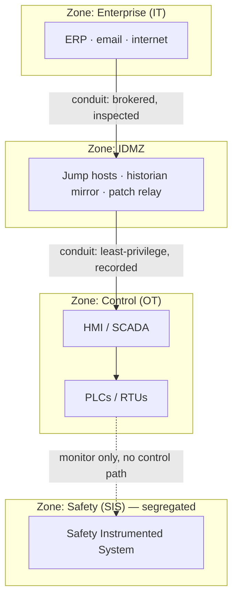
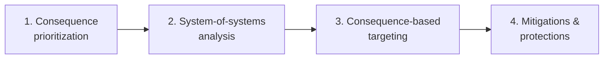

# 04 — OT Defense and Governance

> Level 3–4. The frameworks (IEC 62443, NIST 800-82r3), the architecture (segmentation, IDMZ, data diodes), how you get **visibility** without agents, OT-flavored incident response, and the expert lens: **consequence-driven engineering** and the regulations that mandate all of it.

← Back to the [ladder](README.md)

## IEC 62443 — the OT security standard

ISA/IEC 62443 is the international framework for **Industrial Automation and Control Systems (IACS)** security. Two ideas do most of the work:

**Zones & conduits.** Group assets with shared security requirements into **zones**; every communication path between zones is a **conduit** you explicitly define, restrict, and monitor. This is the Purdue model made enforceable.

**Security Levels (SL 1–4).** Each zone/conduit gets a target SL by *who* you must resist:

| SL | Protects against |
|---|---|
| SL 1 | Casual / accidental misuse |
| SL 2 | Intentional attack, **simple** means, low resources (generic hacker) |
| SL 3 | Intentional attack, **sophisticated** means (skilled, ICS-specific) |
| SL 4 | Intentional attack, sophisticated means + **extended resources** (nation-state) |

**Seven Foundational Requirements (FR1–7):** Identification & authentication control, Use control, System integrity, Data confidentiality, Restricted data flow, Timely response to events, Resource availability. **Three roles** share responsibility: the **asset owner**, the **system integrator**, and the **product supplier**.

## NIST SP 800-82 Rev. 3

The US guide, **retitled to "Operational Technology (OT) Security"** in Rev. 3 (2023) to widen scope beyond ICS. It profiles OT threats/vulnerabilities and provides an **OT overlay** that tailors the NIST SP 800-53r5 control catalog into low/moderate/high OT baselines — the bridge that lets an OT program plug into enterprise risk management.

## Defensible architecture

- **Segment** into zones; deny IT→OT by default; allow-list conduits only.
- **IDMZ (L3.5):** no direct IT↔OT flow — brokered jump hosts, a historian *mirror* IT reads, a patch/AV relay. (This is where [OT PAM](05-pam-for-ot.md) lives.)
- **Unidirectional gateways / data diodes:** hardware that physically permits data to flow **up** (telemetry to the historian/cloud) while making a control path **down** impossible. The strongest boundary where monitoring is needed but control must never cross.
- **Harden the ends:** disable unused services, change defaults, control USB/removable media (Stuxnet's vector), protect engineering workstations and project files (they own the PLCs).

## Visibility & detection — without agents

You usually **can't** put an EDR agent on a PLC. So OT detection is mostly **passive network monitoring**: tap/SPAN the OT segment and let an OT-aware sensor parse the industrial protocols and **baseline normal**, then alert on deviation.

High-value OT detections:
- **Unexpected writes** — Modbus FC5/6/15/16 (or DNP3/S7 control) from a host that should only read; new "master"/client talking to a controller.
- **Engineering activity off-hours** — a PLC put into program/run mode, logic download, firmware change outside a change window.
- **New or rogue devices** — an unknown host on the control VLAN; unexpected ARP/DCP.
- **IT↔OT crossings** — any flow through a conduit that isn't allow-listed.
- **Privileged-access anomalies** — access into the OT zone outside change windows (the PAM lens — see [`../defender-pam/detection-engineering.md`](../defender-pam/detection-engineering.md)).

> **SANS Five ICS Cybersecurity Critical Controls** — the pragmatic priority list to build a program around: **(1)** an ICS-specific incident response plan, **(2)** a defensible architecture, **(3)** ICS network visibility & monitoring, **(4)** secure remote access, **(5)** risk-based vulnerability management. If you do nothing else, do these five in order.

## Incident response, OT-style

OT IR is not IT IR. Priorities and moves change:
- **Safety and availability first.** You may **not** pull the plug — an abrupt stop can be more dangerous than the intrusion. The goal is a **safe, controlled state**, decided *with* operations and process engineers.
- **Containment respects the process.** Isolating a segment might blind operators; coordinate so they retain view/control (even manual).
- **Evidence is fragile & odd.** PLC memory, project files, historian data, engineering logs — not disk images. Capture network traffic (you're likely already tapping it).
- **People:** IR is a joint effort of security, plant operations, engineering, and safety — rehearse it as a **tabletop** before a real event.

## Expert lens — Consequence-driven Cyber-informed Engineering (CCE)

Developed at **Idaho National Laboratory**, CCE flips the question from "patch every vuln" to **"what few events would be catastrophic, and how do we engineer them out?"** Four phases:

The power move is **engineering out** a catastrophic consequence with a non-digital safeguard (a mechanical relief valve, an analog interlock, a hardware limiter) so that *no cyberattack can cause it*, regardless of the IT/OT security posture. Consequence-driven thinking is why OT defenders protect the handful of "loss-of-life / loss-of-region" scenarios first.

## Regulation & mandates (know the map)

| Regime | Scope | Note |
|---|---|---|
| **NERC CIP** | Bulk electric system (North America) | Mandatory, audited, fineable critical-infrastructure protection standards |
| **TSA Security Directives** | Pipelines, rail, aviation (US) | Issued after Colonial Pipeline (2021); segmentation, access control, monitoring, IR |
| **EU NIS2 Directive** | Essential/important entities (EU) | In force 2023, national transposition from Oct 2024; raises OT/critical-infra security & reporting |
| **CISA Cross-Sector CPGs** | US critical infrastructure (voluntary) | A baseline set of high-impact goals mapped to the NIST CSF |
| **ISA/IEC 62443** | IACS (global) | The technical anchor most of the above lean on |

## ✅ Checkpoint
- Explain zones & conduits and assign a target **Security Level** to an SIS zone vs a corporate zone — and justify it.
- Name three OT detections you can build from **passive network monitoring** alone.
- Explain how OT incident response differs from IT, and give one example of **engineering out** a consequence (CCE).

## Sources
- ISA/IEC 62443 series — https://www.isa.org/standards-and-publications/isa-standards/isa-iec-62443-series-of-standards
- NIST SP 800-82 Rev. 3 — https://csrc.nist.gov/pubs/sp/800/82/r3/final
- SANS — *The Five ICS Cybersecurity Critical Controls* — https://www.sans.org/white-papers/five-ics-cybersecurity-critical-controls/
- Idaho National Laboratory — Consequence-driven Cyber-informed Engineering (CCE) — https://inl.gov/national-security/cce/
- CISA Cross-Sector Cybersecurity Performance Goals — https://www.cisa.gov/cross-sector-cybersecurity-performance-goals-cpgs
- NERC CIP Standards — https://www.nerc.com/pa/Stand/Pages/CIPStandards.aspx
- TSA — Pipeline/Surface security directives — https://www.tsa.gov/for-industry/surface-transportation-cybersecurity
- EU NIS2 Directive — https://digital-strategy.ec.europa.eu/en/policies/nis2-directive

---
Next: [05 — PAM for OT](05-pam-for-ot.md) →
