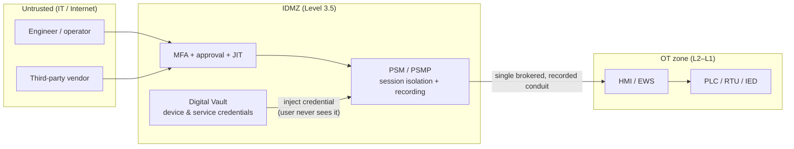
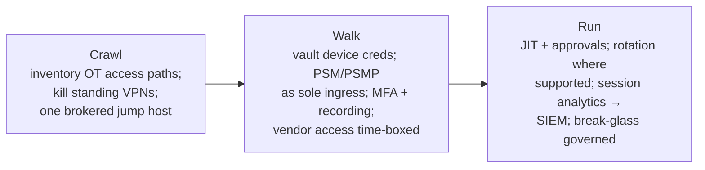

# 05 — PAM for OT (CyberArk)

> Level 4. The expert control. In OT you often **can't patch, can't run an agent, and can't reboot** — so the exposure isn't the device, it's the **access path**. Privileged Access Management makes a brokered, recorded, least-privilege jump host the **only** way in. This is the CyberArk-centric architecture that operationalizes the [IDMZ](01-foundations.md) and [IEC 62443 conduits](04-defense.md).

← Back to the [ladder](README.md) · Foundation: [`../defender-pam/`](../defender-pam/)

## Why PAM is *the* OT control

Every other layer has a gap OT can't easily close:
- The **protocols** have no identity ([02](02-protocols.md)).
- The **devices** can't take agents or frequent patches ([the OT-vs-IT reality](README.md)).
- **Convergence** removed the air gap ([01](01-foundations.md)).

What's left to control is **who reaches the OT zone, how, and with what rights** — and PAM is exactly that. Make the plant floor a **crown-jewel Tier 0**: no human or vendor touches L0/L1 directly; every path is brokered through a jump host with JIT, MFA, approval, credential injection, and full session recording.

## The OT secure-remote-access reference architecture

The properties that matter: the operator authenticates to PAM (not to the PLC), the **real device credential is injected from the vault and never revealed**, the session is **isolated** (malware on the operator's laptop can't ride into OT) and **recorded end-to-end**, access is **time-boxed (JIT)** and approved, and there is **no standing VPN** into the plant.

## CyberArk components mapped to OT

| OT problem | CyberArk control | Component |
|---|---|---|
| Shared/default PLC, HMI, RTU credentials | Vault them; rotate where the device supports it | **Digital Vault + CPM** |
| Engineers/operators reaching controllers | Broker via an isolated, recorded jump host | **PSM / PSMP** |
| Third-party vendor / OEM remote support | VPN-less, time-boxed, biometric-MFA access | **Remote Access** (vendor PAM) |
| Secrets in historians, MES, OT apps / scripts | Remove hardcoded creds; fetch at runtime | **Conjur / Secrets Manager** |
| Web console into the OT jump layer | Single access point + approvals + audit | **PVWA** |

### Mapping to IEC 62443
- **PSM/PSMP as the sole ingress** *is* the enforced **conduit** between the IT and OT zones.
- **JIT + least privilege + approval** raise the achievable **Security Level** (SL 2→3) on that conduit.
- Satisfies **FR1 (Identification & Authentication Control)** and **FR2 (Use Control)** — the jump host supplies the identity the protocol lacks.

## The hard problems (and pragmatic answers)

OT breaks the neat PAM story; here's how to cope without pretending otherwise:

| Hard reality | Pragmatic control |
|---|---|
| Device credential **can't rotate** (static/shared, vendor-locked, no API) | Vault it as a *known* secret; compensate with **strict segmentation + brokered-only access + session recording + monitoring**. The jump host, not the device, becomes the control point. |
| Legacy protocol has **no auth** ([02](02-protocols.md)) | Identity lives at the **PSM conduit**; the protocol is only reachable *through* it, from an allow-listed source. |
| **Availability first** — a session policy can't disrupt the process | Non-intrusive session isolation; avoid auto-rotations that could break a running integration; schedule any change to a **maintenance window (MOC)**. |
| **Emergency access** during an incident | A governed **break-glass** flow: pre-approved, heavily alerted, fully recorded, auto-expiring — never a shared "in case of fire" password. |
| **Vendor churn** and OEM back-doors | Time-boxed vendor access that **expires by default**; kill standing accounts and always-on VPNs; per-session approval. |
| Can't install anything **on** the PLC | PAM controls the **path**, not the endpoint — exactly the layer that *is* available. |

## Detection through the privileged lens
The privileged access itself is a detection surface. Alert on:
- Access into the OT zone **outside change windows**.
- A vendor session from a **new geo / off-hours**, or one that runs long.
- Credential retrieval for a device that shouldn't be touched right now.
- Session content showing **engineering-mode** changes or control writes.

Wire these to the OT monitoring in [04](04-defense.md) and the privileged-access detections in [`../defender-pam/detection-engineering.md`](../defender-pam/detection-engineering.md). Cross-reference the attack→control mapping in [`../defender-pam/cyberark-attack-mapping.md`](../defender-pam/cyberark-attack-mapping.md).

## An OT PAM maturity path

> **Engineering note:** make **PSM/PSMP the single ingress** into the OT DMZ (aligned to IEC 62443 zones/conduits), vault device credentials, and grant vendors **time-boxed Remote Access** — no flat, standing path to the plant floor. Where devices can't rotate, the compensating control is *segmentation + brokered access + monitoring*, not wishful thinking. The pattern is vendor-agnostic; the components above are CyberArk's implementation of it.

## ✅ Checkpoint
- Draw a vendor-remote-access path into an OT cell that gives JIT, MFA, credential injection, and full recording **with no standing VPN and no shared PLC password**.
- Explain how a PSM/PSMP jump host satisfies an IEC 62443 **conduit** and which **Foundational Requirements** it covers.
- Give the compensating control for a PLC whose credential **cannot** be rotated.

## Sources
- CyberArk documentation — https://docs.cyberark.com/
- CISA — Secure remote access / defense of OT — https://www.cisa.gov/topics/industrial-control-systems
- SANS — *Five ICS Cybersecurity Critical Controls* (control #4: secure remote access) — https://www.sans.org/white-papers/five-ics-cybersecurity-critical-controls/
- ISA/IEC 62443 (zones, conduits, foundational requirements) — https://www.isa.org/standards-and-publications/isa-standards/isa-iec-62443-series-of-standards
- NIST SP 800-82 Rev. 3 (remote access guidance) — https://csrc.nist.gov/pubs/sp/800/82/r3/final

---
Back to the [OT Security ladder](README.md) · Related: [Module 18](../modules/18-iot-and-ot-hacking/README.md) · [OT lab](../labs/ot/) · [defender-pam](../defender-pam/)
