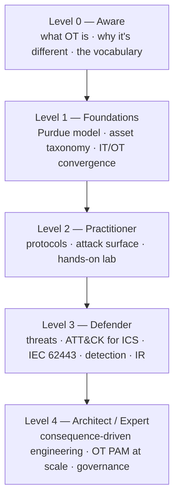

# OT / ICS Security — Beginner → Expert

> **One-liner:** securing the computers that move the physical world — the PLCs, sensors, and valves that run power grids, water plants, pipelines, and factories. The stakes aren't data breaches; they're **safety, uptime, and physical damage**. Your PAM instinct — *segment, broker, least-privilege, record everything* — is the core of the defense.

> ⛔ **OT is safety-critical.** A mistimed scan or a single stray write can trip a safety system, damage equipment, or hurt people. Everything hands-on in this repo runs against **your own loopback simulators** ([`../labs/ot/`](../labs/ot/)) — never a device you don't own on an isolated bench.

This is a standalone curriculum. It complements the exam-focused [Module 18](../modules/18-iot-and-ot-hacking/README.md) by going deeper and wider — from "what is a PLC" to "design and govern an OT security program."

---

## The one mental model: OT is not IT

Everything downstream follows from this. In IT you protect **data**; in OT you protect a **physical process that can kill people**. The classic CIA triad is *inverted*, and "just patch it" / "just reboot it" can be the dangerous answer.

| Dimension | IT | OT |
|---|---|---|
| Top priority | **C**onfidentiality → I → A | **S**afety → **A**vailability → Integrity → Confidentiality |
| Uptime expectation | Reboot/patch anytime | Runs for **years**; downtime = lost production or blackout |
| Asset lifespan | 3–5 years | **15–30 years** (PLCs older than the engineer) |
| Patching | Fast, automated | Slow, vendor-validated, **maintenance-window only** — often never |
| Protocols | Authenticated, encrypted (TLS) | Modbus/DNP3/S7 — **no auth, no crypto by design** |
| A failure means | Data loss, outage | **Explosion, flood, blackout, injury** |
| Endpoint agent / EDR | Everywhere | Rarely — may void warranty or break real-time timing |
| Change control | CI/CD, move fast | Formal MOC (Management of Change), safety review |

> **Why this matters for defense:** because you often *can't* patch, *can't* install an agent, and *can't* take a device down, the control shifts to the **network and the access path** — segmentation and brokered, least-privilege remote access. That is a PAM problem, which is why this topic sits so close to [`../defender-pam/`](../defender-pam/).

---

## The learning ladder

> Each level ends with a **checkpoint** — a concrete thing you can *do* or *explain*. If you can't, go back; don't climb on a weak rung.

### Level 0 — Aware *(a weekend)*
Understand what you're protecting and why it's a different game.
- **Learn:** this page's *OT is not IT* table, plus the "what is OT / ICS" opening of [Foundations](01-foundations.md).
- ✅ **Checkpoint:** in two sentences, explain why you might refuse to run an Nmap `-A` scan on a production plant network, and why "availability" outranks "confidentiality" in OT.

### Level 1 — Foundations *(1–2 weeks)*
Build the map of the environment.
- **Learn:** [01 — Foundations](01-foundations.md): SCADA vs DCS vs PLC vs RTU vs IED vs HMI vs Historian vs SIS, the sense→decide→actuate control loop, and the **Purdue model** (levels 0–5 + the IDMZ at 3.5).
- ✅ **Checkpoint:** draw the Purdue model from memory and place a sensor, a PLC, an HMI, a historian, and an engineering workstation at the correct level. Name what the **IDMZ** is for.

### Level 2 — Practitioner *(2–4 weeks · hands-on)*
Feel *why* the protocols are insecure, safely.
- **Learn:** [02 — Protocols](02-protocols.md): Modbus, DNP3, S7comm, EtherNet/IP, PROFINET, BACnet, and the secure-capable **OPC UA** — port, purpose, and the missing-identity flaw of each.
- **Do:** stand up the containerized [OT lab](../labs/ot/) — subscribe to MQTT `#` and inject a spoofed reading; read (FC3) then **write** (FC6) Modbus registers with no login. Then work [Module 18's guided walkthrough](../modules/18-iot-and-ot-hacking/lab-walkthrough.md) (adds Shodan index recon + firmware carving).
- ✅ **Checkpoint:** on your own simulator, read and change a Modbus register and explain, per function code, exactly what had no authentication — and which network control would have stopped it.

### Level 3 — Defender *(4–8 weeks)*
Know the adversary, the frameworks, and how to catch them.
- **Learn:** [03 — Threats & incidents](03-threats.md) (the ICS Cyber Kill Chain, **MITRE ATT&CK for ICS**, and the landmark cases — Stuxnet → TRITON → PIPEDREAM → FrostyGoop) and [04 — Defense & governance](04-defense.md) (**IEC 62443** zones/conduits & Security Levels, **NIST SP 800-82r3**, segmentation, unidirectional gateways, OT monitoring, and OT incident response).
- ✅ **Checkpoint:** take one real incident (e.g. Industroyer or TRITON), map its stages to ATT&CK for ICS, and name the IEC 62443 control that would have broken the chain.

### Level 4 — Architect / Expert *(ongoing · never "done")*
Design and govern the program.
- **Learn:** [05 — PAM for OT](05-pam-for-ot.md) — the CyberArk-centric secure-remote-access architecture that makes a brokered jump host the **only** way into the OT zone — plus the expert practices in [04](04-defense.md): **Consequence-driven Cyber-informed Engineering (CCE)**, and the regulatory landscape (NERC CIP, TSA directives, EU NIS2).
- ✅ **Checkpoint:** design a vendor-remote-access path into an OT cell that satisfies IEC 62443 conduits *and* gives you JIT, MFA, credential injection, and full session recording — with no standing VPN and no shared PLC password.

---

## Where are you? — competency self-assessment
Rate each row: **🟥 Novice** (need a guide) · **🟨 Competent** (with notes) · **🟩 Proficient** (cold) · **🟦 Expert** (can teach + adapt).

| Skill | 🟥 → 🟦 |
|---|---|
| OT vs IT mindset | recite the differences → apply them to a design call → argue trade-offs with plant engineers |
| Asset taxonomy & Purdue model | name the parts → place any asset correctly → design the zoning for a new site |
| OT protocols | know the ports → read a Modbus/DNP3 capture → assess a protocol's real risk in context |
| Threats & ATT&CK for ICS | name Stuxnet → map an incident to tactics → run a threat-informed tabletop |
| Frameworks (62443 / 800-82) | know they exist → apply zones/conduits + SLs → lead a certification / assessment |
| Detection & IR | spot an unexpected write → build OT-aware detections → run an OT incident to safe state |
| OT secure remote access (PAM) | describe a jump host → deploy PSM/PSMP into an IDMZ → architect vendor access org-wide |

---

## This documentation set

| Doc | Covers | Level |
|---|---|---|
| [01 — Foundations](01-foundations.md) | OT vs IT, ICS asset taxonomy, the control loop, the Purdue model, IT/OT convergence | 0–1 |
| [02 — Protocols](02-protocols.md) | Modbus, DNP3, S7comm, EtherNet/IP, PROFINET, BACnet, OPC UA, MQTT/CoAP — and their (missing) security | 2 |
| [03 — Threats & incidents](03-threats.md) | ICS Cyber Kill Chain, ATT&CK for ICS, landmark attacks, threat-actor groups | 3 |
| [04 — Defense & governance](04-defense.md) | IEC 62443, NIST 800-82r3, segmentation, unidirectional gateways, detection, IR, CCE, regulation | 3–4 |
| [05 — PAM for OT (CyberArk)](05-pam-for-ot.md) | Secure remote access architecture, credential vaulting, the OT PAM maturity path | 4 |

## How this ties into the rest of the repo
- **Exam angle:** [Module 18 — IoT and OT Hacking](../modules/18-iot-and-ot-hacking/README.md) (ports, Purdue, OWASP IoT Top 10, exam traps).
- **Hands-on:** the containerized [OT range](../labs/ot/) (MQTT + Modbus, loopback-only).
- **Defender / PAM knowledge base:** [`../defender-pam/`](../defender-pam/) — architecture, detection engineering, attack-to-control matrix.
- **Where OT fits in the whole journey:** [ROADMAP](../ROADMAP.md) Stage 5 (specialize).

## Sources
- CISA — Industrial Control Systems — https://www.cisa.gov/topics/industrial-control-systems
- NIST SP 800-82 Rev. 3, *Guide to Operational Technology (OT) Security* (2023) — https://csrc.nist.gov/pubs/sp/800/82/r3/final
- ISA/IEC 62443 series (zones & conduits) — https://www.isa.org/standards-and-publications/isa-standards/isa-iec-62443-series-of-standards
- MITRE ATT&CK for ICS — https://attack.mitre.org/matrices/ics/
- Dragos — OT/ICS threat intelligence — https://www.dragos.com/
- SANS ICS — https://www.sans.org/industrial-control-systems-security/
