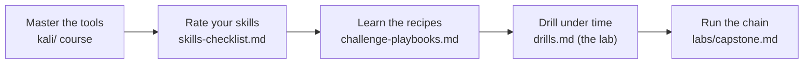

# CEH Practical (CEH Master) — Prep

> The **CEH Practical** is the hands-on, performance-based exam. Passing both the [Knowledge exam](../EXAM-LOGISTICS.md) *and* the Practical earns the **CEH Master** designation. This section prepares you for the *doing*, not the recognizing — because the Practical gives you no multiple-choice options: it drops you on real targets and asks *"what is the password of user X?"*, *"what flag is in this file?"* — and you must go get the answer.

> **Verify the format.** Numbers below are consistent across public sources but exam policy changes — confirm on the official [CEH Practical page](https://www.eccouncil.org/train-certify/certified-ethical-hacker-ceh-practical/) before you book.

## What it is

| Item | Value |
|---|---|
| Format | **20 hands-on challenges** in EC-Council's browser-based **iLabs Cyber Range** |
| Duration | **6 hours** |
| Delivery | Remotely proctored; you get a pre-built attacker VM (Parrot/Kali-style) in the range |
| Scoring | Answer the question tied to each challenge; passing is commonly reported as **~70% (≈ 14 of 20)** — confirm with EC-Council |
| Style | **Open-tool / open-notes** — no memorizing tool syntax; but the clock is brutal |
| Result | Pass this + the Knowledge exam → **CEH Master** |

**How it differs from the Knowledge exam:** no distractors to eliminate, no "best answer" — you either *produce the artifact* (a cracked password, a hidden flag, a service version, an exfiltrated record) or you don't. Speed and methodology decide it.

## What's tested
The same 20 modules, but as **tasks**: scan and fingerprint hosts, enumerate services, crack hashes and passwords, exploit web apps and SQLi, get shells and escalate, attack AD, pull secrets from packet captures, break Wi-Fi, extract steganography, and identify/decrypt crypto. See the [skills checklist](skills-checklist.md) for the exact list.

## How to prepare with this repo

1. **Be fluent with the tools** — work the [`kali/`](../kali/README.md) course until you can run each tool from muscle memory. The Practical punishes fumbling with syntax.
2. **Rate yourself** honestly against the [skills checklist](skills-checklist.md); drill every skill you can't do cold in a few minutes.
3. **Internalize the recipes** in [challenge-playbooks.md](challenge-playbooks.md) — the "when the question asks X, do Y" patterns.
4. **Generate the missing challenge types** — run [`challenge-lab/setup-challenges.sh`](challenge-lab/README.md) to create local stego / pcap / crypto / hash / archive challenges the AD-web lab can't.
5. **Drill under a timer** — start with the [drills.md](drills.md) sampler, then the **deep per-domain packs** in [drills/](drills/README.md) (full walkthroughs). Re-drill any domain you're slow in.
6. **Run the [capstone](../labs/capstone.md)** end to end, then sit a full **[simulated exam](exams/README.md)** (20 challenges, timed) as your dress rehearsal.

---

## Exam-day playbook

**Time budget.** 6 hours ÷ 20 challenges ≈ **18 minutes each**. Treat it as a race:
- **First pass:** answer every challenge you can do quickly; **flag and skip** anything that stalls you past ~15–20 min.
- **Second pass:** return to skipped ones with the time you banked.
- **Never leave a challenge blank** if you can make a supported attempt — but don't sink an hour into one.

**Answer format.** Each challenge asks a specific question — read it *exactly*. Answers are usually a precise string: a password, a hash, a version, an FQDN, a file's contents, a flag. Submit the exact value; watch for case and trailing characters. **Screenshot your evidence** as you go (many candidates keep a notes doc) so you can re-verify an answer before submitting.

**Setup in the first 5 minutes.**
- Note your attacker IP (`ip a`) and the target scope you're given.
- Start a working notes file and a folder for output (`nmap -oA`).
- Do a broad discovery scan of the scope so you're never idle while thinking.

**Triage rule — match the question to a recipe.** Every challenge maps to a pattern in [challenge-playbooks.md](challenge-playbooks.md):
- "what is the password / hash" → crack it (hashcat/john/hydra).
- "read/find the file / flag" → web exploit, LFI, SQLi, or privesc.
- "what's hidden in this image/file" → steganography extract.
- "extract X from the capture" → Wireshark/tcpdump follow-stream.
- "what version / FQDN / OS" → nmap/enum.
- "crack the Wi-Fi" → aircrack/hashcat 22000.

**Discipline.**
- **Enumerate before you exploit** — most stalls are missed enumeration, not missing exploits.
- **Read the question twice** — it often tells you the exact artifact and even the technique.
- **Keep the clock visible**; a skipped challenge you return to beats one you drowned in.

## Ethics & sources
- Practice only against **your own lab** or EC-Council's official range. No brain dumps — the Practical is performance-based, so dumps don't even help.
- CEH Practical (official): https://www.eccouncil.org/train-certify/certified-ethical-hacker-ceh-practical/
- Deeper tradecraft when a drill stumps you: [`../resources/deep-references.md`](../resources/deep-references.md) (HackTricks, The Hacker Recipes).

## Files here
| File | Use |
|---|---|
| [skills-checklist.md](skills-checklist.md) | The hands-on skills you must be able to do fast — self-rate and drill the gaps |
| [challenge-playbooks.md](challenge-playbooks.md) | "When the question asks X → run Y" copy-adaptable recipes |
| [drills.md](drills.md) | A quick 15-challenge sampler against the repo lab |
| [drills/](drills/README.md) | **Deep per-domain drill packs** (8–12 challenges each) with full solution walkthroughs |
| [challenge-lab/](challenge-lab/README.md) | A **generator** for the challenge types the lab can't provide — stego, pcap, crypto, hashes, archives |
| [exams/](exams/README.md) | **Full 20-challenge simulated exams** (6-hour dress rehearsals) with answer keys |
