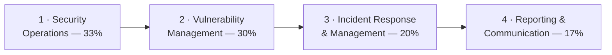

# 🔵 CompTIA CySA+ — Study Hub

### A step-by-step preparation guide for **CompTIA CySA+ (CS0-003)**

*Concepts, real diagrams, and exam prep* — the **vendor-neutral, defensive (blue-team / SOC
analyst)** certification for detection, threat hunting, and incident response.

---

> [!NOTE]
> **Unofficial & no fabrication.** Not affiliated with or endorsed by CompTIA. Exam specifics
> are from CompTIA's official CySA+ page; volatile items (price, exam code, CEU renewal) should
> be re-checked there. Compiled **2026-06-20**; exam facts re-checked **2026-09-29**.

> [!IMPORTANT]
> **Version notice — this hub covers CS0-003 (V3), which is retiring.** English learning
> products retire **2026-11-22**, the **English exam retires 2026-12-22**, and the Japanese,
> Portuguese, and Spanish exams retire **2027-03-23** ([V3 page](https://www.comptia.org/en-us/certifications/cybersecurity-analyst/v3/)).
> The successor **CS0-004 (V4)** launched **2026-06-23**: max 85 questions, 165 minutes, 750 on
> 100–900, English (other languages "coming soon"); domains Security Operations 34%,
> Vulnerability Management 26%, Incident Response and Management 24%, Reporting and
> Communication 16%; recommended "About 4 years in a SOC analyst or vulnerability analyst
> role" ([V4 page](https://www.comptia.org/en-us/certifications/cybersecurity-analyst/v4/)). **Booking after 2026-12-22? Map your study to the CS0-004
> objectives** — see the [version notice](00-overview/exam-and-objectives.md#version-notice--cs0-003-retires-cs0-004-is-live).

## 📋 At a glance

| Item | Detail |
|------|--------|
| **Exam** | CS0-003 (V3) — English exam retires **2026-12-22**; successor CS0-004 |
| **Format** | Max **85 questions** — multiple-choice + **performance-based (PBQ)** |
| **Duration / pass** | **165 minutes** · **750** on a 100–900 scale |
| **Level / focus** | Intermediate, **vendor-neutral**, **defensive** (SOC analyst / detection & response) |
| **Recommended** | Network+, Security+, or equivalent knowledge, with a minimum of 4 years as an incident response or SOC analyst *(not required)* |

Full details: **[exam & objectives](00-overview/exam-and-objectives.md)**.

## 🛠️ Prepare for it — the procedure

This hub is a **preparation guide**: follow the steps in order. The method is the repo-wide
[how to prepare a certification](../../learning/how-to-prepare-a-cert.md); the numbers below (80% per domain, 85% on a
full mock) are that method's readiness rule, not a CompTIA figure.

1. **Commit** — read [exam & objectives](00-overview/exam-and-objectives.md), confirm the
   current exam code and price on [CompTIA's page](https://www.comptia.org/en-us/certifications/cybersecurity-analyst/), and set a target date.
   Plan on roughly **7 weeks at 8–10 hours a week** (~54–70 h total, summing the plan's suggested hours) — the
   [study plan](exam-prep/study-plan.md) breaks that down.
2. **Get the official objectives PDF** from CompTIA and fill the
   [coverage map](exam-prep/coverage-map.md): write each official objective number next to
   the topic row that covers it, mark any gap, and self-score every row 0–3 before you
   start (the method explains the scale).
3. **Study weight-first** — by weight: 1 → 2 → 3 → 4. For each domain: read the page, do the hands-on
   items it names (in the [CEH lab](../ceh/labs/README.md) or on a
   [practice platform](../../learning/platforms.md)), map each attack or control to the
   [attack → defense matrix](../../attack-to-defense-matrix.md), then take that domain's
   [practice questions](exam-prep/practice-questions.md). Log every miss, then
   drill the [flashcard deck](exam-prep/flashcards.csv) with `python3 certs/ceh/scripts/quiz.py --deck certs/cysa-plus/exam-prep/flashcards.csv` (from the repo root) or import it into Anki.
4. **Rehearse the PBQs** — performance-based questions open the exam and eat the clock; the
   study plan's PBQ section tells you how to drill them. Pace to remember: up to 85 questions in 165 minutes: about two minutes per item, PBQs longer.
5. **Pass the readiness gate** — every domain ≥ 80% on a second, spaced attempt; the timed
   [full mock exam](exam-prep/mock-exam.md) ≥ 85%; the [glossary](reference/glossary.md) · [Security+ acronyms](../security-plus/reference/acronyms.md) automatic; no open weak-area row older than a week.
6. **Exam week** — logistics (ID, online-proctoring check or test-centre rules) three days
   out; final drill of the weak-area log; the exam-day tactics in the
   [CEH exam strategy](../ceh/EXAM-STRATEGY.md) apply unchanged to CompTIA multiple choice.
7. **After** — note CompTIA's continuing-education renewal rule from the objectives page and
   calendar it; return to the [roadmap](../../learning/roadmap.md) for the next milestone.

### 📈 Track it

| # | Domain | Weight | Read | Hands-on | Practice 1 | Practice 2 (spaced) |
|---|--------|--------|:----:|:--------:|:----------:|:-------------------:|
| 1 | [Security Operations](domains/01-security-operations.md) | 33% | ☐ | ☐ | ____% | ____% |
| 2 | [Vulnerability Management](domains/02-vulnerability-management.md) | 30% | ☐ | ☐ | ____% | ____% |
| 3 | [Incident Response and Management](domains/03-incident-response-and-management.md) | 20% | ☐ | ☐ | ____% | ____% |
| 4 | [Reporting and Communication](domains/04-reporting-and-communication.md) | 17% | ☐ | ☐ | ____% | ____% |

- [ ] Objectives PDF downloaded · self-assessment done · exam date `__________`
- [ ] Timed [full mock exam](exam-prep/mock-exam.md): ____% (target ≥ 85%) · exam booked `__________` · passed `__________`

## 🗺️ The four domains

| # | Domain | Weight | Page |
|---|--------|--------|------|
| 1 | Security Operations | 33% | [01-security-operations.md](domains/01-security-operations.md) |
| 2 | Vulnerability Management | 30% | [02-vulnerability-management.md](domains/02-vulnerability-management.md) |
| 3 | Incident Response and Management | 20% | [03-incident-response-and-management.md](domains/03-incident-response-and-management.md) |
| 4 | Reporting and Communication | 17% | [04-reporting-and-communication.md](domains/04-reporting-and-communication.md) |

## 📦 What's inside

| Section | Contents |
|---------|----------|
| **[Overview](00-overview/what-is-cysa-plus.md)** | [What is CySA+](00-overview/what-is-cysa-plus.md) · [Exam & objectives](00-overview/exam-and-objectives.md) |
| **[The 4 domains](domains/README.md)** | SOC operations, vulnerability management, incident response, reporting — taught to the CS0-003 objectives |
| **[Exam prep](exam-prep/study-plan.md)** | [Study plan](exam-prep/study-plan.md) · [Coverage map](exam-prep/coverage-map.md) · [Flashcards](exam-prep/flashcards.csv) · [Practice questions](exam-prep/practice-questions.md) · [Full mock exam](exam-prep/mock-exam.md) (80 MCQ + 5 PBQ, timed) |
| **[Reference](reference/glossary.md)** | [Glossary](reference/glossary.md) (SOC / blue-team terms) — acronyms cross-link the [Security+ list](../security-plus/reference/acronyms.md) |

## 🧭 Where it fits

CySA+ is the **detection-and-response** analyst credential — the blue-team counterpart to the
offensive [CEH](../ceh/README.md) and [PenTest+](../pentest-plus/README.md) hubs, and a natural
step **after** [Security+](../security-plus/README.md).

- **Operationalizes** the monitoring, SIEM, and incident-response topics from
  [Security+ Domain 4](../security-plus/domains/04-security-operations.md).
- **Pairs with** the [attack → defense matrix](../../attack-to-defense-matrix.md): CySA+ is the
  defender reading the telemetry the attacks generate.
- **Connects to PAM** — privileged-session monitoring and audit ([PAM detection engineering](../ceh/defender-pam/detection-engineering.md)) feed SOC detection.

## 🔗 Quick links

- 🎓 [CompTIA CySA+ (official)](https://www.comptia.org/en-us/certifications/cybersecurity-analyst/)
- 🧠 [Glossary](reference/glossary.md) · [Security+ acronyms](../security-plus/reference/acronyms.md)
- 🧪 [The 4 domains](domains/README.md)
- 📝 [Practice questions](exam-prep/practice-questions.md) · [Full mock exam](exam-prep/mock-exam.md)

> CompTIA and CySA+ are trademarks of CompTIA, used here for identification and educational
> purposes only.
