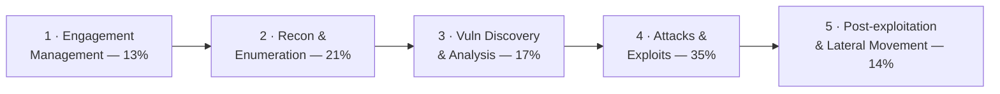

# 🟠 CompTIA PenTest+ — Study Hub

### A step-by-step preparation guide for **CompTIA PenTest+ (PT0-003)**

*Concepts, methodology, real diagrams, and exam prep* — the **vendor-neutral, hands-on
penetration-testing** certification, with strong engagement-management and reporting coverage.

---

> [!WARNING]
> **Educational & authorized use only.** Penetration testing is legal **only** with explicit
> written authorization, scope, and Rules of Engagement (RoE). This hub explains techniques
> **conceptually** for understanding, methodology, and defense — no weaponized step-by-step
> playbooks. See the CEH hub's [legal & ethics](../ceh/00-overview/legal-and-ethics.md).

> [!NOTE]
> **Unofficial & no fabrication.** Not affiliated with or endorsed by CompTIA. Exam specifics
> are from CompTIA's official PenTest+ page; volatile items (price, exam code, scoring model,
> CEU renewal) should be re-checked there. Compiled **2026-06-20**.

## 📋 At a glance

| Item | Detail |
|------|--------|
| **Exam** | PT0-003 *(launched 2024; verify on CompTIA)* |
| **Format** | Max **90 questions** — multiple-choice + **performance-based (PBQ)** |
| **Duration / pass** | **165 minutes** · passing/scoring model — **verify on CompTIA** |
| **Level / focus** | Intermediate, **vendor-neutral**, hands-on offensive + methodology/reporting |
| **Recommended** | Network+/Security+ and ~3–4 years pentest/security experience *(verify)* |

Full details: **[exam & objectives](00-overview/exam-and-objectives.md)**.

## 🛠️ Prepare for it — the procedure

This hub is a **preparation guide**: follow the steps in order. The method is the repo-wide
[how to prepare a certification](../../learning/how-to-prepare-a-cert.md); the numbers below (80% per domain, 85% on a
full mock) are that method's readiness rule, not a CompTIA figure.

1. **Commit** — read [exam & objectives](00-overview/exam-and-objectives.md), confirm the
   current exam code and price on [CompTIA's page](https://www.comptia.org/en-us/certifications/pentest/), and set a target date.
   Plan on roughly **10 weeks at 8–10 hours a week** (~57–76 h total, summing the plan's suggested hours) — the
   [study plan](exam-prep/study-plan.md) breaks that down.
2. **Get the official objectives PDF** from CompTIA and fill the
   [coverage map](exam-prep/coverage-map.md): write each official objective number next to
   the topic row that covers it, mark any gap, and self-score every row 0–3 before you
   start (the method explains the scale).
3. **Study weight-first** — Domain 1 first (scoping and rules of engagement frame everything), then 4 → 2 → 3 → 5 by weight. For each domain: read the page, do the hands-on
   items it names (in the [CEH lab](../ceh/labs/README.md) or on a
   [practice platform](../../learning/platforms.md)), map each attack or control to the
   [attack → defense matrix](../../attack-to-defense-matrix.md), then take that domain's
   [practice questions](exam-prep/practice-questions.md). Log every miss, then
   drill the [flashcard deck](exam-prep/flashcards.csv) with `python3 certs/ceh/scripts/quiz.py --deck certs/pentest-plus/exam-prep/flashcards.csv` (from the repo root) or import it into Anki.
4. **Rehearse the PBQs** — performance-based questions open the exam and eat the clock; the
   study plan's PBQ section tells you how to drill them. Pace to remember: up to 90 questions in 165 minutes: under two minutes per item, PBQs longer.
5. **Pass the readiness gate** — every domain ≥ 80% on a second, spaced attempt; the timed
   [full mock exam](exam-prep/mock-exam.md) ≥ 85%; the [cheat sheet](exam-prep/cheat-sheet.md) · [glossary](reference/glossary.md) automatic; no open weak-area row older than a week.
6. **Exam week** — logistics (ID, online-proctoring check or test-centre rules) three days
   out; final drill of the weak-area log; the exam-day tactics in the
   [CEH exam strategy](../ceh/EXAM-STRATEGY.md) apply unchanged to CompTIA multiple choice.
7. **After** — note CompTIA's continuing-education renewal rule from the objectives page and
   calendar it; return to the [roadmap](../../learning/roadmap.md) for the next milestone.

### 📈 Track it

| # | Domain | Weight | Read | Hands-on | Practice 1 | Practice 2 (spaced) |
|---|--------|--------|:----:|:--------:|:----------:|:-------------------:|
| 1 | [Engagement Management](domains/01-engagement-management.md) | 13% | ☐ | ☐ | ____% | ____% |
| 2 | [Reconnaissance and Enumeration](domains/02-reconnaissance-and-enumeration.md) | 21% | ☐ | ☐ | ____% | ____% |
| 3 | [Vulnerability Discovery and Analysis](domains/03-vulnerability-discovery-and-analysis.md) | 17% | ☐ | ☐ | ____% | ____% |
| 4 | [Attacks and Exploits](domains/04-attacks-and-exploits.md) | 35% | ☐ | ☐ | ____% | ____% |
| 5 | [Post-exploitation and Lateral Movement](domains/05-post-exploitation-and-lateral-movement.md) | 14% | ☐ | ☐ | ____% | ____% |

- [ ] Objectives PDF downloaded · self-assessment done · exam date `__________`
- [ ] Timed full mixed set: ____% (target ≥ 85%) · exam booked `__________` · passed `__________`

## 🗺️ The five domains

| # | Domain | Weight | Page |
|---|--------|--------|------|
| 1 | Engagement Management | 13% | [01-engagement-management.md](domains/01-engagement-management.md) |
| 2 | Reconnaissance and Enumeration | 21% | [02-reconnaissance-and-enumeration.md](domains/02-reconnaissance-and-enumeration.md) |
| 3 | Vulnerability Discovery and Analysis | 17% | [03-vulnerability-discovery-and-analysis.md](domains/03-vulnerability-discovery-and-analysis.md) |
| 4 | Attacks and Exploits | 35% | [04-attacks-and-exploits.md](domains/04-attacks-and-exploits.md) |
| 5 | Post-exploitation and Lateral Movement | 14% | [05-post-exploitation-and-lateral-movement.md](domains/05-post-exploitation-and-lateral-movement.md) |

*(Weightings per CompTIA — verify on the official objectives.)*

## 📦 What's inside

| Section | Contents |
|---------|----------|
| **[Overview](00-overview/what-is-pentest-plus.md)** | [What is PenTest+](00-overview/what-is-pentest-plus.md) · [Exam & objectives](00-overview/exam-and-objectives.md) |
| **[The 5 domains](domains/README.md)** | Engagement management, recon/enum, vuln discovery, attacks & exploits, post-exploitation — concept + defense |
| **[Exam prep](exam-prep/study-plan.md)** | [Study plan](exam-prep/study-plan.md) · [Coverage map](exam-prep/coverage-map.md) · [Flashcards](exam-prep/flashcards.csv) · [Practice questions](exam-prep/practice-questions.md) · [Full mock exam](exam-prep/mock-exam.md) · [Cheat sheet](exam-prep/cheat-sheet.md) |
| **[Reference](reference/glossary.md)** | [Glossary](reference/glossary.md) — acronyms cross-link the [Security+ list](../security-plus/reference/acronyms.md) |

## 🧭 Where it fits

PenTest+ is the **vendor-neutral, report-focused** offensive cert. It pairs with the rest of
this repo:

- **Alongside** the [CEH hub](../ceh/README.md) — CEH is broad knowledge; PenTest+ adds the
  hands-on engagement-and-reporting workflow. Many cross-links go straight to the CEH modules.
- **Defensive flip side** → every attack here maps to a control in the
  [attack → defense matrix](../../attack-to-defense-matrix.md); Domain 5 leans on
  [PAM](../../foundations/README.md) as the defense against lateral movement.
- **Practical hands-on next steps** → [OSCP](../oscp/README.md) and [PNPT](../pnpt/README.md).

## 🔗 Quick links

- 🎓 [CompTIA PenTest+ (official)](https://www.comptia.org/en-us/certifications/pentest/)
- ⚖️ [Legal & ethics](../ceh/00-overview/legal-and-ethics.md) · 🧠 [Glossary](reference/glossary.md)
- 🧪 [The 5 domains](domains/README.md) · 📝 [Full mock exam](exam-prep/mock-exam.md)

> CompTIA and PenTest+ are trademarks of CompTIA, used here for identification and educational
> purposes only.
